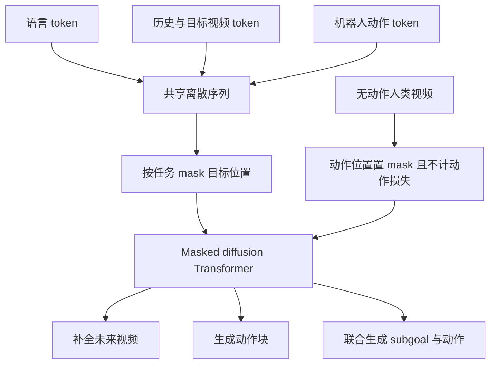

# SUAVE：统一视频、语言与动作的 Masked Diffusion 模型

**SUAVE** 展开为 *Single-vocabulary Unified Action-Video modEl*，将语言、视频帧和机器人动作表示为同一离散词表 token，再通过 masked diffusion Transformer 联合去噪（[arXiv:2610.04009](https://arxiv.org/abs/2610.04009)）。推理时改变被 mask 的模态位置，同一组权重可承担世界预测、动作策略或 video-action 联合生成。

- **论文：** [arXiv 摘要](https://arxiv.org/abs/2610.04009) · [HTML v1](https://arxiv.org/html/2610.04009v1) · [PDF](https://arxiv.org/pdf/2610.04009)
- **作者：** Rhythm Syed、Jean Mercat、Sedrick Keh、Kushal Arora、Paarth Shah、Aykut Onol、Mengchao Zhang、Tony Dear
- **机构：** Columbia University、Toyota Research Institute
- **代码状态：** arXiv v1 正文未列独立项目页或 SUAVE 官方 GitHub 仓库；此处以论文为来源。

## 一句话理解

**把“说什么、未来画面怎样、机器人如何动”变成同一序列中的 token，再通过遮挡哪些 token 来选择模型要回答的问题。**

## 方法图

## 架构与训练目标

### 单一词表与统一骨干

SUAVE 从 **MMaDA-8B** 初始化，为 32 层 Transformer，增加 256 个动作 token；文本、视频与动作共享 embedding/output head。论文使用冻结的 **MAGViT-v2** 视频 tokenizer，把 256×256 图像映射为 16×16 共 256 个视觉 token。

- **语言：** LLaDA 文本 tokenizer。
- **视频：** MAGViT-v2 离散视觉 token。
- **动作：** 按训练集 q1/q99 分位数缩放到 [-1,1]，离散量化为 256 档。
- **去噪：** 使用 block-causal mask；masked diffusion 在少量步骤中并行补全被遮挡 token。

### 无动作视频与机器人示教共训练

机器人示教提供图像、语言和动作。无动作人类视频在动作 token 位置填入 mask，并从损失中排除，因此视频预测能利用无机器人动作标签的视频，但这些样本不直接监督机器人动作。

推理阶段用 mask pattern 选择任务：

- **世界模型：** mask 未来视频位置以预测后续画面。
- **策略：** mask 动作位置并生成动作 token。
- **联合 video-action：** 同时 mask 未来 subgoal 帧与动作块。
- **长时域 rollout：** 将生成目标帧作为下一轮上下文，分块滚动预测。

## 推理与部署设置

实机任务采用 4 个去噪步骤和 prefix KV cache。单次 query 生成 front/wrist 两个 subgoal 图像和 5 个动作（约 1 秒跨度），RTX 5090 上耗时 1,030 ms，论文报告闭环约 2.5 个策略查询/秒；prefix KV cache 最多将每个 chunk 解码时间降低 2.2 倍。

**2.5 Hz 是策略查询/动作块更新率，不是电机控制频率。** 每次查询输出的是约 1 秒动作块。

## 论文评测

| 评测 | SUAVE 结果 | 对照与说明 |
|---|---:|---|
| LIBERO 平均成功率 | SUAVE-Cotrain 95.9% | 同表 π0.5 为 97.4%；SUAVE 没有全面领先 |
| LIBERO-Plus 零样本扰动 | 71.3% | π0.5 为 84.7%；robot initial-state 子类 82.5% |
| LIBERO-Plus 训练内扰动 | 86.1% | 论文报告高于 OpenVLA-OFT 的 79.5% |
| DOMINO 动态操作 SR | Level 1/2/3：18.7% / 12.3% / 8.2% | 论文报告三等级中最高；任务难度增加时所有方法均退化 |
| 实机 | 7-DoF xArm7 | RTX 5090 上 1.03 秒生成双 subgoal 图像与 1 秒动作块 |
| 真实视频预测 | PSNR、SSIM、LPIPS、FVD | 重建仍受冻结 MAGViT-v2 tokenizer 限制 |

实验覆盖 LIBERO、LIBERO-Plus、DOMINO 仿真，以及单臂 xArm7 实机。论文称机器人视频预训练和无动作人类视频 co-training 改善策略表现，但也说明部分 co-training 增益在统计上不可区分。

## 与其他统一模型的区别

| 方向 | 常见设计 | SUAVE |
|---|---|---|
| VLA | 视觉/语言条件动作生成 | 加入未来视频生成并共享 token 空间 |
| 视频世界模型/WAM | 连续视觉 latent、单独动作头或条件模块 | 文本、视频、动作共享离散词表 |
| 自回归统一模型 | 逐 token 解码 | masked diffusion 少步并行补全 |
| 无动作视频共训 | 通常使用连续动作噪声或独立辅助目标 | 动作位置 mask 且不计算该位置监督损失 |

## 复现边界与局限

- **实机范围较窄：** 只评测单一 7-DoF xArm7 和末端执行器动作空间，未验证双臂、移动底盘或人形迁移。
- **不等于自然语言推理：** 当前版本不生成语言，论文没有评测一般语义泛化。
- **静态基准并非全胜：** LIBERO 平均分低于 π0.5；相对强项在动态 DOMINO 和部分扰动设置。
- **共训练收益有统计边界：** 论文称部分 co-training 与 robot-video-only 差异不可统计区分，且训练仅用单 seed。
- **视觉 tokenizer 与序列长度受限：** 冻结 MAGViT-v2 影响帧重建，固定长度序列限制自适应 horizon。
- **公开实现：** arXiv v1 正文未列 SUAVE 官方代码链接；论文报告的延迟不代表已有公开软件包可复现。

## 关联页面

- [World Action Models](../concepts/world-action-models.md)
- [VLA 方法](../methods/vla.md)
- [机器人操作任务](../tasks/manipulation.md)
- [论文来源归档](../../sources/papers/suave_arxiv_2610_04009.md)

## 结论

SUAVE 用共享离散 token 和 masked diffusion 把文本、未来视频和动作放入同一生成目标，并通过 mask pattern 选择世界预测或动作策略。论文在动态 DOMINO 上显示竞争力，但 LIBERO 上未超过 π0.5，实机也只覆盖单臂 xArm7，需按这些边界理解“统一视频、语言与动作”。

## 参考来源

- [SUAVE arXiv 论文](https://arxiv.org/abs/2610.04009)
- [SUAVE arXiv HTML v1](https://arxiv.org/html/2610.04009v1)
