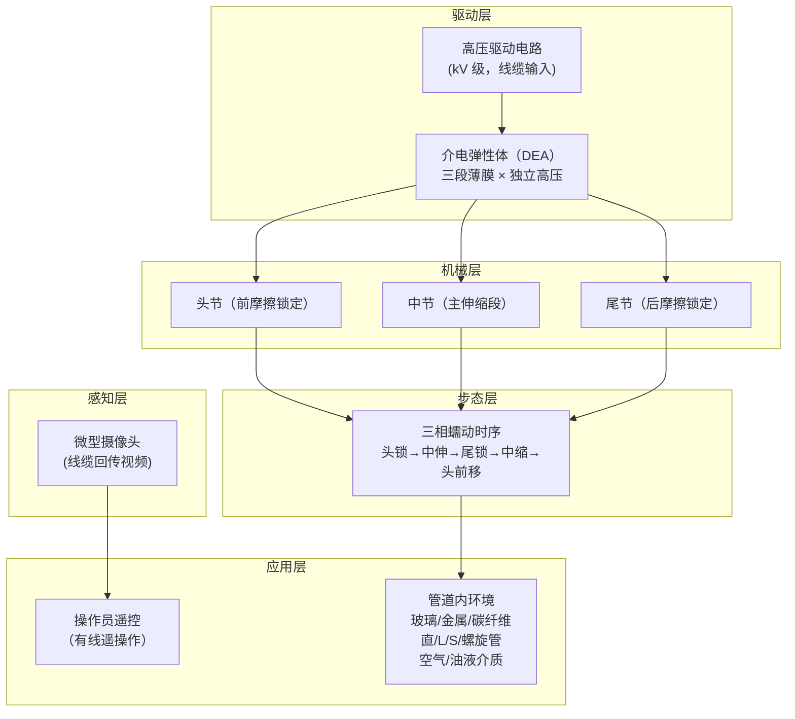

# 亚厘米级管道检测机器人：DEA 驱动的蠕动穿管软体机器人

**A pipeline inspection robot for navigating tubular environments in the sub-centimeter scale**（Tang Chao 等，清华大学机械工程系，**Science Robotics 2022**，[DOI:10.1126/scirobotics.abm8597](https://doi.org/10.1126/scirobotics.abm8597)）首次演示了一款质量 **2.2 g**、长 **47 mm**、外径适配 **< 10 mm** 管道的蠕虫式软体机器人，用**介电弹性体执行器（DEA）**取代电机/气动，实现三段蠕动步态，在直管、L 弯、S 弯、螺旋管及玻璃/金属/碳纤维管壁中稳定穿行，速度超过 **1 体长/秒**，并集成微型摄像头完成遥控管内视频采集。

## 一句话定义

**用介电弹性体人工肌肉驱动三段蠕动、能在外径 < 1 cm 管道中穿行并搭载摄像头做遥控内窥检测的 2.2 g 软体管道机器人。**

## 英文缩写速查

| 缩写 | 英文全称 | 简要说明 |
|------|----------|----------|
| DEA | Dielectric Elastomer Actuator | 介电弹性体执行器；高压电场驱动面内膨胀，取代电机或气动 |
| SRI | Stanford Research Institute | 最早系统研究 DEA 的机构；本文核心驱动原理溯源至此 |
| PAM | Pneumatic Artificial Muscle | 气动人工肌肉；本工作对比参照物（需气源，本文不用） |
| IPMC | Ionic Polymer-Metal Composite | 离子聚合物金属复合材料执行器；另一类软体驱动方案 |
| FEA | Finite Element Analysis | 有限元分析；用于验证 DEA 形变与管内力学 |
| DOF | Degrees of Freedom | 自由度；蠕动机器人三段 × 1 自由度的简约设计 |

## 为什么重要

- **禁区突破：** 直径 < 1 cm 的管路（精密工业管、医用软管、飞行器燃油管）是刚性机器人禁区；本工作将可穿行管径推进到 < 10 mm 量级，填补了该尺寸区间的能力空白。
- **DEA 取代复杂机构：** 不依赖电机齿轮箱、气泵或液压源；高压电信号直接驱动弹性体收缩，适合极端空间约束，为小型化软体机器人提供了可迁移的驱动方案。
- **多管型、多材质通用：** 同一机器人在**直/L/S/螺旋管**与**玻璃/金属/碳纤维**壁中均能推进，证明蠕动步态在管道检测中的鲁棒性。
- **遥操作集成：** 搭载微型摄像头并回传实时视频，完成了从运动演示到**可用检测工具**的闭环验证——不只是移动，还能看。
- **清华软体机器人里程碑：** 是赵慧婵团队在 Science Robotics 上的代表性成果，对国内软体机器人与微型机器人社区具有示范价值。

## 系统设计总览

## 核心机制（提炼）

| 模块 | 作用 | 关键参数 |
|------|------|----------|
| **DEA 薄膜** | 高压 → 面内膨胀，撤压 → 弹性收缩 | kV 级驱动；电场正比于 V²/厚度² |
| **三段蠕动** | 头/中/尾节顺序激励产生净前进位移 | 三相时序控制；仿蚯蚓生物力学 |
| **摩擦各向异性** | 前向摩擦 < 后向摩擦 → 单向净位移 | 被动爪/刚度差结构实现 |
| **机器人尺寸** | 外径 < 10 mm，质量 2.2 g，长 47 mm | 亚厘米级约束核心指标 |
| **推进速度** | > 1 体长/秒（> 47 mm/s） | 在空气/油液介质中均测试 |
| **微型摄像头** | 机头集成，线缆回传实时视频 | 遥操作闭环；实现内窥检测 |

## 适应性测试矩阵

| 管型 | 管壁材料 | 介质 | 结果 |
|------|----------|------|------|
| 直管 | 玻璃 | 空气 | 稳定前进 |
| L 形弯管 | 金属 | 空气 | 稳定通过弯曲段 |
| S 形弯管 | 碳纤维 | 空气 | 稳定通过双弯 |
| 螺旋管 | 玻璃 | 空气 | 连续螺旋段可穿行 |
| 直管 | 金属 | 油液 | 油润滑介质下仍正常推进 |

## 与相邻工作对比

| 维度 | 本工作 | 传统管道机器人 | 气动软体机器人 | IPMC 驱动 |
|------|--------|---------------|----------------|-----------|
| 管径下限 | **< 10 mm** | 通常 > 50 mm | > 20 mm | 可 < 10 mm（液体环境） |
| 驱动方式 | **DEA（高压电）** | 电机 / 轮式 | 气泵 / 气囊 | 离子聚合物 |
| 质量 | **2.2 g** | 数百 g 至 kg | 数十 g | 数克（形态受限） |
| 适应管型 | **直 / L / S / 螺旋** | 主要直管 | 有限弯曲 | 直管为主 |
| 检测集成 | **微型摄像头 + 遥操作** | 常见 | 少见 | 罕见 |

## 局限与风险

- **高压驱动：** DEA 需要 kV 级高压，驱动电路体积与安全性是实用化门槛；不适合直接携带电源。
- **有线约束：** 线缆供电与通信限制了可探索长度（数十厘米量级）；无线化需突破微型高压发生器。
- **单向推进：** 目前机器人以蠕动前进为主，尚未演示原地倒退或转向；复杂管网需要额外导向机构。
- **极细管径：** 医疗级 < 3 mm（血管介入）尚未演示；在更小尺寸下 DEA 膜的制造精度与驱动电压成为新瓶颈。
- **无公开代码或制造图纸：** 截至入库日（2026-07-20）无 GitHub 或公开 CAD；制造与复现需依赖论文 Methods + 补充材料。
- **耐久性：** DEA 薄膜长期高压循环下的疲劳寿命在论文中未系统评测。

## 工程实践

- **DEA 选材：** VHB 丙烯酸弹性体（3M）是常见 DEA 基材；预拉伸比例影响最大应变与击穿电压，需按管径和所需力矩调参。
- **摩擦各向异性设计：** 在体节末端加装微型被动爪或不对称弹性片，使前向摩擦显著低于后向——这是蠕动净位移的关键。
- **驱动电路：** 高压模块（如 EMCO、Ultravolt 系列）可集成在体外控制箱；若需随身携带，需研究微型升压方案（DC-DC + 压电或电感）。
- **开源状态：** 确认未开源，论文无代码承诺；制造与复现依赖 Science Robotics 论文 Methods 与 SI Video。
- **源码运行时序图：** 不适用（无公开可运行代码）。

## 参考来源

- [深蓝AI：近五年 Science Robotics 中国顶尖高校盘点](../../sources/blogs/wechat_shenlan_scirobotics_china_top3_2026-07-02.md)
- [亚厘米级管道检测机器人论文归档（Science Robotics 2022）](../../sources/papers/subcentimeter_pipeline_inspection_scirobotics_2022.md)
- Tang Chao et al., *A pipeline inspection robot for navigating tubular environments in the sub-centimeter scale*, [Science Robotics 2022](https://doi.org/10.1126/scirobotics.abm8597)

## 关联页面

- [Locomotion 任务页](../tasks/locomotion.md)
- [遥操作（Teleoperation）](../tasks/teleoperation.md)

## 推荐继续阅读

- [Science Robotics 论文页](https://doi.org/10.1126/scirobotics.abm8597)
- Zhao Huichan Lab，清华大学机械工程系软体机器人方向
