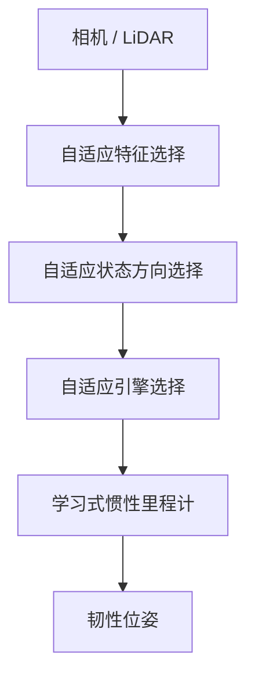
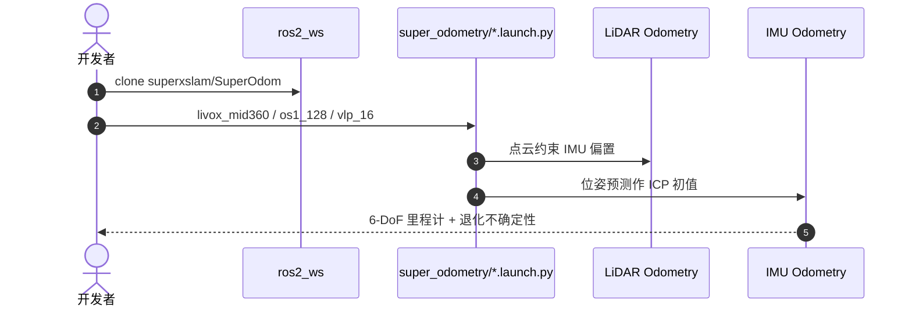

# SUPER ODOMETRY 2.0

**SUPER ODOMETRY 2.0: Resilient Odometry via Hierarchical Adaptation**（[arXiv:2608.25427](https://arxiv.org/abs/2608.25427)，[项目页](https://superodometry.com)，*Science Robotics* 2025）——卡内基梅隆大学（CMU）AirLab；纽约州立大学布法罗分校（University at Buffalo）。

## 一句话定义

**可靠定位不是寻找永不失效的传感器，而是建立可退化、可切换的层级体系，让 IMU 在外感知失效时顶上。**

## 英文缩写速查

| 缩写 | 英文全称 | 简要说明 |
|------|----------|----------|
| IMU | Inertial Measurement Unit | 惯性测量单元，本文提升为核心后备 |
| LIO | LiDAR-Inertial Odometry | 激光-惯性里程计 |
| VIO | Visual-Inertial Odometry | 视觉-惯性里程计 |
| ICP | Iterative Closest Point | slim 仓中激光里程计用 IMU 预测作初值 |

## 为什么重要

- 纳入 [具身智能小站 2026-08-28 九篇盘点](../../sources/blogs/wechat_embodied_station_wam_vla_cross_embodiment_9_papers_2026-08-28.md)：部署可靠性走传感器退化路径。
- 开源状态（入库日）：**部分开源**（slim LiDAR-inertial ROS 2；完整四级自适应以论文为准）。

## 核心信息

| 项 | 内容 |
|----|------|
| **机构** | 卡内基梅隆大学 AirLab；纽约州立大学布法罗分校 |
| **出处** | arXiv:2608.25427；*Science Robotics* 10(109):eadv1818 |
| **开源** | **部分开源**（[`superxslam/SuperOdom`](https://github.com/superxslam/SuperOdom)） |

### 流程总览

## 工程实践

| 项 | 内容 |
|----|------|
| **名义条件** | 下层因子图给 IMU 网络提供自由位姿标签 |
| **退化条件** | 学习式 IMU 接管运动先验 |
| **slim 仓** | `ros2 launch super_odometry livox_mid360.launch.py`（亦有 OS1-128 / VLP-16） |
| **许可** | GPL-3.0 |

## 评测

| 项 | 内容 |
|----|------|
| **规模** | **200 km / 800 h**，空中、轮式、腿式 |
| **IMU 数据** | 超过 **100 小时**异构平台 |
| **压力测试** | 13 类连续硬件/环境退化单次跑 |
| **漂移** | 腿式约 **20 cm / 2966 m** |

- 数据出处：[ingest 摘录「评测」](../../sources/papers/super_odometry_2_arxiv_2608_25427.md) 与项目页 Highlights。

## 结论

**外感知会失效；分层自适应把 IMU 从「校正对象」改成「对等模态」。**

1. 低层做便宜的特征/方向调整，高层才切换引擎或纯惯性。
2. 学习式 IMU 需要异构数据，否则新本体仍会域移。
3. slim 开源仓能跑 LiDAR-inertial 演示，不等于复现论文全部四层。
4. 项目页自承切换策略仍偏启发式，在线学习会过拟合或遗忘。

## 源码运行时序图

这是 slim 仓的互为约束回路，不是论文中学习式惯性模块的训练时序。

## 局限与风险

- slim ≠ 2.0 全文系统；不要把 GitHub star 数读成「论文已完全开源」。
- 未见域的 IMU 模型仍弱；作者建议补仿真 IMU。
- GPL-3.0 对商业集成需单独评估。

## 与其他工作对比

- 相对传统相机/LiDAR 中心融合：IMU 提到对等地位。
- 相对 [跨平台惯性里程计 X-IONet](./paper-x-ionet-cross-platform-inertial-odometry.md)：Super Odometry 是层级融合系统，X-IONet 聚焦学习式惯性本身。
- 相对 FAST-LIO / LIO-SAM：见 [LIO/VIO 选型](../comparisons/lidar-slam-lio-vio-selection.md)；本页强调退化可切换，而不是单一滤波器精度。

## 关联页面

- [里程计与激光雷达融合](../methods/lidar-odometry-fusion.md)
- [LiDAR / LIO / VIO 选型](../comparisons/lidar-slam-lio-vio-selection.md)
- [导航与 SLAM 栈](../overview/navigation-slam-autonomy-stack.md)
- [WAM / VLA / 跨本体 9 篇技术地图](../overview/wam-vla-cross-embodiment-9-papers-technology-map.md)

## 参考来源

- [super_odometry_2_arxiv_2608_25427](../../sources/papers/super_odometry_2_arxiv_2608_25427.md)
- [superodometry 项目页](../../sources/sites/superodometry.md)
- [superodom 仓库](../../sources/repos/superodom.md)
- [具身智能小站 9 篇盘点](../../sources/blogs/wechat_embodied_station_wam_vla_cross_embodiment_9_papers_2026-08-28.md)

## 推荐继续阅读

- [arXiv:2608.25427](https://arxiv.org/abs/2608.25427)
- [Science Robotics DOI](https://doi.org/10.1126/scirobotics.adv1818)
- [SuperOdom slim 代码](https://github.com/superxslam/SuperOdom)
