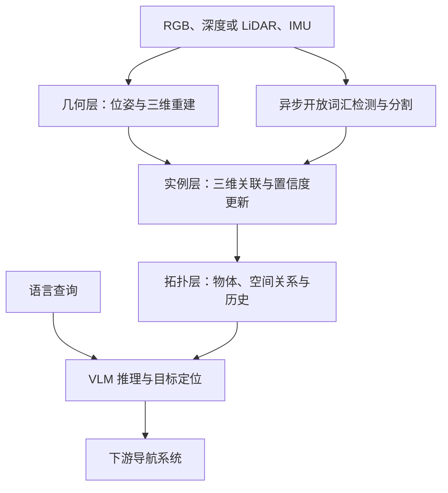

# SuperMap：面向语言导航的 4D 空间记忆

## 一句话定义

SuperMap 把物体在哪里、如何变化和彼此关系写入持续更新的三维地图及时间历史，为语言导航提供外部空间记忆。

## 英文缩写速查

| 缩写 | 英文全称 | 简要说明 |
|---|---|---|
| SLAM | Simultaneous Localization and Mapping | 同时定位与建图 |
| VLN | Vision-Language Navigation | 视觉语言导航 |
| VLM | Vision-Language Model | 查询场景图的视觉语言模型 |
| RSS | Robotics: Science and Systems | 本论文发表会议 |
| ROS2 | Robot Operating System 2 | 文档描述的在线机器人接口 |

## 核心信息

| 项目 | 内容 |
|---|---|
| 论文 | SuperMap: A Spatio-Temporal SLAM System for Visual-Language Navigation |
| 机构 | 卡内基梅隆大学（Carnegie Mellon University）AirLab |
| 会议 | RSS 2026 |
| arXiv | 2608.22896 |
| 4D 含义 | 三维物体位置与时间历史，支持出现、消失和移位记录 |

## 为什么重要

逐帧检测容易把再次出现的椅子当成新物体，也容易保留早已搬走的椅子。语言导航需要长期一致的世界表示，而不仅是当前画面的类别标签。SuperMap 提供可查询的实例记忆，适合研究长期运行机器人如何把语言目标落到真实位置。

## 核心原理与流程总览

几何层由 SuperOdometry 提供位姿及稠密彩色三维表示；实例层融合 Grounding DINO/SAM2 等开放词汇感知与三维关联。遮挡后的实例可重新激活，存在和标签置信度用于抑制身份漂移、删除过时内容。拓扑层把空间边与时间历史组织成可序列化场景图，让下游按物体语义、相对位置和历史组合查询。

例如「去之前放在书架旁、后来搬走的椅子那里」需要区分当前位置与历史位置。系统的价值是保留这些事实供推理查询；语言目标解析、路径规划与底层移动仍需导航模块完成。

## 源码运行时序图

**不适用**：截至 2026-10-02，官方仓库仅公开说明与文档，没有可核验的运行实现。README 中的命令不能据此当作已验证源码时序。

## 工程实践

先读项目页的校园地图和动态演示，再核对仓库是否补齐实现。未来复现应分别检查几何位姿、实例 ID 连续性、出现/消失检测、查询正确率和端到端导航成功率。

官方 README 声明 ≥16 GB 显存及 ROS2 Jazzy 在线模式，并描述 RGB/点云/里程计输入和带物体 ID、关系、状态、时间戳的输出；目前均未运行验证。训练免费指映射系统无需场景专用训练，仍使用预训练感知模型。

## 实验与评测

| 项目页评测 | SuperMap | 对照与读法 |
|---|---|---|
| ScanNet mIoU | 27.42% | HOV-SG 26.79%，增益依指标而异 |
| ScanNet f-mIoU | 43.50% | HOV-SG 36.05% |
| ScanNet Acc | 55.48% | HOV-SG 35.17% |
| 出现事件 recall | Bucket 1.000 / Cart 0.262 / Sign 0.583 | 不同物体差异明显，不能称全部完美检测 |
| 连续部署展示 | CMU 校园两小时 | 长期建图演示，不等同于标准导航 SR/SPL |

以上数字来自官方项目页，未独立复现。

## 结论

关键贡献是把逐帧开放词汇感知变成长期一致、可查询的空间记忆。

1. 研究重点应放在实例身份维护和过时地图清理，而不仅是单帧检测准确率。
2. 动态评测应分开出现、消失、移位，逐类检查漏检。
3. 把建图与导航指标分开，不能用分割精度证明语言导航成功率。
4. 当前适合学习架构和评测设计；可运行源码发布前不能按开箱复现项目安排工程计划。

## 与其他工作对比

| 路线 | 重点 | 与 SuperMap 的关系 |
|---|---|---|
| Functional-SLAM | 物体、可交互单元与功能关系 | 偏交互功能建图；SuperMap 偏动态实例历史与导航空间记忆 |
| 语义认知地图 | 把感知变成规划可用表示 | SuperMap 是加入实例持久身份与时间记录的具体系统 |
| 生成式世界模型 | 预测或生成未来观测 | SuperMap 维护已观测场景及历史；4D 表示不能直接理解成生成未来视频 |

## 局限与风险

- **开放状态：待发布源码。** 项目页虽宣称开源，官方仓库仅 README/doc，并仍声明代码将发布；未找到独立评测数据下载入口或许可文件。
- 遮挡不等于物体消失，存在置信度更新仍需避免删除暂时看不到的对象。
- 位姿漂移、错误分割和语义标签波动会影响实例关联。
- 零样本开放词汇识别及训练免费建图，不意味着所有语言任务和机器人平台均可直接零样本部署。

## 关联页面

- [视觉语言导航](../tasks/vision-language-navigation.md)
- [具身语义认知地图](../concepts/embodied-semantic-cognitive-map.md)
- [Functional-SLAM](./paper-functional-slam.md)

## 参考来源

- [论文归档](../../sources/papers/supermap_arxiv_2608_22896.md)
- [项目页核查](../../sources/sites/supermap.md)
- [官方仓库核查](../../sources/repos/supermap.md)

## 推荐继续阅读

- [官方项目页与交互地图](https://superodometry.com/supermap)
- [RSS 正式论文](https://www.roboticsproceedings.org/rss22/p052.pdf)
