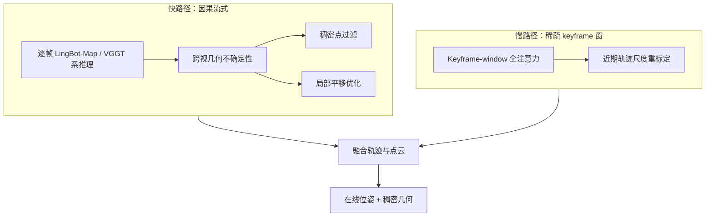
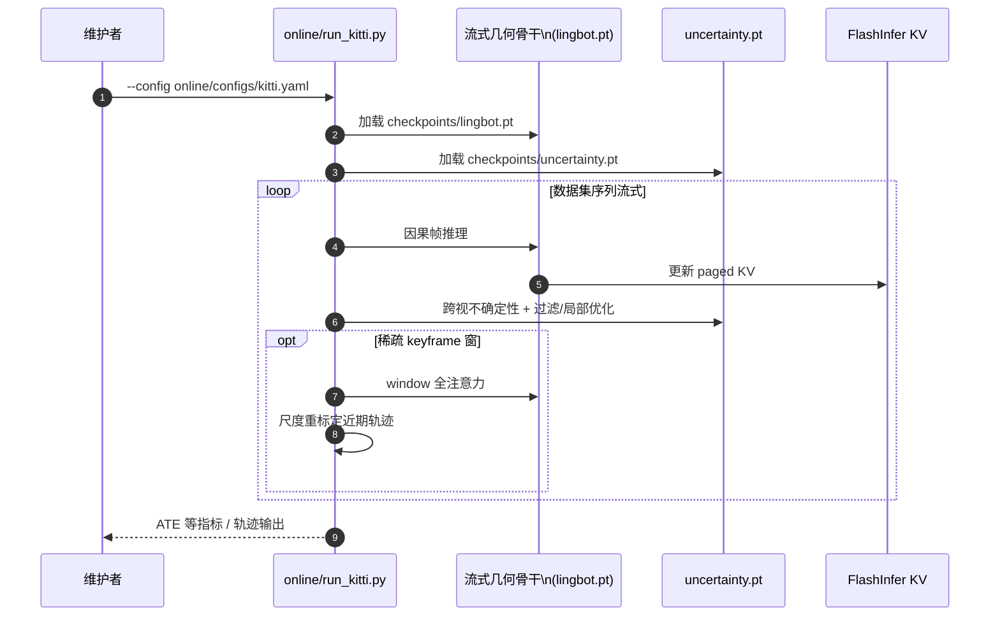

# SURE-Map：自校正流式几何基础模型

**SURE-Map**（*SURE-Map: Self-Correcting Streaming Geometric Foundation Models*，arXiv:[2609.15795](https://arxiv.org/abs/2609.15795)，[项目页](https://mingkai-liu.github.io/projects/sure-map/)，[代码](https://github.com/RCL-Robotics/SURE-map)，[HF uncertainty](https://huggingface.co/milchstrasse/SURE-Map)）由 **穆罕默德·本·扎耶德人工智能大学（MBZUAI）、北京大学与清华大学** 提出：面向 **在线前馈** 流式几何重建，在预测之外显式引入 **自校正**——用 **跨视几何不确定性** 筛点并做局部平移优化，并用 **多时间尺度** 快慢推理组合 **周期性尺度重标定**，抑制长程漂移。

## 一句话定义

**在流式几何基础模型的因果推理之上，用「位姿–深度是否跨视一致」的学习不确定性过滤几何，并用稀疏 keyframe 全注意力窗周期性拉回轨迹尺度。**

## 英文缩写速查

| 缩写 | 英文全称 | 简要说明 |
|------|----------|----------|
| SURE-Map | Self-Correcting Streaming Geometric Foundation Model(s) | 本文框架与项目名 |
| FM | Foundation Model | 几何基础模型（VGGT / LingBot-Map 系骨干） |
| ATE | Absolute Trajectory Error | 绝对轨迹误差；文中等报 **ATE-RMSE** |
| SLAM | Simultaneous Localization and Mapping | 同步定位与建图；流式 FM 作为替代路线 |
| KV | Key-Value Cache | 流式注意力缓存；实现依赖 FlashInfer |
| LC | Loop Closure | 可选回环精炼，进一步降低长程 ATE |

## 核心信息

| 字段 | 内容 |
|------|------|
| **机构** | 穆罕默德·本·扎耶德人工智能大学（MBZUAI）；北京大学（PKU）；清华大学（Tsinghua） |
| **作者** | Mingkai Liu1,2；Hao Zhao3,*（通讯）；Xingxing Zuo1,*（通讯） |
| **arXiv** | [2609.15795](https://arxiv.org/abs/2609.15795)（2026-09-14 上传） |
| **骨干（论文实验）** | **LingBot-Map** 权重（`lingbot-map.pt`）；框架面向 VGGT 系流式几何 FM |
| **新增模块** | **Cross-view geometric uncertainty** 头（HF `uncertainty.pt`） |
| **开源（截至 2026-09-24）** | **已开源** — 代码 + uncertainty 权重 + `online/` / `benchmark/` 评测；骨干与更多 stride 权重 README 注明后续发布 |
| **许可** | 仓库主体 **Apache-2.0**；`training/dust3r/` 等 **CC BY-NC-SA 4.0** 片段保留原许可 |

## 为什么重要

- **流式 FM 的「第二轴」：** [LingBot-Map](./paper-lingbot-map.md) 等把 SLAM 式记忆写进 GCA + Paged KV，解决 **可流式预测**；SURE-Map 针对 **有限上下文下的误差累积与尺度漂移**，补上 **检测不可靠跨视几何 + 自校正** 一层，更接近可部署长视频几何。
- **不确定性定义可操作：** 不是单视 depth confidence，而是 **联合 pose–depth 诱导的跨视像素对应是否几何一致**——直接服务 **点云过滤** 与 **局部平移优化**。
- **多时间尺度工程可落地：** 快路径维持因果吞吐；**稀疏 keyframe-window** 全注意力提供长程证据做 **尺度重标定**，与 FlashInfer 流式栈兼容（README 与 LingBot-Map 同源依赖）。
- **长程户外 SOTA 报告：** 相对表内 LingBot-Map 等基线，KITTI / Oxford Spires / VBR 上 ATE-RMSE 明显下降（见下表）；室内 NRGBD / 7-Scenes 点云指标亦随 uncertainty filtering 改善。

## 流程总览

## 核心原理

### 1. 跨视几何不确定性

- 对 **相邻（或指定）视图对**，评估联合 **相机位姿 + 深度** 是否产生 **一致的跨视像素对应**（与 optical flow / 重投影残差监督对齐；训练用 TartanAir，README 说明 forward/backward flow 记号与推理对齐方式）。
- **推理用途：** 剔除高不确定性稠密点；驱动 **uncertainty-weighted 局部平移优化**，抑制动态物体与弱纹理导致的局部错位。

### 2. 多时间尺度自校正

- **快：** 连续帧因果推理，保留流式效率与 FlashInfer KV 路径。
- **慢：** 稀疏触发 **keyframe-window** 全注意力，引入更长程几何约束，对 **近期轨迹尺度** 做周期性 **recalibration**——单独局部校正无法消除的 **慢累积尺度漂移** 的主要对策。

### 3. 可选回环精炼

- 论文与项目页报告在 baseline 之上叠加 **loop-closure refinement** 可进一步降低长程 ATE（KITTI 等）；部署时需与前端 keyframe 策略一并评估算力。

## 源码运行时序图

长程位姿评测 `online/run_kitti.py`（Oxford / VBR 为同级入口）的典型路径：

**复现路径：** `conda` + `pip install -e .` + `flashinfer-python` → 下载 `uncertainty.pt` 与 `lingbot-map.pt` 至 `checkpoints/` → 按 README 准备 KITTI / Oxford / VBR → `python online/run_kitti.py --config online/configs/kitti.yaml`。

## 评测要点

| 基准 / 维度 | 要点 |
|-------------|------|
| **KITTI Odometry** | 长程户外；ATE-RMSE **24.00→17.24 m**（+ LC **15.17 m**）相对报告基线 |
| **Oxford Spires** | 长程户外；**5.11→4.74 m**（+ LC **4.63 m**） |
| **VBR** | 长程；**31.37→28.58 m**（+ LC **22.12 m**） |
| **Neural RGB-D / 7-Scenes / DTU** | `benchmark/` 点云 Acc./CD/F1；uncertainty filtering 提升 F1（如 NRGBD **65.10→66.20%**） |
| **对照** | 直接建立在 [LingBot-Map](./paper-lingbot-map.md) 流式栈上；离线精度仍见 [Glob3R](./paper-glob3r.md) |

## 对比定位

| 对照 | SURE-Map 差异 |
|------|----------------|
| [LingBot-Map](./paper-lingbot-map.md) | 同系流式 FM；SURE-Map **不改 GCA 叙事**，叠加 **不确定性 + 多尺度校正** 改善长程 ATE/点云 |
| [R³](./paper-r3-relative-regression.md) | R³ 改 **相对位姿回归** 范式；SURE-Map 保留 FM 输出，用 **几何一致不确定性** 与 **尺度窗** 校正 |
| [SLAMFormer-∞](./paper-slamformer-infinity.md) | 学习型 mono SLAM + 显式前后端；SURE-Map 仍 **前馈 FM + 轻量校正模块** |
| [Glob3R](./paper-glob3r.md) | 离线 tracks→BA；SURE-Map 目标 **在线 feed-forward** 长序列 |

## 工程实践

| 项 | 建议 |
|----|------|
| **权重** | `checkpoints/uncertainty.pt`（HF）+ `checkpoints/lingbot.pt`（robbyant/lingbot-map） |
| **训练 uncertainty** | TartanAir v1；8 GPU；`train_flow_sigma_tartanair.py`；骨干 **冻结** |
| **依赖** | torch **2.8.0** + cu128；**flashinfer-python** |
| **数据准备** | Oxford 用 `preprocess/oxford.py`；VBR 用 HF `Junyi42/vbr_processed` |
| **许可边界** | 主体 Apache-2.0；NC-SA 训练子树勿误用于闭源产品化训练栈 |
| **源码运行时序图** | 见上节；无可运行代码时不适用——**本仓库已开源** |

## 结论

**SURE-Map 把流式几何 FM 从「只会往前预测」推进到「能识别跨视不可靠并拉回尺度」——长程 ATE 与点云过滤的增益来自显式自校正，而不是换更大的骨干。**

- **不确定性要测跨视一致：** 单视 confidence 不足以筛动态/弱纹理错配；联合 pose–depth 的对应一致性才是过滤与局部优化的正确信号。
- **局部优化不够，必须有多尺度窗：** keyframe-window 尺度重标定针对 **慢漂移**，与快路径因果推理互补。
- **工程上叠在 LingBot-Map：** 复现门槛主要是双 checkpoint + FlashInfer；与现有流式几何 FM 选型路径一致。
- **loop closure 是可选增益：** 户外表上 LC 仍显著降 ATE；是否启用取决于算力与前端图结构。
- **许可注意 NC-SA 训练片段：** 产品化训练需单独审计 `training/dust3r/` 等目录。

## 局限与风险

- **骨干外置：** 论文实验依赖 **LingBot-Map** 权重；换 VGGT 系其他 checkpoint 需自行验证 uncertainty 头迁移。
- **训练数据：** uncertainty 头主要在 **TartanAir** 流程公开；README 称更广数据集/stride 权重 **后续发布**。
- **算力：** keyframe-window 全注意力与 LC 精炼增加峰值算力，需与真机 **FPS 预算** 一并评估。
- **相对坐标与尺度：** 自校正缓解漂移但不等价于全局 BA；极高精度离线 SfM 仍应并行评估 Glob3R 等路线。

## 关联页面

- [LingBot-Map（方法页）](../methods/lingbot-map.md) — 上游流式几何 FM
- [LingBot-Map（论文实体）](./paper-lingbot-map.md) — 骨干与基线对照
- [Glob3R](./paper-glob3r.md) — 离线全局精炼
- [R³](./paper-r3-relative-regression.md) — 相对回归流式路线
- [VGGT 几何状态综述](../overview/vggt-geometric-state-survey.md) — S4 流式/长序列
- [导航·SLAM 栈总览](../overview/navigation-slam-autonomy-stack.md)
- [State Estimation](../concepts/state-estimation.md)

## 参考来源

- [SURE-Map 论文摘录](../../sources/papers/sure_map_arxiv_2609_15795.md)
- [SURE-Map 项目页归档](../../sources/sites/sure-map-mingkai-liu-github-io.md)
- [SURE-Map 官方仓库](../../sources/repos/sure-map.md)
- Liu et al., *SURE-Map: Self-Correcting Streaming Geometric Foundation Models* — <https://arxiv.org/abs/2609.15795>

## 推荐继续阅读

- 项目页：<https://mingkai-liu.github.io/projects/sure-map/>
- 代码：<https://github.com/RCL-Robotics/SURE-map>
- 演示视频：<https://www.youtube.com/watch?v=vIKJFzLCtMc>
- LingBot-Map 骨干：<https://github.com/Robbyant/lingbot-map>
- FlashInfer：<https://github.com/flashinfer-ai/flashinfer>
