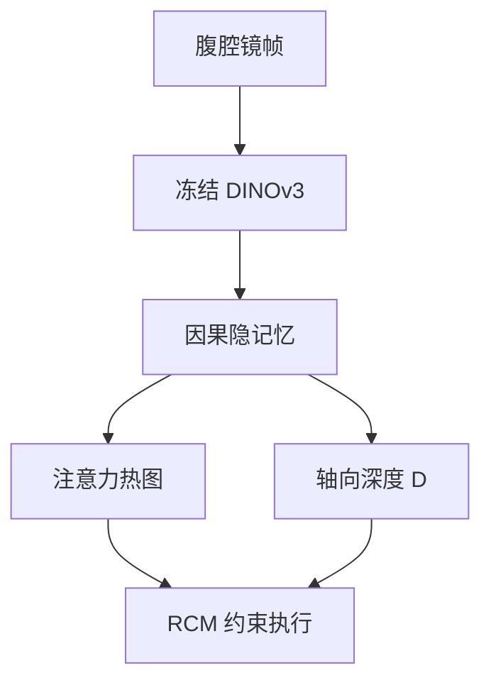

# SurgLAT：腹腔镜要跟的是意图轨迹，不是器械中心

**SurgLAT**（*Surgical Latent Attention Tracking*；[arXiv:2608.07876](https://arxiv.org/abs/2608.07876)，[项目页](https://surglat-home-page.pages.dev/)）由 **香港中文大学 / 南方科技大学 / 深圳大学 / 深圳市人民医院** 等提出：自主腹腔镜控制的目标不是稳定物体，而是随手术阶段演化的隐式注意力。

## 一句话定义

**用冻结 DINOv3 和因果记忆把术者关注区建成隐状态，解码成热图与轴向深度，再在 RCM 约束下驱动 7-DoF 腹腔镜。**

## 英文缩写速查

| 缩写 | 英文全称 | 简要说明 |
|------|----------|----------|
| SurgLAT | Surgical Latent Attention Tracking | 本文感知–控制框架 |
| RCM | Remote Center of Motion | 戳卡约束的远程运动中心 |
| FoV | Field of View | 术野 |
| IoU | Intersection over Union | 关注框重叠 |
| MCE | Mean Center Error | 中心像素误差 |

## 为什么重要

- 跟器械几何中心，可能正好偏离真正的缝合/解剖界面。
- 腹腔镜视频有烟雾、反光、出血和遮挡，逐帧检测会抖。
- 有预测没有 RCM 可行运动，仍不能上真机。

## 核心信息

| 项 | 内容 |
|----|------|
| **机构** | 香港中文大学（CUHK）；南方科技大学（SUSTech） |
| **数据** | SurgAtt-1.16M（SZPH / AutoLaparo / Hamlyn） |
| **开源** | **项目页已发；独立训练仓未找到** |

## 核心原理

### 方法栈

冻结 DINOv3 ViT-B/16 → 上一时刻隐状态生成高斯空间先验，软调制当前 token → spatial token mixer（16 evidence token）→ selective causal memory（4 latent token，短/长缓存 16/64）动态检索当前/近期/历史 → 解码热图与操作区；深度支路在区内聚合相对深度，得到轴向目标 \(D\)。控制：任务 \((x,y,D)\)，虚拟插入坐标 \(\lambda\) 建 RCM；初始化在冗余零空间里搜更大旋转工作空间。

### 流程总览

## 源码运行时序图

**不适用。** 项目页有 Code 按钮但未给出独立 GitHub；截至 2026-08-17 未找到可辨识的训练/控制入口。

## 工程实践

| 项 | 建议 |
|----|------|
| 源码运行时序图 | **不适用**（独立仓未找到） |
| 训练 | 文内两阶段：T=32 短片段 5 epoch → T=64 在线流式 5 epoch，记忆跨段传递 |
| 输入 | 512×512 → 32×32 token；隐维 256 |
| 控制 | 主任务保 RCM，次任务调 \(\lambda\)；不要把轴向旋转当视向自由度 |

## 实验与评测

SurgAtt-1.16M（H100、10 epoch）：

| 模型 | SZPH IoU / MCE / FPS | AutoLaparo IoU | Hamlyn IoU |
|------|---------------------:|---------------:|-----------:|
| SurgAtt-Tracker | 0.566 / 49.92 / 12.4 | 0.462 | 0.443 |
| **SurgLAT** | **0.604 / 41.24 / 34.5** | **0.527** | **0.479** |

真机 7-DoF 平台：遮挡、快速运动、目标切换下在线跟踪与稳定视野；项目页提供四场景对照视频。

## 与其他工作对比

相对器械视觉伺服：目标从工具中心改成隐式术野。相对 SurgAtt-Tracker：加上因果记忆、深度轴向和 RCM 执行。相对 [零空间控制](../concepts/null-space-control.md)：把冗余用于腹腔镜初始构型，而不是全身操作。相对 [SHRIMP](./paper-shrimp.md)：一个把人留在计划环里，一个把术者意图留在相机环里。

## 结论

**自主腹腔镜跟的是随时间演化的术者意图，不是某一类可检测物体。**

1. **先验要软** — 高斯调制而不是裁剪，才能从错误记忆里恢复。
2. **短记忆保连续、长记忆保换目标** — 两者都要检索。
3. **深度是轴向调节，不是米制重建** — 相对深度当反馈。
4. **RCM 是硬约束** — 预测再准，违反戳卡也不能用。
5. **代码未独立发布** — 目前只能读协议与项目页视频。

## 局限与风险

- 无独立仓，无法核对 RCM 控制器实现。
- 标注是框而不是像素级术野，IoU 有上限。
- 真机验证是体外平台，体内烟雾/出血分布不同。

## 关联页面

- [零空间控制](../concepts/null-space-control.md)
- [MPC](../methods/model-predictive-control.md)
- [PGIF-MPPI](./paper-pgif-mppi.md) — 另一条「面向未来的安全/目标成本」
- [SHRIMP](./paper-shrimp.md)

## 参考来源

- [SurgLAT 论文摘录](../../sources/papers/surglat_arxiv_2608_07876.md)
- [项目页归档](../../sources/sites/surglat-home-page.md)
- [具身智能小站 9 篇盘点（2026-08-17）](../../sources/blogs/wechat_embodied_station_9_papers_2026-08-17.md)
- [arXiv:2608.07876](https://arxiv.org/abs/2608.07876)

## 推荐继续阅读

- [SurgLAT 项目页](https://surglat-home-page.pages.dev/)
- SurgAtt-Tracker / SurgAtt-1.16M（文内基准）
