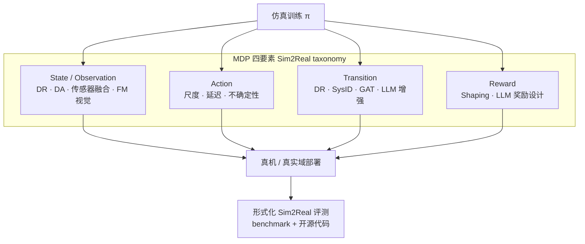

# Sim2Real RL 综述（2502.13187）

**A Survey of Sim-to-Real Methods in RL: Progress, Prospects and Challenges with Foundation Models**（arXiv [2502.13187v3](https://arxiv.org/abs/2502.13187v3)，2025-03-08）由 Longchao Da 等撰写，是 RL 视角 Sim2Real 的 **MDP 四要素 taxonomy** 综述，并维护配套策展库 [LongchaoDa/AwesomeSim2Real](https://github.com/LongchaoDa/AwesomeSim2Real)。

## 一句话定义

用 **State / Action / Transition / Reward** 四个 MDP 要素统一归类 Sim2Real RL 技法，并总结跨领域 simulators、评测协议与基础模型带来的新机遇。

## 英文缩写速查

| 缩写 | 英文全称 | 简要说明 |
|------|----------|----------|
| Sim2Real | Simulation to Real | 仿真策略迁移到真机/真实环境 |
| MDP | Markov Decision Process | 状态–动作–转移–奖励形式化框架 |
| DR | Domain Randomization | 训练时随机化仿真参数 |
| FM | Foundation Model | 大模型/基础模型（VLM/LLM 等） |
| GAT | Grounded Action Transformation | 用真机数据校正仿真动力学转移 |
| DA | Domain Adaptation | 观测或特征空间的域适配 |

## 为什么重要

- **taxonomy 可导航：** 多数 Sim2Real 综述按应用域或年份堆叠；本文按 **gap 落在 MDP 哪一环** 组织，便于与 [Sim2Real 四条路线](../comparisons/sim2real-four-routes-identifiability.md) 等工程选型页对齐。
- **跨域覆盖：** 除机器人外纳入交通、推荐等 RL Sim2Real，并分 **Environment vs Sim2Real Benchmark** 汇总 simulators。
- **FM 章节及时：** v3 纳入 VLM/LLM 用于观测对齐、奖励设计与语言条件迁移，与 2024–2025 热点同步。
- **可维护资源库：** 作者 actively maintain [AwesomeSim2Real](https://github.com/LongchaoDa/AwesomeSim2Real)；站内已节点化为 [技术地图](../overview/lc-awesome-sim2real-technology-map.md)（每篇独立详情节点）。

## 流程总览

## 核心机制（知识归纳）

### 1. State（观测 gap）

- **Domain Randomization / Randomization on sensing**：视觉纹理、光照、相机参数随机化（经典 Tobin et al. DR）。
- **Domain Adaptation**：Sim→Real 或 Real→Sim 的对抗/自监督特征对齐（RetinaGAN、Bi-directional DA 等）。
- **Sensor Fusion**：多模态（LiDAR+相机、GPS+IMU）在仿真与真机间的噪声建模。
- **Foundation Models**：DINOv2、VLM 视觉先验、语言条件 segmentation 等降低 sim 观测与 real 语义 gap。

### 2. Action（动作 gap）

- **Action space scale / safety shields**：高维连续动作、协作机器人安全约束。
- **Action delay**：非 Markov 延迟 MDP、状态增广、异步 RL 框架。
- **Action uncertainty**：鲁棒 RL、概率执行不确定性。

### 3. Transition（动力学 gap）

- **Domain Randomization（动力学侧）**：摩擦、质量、执行器参数随机化。
- **Grounded Action Transformation（GAT）**：用真机 rollout 学习仿真转移校正（UT Austin Stone 组系列）。
- **Domain Adaptation / Residual**：与观测侧 DA 互补；部分工作学习 residual dynamics。
- **LLM-Enhanced**：语言 prompt 辅助 sim2real 策略迁移（如交通信号控制 Prompt-to-Transfer）。

### 4. Reward（奖励 gap）

- **Reward shaping**：潜在 shaping、内在奖励。
- **LLM-Based Reward Design**：用 LLM 反馈构造稠密奖励或课程（RLingua、CurricuLLM 等）。

### 5. Simulators & Benchmarks（跨域）

综述按 **Robotics / Transportation / Recommender / Other** 分列 **Environment**（通用 RL 环境）与 **Sim2Real Benchmark**（专为迁移评测设计，如 Humanoid-Gym、DISCOVERSE、Robust Gymnasium）。

## 工程实践

| 场景 | 读综述 + 列表怎么用 |
|------|---------------------|
| 选型入口 | 先判断 gap 主因落在 S/A/T/R 哪一环，再到 [lc-awesome-sim2real 技术地图](../overview/lc-awesome-sim2real-technology-map.md) 同分组找代表论文 |
| 机器人 loco/manip | 与 [PACE](./paper-pace-sim2real-legged-robots.md)（Transition/SysID）、[Domain Randomization](../concepts/domain-randomization.md) 对照 |
| 交通 / 非机器人 | 列表含 TorchDriveEnv、AutoVRL 等；注意动力学与观测 gap 与腿足不同 |
| FM 增强 | 查 Observation / Reward 下 Foundation Models & LLM 小节，并交叉 [VLA](../methods/vla.md) |
| 评测 | 优先选带 **Sim2Real Benchmark** 标签的环境；复现前查各论文 GitHub badge（列表仅部分标注） |

## 局限与风险

- **综述 ≠ Runbook：** 工程部署仍以 [Sim2Real Checklist](../queries/sim2real-checklist.md) 与真机闭环日志为准。
- **列表更新快于 arXiv 版本：** AwesomeSim2Real issue 入口可补新文；站内 catalog 需定期重跑生成脚本。
- **开源状态逐条核：** 综述 PDF 写 open-source 不等于项目页已挂链；步骤 2.5 以实际 URL 为准。
- **与 Real2Sim 闭环清单重叠：** [Awesome-Real2Sim2Real](./awesome-real2sim2real.md) 偏 Real2Sim2Real 闭环；本篇偏 **RL Sim2Real taxonomy**，互补而非替代。

## 源码运行时序图

**不适用** — 综述与 Awesome 列表为 Markdown 策展资源，无可运行官方训练/推理仓库；逐条论文代码见列表内 GitHub badge 或各论文实体页。

## 与其他工作对比

- **vs sun254667 Awesome-Real2Sim2Real：** 后者按 Sim2Real → Real2Sim → Real2Sim2Real **闭环管线** 组织（含 3DGS）；本篇按 **MDP 四要素** 组织 **RL 技法**，更适合作 taxonomy 与 related work 框架。
- **vs 早期 Sim2Real 综述（Zhao 2020、Salvato 2021 等）：** 本文显式纳入 **Foundation Models** 与跨域 benchmark 表，并维护 live repo。
- **vs 站内 [四条路线](../comparisons/sim2real-four-routes-identifiability.md)：** 四条路线按 **工程可辨识性** 选型；本文 taxonomy 按 **gap 落在 MDP 哪一环** 分类——二者互补，不宜混为一谈。

## 评测与指标

- 综述强调 **形式化 Sim2Real 评测流程**：在一致 benchmark 上报告 sim vs real 性能差距、样本效率与成功率。
- 具体数值因领域差异大（机器人 success rate vs 交通 KPI）；本页不搬运原文汇总表。
- 机器人方向可对照 [Robot Policy Evaluation for Sim-to-Real Transfer（2508.11117）](https://arxiv.org/abs/2508.11117) 等 benchmark 视角论文（亦收录于 sun254667 Real2Sim2Real 清单）。

## 结论

**这是 RL Sim2Real 的「MDP 要素地图」型综述：适合用来定位 gap 类型与找代表文献，但不能替代针对具体平台的 SysID / DR / 残差工程闭环。**

- 真影响：按 **State/Action/Transition/Reward** 读文献，比按年份堆论文更利于选型与写 related work。
- 次要代价：跨域广覆盖导致单域深度有限；机器人工程细节需回到专题页（如 [四条路线](../comparisons/sim2real-four-routes-identifiability.md)）。
- 部署读法：先 taxonomy 定位 gap → [AwesomeSim2Real 技术地图](../overview/lc-awesome-sim2real-technology-map.md) 找 2–3 篇代表 → 对照站内方法页落地。
- FM 章节宜与 sim 侧数据管线一并评估，避免只换 VLM backbone 却忽略 Transition gap。
- 维护者可通过 issue 向 upstream 列表贡献新论文，并重跑 `generate_longchao_awesome_sim2real_entities.py` 同步节点。

## 关联页面

- [AwesomeSim2Real（列表实体）](./awesome-sim2real.md)
- [AwesomeSim2Real 技术地图](../overview/lc-awesome-sim2real-technology-map.md)
- [Sim2Real（概念）](../concepts/sim2real.md) / [Hub Sim2Real](../overview/hub-sim2real.md)
- [Sim2Real 四条路线](../comparisons/sim2real-four-routes-identifiability.md)
- [Awesome-Real2Sim2Real](./awesome-real2sim2real.md)（闭环迁移姊妹清单）

## 参考来源

- [lc_awesome_sim2real_survey_2502_13187.md](../../sources/papers/lc_awesome_sim2real_survey_2502_13187.md)
- [sources/repos/awesome-sim2real.md](../../sources/repos/awesome-sim2real.md)
- [lc_awesome_sim2real_catalog.md](../../sources/papers/lc_awesome_sim2real_catalog.md)
- [sun_awesome_r2s2r 策展摘录（062/063）](../../sources/papers/sun_awesome_r2s2r_2502_13187_a-survey-of-sim-to-real-methods-in-rl-pr.md)
- 论文：<https://arxiv.org/abs/2502.13187v3>
- [`sources/papers/sun_awesome_r2s2r_catalog.md`](../../sources/papers/sun_awesome_r2s2r_catalog.md) — 列表总表
- [`sources/repos/awesome-real2sim2real.md`](../../sources/repos/awesome-real2sim2real.md)

## 推荐继续阅读

- [AwesomeSim2Real GitHub](https://github.com/LongchaoDa/AwesomeSim2Real)
- [arXiv:2502.13187v3 PDF](https://arxiv.org/abs/2502.13187v3)
- [Sim2Real Checklist](../queries/sim2real-checklist.md)
