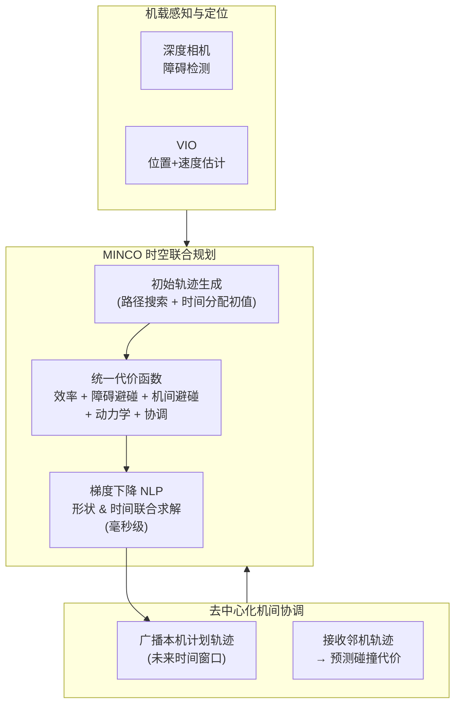

# 野外微型飞行机器人蜂群（Swarm of Micro Flying Robots in the Wild）

**Swarm of micro flying robots in the wild**（Xin Zhou、Xiangyong Wen、Zhepei Wang 等，ZJU FAST-Lab，Chao Xu* & Fei Gao*，**Science Robotics 2022 封面**，[DOI:10.1126/scirobotics.abm5954](https://doi.org/10.1126/scirobotics.abm5954)）提出 **掌心级微型四旋翼蜂群** + **时空联合轨迹优化（MINCO）**，在无 GPS、无动捕、无外部通讯基础设施的 **竹林** 中演示 **10 机协同自主飞行**，实现毫秒级在线重规划、去中心化互避碰与任务可扩展性。

## 一句话定义

**以 MINCO 时空联合优化同步求解轨迹形状与时间分配，使掌心级微型蜂群在杂乱野外环境中完全依赖机载感知实现去中心化、毫秒级安全重规划。**

## 英文缩写速查

| 缩写 | 英文全称 | 简要说明 |
|------|----------|----------|
| MINCO | Minimum-Jerk Continuity Optimization | 本文轨迹表示：分段多项式支持轨迹形状与时间分配联合优化 |
| VIO | Visual-Inertial Odometry | 视觉-惯性里程计，机载位姿估计 |
| UAV | Unmanned Aerial Vehicle | 无人飞行器；本文指掌心级约 30–40 g 四旋翼 |
| ESDF | Euclidean Signed Distance Field | 欧氏符号距离场，障碍距离梯度来源 |
| STP | Spatiotemporal Planning | 时空联合规划，形状与时间同步优化的核心思想 |
| NLP | Nonlinear Programming | 非线性规划，统一代价函数优化求解器 |
| ROS | Robot Operating System | 机载计算框架 |

## 为什么重要

- **户外蜂群里程碑：** 10 机竹林无基础设施飞行是 2022 年前规模最大的野外微型 UAV 群实证，证明小型化硬件 + 纯机载计算可支撑真实森林级复杂度。
- **时空联合优化范式：** 在规划界区分了「先定形状后优化时间」与「形状和时间同时优化」两条路——后者使后行无人机可通过 **时间膨胀** 完成空间规避，避免绕路等待，轨迹更光滑、更安全、能耗更低。
- **完整开源栈：** [EGO-Planner-v2](https://github.com/ZJU-FAST-Lab/ego-planner-v2)（GPL v3）提供可直接运行的 swarm/formation/tracking 三个仿真 workspace，降低社区复现门槛，700+ stars（截至 2026-07）。
- **对 [EGO-Planner Swarm](./ego-planner-swarm.md) 的升格：** EGO-Planner Swarm 基于 ESDF + B-spline 但时间分配固定；本文 MINCO 将时间纳入联合优化，在最拥挤场景下优势最显著。

## 流程总览

## 核心机制（提炼）

| 模块 | 作用 | 与前序工作的区别 |
|------|------|-----------------|
| **MINCO 轨迹表示** | 分段多项式 + 映射矩阵，保证 C^n 连续；时间分配为可微变量 | MADER/EGO-Swarm 只优化形状；本文时间与形状 **同时求导** |
| **统一 NLP** | 效率 + 静态障碍 + 机间碰撞 + 动力学 + 协调代价全部可微 | 避免多阶段解耦带来的次优性 |
| **时间弹性（Temporal Flexibility）** | 后行机可拉伸时间轴让前行机先过，无需空间绕路 | 关键于密集走廊场景 |
| **去中心化广播** | 各机 broadcast 自身计划轨迹，邻机用于预测碰撞 | 无全局指挥；异步触发 |
| **任务可扩展** | swarm、formation、tracking 三任务只需修改代价项 | 通用框架，非单任务特化 |

## 实验与评测

- **仿真对比：** 在不同速度与障碍密度下对比 **MADER** 与 **EGO-Swarm**，评测四项指标（轨迹质量、算力、碰撞率、任务完成）。MINCO 时空联合优化在拥挤场景下优势显著——后行机无需绕路。
- **实机验证（竹林）：** 10 架掌心级四旋翼，**无 GPS**、**无动捕**、**无地面站实时控制**；通过机载深度相机检测竹竿；演示自由飞行、编队与穿越窄道。
- **三个扩展任务（EGO-Planner-v2 仓库）：** swarm formation（队形重构）、interlaced flights（交错穿越）、multi-goal tracking（目标跟踪），验证框架通用性。

## 局限与风险

- **代码与硬件解耦：** EGO-Planner-v2 提供完整规划代码和仿真 playground，但 **自研掌心级硬件平台（机体、电调、主控板）设计未随代码开源**，实机复现需自行适配飞控。
- **通讯依赖：** 去中心化互避碰依赖邻机 **广播计划轨迹**；实机用低功耗 WiFi；在更密集或通讯干扰环境下鲁棒性待验证。
- **规模上限：** 论文演示 10 机；随机数增加，广播解析与 NLP 规模线性增长，极大规模（50+）下的实时性未经实机验证。
- **静态地图假设：** 规划器处理 **动态障碍** 能力有限；动态行人或大风下树枝摆动为主要 OOD 场景。
- **仅平移运动：** 微型四旋翼不携带机械臂，演示为纯运动规划；抓取、感知-操作融合为后续工作。

## 工程实践

- **可借鉴管线：** MINCO 框架已用于 ZJU FAST-Lab 后续多个工作（如 FASTER、Swarm-LIO）；需要多机协同规划的团队可直接 **fork EGO-Planner-v2** 作为仿真 baseline。
- **从仿真到实机：** 仓库提供三个 `*_ws/` 目录，每个含完整 ROS launch + PDF 教程 + 演示视频，可先在仿真中验证扩展，再适配硬件。
- **MINCO 原始实现：** 若需更底层的时空联合优化基础，参见 [ZJU-FAST-Lab/GCOPTER](https://github.com/ZJU-FAST-Lab/GCOPTER)（含 MINCO 的原始论文代码）。

## 关联页面

- [EGO-Planner Swarm（单/多机局部规划器）](./ego-planner-swarm.md)
- [Crazyswarm2（Crazyflie 群体平台）](./crazyswarm2.md)
- [Quad Swarm RL（强化学习群控）](./quad-swarm-rl.md)
- [多旋翼仿真规划控制栈概览](../overview/multirotor-simulation-planning-control-stack.md)

## 参考来源

- [深蓝AI：近五年 Science Robotics 中国顶尖高校盘点](../../sources/blogs/wechat_shenlan_scirobotics_china_top3_2026-07-02.md)
- [Swarm 论文归档（Science Robotics 2022）](../../sources/papers/swarm_micro_flying_robots_scirobotics_2022.md)
- Zhou et al., *Swarm of micro flying robots in the wild*, [Science Robotics 2022](https://doi.org/10.1126/scirobotics.abm5954)
- [EGO-Planner-v2 GitHub 仓库](https://github.com/ZJU-FAST-Lab/ego-planner-v2)
- [论文配套数据集（Zenodo）](https://doi.org/10.5281/zenodo.5804079)

## 推荐继续阅读

- [EGO-Planner-v2（完整代码库）](https://github.com/ZJU-FAST-Lab/ego-planner-v2)
- [GCOPTER / MINCO 原始仓库](https://github.com/ZJU-FAST-Lab/GCOPTER)
- [Science Robotics 论文页](https://doi.org/10.1126/scirobotics.abm5954)
