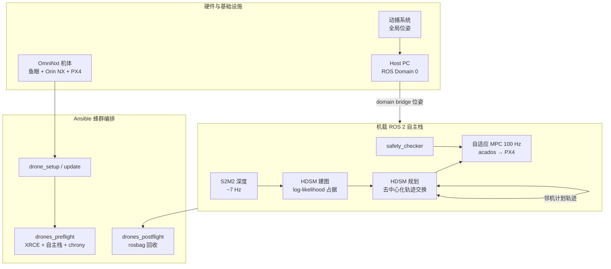
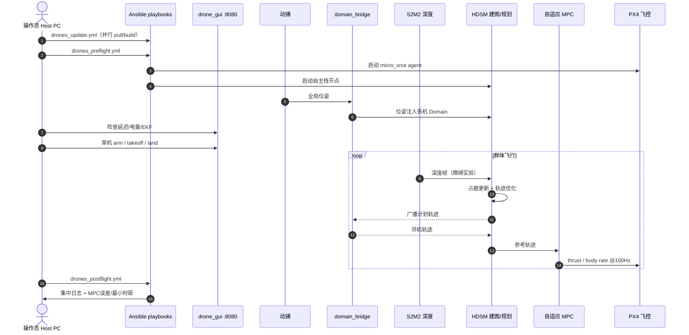

# SwarmNxt（开源软硬件敏捷空中蜂群平台）

**SwarmNxt**（*Open-source Software-Hardware Platform for Fast and Agile Aerial Swarms*，Toumieh、Mistry、Jarvis、Jeger、Liu、Shen、Floreano；arXiv:[2609.11382](https://arxiv.org/abs/2609.11382)，2026-09）是 EPFL Laboratory of Intelligent Systems 与 HKUST 提出的 **端到端开源蜂群研究基础设施**：在开源 [OmniNxt](https://github.com/HKUST-Aerial-Robotics/OmniNxt) 机体上集成 **Ansible 并行部署工具链** 与 **ROS 2 多机自主栈**（HDSM 规划、自适应 MPC、S2M2 深度），降低从硬件组装到多机真机实验的工程门槛。

## 一句话定义

**把 OmniNxt 全向视觉机体、Ansible fleet 运维与 ROS 2 上的 HDSM+MPC+深度估计打成可复现管线，使研究者用动捕室内环境快速迭代敏捷蜂群算法，而非每次从零搭部署栈。**

## 英文缩写速查

| 缩写 | 英文全称 | 简要说明 |
|------|----------|----------|
| HDSM | High-speed Decentralized and Synchronous Motion planner | 本文集成的高速去中心化同步运动规划器（建图 + 轨迹优化） |
| MPC | Model Predictive Control | 模型预测控制；本文用 acados 自适应 MPC 以 100 Hz 跟踪规划轨迹 |
| ROS 2 | Robot Operating System 2 | 多机 DDS 通信与节点编排中间件 |
| S2M2 | Scalable Stereo Matching Model | 机载立体匹配深度网络，约 7 Hz GPU 推理 |
| PX4 | — | 开源飞控固件，接收 collective thrust / body rate |
| MoCap | Motion Capture | 动作捕捉；本文实验的全局位姿来源（经 Host PC 注入） |
| BOM | Bill of Materials | 物料清单；单机约 2300 CHF（论文撰写时） |

## 核心信息

| 字段 | 内容 |
|------|------|
| 机构 | 洛桑联邦理工学院（EPFL）LIS；香港科技大学（HKUST）Aerial Robotics |
| venue | arXiv:2609.11382（2026-09-10） |
| 代码 | [lis-epfl/swarm-nxt](https://github.com/lis-epfl/swarm-nxt) |
| 文档 | [lis-epfl.github.io/swarm-nxt](https://lis-epfl.github.io/swarm-nxt/) |
| 硬件 | [HKUST-Aerial-Robotics/OmniNxt](https://github.com/HKUST-Aerial-Robotics/OmniNxt) |

## 为什么重要

- **填补「能飞」与「能 swarm 迭代」之间的工程沟：** 商用机闭源；Crazyswarm 类微四轴算力不足；FLA/Agilicious 等强平台受 ROS 1 单主节点与 fleet 维护成本拖累。SwarmNxt 用 **ROS 2 + Ansible** 把部署、更新、预飞检查、日志回收标准化。
- **算力—感知—规划一体化真机栈：** Jetson Orin NX 上并行跑 **S2M2 深度 + HDSM 建图/规划 + 自适应 MPC**；论文报告启用深度时 GPU ~95%、仍留 CPU 余量——适合作为「视觉蜂群」模块替换实验的 **固定硬件基线**。
- **与 [多旋翼栈总览](../overview/multirotor-simulation-planning-control-stack.md) 互补：** 相对 [EGO-Planner Swarm](./ego-planner-swarm.md) 侧重规划算法、[Crazyswarm2](./crazyswarm2.md) 侧重微四轴编队，SwarmNxt 贡献的是 **平台 + 运维 + 集成**，使 HDSM 等模块能在物理蜂群上快速 A/B。
- **诚实界定「去中心化」边界：** 规划与轨迹交换在机间去中心化，但 **全局位姿仍依赖动捕经 Host PC 注入**——避免读者误以为是户外无基础设施蜂群。

## 流程总览

## 源码运行时序图

运行时主路径对齐 [sources/repos/swarm_nxt.md](../../sources/repos/swarm_nxt.md) 与官方 `flying.md` 检查单：

机载 **规划/建图/控制闭环在无人机本地运行**；动捕仅提供全局定位，邻机轨迹经 domain bridge 直连交换。

## 核心机制（提炼）

| 模块 | 作用 | 备注 |
|------|------|------|
| **OmniNxt 硬件** | 360° 鱼眼 + Orin NX + PX4 | IROS 2024 开源机体；BOM ~2300 CHF/机 |
| **Ansible 编排** | 并行 setup / update / preflight / postflight | 降低 N 机配置漂移；post-flight 自动汇总 KPI |
| **ROS 2 多域** | Host Domain 0 + 各机独立 Domain | domain bridge 过滤跨域话题（位姿、轨迹广播） |
| **HDSM** | 体素安全走廊 + 去中心化时间感知规划 | 12 步 × 0.1 s  horizon；安全半径 0.45 m |
| **自适应 MPC** | acados 跟踪 + 电池压降补偿 | worst-case 40.4 ms > 10 ms 预算，靠 PX4 保持 setpoint |
| **S2M2 深度** | 障碍实验机载感知 | 分辨率换效率；独占 GPU |
| **safety_checker** | 监督层 | 与 `drone_state_manager` 协同起飞参数 |

## 与其他平台对比

| 平台 | 尺度 | 定位 | ROS | Fleet 工具 | 机载 GPU 深度+规划 | 全局定位 |
|------|------|------|-----|------------|-------------------|----------|
| [Crazyswarm2](./crazyswarm2.md) | 微四轴 | 室内编队/灯光秀 | ROS 2 | 脚本编排 | 否 | 动捕/UWB |
| [EGO-Planner Swarm](./ego-planner-swarm.md) | 标准多旋翼 | 规划算法栈 | ROS 1/2 | 无官方 fleet | 可选（非捆绑） | 自研/VIO |
| [野外微型蜂群](./paper-swarm-micro-flying-robots-in-the-wild.md) | 掌心级 | 户外无基础设施规划 | ROS | 无 | 机载深度+VIO | **无动捕** |
| **SwarmNxt** | OmniNxt 紧凑机 | **平台+运维+集成** | **ROS 2** | **Ansible** | **S2M2+HDSM 捆绑** | **动捕（经 Host）** |

## 实验与评测

- **场景：** 8×8×4 m 室内动捕；两实验各约 2 min 定量段 + 长时累积（6 机 ~2 h；4 机障碍 ~30 min）。
- **实验 1（6 机空场）：** 圆周换位汇聚（强气动扰动）+ 随机目标漫游；**零碰撞**；通信延迟与 0.2% 丢包下仍安全。
- **实验 2（4 机障碍）：** 机载 S2M2 + 保守建图/规划；**零机间/障碍碰撞**（其余机体未完成鱼眼标定未参战）。
- **动力学约束：** 最大速度 10 m/s、加速度 10 m/s²、jerk 20 m/s³（OmniNxt 物理极限对齐）。
- **精度：** 平均跟踪误差 ~0.075 m；最大 0.301 m < 0.45 m 规划安全半径。

## 结论

**SwarmNxt 的价值在工程可复现性：它把「蜂群算法论文」从单机 demo 拉到可维护的 N 机真机流水线，而不是提出新的规划理论。**

- 真正降低门槛的是 **Ansible fleet 工具链 + ROS 2 多域桥接**——并行 update/preflight/postflight 使研究者把时间花在算法而非 SSH 逐机配置上。
- 算法侧集成 **HDSM 去中心化规划 + 自适应 MPC + S2M2** 已足够支撑 **10 m/s 级互避碰** 与 **机载深度障碍飞行**；2 h / 30 min 零碰撞说明栈在动捕室内可迭代。
- 部署读法应认清 **中心动捕依赖**：论文所称「去中心化」指 **规划与轨迹交换**，非户外无基础设施蜂群；CVIO 精度/延迟尚不足以替代动捕做敏捷飞行。
- MPC worst-case 超时（40.4 ms vs 10 ms）被 **0.45 m 规划安全半径 + PX4 保持 setpoint** 吸收——调参时勿单独收紧 MPC 预算而忽视规划半径。
- 深度管线 **S2M2 占满 GPU、分辨率有限**——更杂乱环境需更强深度或放松保守建图，二者需配对调参。
- 选型上：要 **轻量微四轴灯光秀** 选 [Crazyswarm2](./crazyswarm2.md)；要 **视觉+GPU+高速互避碰研究基线** 优先 SwarmNxt/OmniNxt；要 **纯规划算法** 仍可 fork [EGO-Planner Swarm](./ego-planner-swarm.md) 仿真栈。

## 局限与风险

- **室内动捕限定：** 全局位姿非机载 SLAM；不能直接外推到 GPS 拒止户外（论文 Future Work 明确 CVIO 不足）。
- **深度质量与 GPU 独占：** S2M2 难检测远处小障碍；启用深度后 GPU ~95%，难并行第二路感知模块。
- **保守调参换安全：** 障碍实验靠保守建图/规划；更杂乱环境需放松调参并配套更准深度，否则易卡住或漏检。
- **fleet 规模成本：** BOM ~2300 CHF/机 + 动捕 + Host 网络；6 机已是论文验证上限量级，非 Crazyflie 级低成本。
- **许可证：** 主仓库未统一 SPDX；acados/Gurobi 等依赖需注意学术许可与安装脚本约束。

## 工程实践

| 步骤 | 动作 |
|------|------|
| 1 | 阅读 [官方文档](https://lis-epfl.github.io/swarm-nxt/)：IT 基础设施 → Drone Setup |
| 2 | 按 OmniNxt BOM 组装；`ansible-playbook drone_setup.yml` |
| 3 | 配置 `inventory.ini`；`drones_update.yml` 同步 ROS 包 |
| 4 | 动捕标定 EKF；`drones_preflight.yml`；浏览器打开 `localhost:8080` 仪表盘 |
| 5 | 单机 arm/takeoff/land 通过后发送群体目标；`drones_postflight.yml` 收日志 |

- **开源入口：** [GitHub](https://github.com/lis-epfl/swarm-nxt) · [演示视频](https://youtu.be/9aOr5EDLQEo)
- **起飞参数：** `drone_state_manager_params.yaml` 经 Ansible 同步全 fleet
- **与 PX4 栈：** micro XRCE DDS 桥接；与 [MAVSDK](./mavsdk.md) 场景不同（本栈走 ROS 2 全栈）

## 关联页面

- [多旋翼仿真—规划—飞控开源栈总览](../overview/multirotor-simulation-planning-control-stack.md)
- [Crazyswarm2（室内微四轴蜂群）](./crazyswarm2.md)
- [EGO-Planner Swarm（ESDF 局部规划）](./ego-planner-swarm.md)
- [PX4 Autopilot（飞控执行层）](./px4-autopilot.md)

## 参考来源

- [SwarmNxt 论文归档](../../sources/papers/swarmnxt_arxiv_2609_11382.md)
- [swarm-nxt 仓库归档](../../sources/repos/swarm_nxt.md)
- [OmniNxt 硬件归档](../../sources/repos/omninxt.md)
- [SwarmNxt 项目站归档](../../sources/sites/swarm-nxt-lis-epfl.md)
- Toumieh et al., [arXiv:2609.11382](https://arxiv.org/abs/2609.11382)

## 推荐继续阅读

- [SwarmNxt 官方文档（硬件组装 + 飞行检查单）](https://lis-epfl.github.io/swarm-nxt/)
- [OmniNxt 项目页（IROS 2024 机体）](https://hkust-aerial-robotics.github.io/OmniNxt/)
- [野外微型飞行机器人蜂群（Science Robotics 2022）](./paper-swarm-micro-flying-robots-in-the-wild.md) — 无动捕户外蜂群规划对照
