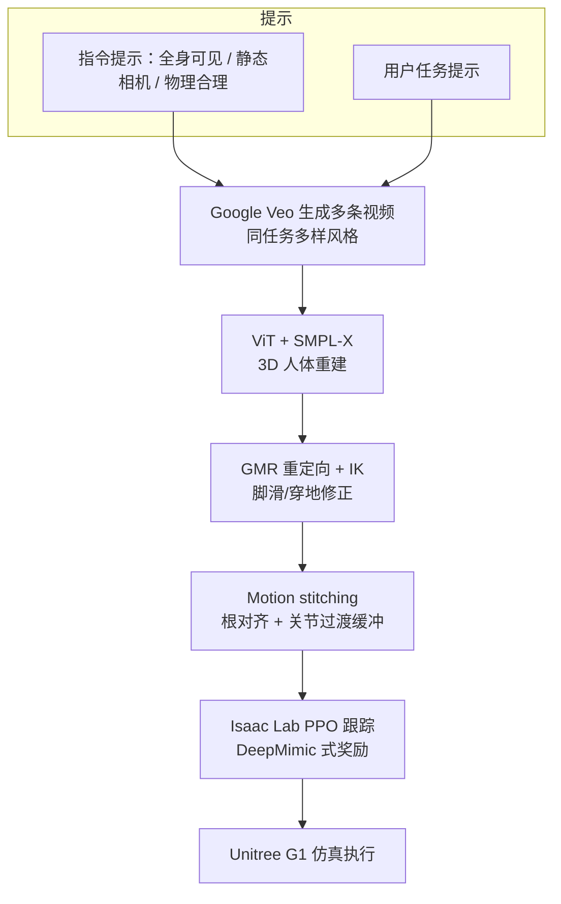

# Learning Diverse Humanoid Tasks via Synthetic Video Scenarios

**Learning Diverse Humanoid Tasks via Synthetic Video Scenarios without Real World Data**（国立成功大学 NCKU，arXiv:2607.21648）提出一条 **无真机、无 MoCap** 的人形技能数据通路：用 **文本提示驱动 Google Veo** 生成多样人体运动视频，经 **SMPL-X 重建 + GMR 重定向** 得到机器人参考，再用 **motion stitching** 拼复合技能，最后在 **Isaac Lab** 中以 DeepMimic 式 **PPO 跟踪** 训练 Unitree G1 策略。目标是用生成模型覆盖「同任务多种执行风格」，降低对真人示范的依赖。

## 英文缩写速查

| 缩写 | 英文全称 | 简要说明 |
|------|----------|----------|
| NCKU | National Cheng Kung University | 作者单位：国立成功大学 |
| Veo | Google Veo | 文生视频模型（文内 3 / 3.1） |
| SMPL-X | Skinned Multi-Person Linear Model eXpressive | 从生成视频估计人体网格/姿态 |
| GMR | General Motion Retargeting | 人体→人形运动学重定向 |
| PPO | Proximal Policy Optimization | Isaac Lab 中的跟踪策略优化 |
| MAE | Mean Absolute Error | 关节位置跟踪误差指标 |
| RL | Reinforcement Learning | DeepMimic 式模仿跟踪训练 |

## 核心信息

| 字段 | 内容 |
|------|------|
| 机构 | 国立成功大学（National Cheng Kung University）机械工程系 |
| 作者 | Yun-Hao Tsai、Cong-Thanh Vu、Yen-Chen Liu |
| 平台 | Unitree **G1**（仿真） |
| 数据源 | **无** 真机 teleop / MoCap；**Veo** 生成视频 |
| 仿真 | **Isaac Lab**；4096 并行 agent；Xeon W5-3435X + RTX 4000 Ada |
| 策略 | 非对称 actor–critic PPO；actor 出关节目标 → PD |
| 开源 | **确认未开源**（截至 2026-08-05：无项目页、无官方仓、论文未承诺 release） |

## 为什么重要

- **把「生成视频」接到 DeepMimic 训练环，而不是只做零样本轨迹：** 相对 [GenHOI](./paper-loco-manip-03-genhoi.md)（单视频→接触约束→不训 task policy），本文强调 **每提示多样本视频** 作参考库，再训跟踪策略，服务风格多样性。
- **显式处理多视频拼接断续：** 独立生成片段各有局部坐标系；根对齐 + 关节过渡缓冲使复合行为可进仿真，否则拼接即不稳定。
- **成本叙事清晰：** 用 API 视频替代 MoCap 场与标定；但证据目前停在仿真，结论自己把 **sim-to-real** 列为未来工作。
- **与 OASIS 正交：** [OASIS](./paper-loco-manip-04-oasis.md) 用仿真 VR teleop 扩视觉数据；本文连操作员示范也去掉，改吃生成运动先验——两者同属「少真机数据」族，瓶颈不同（生成物理一致性 vs 资产/渲染质量）。

## 流程总览

## 核心机制（方法）

### 1）Prompt-driven video → humanoid reference

- 指令提示固定视觉条件（全身可见、单成年主体、静态相机等），用户提示指定动作（如「carry a box」）。
- 重建：视觉 Transformer + bounding box / 体型先验 / 时序模块估计 **SMPL-X**。
- 重定向：**GMR** 对齐初姿、缩放肢长、抑脚滑与穿地，再 IK 最小化关节与末端误差并尊重限位。

### 2）Motion stitching

- **根对齐：** 将后段初始根位姿变换到前段终点，消除相机/站位差异造成的全局跳变。
- **关节平滑：** 在接缝处插入短过渡缓冲做关节插值，避免突变导致仿真发散。
- 拼接顺序：前段 → 过渡 → 对齐后段，供下游跟踪。

### 3）RL-based motion tracking

- 观测为根相对 link 位姿/速度、跟踪误差与上一步动作；critic 另吃干净参考位姿（特权）。
- 模仿奖励：姿态 / 速度 / 末端 / CoM 指数核加权和（\(w_p=0.65\) 等）；减去限位、动作平滑、自碰惩罚。
- 域随机：地面摩擦与恢复、关节偏置、躯干 CoM、速度扰动。

## 源码运行时序图

**不适用**（确认未开源：截至 2026-08-05 arXiv 与作者公开仓均无训练/部署入口；无可对齐 README 的可运行路径）。

## 工程实践

| 项 | 要点 |
|----|------|
| 视频规模（生成评测） | 50 日常任务提示 × 每提示 10 条视频 |
| 训练栈 | Isaac Lab + PPO；MLP [512,256,128]；4096 env |
| 参考工具链 | Veo API → SMPL-X 估计器 → [GMR](../methods/motion-retargeting-gmr.md) |
| 开源状态 | **未开源**；复现需自建 Veo/SMPL-X/GMR/Isaac 管线 |
| 部署读法 | 文内结果为 **仿真**；勿当作已完成 sim-to-real 证据 |

## 实验与评测

### 生成质量（V-B）

- 多数日常任务：生成运动物理合理且动作意图正确即可计成功。
- **失败模式：** 后空翻等高动态段出现时间不一致 / 不真实——生成模型速度极限仍是上限。

### 策略质量（V-C）

| 观察 | 结果 |
|------|------|
| 定性任务 | lie-and-stand、boxing、pick-and-place 等全身体与操作序列（Fig. 4） |
| 跟踪误差 | 动态任务关节位置 MAE 约 **0.04–0.07 m** |
| 负载 | **0.5 kg** 时上身力矩上升、下身轨迹大体不变；上身 MAE 升高、下身稳定 |
| pick-and-place | 腕/踝竖直轨迹与目标对齐；上下身力矩协同 |

## 结论

**本文的真正主张是「用生成视频多样性替代 MoCap 示范多样性」，再用 stitching + DeepMimic 跟踪把多段合成参考吃进仿真策略——不是宣称已解决 sim-to-real。**

1. **对照 GenHOI** — GenHOI 把单视频压成接触约束做零样本执行；本文把多视频压成参考库做 **RL 跟踪训练**，换风格覆盖、付训练成本。
2. **对照 OASIS** — OASIS 仍要操作员 VR；本文去掉真人示范，但把风险前移到 **Veo 物理一致性**（高动态易坏）。
3. **Stitching 不是可选项** — 多视频局部坐标系若不做根对齐与关节缓冲，复合任务在仿真里先挂，再谈策略。
4. **数字读法** — 0.04–0.07 m MAE 与 0.5 kg 负载曲线说明「跟得上日常动态」；不要外推到后空翻级高动态或真机接触丰富任务。
5. **复现边界** — 无开源仓；关键依赖闭源/商用 Veo API 与自建重建栈，工程门槛高于「克隆一个 GitHub」。

## 局限与风险

- **无真机结果：** 结论写明未来做 sim-to-real；当前不可当作部署就绪系统。
- **生成物理上限：** 高动态（如后空翻）时间不一致会直接污染参考与策略。
- **未开源：** 无法核对 SMPL-X 估计器具体权重、拼接超参与完整任务列表。
- **与接触丰富 HOI 有间隙：** pick-and-place 展示存在，但未像 GenHOI 那样系统报告接触点误差 / 物体 SR。

## 与其他工作对比

| 维度 | 本文（NCKU） | GenHOI | OASIS | Imagine2Real | [RoboReact](./paper-roboreact.md) |
|------|--------------|--------|-------|--------------|------------|
| 视频用途 | 多样示范 → **训跟踪策略** | 接触先验 → **零样本轨迹** | 非主路径（VR teleop） | 4D 点 + BFM 跟踪 | 任务结构先验 → **关键帧技能** |
| 真人数据 | **无** | 无物理示范 | 操作员仿真 teleop | 无 | 无示教；标定可有现象描述 |
| 复合行为 | **motion stitching** | 单段 5 s 视频 | 长程靠采数 | 链路不同 | 长程双臂关键帧 |
| 真机 | 未报 | 有 | 有 | 见其页 | G1 四任务，均值 SR 81.3% |
| 开源 | **无** | 见项目页 | 已开源 | 见其页 | **无** |

## 关联页面

- [生成与仿真数据（Loco-Manip 02）](../overview/loco-manip-category-02-synthetic-data.md) — GenHOI / OASIS 同主题入口
- [生成式接触数据分类](../overview/loco-manip-contact-category-03-generative-data.md)
- [GenHOI](./paper-loco-manip-03-genhoi.md) — 生成视频零样本 HOI 对照
- [OASIS](./paper-loco-manip-04-oasis.md) — 仿真 teleop 合成数据对照
- [Imagine2Real](./paper-imagine2real-zero-shot-hoi.md) — 另一条生成式 HOI
- [RoboReact](./paper-roboreact.md) — 生成视频编译成物体中心技能并上 G1 真机，不做仿真 RL 跟踪
- [DeepMimic](../methods/deepmimic.md) — 模仿跟踪奖励范式
- [GMR](../methods/motion-retargeting-gmr.md) — 本文重定向组件
- [Unitree G1](./unitree-g1.md)、[Isaac Lab](./isaac-gym-isaac-lab.md)、[Loco-Manipulation](../tasks/loco-manipulation.md)

## 参考来源

- [synthetic_video_humanoid_tasks_arxiv_2607_21648.md](../../sources/papers/synthetic_video_humanoid_tasks_arxiv_2607_21648.md) — 论文策展归档
- 论文：<https://arxiv.org/abs/2607.21648>

## 推荐继续阅读

- [arXiv:2607.21648](https://arxiv.org/abs/2607.21648)（HTML / PDF）
- [GenHOI（生成视频零样本对照）](./paper-loco-manip-03-genhoi.md)
- [OASIS（仿真 teleop 数据对照）](./paper-loco-manip-04-oasis.md)
- [GMR（重定向实现）](../methods/motion-retargeting-gmr.md)
- [DeepMimic（跟踪奖励基线）](../methods/deepmimic.md)
