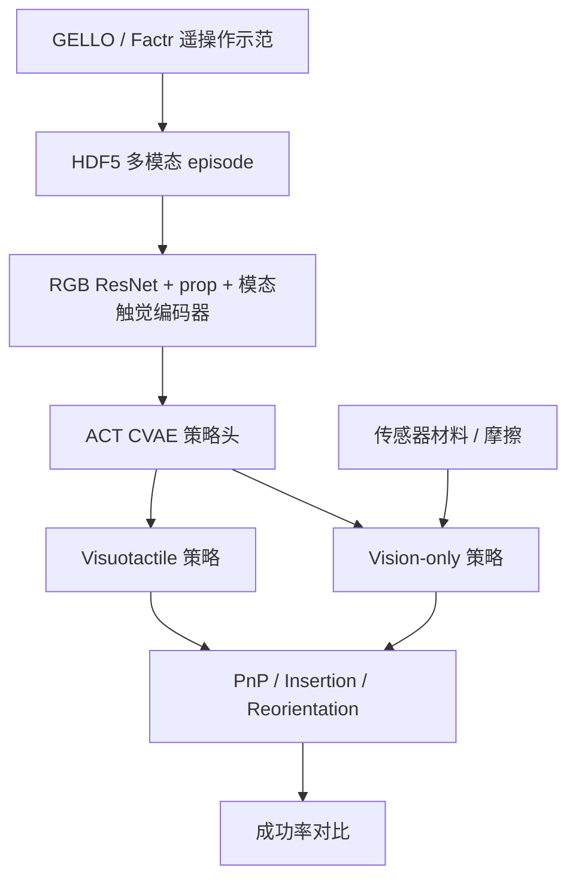
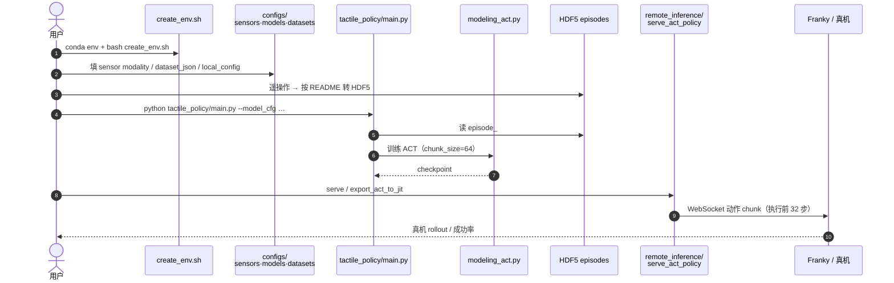

# TacO（触觉传感器操作基准 · arXiv:2605.21976）

> **名称消歧：** 本页 **TacO** = *Benchmarking Tactile Sensors for Object Manipulation*（[tacobench.github.io](https://tacobench.github.io/)）。库内另有 [TACO（触觉 WM 作自我纠正器）](./paper-taco-tactile-wm-vla-posttrain.md)（arXiv:2607.02840，[taco-wm.github.io](https://taco-wm.github.io/)）——二者缩写相同、主题不同。

**TacO**（*TacO: Benchmarking Tactile Sensors for Object Manipulation*，[arXiv:2605.21976](https://arxiv.org/abs/2605.21976)，[项目页](https://tacobench.github.io/)，[代码](https://github.com/TacObench/TacO)）由 **加州大学圣地亚哥分校（UCSD）**、**卡内基梅隆大学（CMU）**、**首尔大学（SNU）** 提出：在统一 **ACT** 模仿学习管线上，对 **6 种触觉传感器 / 四模态** 做 **任务驱动** 真机评测，回答「哪种触觉对哪种操作真正有用」。

## 一句话定义

**没有通用最佳触觉传感器——用同一 ACT 管线对比视觉/磁/声/电阻六硬件在抓取放置、插入与重定向上的策略成功率，让选型跟着任务与接触材料走。**

## 英文缩写速查

| 缩写 | 英文全称 | 简要说明 |
|------|----------|----------|
| TacO | Tactile Object-manipulation benchmark | 本文基准：跨模态触觉传感器真机 IL 评测 |
| ACT | Action Chunking Transformer | 策略骨干；chunk \(H=64\)，部署执行前 32 步 |
| FSR | Force Sensing Resistor | 廉价单点电阻法向力传感器（~$5） |
| IL | Imitation Learning | 遥操作示范 → 行为克隆 |
| CVAE | Conditional Variational Autoencoder | ACT 中建模多峰示范分布 |
| STFT | Short-Time Fourier Transform | Contact Mic 音频 → mel-spectrogram |
| RGB | Red-Green-Blue | 腕部 + 第三人称相机输入 |

## 为什么重要

- **选型缺证据：** 触觉「有用」是共识，但硬件评测常停在标定/感知任务；TacO 把指标换成 **操作策略成功率**。
- **跨模态可比：** 电阻（FSR / FlexiTac / eGain）、磁（eFlesh）、视觉触觉（Daimon）、声学（Contact Mic）同台，覆盖价位约 **$5–$965**。
- **双对照设计：** 同数据 vision-only vs visuotactile 隔离 **信号贡献**；跨传感器 vision-only 隔离 **材料/外形 embodiment**。
- **工程可复现：** 代码 + STL + 可重复性测试套件已开源；降低「只能在论文图里看传感器」的门槛。

## 核心信息

| 项 | 内容 |
|----|------|
| 机构 | UCSD、CMU、SNU |
| 平台 | Franka Panda；GELLO / Factr 遥操作；Fin-Ray 指 |
| 传感器 | FSR、FlexiTac、eGain、eFlesh、Daimon、Contact Mic |
| 任务 | 未知质量 pick-and-place；遮挡插头插入；桌面重定向 |
| 策略 | ACT + 模态特异触觉编码器 |
| 代码 | [TacObench/TacO](https://github.com/TacObench/TacO) |
| 硬件 | [3D_part_files](https://github.com/TacObench/TacObench.github.io/tree/main/3D_part_files) |
| 开源核查 | **部分开源**（2026-07-27）：代码与硬件已开；**数据/权重下载链未见** |

## 核心原理（方法）

### 传感器与模态

| 传感器 | 模态 | 关键能力（论文表口径） | 价位量级 |
|--------|------|------------------------|----------|
| FSR | Resistive | 单点法向力 | ~$5 |
| FlexiTac | Resistive | \(12\times 32\) 法向阵列 | ~$35 |
| eGain | Resistive | 液态金属微通道电阻 | ~$5 |
| eFlesh | Magnetic | 法向 + 剪切（Hall） | ~$35 |
| Daimon | Visual | 高分辨率形变/剪切图 | ~$965 |
| Contact Mic | Acoustic | 高频振动/滑移，无空间力 | ~$27 |

### 策略管线

1. **观测：** 腕部 + 第三人称 RGB、本体（夹爪宽度 / 关节）、模态特异触觉。
2. **编码：** 图像 ResNet18；本体线性投影；触觉 — 标量/阵列 MLP、触觉图像 ResNet/PCA、音频 mel-spectrogram + MLP。
3. **策略：** ACT（CVAE + Transformer），隐维 512；训练 \(\mathcal{L}_1\) 重建 + \(\lambda_{\mathrm{KL}}=10\)。
4. **对照：** 每任务–传感器训两策略：保留触觉 vs 去掉触觉（同示范）。

### 流程总览

## 源码运行时序图

节点对齐 [`sources/repos/taco-bench.md`](../../sources/repos/taco-bench.md) 与官方 README。

- **训练最短路径：** `local_config.py` → 自备 HDF5 → `python tactile_policy/main.py --dataset_json … --model_cfg act_*`。
- **硬件侧：** `hardware_repeatability/run_repeatability_test.py` + 项目页 `3D_part_files/` STL。

## 实验与评测

| 任务 | 设计要点 | 主发现（论文表） |
|------|----------|------------------|
| **Pick-and-Place** | 空罐 vs 装弹珠；视觉外观相同 | 多数 visuotactile ≥ vision-only；重物增益更大；Daimon 触觉策略反而低于 vision-only（0.80 vs 0.95） |
| **Plug Insertion** | 插脚遮挡；测 shear / 振动价值 | FlexiTac 0.1→0.3；Contact Mic / eFlesh **0.2/0.3→0.7** |
| **Reorientation** | 桌面连续调力 + 受控滑动 | 三传感器触觉策略均约 **0.8**；低成本 FSR 可与高分辨率 Daimon 相当 |
| **Cross-sensor（vision-only）** | 隔离材料摩擦 | 高摩擦多数任务更优；重定向例外（需受控滑动） |
| **Repeatability** | Dynamixel 压头套件 | FSR 最稳；重复性高 ≠ 策略成功率高 |

## 结论

**TacO 把「该用哪种触觉」从硬件宣传改写成任务成功率证据：触觉通常有帮助，但模态、摩擦材料与任务匹配决定增益；昂贵高分辨率并非通用赢家。**

1. **按任务选型** — 插入重 shear/振动；连续调力可先试廉价力传感。
2. **同数据双策略** — vision-only vs visuotactile 才能归因到触觉信号，而非夹具外形。
3. **材料也是传感器** — 高摩擦表面改变 embodiment；vision-only 对比可暴露这一点。
4. **分辨率 ≠ 操作增益** — 感知/分类任务上的高分辨率优势未必平移到粗操作 IL。
5. **可复现资产** — 代码与 STL 已开；数据需自采或等待官方下载链。
6. **勿与 TACO-WM 混淆** — 本页是传感器基准，不是 VLA 后训练纠错流水线。

## 局限与风险

- **任务粒度偏粗：** 论文自承未隔离「细粒度触觉」任务上的空间分辨率收益；灵巧指内操作可能改写排名。
- **策略族单一：** 全用 ACT；扩散策略 / VLA / 真机 RL 残差（对照 [OmniTacTune](./paper-omnitactune-tactile-residual-adaptation.md)）是否改变排序未知。
- **开源边界：** 截至 2026-07-27 **示范数据与 checkpoint 未见公开下载**；License 顶层未标 SPDX。
- **跨机构平台差异：** Contact Mic 在第二机构用 Factr + 标准 Franka 夹爪，与其余传感器的 GELLO 自定义夹爪不完全同构。

## 与相邻工作的对比（分界）

| 对比轴 | TacO（本页） | [SoftVTBench](./paper-softvtbench.md) | [TACO WM](./paper-taco-tactile-wm-vla-posttrain.md) | [T-Rex](./paper-trex-tactile-reactive-dexterous-manipulation.md) |
|--------|--------------|----------------------------------------|------------------------------------------------------|------------------------------------------------------------------|
| **问题** | 传感器硬件选型 | 可变形过程安全评测 | 失败轨迹 → VLA 纠错数据 | 高频触觉写入灵巧 VLA |
| **评测** | 6 传感器 × 3 任务真机 IL | Goal + Safety + FEM GT | 接触丰富后训练增益 | 12 双手任务 |
| **开源** | 代码+硬件；数据待链 | 代码+数据；ckpt 待发 | 见该页 | 数据集+模型 |

## 关联页面

- [Tactile Sensing](../concepts/tactile-sensing.md) — 模态与硬件总览；本页补「任务选型」证据
- [视触觉融合](../concepts/visuo-tactile-fusion.md) — vision-only vs visuotactile 消融语境
- [接触丰富操作](../concepts/contact-rich-manipulation.md)
- [Action Chunking](../methods/action-chunking.md) / [Imitation Learning](../methods/imitation-learning.md)
- [触觉纵深](../overview/depth-tactile.md)
- [VTAP Gripper](./paper-vtap-gripper.md) — 同用 FlexiTac
- [TACO（触觉 WM · 消歧）](./paper-taco-tactile-wm-vla-posttrain.md)
- [SoftVTBench](./paper-softvtbench.md) — 可变形 Goal/Safety；互补「怎么测安全」而非「选哪种传感器」
- [T-Rex](./paper-trex-tactile-reactive-dexterous-manipulation.md) / [OmniTacTune](./paper-omnitactune-tactile-residual-adaptation.md)
- [具身评测基准选型闭环](../queries/embodied-eval-benchmark-selection-loop.md) / [具身评测基准纵深](../overview/depth-embodied-eval-benchmark.md)

## 参考来源

- [TacO 论文归档](../../sources/papers/taco_tactile_sensor_benchmark_arxiv_2605_21976.md)
- [项目页归档](../../sources/sites/tacobench-github-io.md)
- [代码归档](../../sources/repos/taco-bench.md)
- 论文：Zorin et al., *TacO: Benchmarking Tactile Sensors for Object Manipulation*, arXiv:2605.21976

## 推荐继续阅读

- 项目页与视频：<https://tacobench.github.io/>
- 官方代码：<https://github.com/TacObench/TacO>
- 硬件 STL：<https://github.com/TacObench/TacObench.github.io/tree/main/3D_part_files>
- ACT 原论文：Zhao et al., [Learning Fine-Grained Bimanual Manipulation…](https://arxiv.org/abs/2304.13705)
