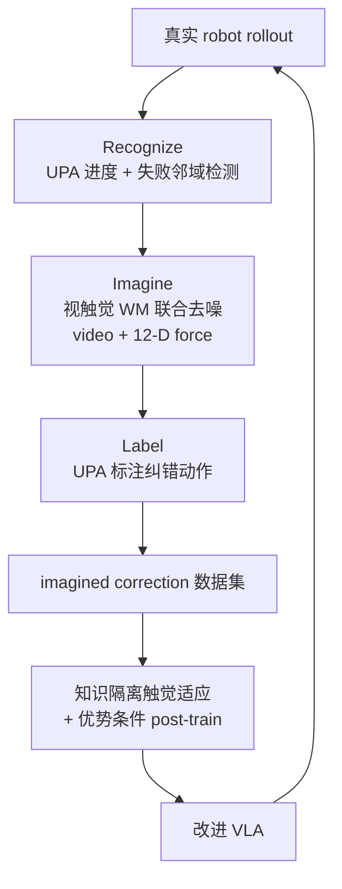

# TACO（TActile World Model as a Self-COrrector · arXiv:2607.02840）

**TACO**（*TACO: TActile World Model as a Self-COrrector for Scalable VLA Post-Training*，[arXiv:2607.02840](https://arxiv.org/abs/2607.02840)，北京大学 + AI2 Robotics 等，[taco-wm.github.io](https://taco-wm.github.io/)）用 **触觉感知世界模型** 把真实失败轨迹转为 **VLA 后训练纠错样本**：**Recognize–Imagine–Label** 闭环定位失败邻域、想象局部视触觉修正片段、标注可执行动作；配合 **知识隔离触觉适应** 与 **优势条件训练**，在六类接触丰富真机任务上相对基础策略 **+44pp**。

## 一句话定义

**失败不是废数据——触觉 WM 从真实 rollout 里「识别–想象–标注」短窗口纠错片段，规模化补齐成功示范稀缺的接触恢复监督。**

## 英文缩写速查

| 缩写 | 英文全称 | 简要说明 |
|------|----------|----------|
| VLA | Vision-Language-Action | 被后训练的 **基础策略**（保留 VLM 先验） |
| WM | World Model | 视触觉 **联合去噪** 生成模型（Wan2.2-TI2V-5B 微调） |
| UPA | Unified Progress-Action Model | 同时预测 **进度 $\hat{p}_t$** 与纠错动作 $\hat{a}_t$ |
| RL | Reinforcement Learning | **优势条件** 离线 RL 目标（二元 advantage） |
| F/T | Force/Torque | 12-D 左右腕力矩序列，与视频 **联合 flow matching** |
| RoPE | Rotary Position Embedding | **时序对齐** 力 token 与视频 latent 时间轴 |
| BC | Behavior Cloning | Filtered BC 基线（仅成功轨迹，缺恢复行为） |

## 为什么重要

- **接触失败的「局部性」：** 擦白板力不足、拧瓶盖扭矩不够等——视觉变化小、**力矩剧变**；完整成功 demo 难覆盖 **失败邻域**，TACO 专挖 **短窗口修正**（策展文「失败样本修正」入口）。
- **视觉 WM 想象不可靠：** 画面 plausible 但 **接触不一致**；TACO **联合去噪视频 + 12-D force**，temporal RoPE 对齐 force/video token，使想象片段 **物理可标注**。
- **+44pp 绝对成功率 vs 基础策略：** 第二轮迭代后平均 SR **+44pp**（相对 base）；无 **知识隔离** 仅 **+32pp**——说明 **保护 VLM 先验** 对 tactile 适应关键。
- **与 [DreamSteer](./paper-dreamsteer-vla-deployment-steering.md) 对照：** DreamSteer **推理时筛选**；TACO **训练期合成纠错数据**，进入 [wm-action-consequence-category-04](../overview/wm-action-consequence-category-04-eval-posttrain.md) 后训练链路。

## 核心结构与方法

| 阶段 / 模块 | 方法要点 |
|-------------|----------|
| **Recognize** | UPA 用 RGB + 12-D force 估计 **进度 $\hat{p}_t$**；定位 **failure-adjacent** 状态（进度停滞/回退邻域） |
| **Imagine** | 视触觉生成模型：视频 latent + force token 拼接 DiT self-attention；**joint CFM** $\mathcal{L}_{\mathrm{joint}}$；首帧 force anchor $F_0$ 稳定接触歧义 |
| **Label** | 同一 UPA 对想象片段标注 **纠错动作 + 进度**；供 post-training |
| **Knowledge-insulated adaptation** | VLM backbone **stop-gradient**；触觉学习路由至 **action expert** |
| **Advantage-conditioned training** | 二元 advantage 分离 **纠错段 vs 失败段**；避免过拟合成功轨迹流形 |
| **迭代** | 多轮 Recognize–Imagine–Label → 扩充 imagined correction 数据（Insert Flower：**1:8 想象比 → 97% SR**） |

### Recognize–Imagine–Label 闭环

### 视触觉生成方法细节

| 设计 | 作用 |
|------|------|
| Force tokenization $T_\eta(F)$ | 12-D 力矩 → 与 video token 同维 hidden |
| Temporal RoPE 对齐 $\rho(i)$ | 力 token $i$ 映射到 video latent 时间索引 |
| $\lambda_f$ 加权 force flow | 平衡视频/力去噪损失 |
| 去触觉生成 | SR 降至 **~28%**（视觉 alone 难捕获接触转移） |
| 去触觉标注 | SR **~65%**（力须参与 action/progress 头） |

## 实验要点（索引级）

| 轴 | 报告口径（以论文为准） |
|----|------------------------|
| **六真机接触任务（Iter 2）** | 平均 SR **+44pp** vs base policy |
| **vs 无 knowledge insulation** | **+32pp** 差距 |
| **vs Filtered BC** | **+39pp**（Filtered BC 缺恢复行为，饱和快） |
| **想象数据 scaling（Insert Flower）** | 真实:想象 **1:2→1:4→1:8**：SR **70%→93%→97%** |
| **任务例** | Wipe Whiteboard、Twist Bottle Cap、Insert Flower 等 |
| **项目** | [taco-wm.github.io](https://taco-wm.github.io/) |

## 与其他工作对比

| 工作 | 关系 |
|------|------|
| **[DreamSteer](./paper-dreamsteer-vla-deployment-steering.md)** | **零微调部署 steering**；TACO **改后训练权重** |
| **[VT-WAM](./paper-vt-wam-visuotactile-contact-rich.md)** | **端到端 tactile WAM**；TACO **WM 作数据引擎** |
| **Vision-only WM post-train** | 易 **接触不一致想象**；TACO **强制 force 联合去噪** |
| **人工 intervengen / milestone** | 人工监视贵；TACO **自主闭环** |
| **Filtered BC / 纯成功 demo** | 强化窄流形；TACO **扩展失败邻域覆盖** |

## 常见误区或局限

- **误区：** 认为 imagined data 可完全替代真人纠错；质量依赖 **WM 物理 fidelity** 与 **进度标注**。
- **误区：** 知识隔离等于 **冻结全部**；仅 **VLM backbone** stop-gradient，action expert 仍学 tactile。
- **局限：** 迭代多轮可能 **分布漂移**；力矩传感 **12-D 特定硬件**；长程全任务纠错未覆盖；WM 幻觉仍可能标注 **不可执行** 动作。

## 与其他页面的关系

- [wm-action-consequence-category-02-contact-modeling](../overview/wm-action-consequence-category-02-contact-modeling.md) — 触觉 WM 方法层
- [wm-action-consequence-category-04-eval-posttrain](../overview/wm-action-consequence-category-04-eval-posttrain.md) — 失败→后训练入口
- [动作后果技术地图](../overview/robot-world-models-action-consequence-technology-map.md) — 专题总览
- [VT-WAM](./paper-vt-wam-visuotactile-contact-rich.md) — 联合预测 WAM 对照
- [VLA](../methods/vla.md) — 被后训练的基础 VLA 族

## 推荐继续阅读

- [TACO 论文（arXiv:2607.02840）](https://arxiv.org/abs/2607.02840)
- [TACO 项目页](https://taco-wm.github.io/)
- [DreamSteer 论文实体](./paper-dreamsteer-vla-deployment-steering.md)
- [VT-WAM 论文实体](./paper-vt-wam-visuotactile-contact-rich.md)

## 参考来源

- [具身智能研究室 · 世界模型动作后果专题导读（2026-07）](../../sources/blogs/wechat_embodied_ai_lab_robot_world_models_action_consequence_2026.md)
- [TACO 论文（arXiv:2607.02840）](https://arxiv.org/abs/2607.02840)
