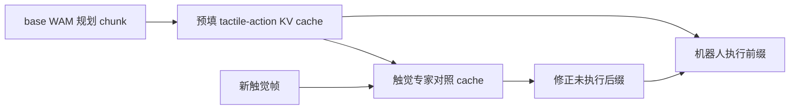
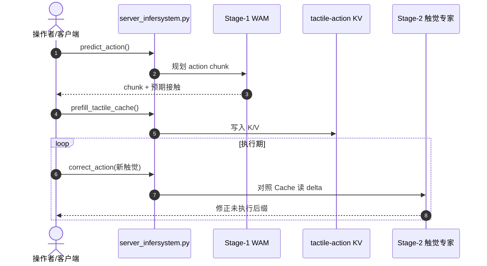

# TacPAC：触觉预测驱动的 WAM 实时动作修正

**TacPAC**（*Tactile Prediction and Real-Time Action Correction in World-Action Models for Contact-Rich Manipulation*，[arXiv:2609.05266](https://arxiv.org/abs/2609.05266)，[代码](https://github.com/LogosRoboticsGroup/TacPAC)）由 **复旦大学数据科学学院**、**上海创智学院（SII）** 与 **NeoteAI** 提出：世界–动作模型能预测 action chunk 预期的接触，但预测在执行前固定、触觉在执行中到达——单纯把未来触觉当额外视角只能拿到约 **1/3** 可达增益。TacPAC 把 **预期接触 + 计划表征** 缓存为可复用 layer-wise KV，触觉专家逐帧对照缓存，只改 **尚未执行** 的后缀；单次修正 **30.4 ms（32.9 Hz）**，比整 chunk 重生成 **20.7×** 更快。Flexiv Rizon 4 上五类接触丰富任务平均成功率 **22% → 64%**。

## 一句话定义

**不是再预测一遍触觉，而是把 WAM 已规划的「预期接触」当对照系，让执行中的触觉只修正还没跑完的动作后缀。**

## 英文缩写速查

| 缩写 | 英文全称 | 简要说明 |
|------|----------|----------|
| TacPAC | Tactile Prediction and Action Correction | 本文方法：预测对齐的触觉修正 |
| WAM | World Action Model | 联合预测未来观测与动作的世界–动作模型 |
| MoT | Mixture-of-Transformers | Stage 1 视觉/触觉/动作专家联合去噪 |
| KV cache | Key-Value cache | 缓存预期触觉与动作表征供修正复用 |
| WAM base | — | Stage 1 触觉预测 base，Stage 2 冻结 |

## 为什么重要

- **补齐 WAM 接触闭环缺口：** 视觉中心预测缺局部接触线索；纯触觉预测又撞上「预测在前、反馈在后」时序错配。
- **把触觉反馈语义化：** 新触觉不是孤立 reactive 信号，而是与 **该 chunk 预期的接触** 对照解读。
- **工程可部署：** 异步 closed-loop——base 每 chunk 规划一次，机器人持续运动，触觉只改后缀；修正延迟 **30.4 ms** 量级。
- **真机五任务全胜：** 精密插入、易碎物、芯片、瓶、卡片等；最强基线仍低 **16 pp**。

## 核心结构与方法

| 模块 | 方法要点 |
|------|----------|
| **Stage 1 base WAM** | 视频专家预测未来视觉+触觉；动作专家经 MoT 联合去噪 action chunk |
| **Stage 2 触觉专家** | 冻结 base；缓存 clean 触觉/动作 K/V；采样执行偏移，监督未执行后缀 delta action |
| **推理协议** | `predict_action()` → `prefill_tactile_cache()` → 循环 `correct_action()` |
| **触觉表征** | raw / frame-residual / stress 三模态；训练与 `server_infersystem` 部署共享预处理 |
| **开源** | **部分开源** — MIT 代码栈完整；README 写明数据集与 checkpoint **待发布** |

### 流程总览

## 评测与指标

| 轴 | 报告口径（以论文为准） |
|----|------------------------|
| **五任务宏平均** | 纯视觉 base **22%** → TacPAC **64%** |
| **逐任务** | TacPAC **五任务全胜**；最强基线仍低 **16 pp** |
| **修正延迟** | **30.4 ms/次** vs 整 chunk 重生成 → **20.7×** 加速 |
| **消融** | 触觉预测 + 在线修正 **互补**；直接读 predicted tactile cache 增益最大 |
| **平台** | Flexiv Rizon 4；每任务 **20** 次真机 trial |

## 结论

**TacPAC 把 WAM 的「预期接触」从静态预测变成可对照的执行时缓存——真正起作用的是预测–反馈对齐，而不是再多预测一个触觉视角。**

- 纯加触觉预测视角只拿到约 **1/3** 可达增益；对照 cache 的在线修正才是主因。
- **20.7×** 比整 chunk 重生成快，使 closed-loop 触觉修正可在 **32.9 Hz** 运行。
- 五任务 **22%→64%** 说明 contact-rich 操纵的瓶颈在 **执行期接触对齐**，不在 chunk 规划本身。
- **部分开源**：代码与部署栈可跑；权重/数据待发布，复现 headline 数字需等 checkpoint。
- 与 [DynaWM](./paper-dynawm-vla-online-correction.md)（冻结 VLA + 视觉历史重写 chunk）互补：TacPAC 面向 **触觉–接触**，且挂在 WAM 而非通用 VLA 外挂。

## 源码运行时序图

训练入口：`scripts/vla/train_WanMoTJoint.sh`（Stage 1）→ `train_WanMoTJoint-TacExpert.sh`（Stage 2）；单测见 `scripts/test/test_infersystem_stateful_tactile.py`。

## 常见误区或局限

- **误区：** 以为 TacPAC 替换 base WAM；实际是 **冻结 base + 后缀修正**。
- **误区：** 把「预测未来触觉」当主贡献；消融显示 **对照 cache 的修正** 才是大增益来源。
- **局限：** checkpoint/数据集 **尚未公开**；真机为单臂 Flexiv + 五任务，未覆盖双臂或 loco-manip。

## 与其他页面的关系

- [World Action Models](../concepts/world-action-models.md) — WAM 预测–执行闭环
- [Generative World Models](../methods/generative-world-models.md) — 未来观测预测骨干
- [Manipulation](../tasks/manipulation.md) — 接触丰富精密操作语境
- [DynaWM](./paper-dynawm-vla-online-correction.md) — 视觉历史重写 chunk 对照
- [ContactWorld](./paper-sa-2606-13877-contactworld-what-matters-in-vision-tactile-worl.md) — 视触觉世界模型
- [TacCoRL](./paper-sa-2606-11743-taccorl-integrating-tactile-feedback-into-vla-vi.md) — VLA 触觉 RL 对照

## 推荐继续阅读

- [TacPAC 论文（arXiv:2609.05266）](https://arxiv.org/abs/2609.05266)
- [LogosRoboticsGroup/TacPAC](https://github.com/LogosRoboticsGroup/TacPAC)
- [DynaWM 论文实体](./paper-dynawm-vla-online-correction.md)

## 参考来源

- [tacpac_arxiv_2609_05266](../../sources/papers/tacpac_arxiv_2609_05266.md)
- [LogosRoboticsGroup/TacPAC](../../sources/repos/logos-robotics-tacpac.md)
