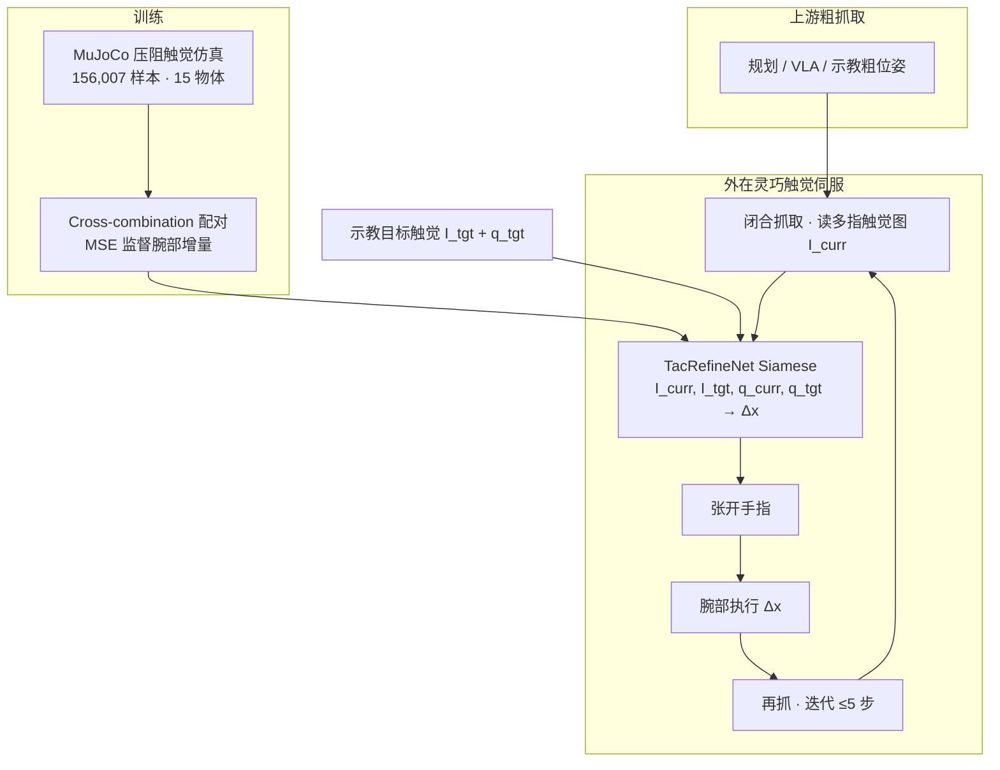

# TacRefineNet：边缘突出物体的目标条件触觉抓取精修

**TacRefineNet**（*Goal-Conditioned Tactile Grasp Refinement for Edge-Prominent Objects*，小米机器人实验室，arXiv:[2509.25746](https://arxiv.org/abs/2509.25746)，[项目页](https://sites.google.com/view/tacrefinenet)）把抓取末段的「最后一公里」对齐做成 **纯触觉目标条件伺服**：用配对的当前/目标多指触觉图与手部关节配置，经 **Siamese 策略** 直接回归腕部位姿增量，并在 **张开—移动—再抓** 的外在灵巧闭环中迭代收敛。

## 一句话定义

**不估绝对物体位姿、也不靠视觉：把「当前接触长什么样」和「目标接触长什么样」送进权共享编码器，直接吐出腕部该怎么挪一点，再反复 regrasp，把薄板/圆盘/细杆精修到毫米级。**

## 英文缩写速查

| 缩写 | 英文全称 | 简要说明 |
|------|----------|----------|
| DoF | Degrees of Freedom | 本文 11-DoF 五指手；策略输出 6-DoF 腕部增量 |
| MSE | Mean Squared Error | 腕部平移/旋转增量回归损失 |
| ViT | Vision Transformer | 每指尖触觉图的空间编码器 |
| SE(3) | Special Euclidean Group in 3D | 绝对位姿基线用相对 SE(3) 差分；本文直接回归 \(\Delta\) |
| Sim2Real | Simulation to Real | 全程 MuJoCo 训练后零样本上真机 |
| VLA | Vision-Language-Action | 上游粗抓取可来自传统管线或 VLA；本文只管接触后精修 |

## 核心信息

| 字段 | 内容 |
|------|------|
| 机构 | 小米机器人实验室（Xiaomi Robotics） |
| 作者 | Shuaijun Wang, Haoran Zhou, Diyun Xiang, Yangwei You |
| 平台 | 双臂机器人 + **11-DoF** 五指灵巧手；指尖 \(11\times9\) **压阻** taxel（间距约 1.1 mm） |
| 数据 | **156,007** 仿真样本；15 物体（板/盘/杆各 5）；真机评测每物体 10 trial |
| 训练 | **仅仿真**（MuJoCo 物理触觉模型）；真机 **零样本**，无微调 |
| 部署延迟 | Jetson Orin：触觉预处理 ~90 ms + 推理 ~10 ms ≈ **10 Hz** |
| 开源 | 项目页挂 [GitHub](https://github.com/NoneJou072/tacrefinenet)，截至 **2026-07-23** 仓库为空；Dataset 按钮未指向独立发布 |

## 为什么重要

- **补「执行末段」缺口：** 传统抓取规划与 VLA 粗策略都容易在接触瞬间留下毫米/度级误差；边缘突出物体接触稀疏、易遮挡，视觉/深度最不可靠——触觉成为主模态。
- **目标条件、免按目标重训：** cross-combination 把数据集内当前/目标任意配对，示教一张目标触觉图即可在采样范围内换目标。
- **直接 \(\Delta\) 优于「估位姿再相减」：** 稀疏/对称接触下绝对 6-DoF 位姿病态；相对增量目标更良态（仿真三阈值 85.9% vs 54.1%）。
- **外在灵巧工程现实：** 欠驱动多指手难以纯手内 gait；腕部重定位 + regrasp 把可控性放到臂/腕上。
- **与站内触觉线互补：** [T-Rex](./paper-trex-tactile-reactive-dexterous-manipulation.md) 做大规模触觉 VLA；[OmniTacTune](./paper-omnitactune-tactile-residual-adaptation.md) 做短真机触觉残差 RL；TacRefineNet 做 **仿真 BC 局部精修头**。

## 核心贡献

| 模块 | 要点 |
|------|------|
| **问题形式化** | 抓取精修 = 多指触觉伺服：对齐当前触觉观测与目标触觉观测 |
| **Siamese 策略** | 权共享 ViT；多指 self-attn + 当前→目标 cross-attn；融合本体后回归 \(\Delta\) |
| **可观 DoF** | 只精修触觉可分辨维：杆 \(\{z,\mathrm{roll}\}\)、板 \(\{z,\mathrm{roll},\mathrm{pitch}\}\)、盘 \(\{y,z,\mathrm{pitch}\}\) |
| **Sim→Real** | 156k 仿真样本全程训练；真机零样本；seen 物体达毫米级均值误差 |

## 流程总览

## 核心原理

### 策略接口

\[
\Delta\mathbf{x}=\pi\big(\{I_i^{\mathrm{curr}},I_i^{\mathrm{target}}\}_{i=1}^{N},\,q^{\mathrm{curr}},\,q^{\mathrm{target}}\big)
\]

回归参数化为 \([R_9,p_3]\in\mathbb{R}^{12}\)（\(3\times3\) 相对旋转展平 + 平移）；旋转经 SVD 对称正交化。每轮闭环：**抓 → 感 → 预测腕部增量 → 张开 → 移动 → 再抓**。

### 触觉 aliasing 与可观维

指尖沿物体主轴接触、法向近掌法向时：\(z\) 与 roll（深度/梯度）可观；轴向自旋、部分滑动等使接触图几乎不变 → 强行回归会注入噪声。按几何类别裁减动作维，是本文「毫米级」与「不要硬做满 6-DoF」的关键工程选择。

### 网络与训练

1. 每指触觉图 → **ViT** + 指身份位置嵌入  
2. 多指 **self-attention** 融合 → pooling  
3. **Siamese** 权共享；当前特征作 query，对目标做 **cross-attention**  
4. 拼接当前/目标关节状态 → Transformer → 平移/旋转双 MLP  
5. **Cross-combination** 随机配对 + MSE；触觉幅值缩放与关节加性噪声增广  

## 工程实践

| 项 | 做法 |
|----|------|
| 传感器 | \(11\times9\) 压阻阵列 → 灰度触觉图；读数 0–255 |
| 仿真 | MuJoCo 弹性球接触点模拟橡胶表面；闭合后无有效接触则拒样重采 |
| 目标指定 | 示教一次：记录目标触觉图、关节配置与参考腕部位姿 |
| 评测协议 | 物体固定；最多 **5** 步精修；准则 \(10^\circ/10\,\mathrm{mm}\)、\(5^\circ/10\,\mathrm{mm}\)、\(5^\circ/5\,\mathrm{mm}\) |
| 开源状态 | **待发布**：GitHub 空仓；数据集无独立链接（见 [repos 归档](../../sources/repos/tacrefinenet.md)） |
| 源码运行时序图 | **不适用**（截至 2026-07-23 无可运行训练/推理入口） |

## 实验要点

### Seen 物体（真机均值）

| 设定 | \(10^\circ/10\,\mathrm{mm}\) | \(5^\circ/10\,\mathrm{mm}\) | \(5^\circ/5\,\mathrm{mm}\) | 五步后均值误差 |
|------|---------------------------|---------------------------|--------------------------|----------------|
| 固定目标 | **80.7%** | 61.3% | 26.0% | ~5.3 mm / 3.4° |
| 随机目标 | **59.3%** | 44.7% | 22.0% | ~5.1 mm / 3.5° |

仿真同设定更高（固定目标三阈值约 99.5% / 98.9% / 97.2%）。圆盘因旋转对称触觉线索弱，固定目标真机成功率低于板/杆。

### 未见边缘特征物体

真机固定/随机 \(10^\circ/10\,\mathrm{mm}\) 降至 **36.7% / 13.3%**；误差仍可下降，但过阈值成功率差。细杆相对可迁移线索更强。

### 消融与基线

- 去掉触觉：损失与成功率近乎崩盘  
- 去掉多指融合或仅用 2 指：明显变差；3→4/5 指增益变小  
- **直接 \(\Delta\)** ≫ 独立估当前/目标绝对位姿再差分  

长程扰动跟踪显示可连续纠偏（见项目页视频）。

## 与其他工作对比

| 路线 | 代表 | 相对 TacRefineNet |
|------|------|-------------------|
| 大规模触觉 VLA | [T-Rex](./paper-trex-tactile-reactive-dexterous-manipulation.md) | 端到端技能学习；本文是 **粗抓取后的局部精修头** |
| 真机触觉残差 RL | [OmniTacTune](./paper-omnitactune-tactile-residual-adaptation.md) | 策略无关在线补触觉；本文 **仿真 BC + 零样本**，无真机 RL |
| 视觉伺服末段 | [Visual Servoing](../methods/visual-servoing.md) | 同构「特征误差 → 增量」；本文特征换成 **多指触觉图** |
| 纯手内重定向 | [In-hand Reorientation](../methods/in-hand-reorientation.md) | 指间 gait；本文用 **腕部 + regrasp 外在灵巧** |

## 局限与风险

- **弱判别接触：** 对称圆盘、平坦弱纹理边缘 → 触觉伺服病态。  
- **局部范围：** 只在数据集覆盖的可观 DoF 内精修，不是全局抓取规划。  
- **Sim2Real 与泛化：** 零样本可用，但严格阈值与未见边缘几何仍掉点；项目页旧文仍写「真机微调」，与 v2 论文不一致——以论文为准。  
- **复现：** 代码/数据尚未实质开放，工程落地需自建仿真与传感器标定。

## 关联页面

- [Tactile Sensing](../concepts/tactile-sensing.md) — 压阻阵列与触觉图像化  
- [Visual Servoing](../methods/visual-servoing.md) — 视觉伺服对偶：触觉图误差驱动运动  
- [In-hand Reorientation](../methods/in-hand-reorientation.md) — 纯手内 vs 外在灵巧 regrasp  
- [Grasp Pose Estimation](../methods/grasp-pose-estimation.md) / [抓取策略选型](../queries/grasp-policy-selection.md) — 粗抓取后接精修头  
- [Contact-Rich Manipulation](../concepts/contact-rich-manipulation.md) / [Manipulation](../tasks/manipulation.md)  
- [Sim2Real](../concepts/sim2real.md) — 触觉仿真零样本边界  
- [OmniTacTune](./paper-omnitactune-tactile-residual-adaptation.md) — 真机触觉残差 RL  
- [T-Rex](./paper-trex-tactile-reactive-dexterous-manipulation.md) — 大规模触觉反应式 VLA  
- [触觉专题](../overview/topic-tactile.md) / [抓取专题](../overview/topic-grasp.md)

## 参考来源

- [TacRefineNet 论文归档](../../sources/papers/tacrefinenet_arxiv_2509_25746.md) — arXiv:2509.25746v2
- [项目页归档](../../sources/sites/tacrefinenet-google-sites.md)
- [代码仓归档（空占位）](../../sources/repos/tacrefinenet.md)

## 推荐继续阅读

- Wang et al., *TacRefineNet: Goal-Conditioned Tactile Grasp Refinement for Edge-Prominent Objects*, [arXiv:2509.25746](https://arxiv.org/abs/2509.25746)
- 项目页演示：<https://sites.google.com/view/tacrefinenet>
