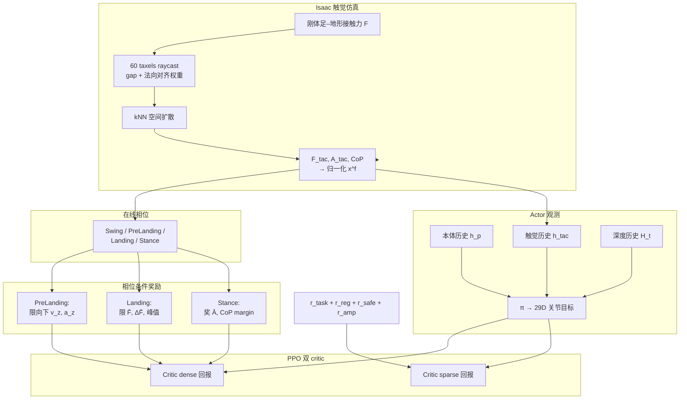

# TactileStep：足底触觉学习调节人形足地交互

**TactileStep**（*Sole Tactile Learning for Regulating Foot-Terrain Interaction in Humanoid Locomotion*；Zizhuo Wang *、Ming-Ju Lee *、Shaoting Zhu、Haozhe Lou、Hang Zhao †、Yiming Li †；[arXiv:2609.28959](https://arxiv.org/abs/2609.28959)，**CoRL 2026 Spotlight**；[项目页](https://tactilestep.github.io/)）由 **清华大学** 提出：在 **Unitree G1（29 DoF）** 上把 **薄型足底压力鞋垫** 的紧凑特征（归一化法向力、接触面积比、CoP）作为 **部署期策略观测**，与 **本体 + 深度历史** 闭环，并用 **四相位步态** 路由 **软着陆 / 稳定支撑** 奖励，使感知跑酷在 **能过障碍** 之外进一步 **轻触地、稳支撑**。

## 一句话定义

**把足底压力做成与仿真对齐的低维触觉状态，让深度跑酷策略在触地瞬间和支撑期「摸得着」地调节冲击与支撑，而不是只靠触地前的视觉几何。**

## 英文缩写速查

| 缩写 | 英文全称 | 简要说明 |
|------|----------|----------|
| TactileStep | Sole Tactile Learning | 本文足底触觉学习框架 |
| CoP | Center of Pressure | 压力中心，支撑稳定性与边缘风险指标 |
| GRF | Ground Reaction Force | 足–地法向反力；本文用 $\bar F$ 等特征表征 |
| PPO | Proximal Policy Optimization | 非对称 actor–双 critic 主优化器 |
| POMDP | Partially Observable MDP | 部分可观测 locomotion 形式化 |
| AMP | Adversarial Motion Prior | 总奖励中含运动先验项 $r_{\mathrm{amp}}$ |
| CoRL | Conference on Robot Learning | 2026 Spotlight venue |
| RL | Reinforcement Learning | Isaac Lab 大规模并行训练 |

## 核心信息

| 字段 | 内容 |
|------|------|
| **机构** | 清华大学（Tsinghua University） |
| **平台** | **Unitree G1**，29 DoF 关节目标 + PD（增益沿用 BeyondMimic 系） |
| **传感** | 机载 **压力鞋垫** + **深度历史** $\mathcal{H}_t$（栈同 [Hiking in the Wild](./paper-hiking-in-the-wild.md)）+ 本体历史 |
| **训练** | NVIDIA **Isaac Sim / Isaac Lab**，2048 并行 env，RTX 4090 |
| **对照** | 外部基线：**Hiking in the Wild** 感知跑酷策略；消融 w/o tac. obs. / w/o soft landing / w/o stable |
| **开源** | **待发布** — [项目页核查（2026-10-01）](../../sources/sites/tactilestep-github-io.md) **未列** GitHub 或权重链接 |

## 为什么重要

- **补感知跑酷的「触地后」盲区：** [Hiking](./paper-hiking-in-the-wild.md)、[FootQuery](./paper-footquery-perceptive-humanoid-locomotion.md) 等用深度/高程优化 **落脚几何与穿越**；TactileStep 指出 **任务成功 ≠ 接触安全**——硬着陆、边缘支撑、CoP 偏移仍损害耐久与人机共处。
- **部署期触觉闭环（非仅 shaping 特权）：** 与 [QuietWalk](./paper-quietwalk-humanoid-locomotion.md)（训练期用 GRF 估计作惩罚、**部署不用 sole 反馈**、偏常规行走）不同，TactileStep 把 **与硬件一致的 $\bar F,\bar A,CoP$** 直接进 actor，在 **楼梯/平台/坡地** 跑酷上调节 **冲击 + 噪声 + 支撑面积**。
- **特征级 sim2real 可复用：** 仿真侧 **60 taxels** 力分配 + 扩散 → 与鞋垫相同的低维特征，避免 raw 阵列直接迁移；对 [触觉感知](../concepts/tactile-sensing.md) 从 **操作** 扩展到 **双足 locomotion** 有范式参考。
- **强基线 + 清晰消融：** 相对 **Hiking** 与 **去触觉观测/去奖励** 变体，论文分离 **观测价值** vs **相位奖励设计**，便于写进 [运控奖励分类](../concepts/humanoid-policy-reward-functions.md)。

## 核心原理

### 相对邻近工作的差异

| 轴 | TactileStep | Hiking in the Wild | QuietWalk | 足端几何奖励（Hiking 系） |
|----|-------------|-------------------|-----------|---------------------------|
| 感知主模态 | 深度 + **sole 特征** | 深度 E2E | 仅本体（GRF 估计作 **训练奖励**） | 深度 + 边缘/体积点 |
| 优化目标 | 穿越 + **触地质量** | 穿越 + 自然性 AMP | 低噪行走 1.2 m/s | 落脚可行 + 边缘规避 |
| 接触信号时机 | **触地前–中–后** 四相位 |  mostly 触地前几何 | 冲击惩罚，无部署 sole | 触地前/仿真几何 proxy |

### 流程总览

### 观测、动作与训练

- **每只脚触觉：** $\mathbf{x}^f_t=[\bar F^f_t, \mathbf{p}^{\mathrm{cop},f}_t, \bar A^f_t]$。
- **Actor：** 本体历史（$\omega,g,c,q,\dot q,a_{t-1}$ 等）$\oplus$ 双足触觉历史 $\oplus$ $\mathcal{H}_t$。
- **Critic（×2，共享特权）：** actor 观测 $\oplus$ 足端 $v_z$ 与四相位 one-hot（用于奖励路由与价值估计）。
- **动作：** $\mathbf{a}_t\in\mathbb{R}^{29}$ 关节目标 → PD 力矩。
- **总奖励：** $r_t=r_{\mathrm{task}}+r_{\mathrm{reg}}+r_{\mathrm{safe}}+r_{\mathrm{amp}}$；按时间密度拆成 **dense / sparse** 两组，由双 critic 各估回报再混合 advantage。

### 相位推断与触觉奖励（要点）

- **四相位** 由法向力/面积阈值、足端 $v_z$ 与高度等 **在线推断**（非固定周期时钟）；Landing 窗口长度 $N_{\mathrm{land}}$ 计数。
- **Soft landing：** PreLanding 惩罚向下速度与加速度；Landing 惩罚 $\bar F$、$\Delta\bar F$ 及 landing 窗口内峰值。
- **Stable support：** Stance 奖励更大 $\bar A$、更大 CoP **离边界 margin**，惩罚 CoP 帧间跳变。

## 源码运行时序图

**不适用** — 截至 2026-10-01 [项目页](https://tactilestep.github.io/) 与 [站点归档](../../sources/sites/tactilestep-github-io.md) **未列** 官方训练/部署仓库或 README 入口；后续若发布代码，应按 Isaac Lab 训练环 + 鞋垫驱动部署补 mermaid `sequenceDiagram`。

## 工程实践

| 项 | 内容 |
|----|------|
| 仿真栈 | Isaac Sim + Isaac Lab；与 Hiking 系相同的深度历史接口 |
| 触觉标定 | 硬件 raw → MLP 映射到力（厂商标定数据） |
| 真机评测 | 每地形 **20** 样本；声级计固定于小腿外侧 ~6 cm 上方测 $L_{A,\mathrm{peak}}$ |
| 复现门槛 | 需 **G1 + 压力鞋垫** 与 Hiking 级深度栈；代码待发布 |
| 代价 | 仿真/真机 **能耗↑**、速度 RMSE 与 traversal time **略↑**（更主动关节调节换接触质量） |

## 局限与风险

- **代码未开源：** 触觉仿真参数（$\eta_n,\alpha,k$ 等）、深度历史长度、奖励权重需读 PDF 全文；无法一键复现。
- **基线绑定 Hiking：** 跨实验室对比需同 checkpoint 与地形协议；与纯本体或 elevation 路线不是零成本替换。
- **能耗–性能权衡：** 成功率与平台下降等场景有增益，但 **能量与跟踪误差** 系统性高于 Hiking——部署需按场景选是否启用全套 tactile 奖励。
- **传感维护：** 鞋垫磨损、标定漂移会影响 $\bar F,\bar A$ 闭环；长期户外跑酷需质控流程（论文未展开）。

## 评测

### 仿真（相对 Hiking 与消融，摘要）

| 关注 | 结论 |
|------|------|
| 触地冲击 | TactileStep **六类地形** landing impact **最低**；去掉 soft-landing 奖励冲击 **一致升高** |
| 支撑质量 | 相对 w/o stable，**接触面积 + CoP margin** 提升；相对 Hiking，**楼梯** 增益最大，平地/坡 **边际较小** |
| 穿越指标 | 成功率 **≥** Hiking（如平台下降 **100%** vs **92.26%**）；能耗 **更高** |

### 真机（同地形内对照，项目页 / Table 3）

| 地形 | 相对 Hiking 亮点（TactileStep） |
|------|--------------------------------|
| 平台上升 | $F_{\mathrm{impact}}$ **695→356 N** 量级（约 **−48.8%**）；噪声 **110→83 dB** |
| 楼梯下降 | 噪声 **97→67 dB**（约 **−30.1 dB**）；$A_c$ **0.483→0.598**（约 **+23.8%**） |
| 平地 | 冲击 **201→191 N**；噪声 **91→67 dB**；$A_c$ **0.453→0.510** |

**w/o tac. obs.** 往往优于 Hiking 但 **弱于完整 TactileStep**（尤其噪声与 $A_c$），说明 **在线 sole 观测** 不可由仅改奖励替代。

## 与其他工作对比

| 对照 | 差异读法 |
|------|----------|
| [Hiking in the Wild](./paper-hiking-in-the-wild.md) | 本文 **外部强基线**；Hiking 优化几何穿越 + AMP，TactileStep **叠加 sole 闭环** 改触地与支撑 |
| [QuietWalk](./paper-quietwalk-humanoid-locomotion.md) | 同 G1 低冲击叙事；QuietWalk **部署无 sole**，用 PINN-GRF **训练惩罚**；TactileStep **部署用触觉状态** 且面向 **跑酷地形** |
| [FootQuery](./paper-footquery-perceptive-humanoid-locomotion.md) | 深度历史 + **触地点 query**；TactileStep 不检索历史 ROI，用 **触地后压力分布** |
| [CoPRE](./paper-copre-proprioceptive-contact.md) | 同期「改 sensing」；CoPRE 为 **臂部本体力矩接触检测**，TactileStep 为 **足底 locomotion** |
| [Tactile Sensing](../concepts/tactile-sensing.md) | 概念页偏 **操作/灵巧手**；本文是 **plantar + RL 跑酷** 实例 |

## 结论

**总判：TactileStep 把「感知跑酷能过」推进到「过的时候踩得轻、撑得稳」，用与鞋垫对齐的低维 sole 特征和四相位奖励，在 G1 真机上相对 Hiking 给出可量化的冲击/噪声/支撑增益，代价是能耗与速度跟踪略差；代码待发布前以 PDF + 项目页为复现依据。**

1. **选型：** 若已有 Hiking 类深度策略且关心 **人机共处噪声、硬件冲击、楼梯边缘支撑**，优先评估 **sole 特征进 actor** 而非仅加仿真 contact penalty。
2. **奖励设计：** PreLanding / Landing / Stance **分相位** 比单一 touchdown 速度惩罚更贴合 **触地前–中–后** 物理；写新 reward 时可对照本文 Table 与 ablation。
3. **Sim2real：** 优先 **特征对齐**（$F,A,CoP$）而非 raw taxel 直迁；仿真侧 raycast+扩散是轻量可扩展模板。
4. **对比实验：** 必须报告 **w/o tac. obs.**，否则无法区分「触觉观测」与「相位 shaping」贡献。
5. **开源跟进：** 项目页出现 GitHub 后补 `sources/repos/` 与 **源码运行时序图**；当前标 **待发布**。
6. **代价预算：** 接受 **更高能耗** 与略大 velocity RMSE 时再启用全套 tactile 目标；平坦高速巡航可能不值得全开。

## 关联页面

- [Humanoid Locomotion](../tasks/humanoid-locomotion.md)
- [楼梯与障碍感知 locomotion](../tasks/stair-obstacle-perceptive-locomotion.md)
- [Tactile Sensing](../concepts/tactile-sensing.md)
- [人形运控观测输入](../concepts/humanoid-policy-observation-inputs.md)
- [人形运控奖励函数](../concepts/humanoid-policy-reward-functions.md)
- [Hiking in the Wild](./paper-hiking-in-the-wild.md)
- [12 篇恢复/WAM 技术地图](../overview/embodied-research-12-papers-recover-wam-technology-map.md)

## 参考来源

- [TactileStep 论文归档（arXiv:2609.28959）](../../sources/papers/tactilestep_arxiv_2609_28959.md)
- [TactileStep 项目页归档](../../sources/sites/tactilestep-github-io.md)
- [具身智能小站 12 篇盘点](../../sources/blogs/wechat_embodied_station_12_papers_recover_wam_2026-09-27.md)

## 推荐继续阅读

- [arXiv PDF](https://arxiv.org/pdf/2609.28959)
- [项目页](https://tactilestep.github.io/)
- [Hiking in the Wild（感知跑酷基线）](./paper-hiking-in-the-wild.md)
