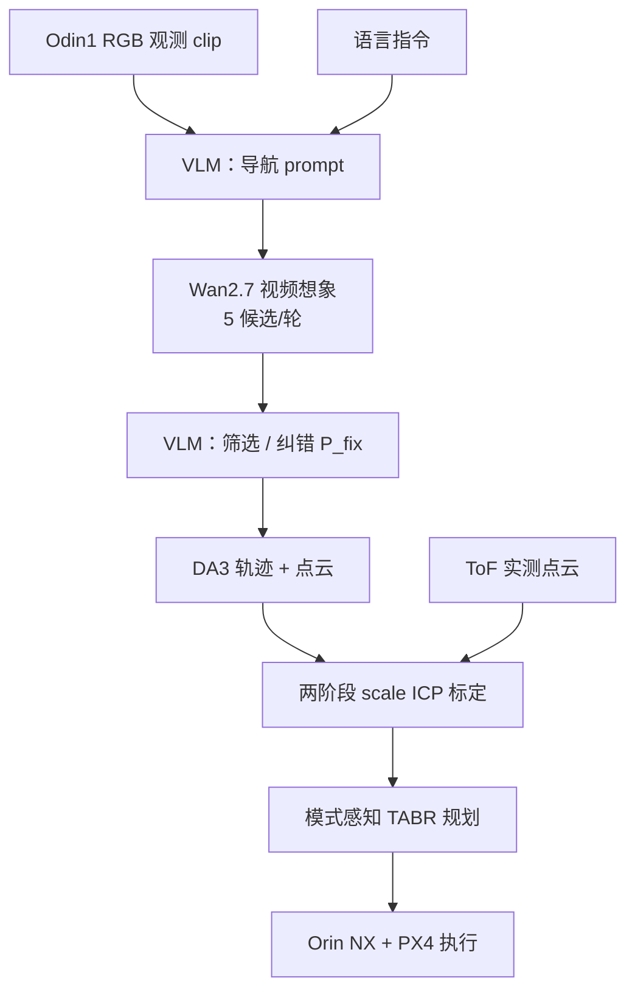

# TADreamer

**TADreamer**（*Zero-Shot Language-Guided 3D Navigation for Terrestrial-Aerial Bimodal Robots via Video Imagination*，Li / Lai 等，浙江大学，arXiv:[2609.19824](https://arxiv.org/abs/2609.19824)，[PDF](https://arxiv.org/pdf/2609.19824)）提出 **零样本** 陆空双模机器人（TABR）语言导航：**VLM** 把 onboard 观测与指令写成视频生成 prompt，**Wan2.7** 合成第一人称导航视频，**VLM** 再选片、纠错再生并标注 **地面/飞行** 模式；**Depth Anything 3（DA3）** 恢复相机轨迹与 imagined 点云，经 **两阶段标定**（FoV 约束 scale 初值 + 各向异性 scaling ICP 对实测 ToF 点云）得到 **metric 3D 路点**，最后交给 **模式感知 TABR 规划器** 在 Jetson 上执行。

## 一句话定义

**用「想象出来的导航视频」当中间规划表示，再用真实点云把想象几何拉回到可执行的陆空双模 metric 轨迹。**

## 英文缩写速查

| 缩写 | 英文全称 | 简要说明 |
|------|----------|----------|
| TABR | Terrestrial-Aerial Bimodal Robot | 可地面滚动/飞行的双模机器人 |
| VLM | Vision-Language Model | 读图+语言，写 prompt / 选视频 / 标模式 |
| DA3 | Depth Anything 3 | 多视图几何重建与点云 |
| VLN | Vision-Language Navigation | 语言条件导航任务族 |
| ToF | Time of Flight | 机载深度/点云传感器（Odin1） |
| ICP | Iterative Closest Point | 点云配准；本文含 scaling 扩展 |
| MADE | Mean Absolute Depth Error | 标定观测上的绝对深度误差 |
| MARDE | Mean Absolute Relative Depth Error | 相对深度误差（%） |
| PX4 | PX4 Autopilot | 飞行控制栈 |

## 核心信息

| 项 | 内容 |
|----|------|
| **作者** | Xiangyu Li*、Tiancheng Lai*、Xijie Huang、Ruitian Pang、Siqi Shen、Juncheng Chen、Zaisheng Pan、Chao Xu、Fei Gao、Yanjun Cao（* 共一；Cao 通讯） |
| **机构** | 浙江大学（ZJU）工业控制技术国重实验室；湖州浙大研究院 |
| **平台** | TABR（与 TriphiBot 同类）；Odin1（RGB+ToF）；Orin NX 规划；PX4 控制 |
| **生成栈** | ChatGPT Sol-5.6（API）；Wan2.7 I2V；DA3 @ 504×406 |
| **评测** | 七室内/外场景真机；深度 vs onboard ToF；对照 NavDreamer、DA3、几何 TABR 规划 [Gao et al.] |
| **开源** | **待发布** — 2026-09-29 arXiv/PDF **未列 GitHub 或项目页** |

## 为什么重要

- **TABR 决策不只是避障：** 需在语义可通行性下 **compose 地面与飞行**（坡地、草地、绕障 vs 必要起飞），纯几何地图易 **误触发飞行**（论文 Grassland / Square 对照）。
- **视频想象 → 动作的可信接口：** 继承 NavDreamer 等「生成视频当规划」路线，但强调 **各向异性尺度畸变** 不能用单一 global scale；**实测点云两阶段标定** 是主要 metric 增益来源（均值 MADE 0.49 m vs NavDreamer 3.99 m）。
- **零样本部署叙事：** 不微调 VLM / 视频模型 / DA3，依赖 API 与预训练模型；适合作为 **VLN + 生成视频 + 双模硬件** 交叉索引节点。

## 方法

| 模块 | 作用 |
|------|------|
| **Prompt 生成** | \(P_{nav}=F_{VLM}(\mathcal{I}^{obs},\ell)\) → 路线 / 模式 / 终止状态 |
| **Wan2.7 + 反馈** | 每轮 5 种子；失败则 \(P_{fix}\) 更新再生（KFC、Red Box 2 需第二轮） |
| **模式时间戳** | VLM 从 \(V_{best}\) 得起降时刻，给 0.5 s 采样帧贴 ground/air 标签 |
| **DA3 重建** | 合并 imagined 点云与候选路点 \(\widehat{w}_i\) |
| **两阶段标定** | FoV ratio + scale ICP → 全 \(S,R,t\) ICP 对 ToF 点云 |
| **规划** | Zhang et al. [5] TABR 生成器 + 实测地图避障；地面非完整约束 yaw |

### 流程总览

## 源码运行时序图

**不适用**（截至 2026-09-29 无官方可运行仓库；复现依赖 Wan / DA3 / VLM API 与 TABR  onboard 栈，需自建集成。）

## 实验要点

| 指标 | 要点 |
|------|------|
| 视频可用性 | 七场景 **≤2 轮** 得到可用片；最终 **Mode Success** 与人工标注一致 |
| 深度标定 | 均值 MADE **−87.7%** vs NavDreamer，**−80.0%** vs 纯 DA3 |
| vs 几何规划 | 草地/台阶场景几何 baseline 误起飞；TADreamer 语义选 **ground** 节能 |

## 与其他工作对比

| 维度 | TADreamer | 对照 |
|------|-----------|------|
| 规划载体 | 生成视频 + 实测点云标定出 metric 路点 | NavDreamer：同为零样本视频想象导航，单尺度对齐（本文深度误差低约 87.7%） |
| 平台 | 陆空双模（ground / flight 模式标签） | [FSD-VLN](./paper-fsd-vln.md)：空中长程 VLN 快慢双系统 |
| 3D 条件 | 想象几何经 ICP 拉回真实尺度 | [WNM-3D-VLN](./paper-wnm-3d-vln.md)：3D 场景条件世界导航模型，闭环 RL 优化 |
| 场景尺度 | 室内外七场景真机 | [DA-Nav](./paper-da-nav.md)：城市尺度户外 VLN，用商业导航方向指令 |

## 结论

**TADreamer 的可复用结论是：TABR 语言导航可把生成视频当「语义+时序」规划载体，但执行前必须用实测几何（尤其各向异性 scale）校准 imagined 路点，否则 NavDreamer 式单尺度对齐不够。**

1. **分层读法** — VLM 负责语言→prompt 与视频 QC；DA3+ICP 负责 metric；TABR planner 负责动力学可行轨迹。
2. **对标 NavDreamer** — 同为零样本视频导航，本文增益在 **TABR 模式标签 + 点云两阶段标定**，不是换更大视频模型 alone。
3. **工程依赖** — API VLM、Wan2.7、DA3 GPU 与 Odin1 ToF 同步；闭环重规划论文标为 future work。
4. **开源** — 入库日无仓库；lint 可跟进 arXiv 更新。
5. **与操作 VLA 区分** — 本文是 **VLN + 视频想象 + 双模导航**，不是 manipulation chunk 策略（见 [VLA](../methods/vla.md)）。

## 局限与风险

- **开环为主：** 动态环境与高阶 replanning 未覆盖；KFC/Red Box 2 需 **人物/静物** 纠错 prompt。
- **API 与闭源模型：** Wan2.7、Sol-5.6 可复现性与延迟未在论文量化。
- **人工评估：** 视频可用性与模式标签部分依赖有经验的操作员参照。
- **无公开代码：** 标定与 planner 耦合细节暂不可审计。

## 关联页面

- 任务：[视觉–语言导航（VLN）](../tasks/vision-language-navigation.md)
- 方法：[Generative World Models](../methods/generative-world-models.md)
- 对照：[DA-Nav](./paper-da-nav.md)（户外 VLN waypoint）、[FSD-VLN](./paper-fsd-vln.md)（空中 VLN 双系统）
- 概念：[World Action Models](../concepts/world-action-models.md)

## 参考来源

- [tadreamer_arxiv_2609_19824.md](../../sources/papers/tadreamer_arxiv_2609_19824.md)
- 论文：<https://arxiv.org/abs/2609.19824>

## 推荐继续阅读

- Huang et al., *NavDreamer: Video Models as Zero-Shot 3D Navigators*（IEEE RAL 2026）— TADreamer 深度标定主对照
- Li et al., *DS-LABRNav*（IEEE RAL 2026）— VLM 评估陆空双模可通行障碍
- [Depth Anything 3（arXiv:2511.10647）](https://arxiv.org/abs/2511.10647)
