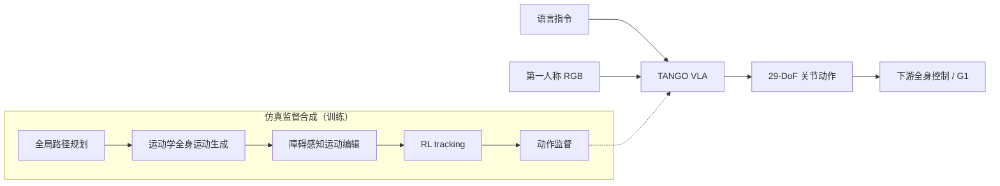

# TANGO：杂乱室内的人形全身 VLA 导航

**TANGO**（*Humanoid Navigation in Cluttered Environments with a Whole-Body Vision-Language-Action Model*，[arXiv:2609.09158](https://arxiv.org/abs/2609.09158)，[项目页](https://tango-vla.github.io/tango-vla.github.io)，CoRL 2026）由 **北京大学** Anqi Li、Yuxin Chen 等与 **加州大学伯克利分校** Masayoshi Tomizuka、**普林斯顿大学 / Google DeepMind** Dhruv Shah 等提出：杂乱室内人形导航不能降维成 **2D 路径规划**——需要连续几何感知的 **全身适应**（摆臂过障、躯干侧倾、步态调制）。TANGO 是首个 **全身 VLA**：自然语言 + 第一人称 RGB → 直接预测 **29-DoF 关节动作**。

## 一句话定义

**语言导航对人形不是「走格子」，而是端到端学全身如何通过 3D 障碍——且监督全部在仿真里合成。**

## 英文缩写速查

| 缩写 | 英文全称 | 简要说明 |
|------|----------|----------|
| TANGO | Whole-Body VLA Navigation | 本文框架简称 |
| VLA | Vision-Language-Action | 视觉–语言–动作策略 |
| VLN | Vision-Language Navigation | 语言条件导航任务族 |
| WBC | Whole-Body Control | 低层全身控制；TANGO 输出关节目标 |
| DoF | Degree of Freedom | G1 全身 29 维关节动作 |
| RL | Reinforcement Learning | 仿真管线末段 tracking 监督 |

## 为什么重要

- **问题设定升级：** 把 VLN 从轮式/平面抽象拉到 **人形 3D 穿越**，与 [HumanoidVLN](./paper-humanoidvln.md)、[FSD-VLN](./paper-fsd-vln.md) 等同导航线但强调 **全身关节输出**。
- **仿真数据闭环：** 不依赖真机导航数据——路径规划、全身运动生成、障碍编辑、RL tracking 全自动合成 **动力学可行** 监督。
- **零样本 G1：** 项目页展示长视界导航与侧身/下蹲/跨步等 **几何感知穿越**；无真机导航 fine-tune。

## 核心信息

| 项 | 内容 |
|----|------|
| **机构** | 北京大学；UC Berkeley（Tomizuka）；Princeton / Google DeepMind（Dhruv Shah）等 |
| **会议** | CoRL 2026 |
| **平台** | Unitree G1，29 DoF 关节动作 |
| **输入** | 自然语言指令 + 第一人称 RGB |
| **训练** | **全程仿真**；无真机导航数据 |
| **开源** | **截至 2026-09-10 未开源**（项目页无 GitHub） |

## 流程总览

## 核心原理

1. **全身动作空间：** 输出关节级命令而非 $(v,\omega)$ 或 footstep 离散集，使手臂与躯干成为 **主动避障自由度**。
2. **合成管线四段：** 全局规划保证可达 → 运动学全身轨迹保证形态可行 → **障碍感知编辑** 插入侧身/抬臂等 → **RL tracking** 把参考变成动力学可行、可学习的动作序列。
3. **语言条件：** 同一 VLA 骨干处理指令与视觉；仿真中配对多样 cluttered 场景与语言目标。
4. **零样本迁移：** 依赖仿真多样性覆盖真实几何；真机不做 navigation 域适应（论文主张）。

## 源码运行时序图

**不适用** — 截至 **2026-09-10** 无官方仓库或可运行训练/部署入口。

## 实验与评测

- **仿真：** 语言引导导航 SOTA；显著优于模块化强基线（路径规划 + 局部避障 + 跟踪类组合，以论文表格为准）。
- **真机：** G1 在真实 cluttered 场景 **零样本**；项目页含长视界、侧身过门、下蹲、跨步等 demo。
- **读数边界：** 全身 VLA 的失败模式包括 **接触不稳定** 与 **指令–几何对齐** 错误，不能只看终点到达率。

## 与其他工作对比

| 对照路线 | 差异 |
|----------|------|
| 模块化导航栈（全局规划 + 局部避障 + 跟踪） | 论文报告仿真中显著优于该类强基线；模块化易调试但难做全身协调，TANGO 赌端到端几何一致（表格以原文为准）。 |
| 2D 速度/footstep 动作空间的 VLN | 输出 $(v,\omega)$ 或离散落脚点，手臂与躯干不参与避障；TANGO 直接出 **29-DoF 关节命令**，摆臂/侧倾成为主动自由度。 |
| [HumanoidVLN](./paper-humanoidvln.md) / [FSD-VLN](./paper-fsd-vln.md) | 同属人形语言导航线，落点在导航策略与场景理解；TANGO 的差别在把监督放到 **全身关节空间** 并整套在仿真里合成。 |
| [FWBC-VLA](./paper-fwbc-vla.md) 等 loco-manip VLA | 同为全身输出但服务 **操作/力交互** 域；TANGO 是导航域，两者分层互补。 |
| 真机 navigation 数据微调路线 | TANGO 不做真机 nav 域适应，零样本完全靠仿真多样性覆盖——代价是真实几何 OOD 仍是风险点。 |

## 结论

**TANGO 证明人形 cluttered VLN 可以直接在关节空间用 VLA 学，但训练监督必须来自「规划→全身运动→编辑→RL」的仿真合成链，而不是 2D 导航数据集。**

1. **全身自由度是特性不是噪声** — 摆臂/躯干是过窄通道的合法策略，不是 tracking 误差。
2. **仿真管线的瓶颈在编辑+tracking** — 仅有 kinematic 轨迹不够，RL tracking 提供动力学可行标签。
3. **零样本靠仿真覆盖** — 无真机 nav 数据意味着真实几何 OOD 仍是风险点。
4. **与操作 VLA 分层** — TANGO 是导航域全身输出；与 [FWBC-VLA](./paper-fwbc-vla.md) 等 loco-manip 线互补。
5. **复现待代码** — CoRL 2026 论文可引用；工程复现需等官方发布。

## 工程实践

| 项 | 建议 |
|----|------|
| 何时引用 | 语言条件 **人形 3D 穿越**、关节级 VLA 导航 |
| 与模块化对比 | 模块化易调试但难协调全身；TANGO 赌端到端几何一致 |
| 部署 | 需可靠低层 WBC/tracking 执行 29-DoF 命令 |
| 开源跟进 | 盯 [项目页](https://tango-vla.github.io/tango-vla.github.io) |

## 关联页面

- [VLA](../methods/vla.md)
- [视觉–语言导航（VLN）](../tasks/vision-language-navigation.md)
- [Unitree G1](./unitree-g1.md)
- [HumanoidVLN](./paper-humanoidvln.md)

## 参考来源

- [`tango_arxiv_2609_09158.md`](../../sources/papers/tango_arxiv_2609_09158.md)
- [`tango-vla.md`](../../sources/sites/tango-vla.md)
- [arXiv:2609.09158](https://arxiv.org/abs/2609.09158)

## 推荐继续阅读

- [TANGO 项目页](https://tango-vla.github.io/tango-vla.github.io)
- [原文 PDF](https://arxiv.org/pdf/2609.09158)
