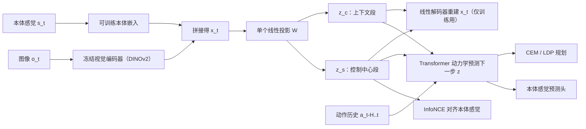
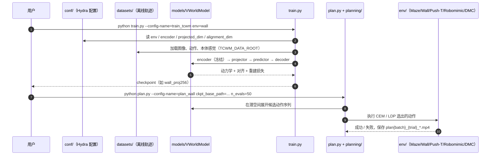

# TC-WM（任务中心世界模型：从视觉基础表征里抽出控制状态）

**TC-WM**（*Back to Parsimonious Latents: Learning Task-Centric World Models from Visual Foundations*，[arXiv:2605.25620](https://arxiv.org/abs/2605.25620)，v1 2026-05-25；[项目页](https://minghaofu.com/tc-wm/)；[代码](https://github.com/MinghaoFu/TC-WM)）由 Minghao Fu、Fan Feng、Nicklas Hansen、Biwei Huang（UCSD）提出。[Aether AI](./aether-ai.md) 官方博客在 **2026-07-09** 发布了解读文 *Back to Parsimonious Latents: Task-Centric World Models from Visual Foundations*（Field notes #05）。它要回答的问题是：**世界模型应该在什么潜空间里做预测，才能用于规划与控制？**

## 一句话定义

**冻结视觉编码器，只学一个线性投影：把高维基础模型嵌入压成紧凑潜变量，其中一段与机器人本体感觉对齐、其余部分留给场景上下文，再在这个小空间里学动力学并做规划。**

## 英文缩写速查

| 缩写 | 英文全称 | 简要说明 |
|------|----------|----------|
| TC-WM | Task-Centric World Model | 本文方法 |
| WM | World Model | 给定历史与动作预测未来的学习型模拟器 |
| DINO-WM | World Models on Pre-trained Visual Features | 直接在冻结 DINOv2 patch 特征上学动力学的主要基线 |
| JEPA | Joint-Embedding Predictive Architecture | 在嵌入空间预测的另一类做法 |
| InfoNCE | Info Noise-Contrastive Estimation | 让 \(z^s\) 与本体感觉配对的对比损失 |
| CEM | Cross-Entropy Method | 目标到达任务的采样式规划器 |
| LDP | Latent Diffusion Planner | 操作任务里提出候选轨迹、再由世界模型打分 |
| SAC | Soft Actor-Critic | 博客写运动任务在学到的动力学上训策略用它 |
| DROID | Distributed Robot Interaction Dataset | 大规模真实操作数据集，用于 TC-Cosmos3 定性对比 |

## 为什么重要

- **把「在哪个空间预测」当作一等问题。** 多数工作在改 tokenizer、拉长 rollout 或提高画质。TC-WM 认为状态空间选错了，加容量也不一定改善规划；状态空间选对了，小动力学模型也够用。
- **对 DINO-WM 一类做法的直接修正。** 在冻结基础模型嵌入上学动力学（[DINO-WM](./paper-sa-2411-04983-dino-wm-world-models-on-pre-trained-visual-featu.md)、JEPA）会把纹理、光照、背景这些不受动作影响的维度也拿来预测。TC-WM 只加一个线性层和两条损失，几乎不增加成本。
- **监督信号是现成的。** 唯一的显式结构监督来自本体感觉，机器人本来就有，不需要额外标注。
- **可以放大到视频世界模型。** 同一组目标用于微调 16B 的 Cosmos3-Nano（TC-Cosmos3），并在 DROID 真实片段上做了定性对比。

## 核心信息

| 项 | 内容 |
|----|------|
| **机构** | 加州大学圣地亚哥分校（UCSD）；论文解读发布在以太智能（Aether AI）博客 |
| **作者** | Minghao Fu、Fan Feng、Nicklas Hansen、Biwei Huang |
| **视觉编码器** | 冻结；默认 DINOv2，配置可选 DINOv3 / Cosmos tokenizer（`encoder=dino / dinov3 / cosmos_ci`） |
| **潜变量** | \(z = W x\)，\(x\) = 视觉嵌入 ⊕ 可训练本体感觉嵌入；\(z=[z^s, z^c]\) |
| **预测器** | Transformer（README 写 ViT），以 H 步历史潜变量与动作预测下一潜变量，另一头预测下一本体感觉 |
| **训练数据** | 离线轨迹（图像、动作、本体感觉），**无奖励、无在线交互** |
| **规划器** | CEM（Maze、Wall、Push-T 等）、LDP（Lift、Can、Square）；运动任务的规划器博客与项目页说法不一 |
| **评测** | 9 个环境：Maze、Wall、Push-T、Lift、Can、Square、Reacher、Cheetah、Hopper（来自 Robomimic、D4RL 等） |
| **基线** | TD-MPC2、DreamerV3、MuZero、DINO-WM |
| **开源** | 代码 MIT 已开源；checkpoint 写「将发布」，2026-10-10 尚不可访问 |

## 核心原理（方法）

### 流程总览

### 三个设计

1. **只用线性投影。** 作者的假设是：冻结编码器已经完成了从像素到语义特征的非线性变换，控制所需的变量已经在嵌入里，只是和外观、背景缠在一起。剩下的工作是在嵌入里找到与控制相关的子空间。博客报告的消融支持这一点：换成随机投影会变差，换成非线性投影头没有提升。
2. **一段潜变量对齐本体感觉。** \(z^s\) 与本体读数 \(s^p\)（关节角、末端位姿）用 InfoNCE 配对：
   \[\mathcal L_{align}=-\mathbb E\Big[\log\frac{\exp(\mathrm{sim}(z^s_t,s^p_t))}{\sum_j\exp(\mathrm{sim}(z^s_t,s^p_j))}\Big]\]
   \(z^c\) 不受此约束，用来放物体构型、场景结构这类本体感觉解释不了的因素。
3. **线性解码器重建嵌入。** 只靠紧凑和对齐，投影可能丢掉 \(z^s\) 之外但预测仍需要的信息。重建项 \(\hat x_t=f_{dec}(z_t)\) 让这些信息留在 \(z^c\) 里。解码器只在训练时用。

总损失：

\[\mathcal L=\mathcal L^{z}_{dyn}+\mathcal L^{s}_{dyn}+\lambda_{align}\mathcal L_{align}+\lambda_{rec}\mathcal L_{rec}\]

**可辨识性主张：** 在模型假设下，线性投影把任务中心子空间辨识到仿射变换为止（项目页写「部分对齐下」）。作者据此说 \(z^s\) 不只是好用的特征，而是状态里可控部分的结构化把手。

## 源码运行时序图

复现路径：先按 README 建 conda 环境并装 MuJoCo 210，再用 `train.py` 训单任务（或 `scripts/run_tcwm.sh` 批量），最后 `plan.py` 评测；`rollout.py` 可导出原图 / 重建 / 开环预测三组 GIF 做定性检查。预训练 checkpoint 尚未公开，需要自己训练。

## 工程实践

| 项 | 要点 |
|----|------|
| 关键超参 | `projected_dim`（紧凑潜变量维度）、`alignment_dim`（\(z^s\) 维度）、\(\lambda_{align}\)、\(\lambda_{rec}\) |
| 维度划分 | 博客称 \(z^s/z^c\) 划分对结果影响小，只要对齐与重建两条约束都在 |
| 先看什么 | 去掉重建项会同时伤规划和画质；去掉对齐项主要伤成功率、画质基本不变。因此 **画质好不代表能规划**，调参时要看规划成功率 |
| 诊断工具 | 扰动 \(z^s\) 看解码响应是否集中在夹爪与物体；扰动 \(z^c\) 应主要影响背景 |
| 编码器选择 | 项目页的编码器消融中 DINOv2 / DINOv3 最好 |
| 鲁棒性 | 项目页演示训练未见的高斯噪声 + 逐通道颜色抖动下，Lift 开环 rollout 仍保住方块位置与机械臂轮廓（定性） |
| 开源状态 | 代码已开源（MIT）；checkpoint 待发布；TC-Cosmos3 未见单独发布 |

## 实验与评测

博客和项目页只用图表报结果，没有给逐任务数值表；以下是文字结论（均为自报）：

- **世界模型预测：** TC-WM 的潜空间 rollout 误差在几乎所有任务上最低，图像重建与其他方法相当。作者说「紧凑潜变量不只是更小，而是更可预测」。
- **规划：** 已饱和的目标到达任务上与最强基线持平；**在每个 Robomimic 操作任务（Lift、Can、Square）上都超过 DINO-WM**，是对比方法里唯一做到的。作者的解释：操作任务里可控物体只占画面一小块且在移动，外观主导的潜变量浪费的容量最多。
- **Lift 损失消融：** 去重建 → 规划与视觉预测都明显下降；去对齐 → 成功率下降、SSIM 基本保持；改 \(z^s/z^c\) 维度 → 影响小。
- **投影消融（Robomimic）：** 线性投影最好；随机投影的 DINOv2 嵌入（RP）更差；非线性头无收益。
- **扰动分析：** 扰动 \(z^s\) 的响应集中在夹爪与被操作物体，并随物体移动；扰动 \(z^c\) 的响应分散在背景。监督只来自本体感觉，却分出了「可控交互状态」和「上下文」。
- **TC-Cosmos3（定性）：** 在 DROID 五个任务（如「把方块放进碗再擦桌子」「把充电头插进适配器」）上，相同起始帧 + 相同真值动作条件下，TC-Cosmos3 比原始 Cosmos3-Nano 更贴住夹爪与物体、允许无关背景变化。没有量化指标。

## 结论

**TC-WM 的价值在于给出了一个低成本、可检验的规则：在冻结基础表征上做世界模型时，先用线性投影 + 本体对齐 + 嵌入重建抽出紧凑控制状态，再学动力学。**

- **看规划成功率，不看画质。** 消融里去掉对齐后 SSIM 基本不变、成功率下降，说明「预测得像」和「能用来控制」是两件事。
- **收益集中在操作任务。** 导航和运动任务上基本与强基线持平；只有在小物体、杂乱背景的操作任务上优势明显。选型时应据此判断是否值得换。
- **改动小，容易嫁接。** 只加线性投影、线性解码器和两条损失，编码器不动。已有 DINO-WM 式管线可以直接试。
- **本体感觉是必需输入。** 方法依赖本体读数做对齐；没有可靠本体感觉的场景（如纯人类视频）不能直接套用。
- **大模型扩展目前只有定性证据。** TC-Cosmos3 只有视频对比，16B 规模下是否改善规划仍待验证。

## 与其他工作对比

| 对比轴 | TC-WM | [DINO-WM](./paper-sa-2411-04983-dino-wm-world-models-on-pre-trained-visual-featu.md) | [TD-MPC2](./paper-td-mpc2.md) / [DreamerV3](./paper-shenlan-wm-13-dreamerv3.md) / [MuZero](./paper-muzero-planning-latent-dynamics.md) |
|--------|-------|---------|---------------------|
| 状态空间 | 冻结嵌入内的紧凑线性子空间 | 冻结 DINOv2 patch 特征全量 | 从头学的潜变量 |
| 语义先验 | 继承基础模型 | 继承基础模型 | 无（或弱） |
| 任务无关细节 | 用对齐 + 紧凑性压掉 | 全部保留 | 取决于训练目标 |
| 显式物理锚点 | \(z^s\) 对齐本体感觉 | 无 | 无 |
| 奖励需求 | 无（离线、无奖励） | 无 | TD-MPC2 / Dreamer 训练用奖励 |

- 与同团队的 [SCAR](./paper-scar-continuous-action.md) 互补：TC-WM 精简「状态」，SCAR 精简「动作」。
- 与 [CD-LAM](./paper-cd-lam.md) 同属 Aether AI 博客里的世界模型系列，CD-LAM 处理的是动作条件被视觉混杂污染的问题。
- 在 [世界模型功能分类](../concepts/functional-taxonomy-world-models.md) 中属于「潜空间动力学 + 测试时规划」一类，见 [Model-Based RL](../methods/model-based-rl.md) 与 [潜在想象](../concepts/latent-imagination.md)。

## 局限与风险

- **没有逐任务数值。** 博客和项目页只给图，无法直接引用具体成功率或误差幅度。
- **口径不一致。** 运动任务的控制器：博客写 SAC，项目页与 README 写 CEM；预测器：博客写 Transformer，README 写 ViT。
- **评测以仿真为主。** 真实数据只有 DROID 上 TC-Cosmos3 的定性开环视频，没有真机闭环。
- **可辨识性依赖假设。** 「辨识到仿射变换」是在模型假设下的结论，实际训练能否满足需另行验证。
- **依赖本体感觉。** 对齐信号来自机器人本体读数，人类视频或无本体传感的数据无法直接使用。
- **checkpoint 未发布**（截至 2026-10-10），复现需从头训练。

## 关联页面

- [Aether AI（以太智能）](./aether-ai.md) — 发布本文解读博客的公司
- [DINO-WM](./paper-sa-2411-04983-dino-wm-world-models-on-pre-trained-visual-featu.md) — 主要对比基线：在冻结 DINOv2 特征上直接学动力学
- [SCAR](./paper-scar-continuous-action.md) — 同团队：从视觉转移学跨本体潜动作
- [CD-LAM](./paper-cd-lam.md) — Aether AI：潜动作因果去偏
- [IWR（The Geometry of Contact）](./paper-geometry-of-contact.md) — 同团队：接触感知的对比 RL 表征
- [Cosmos 3](./cosmos-3.md) — TC-Cosmos3 所用的视频基础模型家族
- [Robomimic](./robomimic.md) — Lift / Can / Square 操作任务来源
- [Model-Based RL](../methods/model-based-rl.md)
- [生成式世界模型](../methods/generative-world-models.md)
- [潜在想象](../concepts/latent-imagination.md)
- [策略的视觉表征](../concepts/visual-representation-for-policy.md)
- [操作任务](../tasks/manipulation.md)

## 参考来源

- [Aether AI 博客：Back to Parsimonious Latents（2026-07-09）](../../sources/blogs/aether_task_centric_world_models.md)
- [TC-WM 论文归档（arXiv:2605.25620）](../../sources/papers/tc_wm_arxiv_2605_25620.md)

## 推荐继续阅读

- [Aether AI 博客原文](https://aetherlabs.ai/articles/task-centric-world-models.html)
- [TC-WM 项目页（含交互 demo）](https://minghaofu.com/tc-wm/)
- [arXiv:2605.25620](https://arxiv.org/abs/2605.25620)
- [GitHub：MinghaoFu/TC-WM](https://github.com/MinghaoFu/TC-WM)
