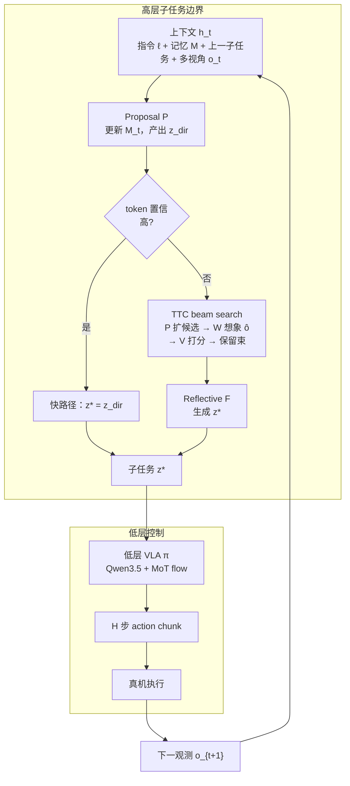
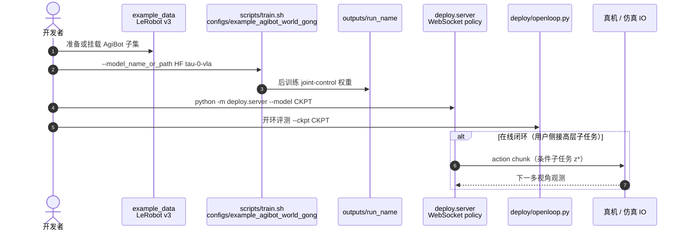

# τ₀-VLA：世界模型引导测试时计算的分层机器人基础模型

**τ₀-VLA**（*a Hierarchical Robot Foundation Model with World-Model-Guided Test-Time Computation*，[arXiv:2608.16885](https://arxiv.org/abs/2608.16885)，[项目页](https://tau0-vla.github.io/)，[代码](https://github.com/sii-research/tau-0-vla)，[权重](https://huggingface.co/sii-research/tau-0-vla)）由 **上海创智学院**、**智元机器人 Finch 团队** 与 **香港中文大学** 提出：把 **下一子任务生成** 写成 **可扩展测试时算力（TTC）** 的推理问题——在不确定时用 **世界模型想象候选子任务的视觉后果**、**价值模型打分** 与 **beam search + 反思** 再提交；**通用低层 VLA** 则在 **40,115 小时** 异构真机数据上学会跨 **固定基 / 双臂 / 移动** 本体的 **40 维** 统一控制。

## 一句话定义

**分层 VLA 基础模型：高层用可修订执行记忆 + 世界模型引导 TTC 在子任务边界「先想象再选步」，低层用同一 generalist flow-VLA 把选定子任务落成跨本体动作块。**

## 英文缩写速查

| 缩写 | 英文全称 | 简要说明 |
|------|----------|----------|
| VLA | Vision-Language-Action | 视觉-语言-动作多模态基础策略 |
| TTC | Test-Time Computation | 推理阶段按难度追加算力（搜索/采样/验证） |
| WM | World Model | 预测候选行为后果的环境/观测模型 |
| MoT | Mixture-of-Transformers | 混合 Transformer 专家结构（动作专家） |
| EEF | End-Effector | 末端执行器位姿/状态 |
| FM | Flow Matching | 连续动作生成的 flow 匹配训练目标 |

## 为什么重要

- **长程瓶颈在「选步」而非只调电机：** 奶茶、炒菜、打扫等 **13–25 有序子步**、最长 **12 分钟** episode 中，错子任务无法靠更精细 low-level 挽回；τ₀-VLA 显式把算力花在 **子任务边界**。
- **想象在提交前：** 与多数 **单次前向高层** 不同，TTC 在执行前 **比较开放语言候选** 的 **预测终端 head 图像**，把世界模型从「解释已选子任务」推进到 **决策前证据**。
- **同低层、不同引导：** 分层 **Plan Once 45.0%** vs 整任务直出 **27.5%**（四类长程任务平均，10 trials/task），说明增益主要来自 **进度跟踪与下一子任务接口**，而非换掉执行策略。
- **与 τ₀-WM 互补：** 同生态 **测试时想象**——[τ₀-WM](./tau0-world-model.md) 在 **5B Joint WAM / action chunk** 级 propose–evaluate–revise；τ₀-VLA 在 **稀疏语言子任务** 级搜索，并内置 **可修订执行记忆**。

## 核心信息

| 项 | 内容 |
|----|------|
| **机构** | 上海创智学院（Shanghai Innovation Institute）；智元机器人 Finch 团队（AgiBot Finch）；香港中文大学（CUHK） |
| **高层** | Proposal **P**、World Model **W**、Value **V**、Reflective **F**；路由 + beam search（分支因子 N、束宽 B、深度 D） |
| **低层** | 预训练 VLM（论文/页：**Qwen3.5**）+ **MoT action expert**；**条件 flow matching**；**H 步 action chunk** |
| **动作空间** | **40 维** 统一状态/动作：EEF、臂关节、夹爪、腰、移动底盘；未用槽位 mask |
| **数据** | **40,115 h** 异构真机 + 多模态共训（遥操作、UMI、自主等，论文口径） |
| **开源** | **部分开源**：低层 HF 权重、LeRobot v3 后训练、`deploy.server`、范例数据（Apache-2.0）；**高层 policy + TTC 据 README 2026.08.19 将逐步发布** |

## 核心结构/机制

| 模块 | 作用 |
|------|------|
| **执行记忆 \(M_t\)** | 汇总截至当前观测的进度；可由 P 更新；支持 **扰动记忆训练** 学会前进/回滚/重试 |
| **Proposal P** | 输入 \(h_t=(\ell, M_{t-1}, z^\star_{t-1}, o_t)\) → 直接子任务 \(z^{\mathrm{dir}}_t\) + 置信路由 \(g_t\) |
| **World Model W** | 给定 head RGB \(\tilde o\) 与候选子任务 \(z\) → 预测 **终端 head 图像** \(\hat o\) |
| **Value V** | 对 \((\ell, z, \hat o)\) 输出标量 **候选质量** |
| **Reflective F** | 在保留 beam 上生成 **最终子任务** \(z^\star_t\)（可超出候选集） |
| **低层 \(\pi_\theta\)** | \((o_t, s_t, z^\star_t, \eta) \rightarrow a_{t:t+H-1}\)；\(\eta\) 为 embodiment / 控制模式元数据 |

### 流程总览（分层推理环）

## 源码运行时序图

官方仓库 [sii-research/tau-0-vla](https://github.com/sii-research/tau-0-vla) 当前公开 **低层后训练与 joint-control serving**（高层 TTC 待发布；归档见 [sources/repos/sii_research_tau_0_vla.md](../../sources/repos/sii_research_tau_0_vla.md)）：

> **注：** 完整 **P/W/V/F + TTC SEARCH** 运行时序待官方释放高层组件后补图；当前 README 仅保证低层 **joint-control** serving 契约（`deploy/README.md`）。

## 实验与评测读法

### 四类长程真机（项目页 / 论文，10 trials/task）

| 方法 | Clean Room | Prepare Ingredients | Stir Fry | Milk Tea | **平均** |
|------|------------|-------------------|----------|----------|----------|
| GR00T N1.7 | 0/10 | 1/10 | 0/10 | 0/10 | 2.5% |
| LingBot-VLA | 0/10 | 0/10 | 0/10 | 0/10 | 0.0% |
| π₀.₅ | 4/10 | 2/10 | 0/10 | 3/10 | 22.5% |
| τ₀-VLA（整任务直出） | 4/10 | 2/10 | 0/10 | 5/10 | **27.5%** |
| τ₀-VLA（分层 Plan Once） | 5/10 | 4/10 | 4/10 | 5/10 | **45.0%** |

- **读法：** 同低层策略下，**显式子任务 + 记忆** 将近翻倍平均成功率；Stir Fry 对全体仍难，分层显著抬升。
- **TTC：** next-subtask 在 in-domain 与分布偏移上 **+15–24 pt**；OOD Book Organization **74.0%** vs Plan Once **50.0%**；固定低层时物理成功 Milk Tea **5→7/10**、Book Org **6→9/10**、Clean Room **5→7/10**。
- **记忆修订：** 扰动记忆训练 **+11.0 pt** next-subtask；Milk Tea 末段 **盖盖 / 插吸管** 仍是主要瓶颈（进度 >91% 但成功仍受限）。

## 结论

**τ₀-VLA 把长程操纵的主战场从「更会动手」推进到「更会选下一语义步」：世界模型引导 TTC 在子任务提交前提供视觉后果证据，可修订记忆让进度记录跟得上物理世界。**

- **真影响指标：** 同低层下 **分层 Plan Once ~45%** vs **整任务 ~27.5%**；TTC 主要抬 **next-subtask 准确率** 并 **可转译** 为固定低层下的物理成功增益。
- **次要代价：** 长程仍受 **接触丰富末段子步** 限制；TTC 需 **额外推理预算**（分支/束宽/深度），但低–中算力区间收益最大且可 **置信路由** 选择性启用。
- **部署读法：** 当前可复现 **低层 generalist 后训练 + joint serving**；完整分层闭环需跟进 **高层组件发布**（README 2026.08.19）。
- **生态定位：** 与 [τ₀-WM](./tau0-world-model.md) **同团队测试时想象谱系**——WM 偏 **动作 chunk 级视频扩散仿真**；VLA 偏 **开放语言子任务搜索 + 执行记忆**。
- **选型：** 长程 **household / 移动操作** 且子步可语言化时优先评估分层 + TTC；短程单技能或子任务难视觉判别时 TTC 收益可能有限。
- **开源：** **部分**——先以 HF 权重与 LeRobot 管线验证低层；高层 TTC 落地前勿假设仓库已含完整 SEARCH 栈。

## 局限与风险

- **高层未全量开源：** 截至 2026-08-19，**TTC / 四模型高层** 仍 **逐步发布**；复现论文闭环需跟踪 upstream News。
- **Serving 边界：** v1 **不支持 EEF serving**（可 EEF 训练）；跨 embodiment 部署须核对 `adapters/` 与 `deploy` 动作序契约。
- **算力与延迟：** beam search 在 **子任务边界** 引入额外 VLM + WM 前向；真机长 episode 需评估 **路由阈值** 与最大预算。
- **与 WM 栈分工：** τ₀-VLA **不替代** 独立闭环模拟平台（如 [GE-Sim 2.0](./ge-sim-2.md)）；世界模型此处服务 **高层候选比较**。

## 与其他工作对比

| 对比轴 | τ₀-VLA | [τ₀-WM](./tau0-world-model.md) | [π₀.₅](./paper-pi05-open-world-vla.md) | [LingBot-VLA 2.0](./lingbot-vla-v2.md) |
|--------|--------|-------------------------------|----------------------------------------|----------------------------------------|
| **决策单元** | **开放语言子任务** | **连续 action chunk** | 语义子任务（模型内分层） | 整段指令 / 任务级 |
| **测试时想象** | WM 预测 **候选子任务终端图** + beam search | 动作条件 **多视角视频** + consistency | 默认单次前馈高层 | Dual-Query 蒸馏，非 rollout 选优 |
| **记忆** | **可修订执行记忆** | 任务进度轨迹（仿真器支路） | 文本子任务历史 | 历史窗口 / 数据过滤 |
| **低层** | Qwen3.5 + MoT flow，**40 维** | Wan 扩散 VAM **5B** | FAST+flow 两阶段 | Qwen3-VL + MoE，**55 维** |
| **长程表（同页对照）** | 分层 **45.0%** avg | 操纵 WM 路线（不同任务集） | **22.5%** avg | **0%** avg（该四任务表） |

## 与其他页面的关系

- [τ₀-World Model（τ0-WM）](./tau0-world-model.md) — 同生态测试时想象与 Agibot 系 WM
- [VLA](../methods/vla.md) — 分层与 foundation policy 总入口
- [Manipulation](../tasks/manipulation.md) — 长程 household 操纵语境
- [Generative World Models](../methods/generative-world-models.md) — 想象用于决策前评估
- [World Action Models](../concepts/world-action-models.md) — Joint 视频–动作对照族谱
- [GE-Sim 2.0](./ge-sim-2.md) — 独立闭环模拟 + Judge 栈

## 参考来源

- [τ₀-VLA 论文摘录](../../sources/papers/tau0_vla_arxiv_2608_16885.md)
- [τ₀-VLA 项目页](../../sources/sites/tau0-vla-github-io.md)
- [sii-research/tau-0-vla 仓库](../../sources/repos/sii_research_tau_0_vla.md)

## 关联页面

- [τ₀-World Model（τ0-WM）](./tau0-world-model.md)
- [π₀.₅（HMI P059）](./paper-pi05-open-world-vla.md)
- [LingBot-VLA 2.0](./lingbot-vla-v2.md)
- [VLA](../methods/vla.md)
- [Manipulation](../tasks/manipulation.md)

## 推荐继续阅读

- 论文 PDF：<https://tau0-vla.github.io/tau0-vla.pdf>
- arXiv：<https://arxiv.org/abs/2608.16885>
- 项目页：<https://tau0-vla.github.io/>
- Hugging Face 权重：<https://huggingface.co/sii-research/tau-0-vla>
