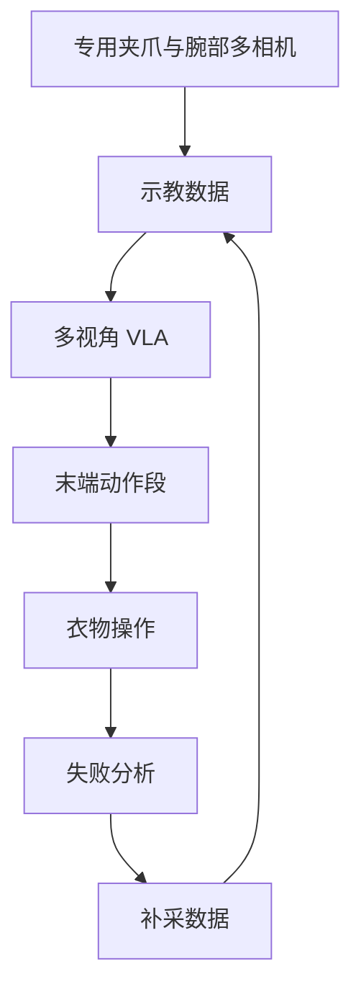

# TCAM（arXiv:2608.10718）

**TCAM**（*TCAM for Autonomous Deformable Manipulation: The RMC2 Champion System for WBCD 2026 Track 4*，[arXiv:2608.10718](https://arxiv.org/abs/2608.10718)）收录于 [多模空间 · 一周 VLA 研究趋势简析（2026.08.10–08.16）第二篇](../../sources/blogs/wechat_duomo_vla_weekly_trends_2026-08-10_part2.md) **末端操控** 段。

## 一句话定义

**衣物操作：专用夹爪、腕部多相机、示教数据与闭环失败分析补采，多视角 VLA 一次输出末端动作段，完成取放对齐抚平。**

## 英文缩写速查

| 缩写 | 英文全称 | 简要说明 |
|------|----------|----------|
| VLA | Vision-Language-Action | 视觉–语言–动作策略 |
| VLM | Vision-Language Model | 视觉–语言多模态模型 |
| RL | Reinforcement Learning | 强化学习 |
| CoT | Chain-of-Thought | 链式推理 |

## 为什么重要

- 柔性物体接触复杂，纯策略难全自主；TCAM 用硬件+数据+闭环微调组合。
- 策展机构：晨昏线科技（TermiTech）
- 开源结论：**待核实**（步骤 2.5，2026-10-01）。

## 流程总览

以下按本页已归纳的机制与资料绘制，表示模块或阅读路径关系。

## 核心机制

| 项 | 内容 |
|----|------|
| **arXiv** | [2608.10718](https://arxiv.org/abs/2608.10718) |
| **开源** | **待核实** |
| **文内评测** | WBCD 2026 Track 4 第一名；ARX X5 实机叠衣流程 |

## 源码运行时序图

**不适用**（截至入库日未提供可运行官方代码入口，或仓库尚无可辨识训练/推理入口）。

## 实验与评测

- **文内口径：** WBCD 2026 Track 4 第一名；ARX X5 实机叠衣流程
- **读法：** 本页为 [公众号策展](../../sources/blogs/wechat_duomo_vla_weekly_trends_2026-08-10_part2.md) 摘要；逐项指标以 **原文 PDF** 为准。

## 与其他工作对比

| 对照 | 差异读法 |
|------|----------|
| [第二篇技术地图](../overview/vla-weekly-trends-2026-08-10-part2-technology-map.md) | 同批 15 篇横向索引；本文属 **末端操控** |
| [VLA 方法页](../methods/vla.md) | 单篇机制细节以原文为准 |

## 结论

**TCAM 适合作为本期「末端操控」路线的快速索引页。**

1. 核心贡献：衣物操作：专用夹爪、腕部多相机、示教数据与闭环失败分析补采，多视角 VLA 一次输出末端动作段，完成取放对齐抚平。
2. 开源结论：**待核实** — 以项目页/仓库实际链接为准。
3. 横向对照见 [第二篇技术地图](../overview/vla-weekly-trends-2026-08-10-part2-technology-map.md)。

## 关联页面

- [VLA（Vision-Language-Action）](../methods/vla.md)
- [一周 VLA 趋势技术地图（第二篇）](../overview/vla-weekly-trends-2026-08-10-part2-technology-map.md)

## 参考来源

- [wechat_duomo_vla_weekly_trends_2026-08-10_part2.md](../../sources/blogs/wechat_duomo_vla_weekly_trends_2026-08-10_part2.md)
- [arXiv:2608.10718](https://arxiv.org/abs/2608.10718)

## 推荐继续阅读

- [VLA 方法页](../methods/vla.md)
- [arXiv PDF](https://arxiv.org/pdf/2608.10718)
