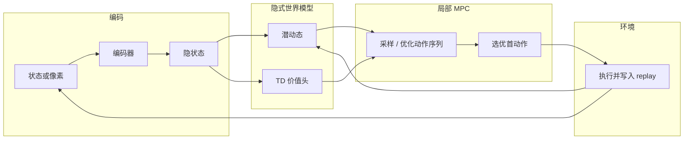
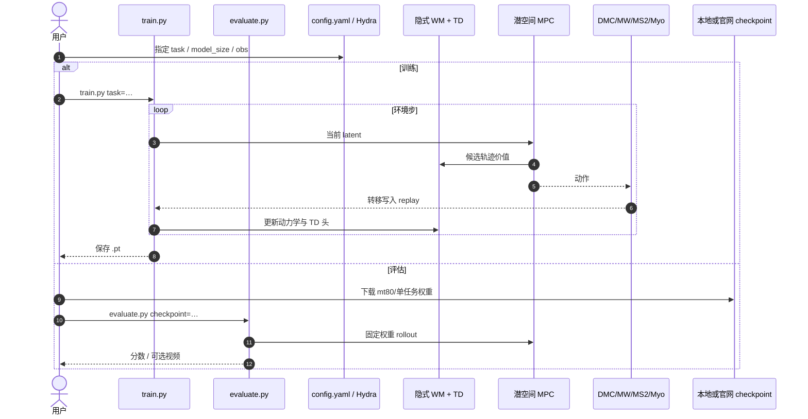

# TD-MPC2（Scalable, Robust World Models for Continuous Control）

**TD-MPC2**（[arXiv:2310.16828](https://arxiv.org/abs/2310.16828)，ICLR 2024 Spotlight，Nicklas Hansen、Hao Su\*、Xiaolong Wang\* · **加州大学圣地亚哥分校（UCSD）**；[项目页](https://www.tdmpc2.com)，[代码](https://github.com/nicklashansen/tdmpc2)）改进 TD-MPC：在 **解码器无关的隐式世界模型** 潜空间做局部轨迹优化，以 **同一套超参** 覆盖 **104** 连续控制任务，并展示百万至三亿参数级多任务扩展。

## 一句话定义

**可扩展、稳健的模型基连续控制算法：隐式 latent 世界模型 + TD 价值 + 局部 MPC，单超参跨域且能量随模型规模增长。**

## 英文缩写速查

| 缩写 | 英文全称 | 简要说明 |
|------|----------|----------|
| TD-MPC2 | Temporal Difference Learning for Model Predictive Control 2 | 本文算法 |
| MBRL | Model-Based Reinforcement Learning | 算法所属范式 |
| MPC | Model Predictive Control | 潜空间局部轨迹优化 |
| TD | Temporal Difference | 价值学习信号 |
| SAC | Soft Actor-Critic | 文中 model-free 对照 |
| DMC | DeepMind Control Suite | 评测域之一 |

## 为什么重要

- **稳健默认：** 相对需调参的 MBRL，TD-MPC2 强调 **零调参跨 104 任务** 仍强——工程可移植性高。
- **扩展曲线：** 明确报告模型/数据增大 → 多任务能力上升（至 317M / 80 任务）。
- **开源资产完整：** 代码 MIT + 大量 checkpoint + 亿级 transition 数据集，便于二次研究。
- **保真度坐标：** 与 Dreamer 同属 [低维潜状态族](../overview/world-model-physics-fidelity-outputs.md)；规划不依赖像素重建。

## 核心信息

| 字段 | 内容 |
|------|------|
| 论文 | TD-MPC2: Scalable, Robust World Models for Continuous Control |
| arXiv | [2310.16828](https://arxiv.org/abs/2310.16828) |
| 会议 | ICLR 2024 Spotlight |
| 机构 | 加州大学圣地亚哥分校（UCSD） |
| 任务 | 104（DMC / Meta-World / ManiSkill2 / MyoSuite） |
| 多任务 | 最多 80 任务；模型 1M–317M |
| 开源 | **已开源** · MIT · 权重与数据集已发布 |
| 代码 | [nicklashansen/tdmpc2](https://github.com/nicklashansen/tdmpc2) |

## 流程总览

## 核心原理 / 机制

### 隐式（decoder-free）世界模型

相对依赖像素重建的生成式 WM，TD-MPC2 的规划环主要在 latent 中完成：重点是 **对控制有用的转移与价值**，而非可视化帧。这与「画面好看」路线（如 [UniSim](./paper-unisim.md)）形成对照。

### TD + 局部轨迹优化

继承 TD-MPC：用时序差分学价值，在模型里对动作序列做局部优化（MPC），执行首步后重规划。TD-MPC2 系列改进提升稳定性与跨任务默认超参表现。

### 单超参与多任务扩展

论文核心卖点之一是 **同一超参集** 打通四域 104 任务；并进一步把单智能体扩到跨 embodiment / 动作空间的 80 任务设定，观察参数量缩放。

### 与 Dreamer / PlaNet 分界

- [PlaNet](./paper-planet-latent-dynamics.md)：显式 RSSM + CEM，偏经典规划。
- [DreamerV3](./paper-shenlan-wm-13-dreamerv3.md)：想象轨迹上训 actor-critic，通配超参。
- **TD-MPC2：** 隐式模型 + MPC；开源与多任务权重更「电池级」齐全。

## 工程实践

| 项 | 实践要点 |
|----|----------|
| 开源状态 | **已开源**（MIT）：代码 + 项目页 Models/Dataset。见 [`sources/repos/tdmpc2.md`](../../sources/repos/tdmpc2.md)。 |
| 单任务 | `python train.py task=dog-run steps=7000000`；评估 `evaluate.py` |
| 多任务 | `task=mt80` / `mt30`，`model_size={1,5,19,48,317}` |
| 像素 | DMControl 可用 `obs=rgb` |
| 资源 | 单任务 ≥12GB RAM；80-task 数据集训练建议 ≥128GB RAM；317M 训练 ≥24GB 显存 |
|  episodic | `episodic=true`（2025-04+）；默认关以保持旧结果可复现 |
| 选型 | 连续控制 MBRL 默认强候选；要视频可检模拟器看 UniSim 谱系，要 Minecraft/通配想象 RL 看 DreamerV3。 |

## 源码运行时序图

节点对齐 [`sources/repos/tdmpc2.md`](../../sources/repos/tdmpc2.md)。

- **最短复现：** Docker 或 `environment.yaml` → 下载单任务 ckpt → `evaluate.py` → 再 `train.py` 小步数冒烟。
- **多任务：** 先确认 RAM/磁盘；数据集体积 20–34GB 量级。

## 实验与评测

| 轴 | 报告口径（以论文 / 项目页为准） |
|----|--------------------------------|
| 104 任务 | vs SAC、DreamerV3、TD-MPC；单超参一致偏强 |
| 多任务缩放 | 1M→317M；80 任务与 30 任务子集 |
| 域 | DMControl、Meta-World、ManiSkill2、MyoSuite |
| 开源资产 | 324 ckpt 量级；545M/345M transitions |

## 结论

**TD-MPC2 把「隐式 latent WM + MPC」做成可扩展、默认可跑的连续控制底座，并配齐权重与数据释放。**

1. **Decoder-free** — 规划不绑像素重建质量。
2. **单超参 104 任务** — 降低 MBRL 调参税。
3. **规模定律可见** — 多任务能力随参数与数据上升。
4. **工程完整度高** — MIT 代码 + ckpt + dataset 适合二次开发。
5. **仍是潜状态族** — 评估物理保真需另加动作/动力学敏感性测试。
6. **对照** — 与 DreamerV3 争「通配默认」；与 UniSim 争「模拟器形态」。

## 局限与风险

- **连续控制仿真为主：** 不直接等于真机视频 WM。
- **多任务资源门槛高。**
- **隐式表示难可视化调试。**
- **大模型风险：** 论文亦讨论大规模 agent 的机会与风险，需负责任使用。

## 与其他工作对比

| 对比轴 | TD-MPC2 | [DreamerV3](./paper-shenlan-wm-13-dreamerv3.md) | [PlaNet](./paper-planet-latent-dynamics.md) | [World Models](./paper-ha-schmidhuber-world-models.md) |
|--------|---------|--------------------------------------------------|---------------------------------------------|--------------------------------------------------------|
| 决策 | 局部 MPC | 想象 actor-critic | CEM MPC | 小线性 C |
| 默认超参 | 104 任务单套 | 150+ 任务单套 | 需按实验设参 | 分阶段训 V/M/C |
| 开源完备度 | 代码+大量权重数据 | 公开 JAX 复现 | archived TF1 | 交互站+历史仓 |
| 机构 | UCSD | DeepMind 谱系 | Google Brain | Google Brain / IDSIA |

## 关联页面

- [世界模型物理保真度 × 输出轴](../overview/world-model-physics-fidelity-outputs.md)
- [Model-Based RL](../methods/model-based-rl.md)
- [Latent Imagination](../concepts/latent-imagination.md)
- [Generative World Models](../methods/generative-world-models.md)
- [World Models](./paper-ha-schmidhuber-world-models.md) · [PlaNet](./paper-planet-latent-dynamics.md) · [DreamerV3](./paper-shenlan-wm-13-dreamerv3.md) · [UniSim](./paper-unisim.md)
- [Online MBRL via Online Optimization](./paper-online-mbrl-robot-control.md) — HEAP 仿真中与本文对照的真机一阶 MBRL

## 参考来源

- [TD-MPC2 论文归档（arXiv:2310.16828）](../../sources/papers/tdmpc2_arxiv_2310_16828.md)
- [nicklashansen/tdmpc2 代码索引](../../sources/repos/tdmpc2.md)
- [tdmpc2.com 项目页归档](../../sources/sites/tdmpc2-com.md)
- [微信：世界模型物理保真度策展](../../sources/blogs/wechat_embodied_ai_lab_world_model_physics_fidelity.md)
- [Online MBRL 论文归档（对照实验提及）](../../sources/papers/online_mbrl_robot_control_arxiv_2510_18518.md)

## 推荐继续阅读

- [项目页](https://www.tdmpc2.com)
- [arXiv:2310.16828](https://arxiv.org/abs/2310.16828)
- [GitHub — nicklashansen/tdmpc2](https://github.com/nicklashansen/tdmpc2)
- [DreamerV3](./paper-shenlan-wm-13-dreamerv3.md) — 通配想象 RL 对照
- [Online MBRL via Online Optimization](./paper-online-mbrl-robot-control.md) — 真实轨迹一阶更新对照
