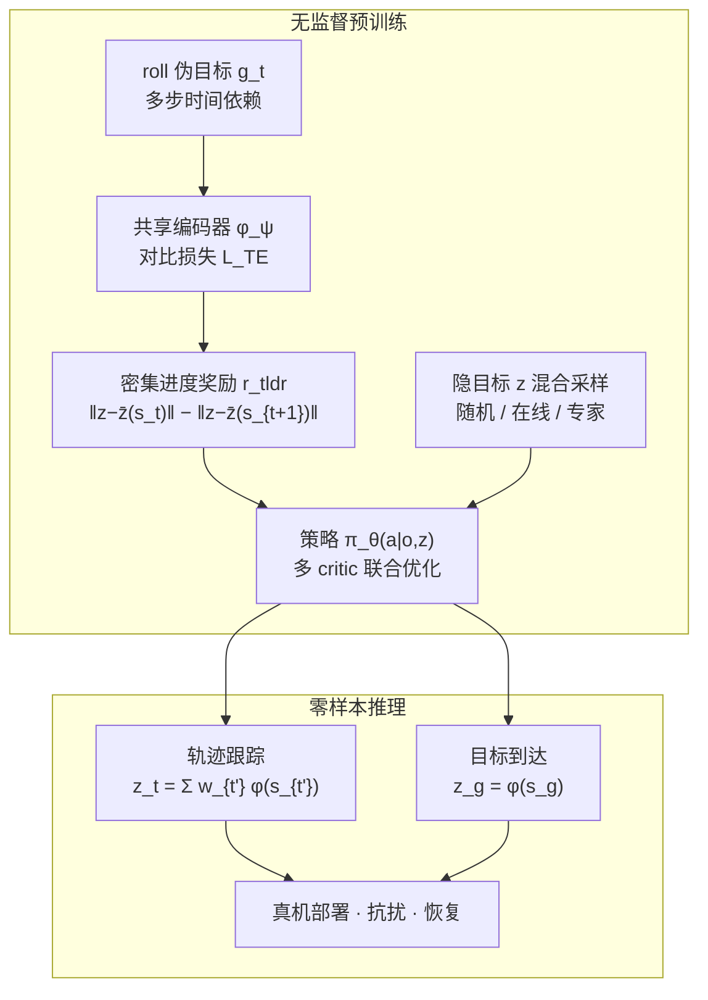

# TeCH：基于对比表征学习的时间距离建模，用于人形机器人全身控制

**TeCH**（*Temporal Distance modeling via Contrastive representation learning for Humanoid whole-body Control*，[RoboParty Lab 成果页](https://lab.roboparty.com/outputs/tech)）提出一种 **基于 TLDR 对比时间距离表征** 的无监督人形全身控制框架：在隐空间中建模时间可达性，用 **距离变化构造密集进度奖励**，以 off-policy 方式学习可 prompt 的统一策略，并 **零样本** 支持运动跟踪与离散目标到达。

> **工程落点：** 方法已集成于 [UFO](./roboparty-ufo.md)（MJLab backend）；与 [BFM-Zero](./paper-bfm-zero.md) 的 FB 表征形成 **同框架不同表征** 的对照线。

## 英文缩写速查

| 缩写 | 英文全称 | 简要说明 |
|------|----------|----------|
| TeCH | Temporal Distance modeling via Contrastive RL for Humanoid WBC | 本文无监督人形全身控制方法 |
| TLDR | TemporaL Distance Representation | 对比学习时间可达性的无监督 RL 范式 |
| FB | Forward–Backward Representation | BFM-Zero 等使用的值分解潜空间 |
| BFM | Behavior Foundation Model | 可复用、可 prompt 的身体运控基座 |
| WBC | Whole-Body Control | 全身协调控制 |
| EMD | Earth Mover's Distance | 动作分布匹配消融指标 |

## 为什么重要

- **补 TLDR 人形落地空白：** [TLDR](https://arxiv.org/abs/2407.08464) 在对比时间距离表征上已验证，但 **真实人形全身控制** 上的系统评测此前不足；TeCH 给出与 [BFM-Zero](./paper-bfm-zero.md)、[SONIC](./paper-sonic.md) 的 **首套人形无监督 RL 对照**。
- **相对 FB 的结构性优势：** FB 依赖 **linear MDP** 假设，在富接触高维人形上易表征退化；TeCH 直接优化时间距离目标，**全局根部旋转漂移** 明显优于 BFM-Zero（页面展示快速 360° 旋转）。
- **训练成本数量级差异：** 页面称 **单卡 GPU + 数小时 LAFAN1** 即可训练，相对 SONIC **128 GPU × 3 天** 降近 **两个数量级** GPU 小时与环境样本。
- **零样本双任务接口：** 同一预训练策略无需微调即可做 **轨迹跟踪**（滑动窗口聚合隐条件）与 **不连续目标到达**（单点隐嵌入）——纯跟踪方法（如 SONIC）在姿态跳变上挣扎。
- **真机鲁棒性信号：** 外力扰动、跌倒后可自主站起；与 BFM-Zero 同属无监督探索覆盖的非标准状态，优于依赖模仿监督的跟踪器。

## 流程总览

## 核心机制（归纳）

### 1）时间距离表征学习

- 对 $(s_t, s_{t+1})$ 构造 $g_t = \mathrm{roll}(s_{t+1})$，超越单步相邻性建模 **多步动力学**。
- 编码器 $\phi_\psi$ 将 $s_t, s_{t+1}, g_t$ 映射到统一隐空间；$L_{TE} = -J_{dist}(\phi_x, \phi_g) + \lambda C_{step}(\phi_x, \phi_y)$ 分离远距离状态对并平滑相邻步。
- **与 FB 差异：** 不分解 forward/backward successor measure，避免间接分解带来的 **全局相位与根部漂移** 近似误差。

### 2）密集进度奖励与探索

- $r_{tldr}$ 衡量朝隐目标 $z$ 的 **逐步接近**——正奖励当下一隐状态更近目标。
- 隐变量 $z$ 来自 **高斯/超球随机**、**当前策略可达目标**、**专家轨迹嵌入** 三源混合。
- TeCH 额外按 **时间可达性估计** 动态调整目标采样：早期偏远距离探索，后期聚焦高回报区域。

### 3）真机迁移组件

遵循 BFM-Zero 实践：**非对称训练**（特权 critic）、**域随机化**、**辅助稳定性/限位/动作变化率** 目标、**风格判别器** 对齐人类运动分布。

### 4）零样本下游接口

| 任务 | 隐条件构造 | 特点 |
|------|------------|------|
| **目标到达** | $z_g = \phi(s_g)$ | 支持躺→坐→站等不连续恢复 |
| **轨迹跟踪** | 前瞻窗口加权聚合 $\phi(s_{t'})$ | 比 FB 更紧的逐步跟踪行为 |

> TeCH **不提供** FB 式统一值函数奖励优化接口；优势在 **时间可达性显式编码** 带来的跟踪紧致性。

## 实验与评测

> 以下数字摘自 [RoboParty Lab 成果页](https://lab.roboparty.com/outputs/tech)；同行评审版以正式论文为准。

### 平台与数据

| 项 | 设置 |
|----|------|
| 仿真 | IsaacLab · **Unitree G1**（29 DoF）；200 Hz / 50 Hz 控制 |
| 训练集 | LAFAN1（~40 段，重定向 G1） |
| 测试集 | 100-Style（3–4k 段） |
| 指标 | 关节 MAE $E_{mae}$；消融用 EMD |

### 运动跟踪（$E_{mae}$ ↓）

| 方法 | LAFAN1 | 100-Style |
|------|--------|-----------|
| SONIC | 0.2916 ± 0.1887 | 0.1522 ± 0.1049 |
| SONIC (TER.) | 0.1081 ± 0.0213 | 0.1355 ± 0.0351 |
| BFM-Zero | 0.1510 ± 0.0255 | 0.1674 ± 0.0459 |
| **TeCH** | **0.1318 ± 0.0329** | **0.1474 ± 0.0405** |

- TeCH 全轨迹指标 **优于 SONIC 全轨迹**；与 SONIC (TER.) **相当或略优**。
- 分布外扰动/跌倒后，TeCH 与 BFM-Zero 更能恢复并继续跟踪。

### 目标到达

- 21 个 LAFAN1 稳定姿态上，与 BFM-Zero **精度相当**，TeCH **到达更高效**。
- 支持躺姿→坐立→站立等 **不连续过渡**。

### 真机与表征质量

- 高动态跟踪、目标到达、**大外力推搡后自主站起**（SONIC 难从跌倒恢复）。
- **随机隐采样** rollout 产生连贯类人运动；**线性隐插值** 对应平滑物理一致轨迹。

### 默认超参（消融收敛）

- 隐维度 **D=256**；编码器 **lr=8×10⁻⁷**；**update-z-every=10**。

## 局限与风险

- **运动平滑性：** 时间距离目标优先 **最少转移步数**，真机响应可能比 BFM-Zero（风格判别器）更 **激进、略不平滑**。
- **无奖励优化接口：** 不能像 FB 那样统一做 arbitrary reward inference；任务边界需认清。
- **发布形态：** 截至入库日以 Lab 成果页为主；**arXiv / 独立代码仓库** 须以官方后续发布为准。
- **对比口径：** SONIC 使用 128 GPU 与更大数据；硬件与 early-termination 设定不同，跨论文比 wall-clock 须注明条件。

## 关联页面

- [UFO（Roboparty）](./roboparty-ufo.md) — 工程集成与复现入口
- [RoboParty Lab / Party OS 技术地图](../overview/roboparty-lab-party-os-technology-map.md)
- [BFM-Zero](./paper-bfm-zero.md) — FB 表征姊妹线
- [SONIC](./paper-sonic.md) — 监督跟踪规模化基线
- [行为基础模型](../concepts/behavior-foundation-model.md)
- [BFM 01 Forward-backward 表征](../overview/bfm-category-01-forward-backward-representation.md)
- [Unitree G1](./unitree-g1.md)

## 参考来源

- [roboparty_lab_tech_humanoid_control.md](../../sources/sites/roboparty_lab_tech_humanoid_control.md)
- [roboparty_ufo.md](../../sources/repos/roboparty_ufo.md)
- [wechat_roboparty_lab_party_os_3_tools.md](../../sources/blogs/wechat_roboparty_lab_party_os_3_tools.md)

## 推荐继续阅读

- [TeCH 成果页（RoboParty Lab）](https://lab.roboparty.com/outputs/tech)
- [UFO GitHub](https://github.com/Roboparty/UFO)
- [TLDR 原论文](https://arxiv.org/abs/2407.08464)
- [BFM-Zero 论文笔记（姊妹仓库）](https://imchong.github.io/Humanoid_Robot_Learning_Paper_Notebooks/papers/04_Loco-Manipulation_and_WBC/BFM-Zero__Promptable_Behavioral_Foundation_Model_for_Humanoid_Control_Using_Unsupervised_RL/BFM-Zero__Promptable_Behavioral_Foundation_Model_for_Humanoid_Control_Using_Unsupervised_RL.html)
