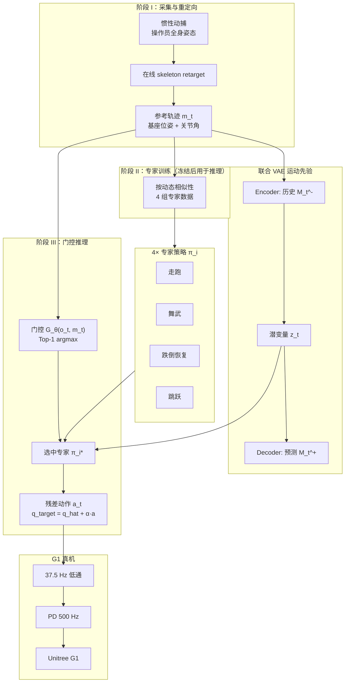

# TeleGate

**TeleGate**（*Whole-Body Humanoid Teleoperation via Gated Expert Selection with Motion Prior*，USTC 等，arXiv:2602.09628，**RSS 2026**）提出 **实时全身人形遥操作** 统一框架：按动态相似性训练 **4 组冻结专家策略**，用 **轻量门控网络 Top-1 路由** 替代把多专家 **蒸馏进单网络**；并用 **VAE 从历史参考轨迹推断隐式未来运动意图**，补偿遥操作场景 **拿不到未来参考** 的信息缺口。在 **Unitree G1** 上仅用 **2.5 小时** 与部署一致的 **惯性动捕** 数据，即可跟踪跑跳、跌倒恢复、踢球等高动态动作。

## 英文缩写速查

| 缩写 | 英文全称 | 简要说明 |
|------|----------|----------|
| TeleGate | — | 门控专家选择 + 运动先验的全身遥操作框架 |
| VAE | Variational Autoencoder | 从历史参考编码未来运动潜变量 $z_t$ |
| PPO | Proximal Policy Optimization | 专家与门控网络的 RL 训练算法 |
| MoE | Mixture-of-Experts | 对比路线：GMT 等联合训练 MoE vs 本文冻结专家 + 门控 |
| DoF | Degrees of Freedom | G1 全身 29 维关节残差控制 |
| PD | Proportional-Derivative Control | 参考 + 残差动作 → 关节力矩低层执行 |
| SR | Success Rate | 全程跟踪误差低于阈值的轨迹比例 |

## 核心信息

| 字段 | 内容 |
|------|------|
| 机构 | 中国科学技术大学（USTC）、芜湖哈特机器人技术研究院；项目页 **AnyWit Research** |
| 平台 | Unitree G1（29 DoF）；MuJoCo 训练 |
| 输入 | 惯性动捕 → 在线 skeleton retarget 参考轨迹 |
| 控制频率 | 策略 50 Hz；PD / retarget 500 Hz；输出经 37.5 Hz 低通 |
| 数据 | **2.5 h** 自采惯性动捕（走/跑/舞/武/跌倒恢复/跳六类） |
| 数据集 | 研究用途开放（需签 permission form，邮件 research@anywit.cn） |

## 为什么重要

- **遥操作低层的「多技能不蒸馏」路线：** 相对 TWIST 类 **统一 tracking 策略** 与 Any2track 类 **DAgger 蒸馏专家**，TeleGate 用 **冻结专家 + 门控选择** 保留各域决策边界，仿真 SR **97.3%**（Table II），显著高于 TWIST（68.9%）与蒸馏基线（91.2%）。
- **数据效率对照 SONIC：** 相对 **700 h** 规模化 tracking（SONIC），仅用 **2.5 h** 且采集设备与部署一致，靠 **专家划分 + 课程采样** 实现高动态泛化——适合 **便携惯性动捕** 部署场景。
- **实时遥操作的预判模块：** 跳跃、趴地起身等动作在 **无未来参考** 时难跟踪；**非对称 VAE**（encoder 读 $M_t^-$，decoder 重建 $M_t^+$）与专家 **联合训练**，使 $z_t$ 语义对齐控制需求（+VAE 将 SR 从 96.7% 提到 97.3%）。
- **与 PILOT MoE 正交：** [PILOT](./paper-pilot-perceptive-loco-manipulation.md) 的 MoE 服务 **感知 loco-manipulation LLC**；TeleGate 的门控解决 **多类动态运动跟踪/遥操作**，不替代上层 VR 接口或 VLA。

## 流程总览

## 核心机制（归纳）

### 1）专家划分与门控（vs 蒸馏 / 联合 MoE）

| 路线 | 机制 | 论文结论（同 2.5 h 数据） |
|------|------|---------------------------|
| 单策略 | 一个 PPO 学全部动作 | SR 94.7%，$E_{mpjpe}$ 最差（24.25 mm） |
| DAgger 蒸馏 | 多专家 → 单网络 | SR 91.2%，蒸馏有损 |
| GMT MoE | 端到端联合训练 | SR 92.0%，关节误差高 |
| **TeleGate Top-1** | **冻结专家 + 门控路由** | SR **97.3%**，接近 Oracle（96.3%） |

六类动捕数据按动态相似性并入 **4 专家**：走跑、舞武、跌倒恢复、跳跃。门控输入 **本体态 + 当前参考**，**不做 Top-2 加权融合**（子优专家会干扰决策）。

### 2）VAE 运动预测先验

- 历史窗 $M_t^-=\{m_{t-20},m_{t-10},m_{t-5},m_{t-1},m_t\}$：**非均匀稀疏采样**，兼顾瞬时动态与长期趋势。
- VAE 与专家 **同一 PPO 目标联合优化**（非先训 VAE 再冻结），避免 $z_t$ 与策略语义脱节。
- 潜维度 $d=32$；部署时仅用 encoder 输出 $z_t$，不访问真实未来 $M_t^+$。

### 3）训练与 sim2real

- **MuJoCo** + 非对称 actor-critic（critic 可见特权与未来参考）。
- **失败率课程采样**：难 clip 权重上调，聚焦高难动作。
- **域随机化**：外推扰动、观测噪声、PD 增益、摩擦等。

## 实验要点

| 设置 | 要点 |
|------|------|
| 仿真对比 | vs TWIST、Any2track、GMT（Table II）；TeleGate 全面领先 |
| 门控消融 | Top-1 优于蒸馏、Top-2 融合、随机划分（Table III） |
| VAE 消融 | +VAE 全面提升 SR 与关节误差（Table IV） |
| 切换平滑 | 专家切换时目标关节变化 3.49°/frame，仍可接受 |
| 真机 | 抓放、立定跳、趴地起身、踢球、侧滑、单脚跳等（项目页视频） |

## 常见误区或局限

- **误区：「门控 = 普通 MoE 换名」。** GMT 式 **联合训练 MoE** 在论文中关节误差显著更差；TeleGate 关键是 **专家独立训满再冻结**，门控只做 **离散路由**，避免梯度冲突。
- **误区：「2.5 h 可替代一切大数据」。** 数据与 **惯性动捕管线强绑定**；换光学 AMASS 或 VR 稀疏 keypoint 需重训，分布偏移明显（论文 §V-A2）。
- **误区：「TeleGate 已解决上层遥操作接口」。** 本文聚焦 **低层全身跟踪 LLC**；VR/外骨骼/无机器人采集等仍见 [Teleoperation](../tasks/teleoperation.md) 其他系统。
- **局限：** 入库时 **无公开代码**；数据集需邮件审批；**RSS 2026** 接收状态以官方为准；未来工作提及用遥操作数据训 **自主策略**。

## 与其他页面的关系

- 便携采集 + tracking：[TWIST2](./paper-twist2.md)、[TWIST](./paper-twist.md)
- 大规模 tracking：[SONIC 方法页](../methods/sonic-motion-tracking.md)
- 蒸馏统一多接口：[BFM 相关论文与 teleoperation 任务页](../tasks/teleoperation.md)
- 感知 MoE LLC（不同问题）：[PILOT](./paper-pilot-perceptive-loco-manipulation.md)
- 重定向：[Motion Retargeting](../concepts/motion-retargeting.md)
- 任务：[Teleoperation](../tasks/teleoperation.md)

## 参考来源

- [telegate-project.md](../../sources/sites/telegate-project.md) — 官方项目页与数据集申请
- [telegate_arxiv_2602_09628.md](../../sources/papers/telegate_arxiv_2602_09628.md) — arXiv 方法与实验摘录
- 论文：<https://arxiv.org/abs/2602.09628>

## 推荐继续阅读

- [TeleGate 项目页](https://anywitresearch.github.io/TeleGate/)
- [机器人论文阅读笔记：TeleGate](https://imchong.github.io/Humanoid_Robot_Learning_Paper_Notebooks/papers/07_Teleoperation/TeleGate__Whole-Body_Humanoid_Teleoperation_via_Gated_Expert_Selection_with_Motion_Prior/TeleGate__Whole-Body_Humanoid_Teleoperation_via_Gated_Expert_Selection_with_Motion_Prior.html)
- [TWIST2（便携全身采集对照）](./paper-twist2.md) — arXiv:2511.02832
- [SONIC（规模化 tracking 对照）](../methods/sonic-motion-tracking.md)
- [Teleoperation 任务页](../tasks/teleoperation.md) — 全身遥操作系统横向表
