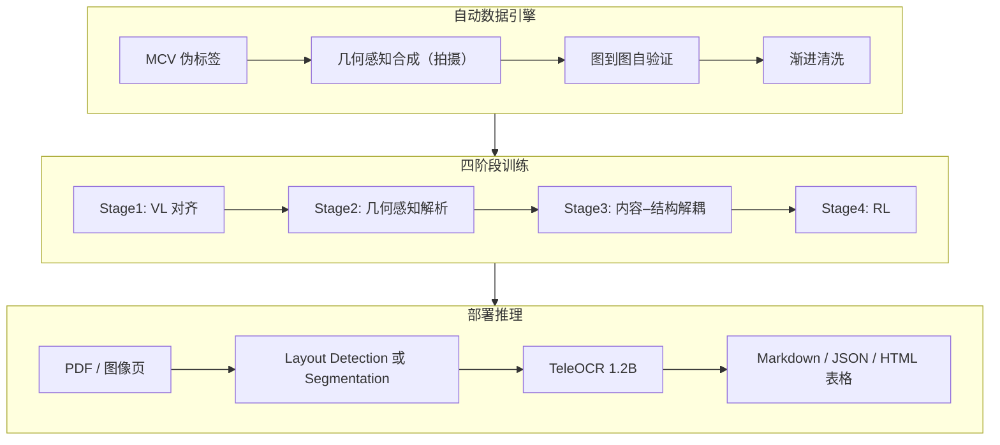
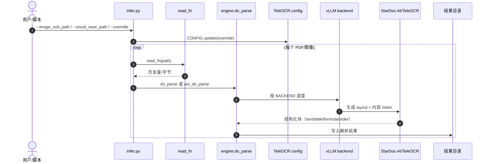

# TeleOCR（arXiv:2608.12898）

**TeleOCR**（*Navigating Document Parsing Across Digital and Camera-Captured Documents*，[arXiv:2608.12898](https://arxiv.org/abs/2608.12898)）是 **中国电信人工智能（TeleAI）** 团队发布的 **~1.2B** 开源 **文档视觉–语言模型**：在 **同一框架** 内处理 **数字 PDF** 与 **手机拍摄几何畸变文档**，输出结构化文本、公式（LaTeX）、表格（OTSL→HTML）与阅读顺序。2026-09-10 起由 **NaviDC-OCR** 更名为 **TeleOCR**。

## 一句话定义

**用变形感知 VLM + 内容–结构解耦训练，把「版面检测级联」和「端到端幻觉」两条旧路线的短板，压进 1.2B 可部署文档解析器里。**

## 英文缩写速查

| 缩写 | 英文全称 | 简要说明 |
|------|----------|----------|
| VLM | Vision-Language Model | 视觉–语言多模态模型 |
| OCR | Optical Character Recognition | 光学字符识别；此处含版面+结构解析 |
| MCV | Multi-node Consensus Voting | 多模型共识投票生成伪标签 |
| CGDP | Curvature-Guided Douglas-Peucker Sampling | 曲率引导的复杂版面采样 |
| OTSL | — | 表格结构线性化格式，可转 HTML |
| TEDS | Tree Edit Distance based Similarity | 表格结构相似度指标 |

## 为什么重要

- **统一数字/拍摄场景：** 多数专用 OCR-VLM 只优化其一；Wild-OmniDocBench / PureDocBench **真实退化** 轨上 TeleOCR 仍领先同量级 **MinerU / PaddleOCR-VL**。
- **轻量可部署：** **1.2B** 在 OmniDocBench v1.6 **Overall 96.87**，超过多数 **3B–4B** 专用模型与部分 **通用大 VLM**。
- **机器人/知识库侧读法：** 设备手册、SOP PDF、现场拍照页的可机器读结构化，是 [Auto-labeling Pipelines](../methods/auto-labeling-pipelines.md) 与 [LLM Wiki 资料 ingest](../references/llm-wiki-karpathy.md) 的 **上游 OCR**，不等同于轨迹语义标注。
- **工程闭环完整：** [GitHub](https://github.com/caipeng328/TeleOCR) 推理栈 + [HF 权重](https://huggingface.co/StarDoc-AI/TeleOCR) + [TeleAI 在线 demo](https://www.teleai.com.cn/docparse/documentParsing)。

## 核心信息

| 项 | 内容 |
|----|------|
| **机构** | 中国电信人工智能（TeleAI）/ StarDoc-AI |
| **arXiv** | [2608.12898](https://arxiv.org/abs/2608.12898) |
| **代码** | <https://github.com/caipeng328/TeleOCR> |
| **权重** | <https://huggingface.co/StarDoc-AI/TeleOCR> |
| **在线体验** | <https://www.teleai.com.cn/docparse/documentParsing> |
| **参数量** | ~1.2B |
| **开源状态** | **已开源**（推理代码 + 权重；训练数据引擎以论文/ README 描述为主） |

## 流程总览

## 核心原理

1. **变形感知：** 拍摄文档的弯曲/透视作为 **显式几何信号** 进入 VLM，而非先独立 dewarp 再 OCR（DocUNet/DIR300 可视化验证）。
2. **CGDP 采样：** 复杂版面用曲率引导 Douglas-Peucker 式采样，控制高分辨率 token 预算。
3. **内容–结构解耦：** 公式按文法、表格按 **OTSL** 结构单独建模，减轻端到端「一口气生成」的结构幻觉。
4. **MCV + 自验证：** 异构教师共识出伪标，渲染回图像做 **自验证** 过滤噪声 — 支撑 **少人工标注** 的大规模训练叙述。
5. **底座：** 继承 **Qwen2.5-VL / Qwen3** 与 **MinerU** 生态工具链。

## 源码运行时序图

官方批量推理入口为 `infer.py` → `TeleOCR/engine.py`（vLLM 后端加载 HF 权重）。

单页 **Transformers** 路径见 HF README：`AutoProcessor` + `AutoModel.generate`，按任务 prompt 分别抽 text / OTSL table / LaTeX formula / layout JSON。

## 工程实践

| 检查项 | 建议 |
|--------|------|
| 快速试用 | [TeleAI docparse](https://www.teleai.com.cn/docparse/documentParsing) 上传样例，再决定是否本地 GPU |
| 本地批处理 | `pip install -e .`；`infer.py` + `model_path=StarDoc-AI/TeleOCR`；CUDA + **vLLM** |
| 退化/拍摄集 | Wild-OmniDocBench、PureDocBench **real degraded** 建议 `LAYOUT_MODE=Segmentation`（作者 README） |
| 评测复现 | 使用 **OmniDocBench v1.6 Docker** 口径对比表格，避免混用旧版 metric |
| 品牌迁移 | 旧权重 [NaviDC-OCR](https://huggingface.co/StarDoc-AI/NaviDC-OCR) 与 2026-09-10 后 **TeleOCR** 命名并存 — 新部署优先 TeleOCR id |
| 训练复现 | 仓库以 **推理** 为主；四阶段训练与完整数据引擎 **未** 作为一键脚本发布 |

## 实验与评测读法

- **OmniDocBench v1.6：** TeleOCR **96.87** Overall、**97.05** Table TEDS — 专用 VLM 中综合第一；Text Edit **0.027** 略逊于 OvisOCR2 **0.025**。
- **Wild-OmniDocBench：** **88.53** Overall，**Decoupled VLM** 组第一，领先 MinerU2.5-Pro / PaddleOCR-VL-1.6。
- **PureDocBench：** Clean **86.90**；**Real Degraded Overall 70.85** 领先同组 DotsMOCR、MinerU 等 — 支持「拍摄退化」叙事。
- **Dr.DocBench Challenge：** 自报 **67.96** overall > MinerU 2.5 pro；formula CDM 仍低（**0.02**）— 竞赛轨与 OmniDoc 主榜 **不可直接混读**。
- **ICDAR 2026 Sci-ImageMiner：** 榜单 **#1**（Weighted **41.81**）。

## 与其他工作对比

| 维度 | TeleOCR | 对照 |
|------|-------------|------|
| 识别对象 | 数字 PDF + 手机拍摄畸变文档的结构化解析（文本 / 公式 LaTeX / 表格 OTSL / 阅读顺序） | [RPDF / Scanford](./paper-scanford-robot-powered-data-flywheel.md)：图书馆书脊识别，困难英 / 中 OCR 作为域邻接评测（+21.8 / +7.2 pp，数值摘自该页论文摘录） |
| 训练数据来源 | MCV 多模型共识伪标 + 渲染回图自验证 + 几何感知合成，少人工标注 | [RPDF / Scanford](./paper-scanford-robot-powered-data-flywheel.md)：野外部署机器人边执行任务边自动采集、策展数据并持续微调 VLM |
| 在机器人数据栈中的位置 | 手册 / SOP / 论文 PDF 的上游 OCR，输出供知识库 ingest | [Auto-labeling Pipelines](../methods/auto-labeling-pipelines.md)：VLM 为原始机器人轨迹生成文本描述与成功率标签，属轨迹语义标注 |

## 结论

**TeleOCR 把文档解析从「要么级联版面、要么端到端胡编」推进到「1.2B 统一数字+拍摄、且开源可跑」的实用点。**

1. **OmniDocBench v1.6 Overall 96.87** 是可引用的主榜锚点；对比时注明 **Docker v1.6** 口径。
2. **拍摄/退化文档** 优先看 Wild-OmniDocBench 与 PureDocBench real 轨，并尝试 **Segmentation** layout 模式。
3. **公式** 在 Dr.DocBench 自报仍弱 — 科学 PDF 公式密集场景需 **实测** 而非只看 Overall。
4. **部署路径清晰：** TeleAI demo → HF 单页 → GitHub `infer.py` + vLLM 批处理。
5. **训练复现** 不要默认与推理同级 — 数据引擎描述在论文/README，代码以 **infer** 为准。
6. **与机器人栈关系：** 适合 **手册/SOP/论文 PDF 结构化** 前置，不替代 egocentric **VLM 轨迹标注**。

## 局限与风险

- **公式 CDM** 在部分赛道仍明显低于表格/text — 公式-heavy 文档需单独 benchmark。
- **vLLM / CUDA** 依赖重；边缘端需社区 GGUF/Ascend 等 **非官方** 路径。
- **Decoupled vs End-to-End** 分类随竞品更新变化 — 引用表格时注意 **Model Type** 列。
- **TeleAI 在线服务** 与开源权重版本可能 **不同步** — 生产以 pinned HF revision 为准。

## 关联页面

- [Auto-labeling Pipelines](../methods/auto-labeling-pipelines.md)
- [LLM Wiki（Karpathy）](../references/llm-wiki-karpathy.md)
- [VLA](../methods/vla.md)（VLM 上游能力谱系）

## 参考来源

- [teleocr_arxiv_2608_12898.md](../../sources/papers/teleocr_arxiv_2608_12898.md)
- [teleocr.md](../../sources/repos/teleocr.md)
- [teleai-docparse.md](../../sources/sites/teleai-docparse.md)
- [arXiv:2608.12898](https://arxiv.org/abs/2608.12898)

## 推荐继续阅读

- [TeleOCR GitHub](https://github.com/caipeng328/TeleOCR)
- [StarDoc-AI/TeleOCR on Hugging Face](https://huggingface.co/StarDoc-AI/TeleOCR)
- [OmniDocBench](https://github.com/opendatalab/OmniDocBench)
