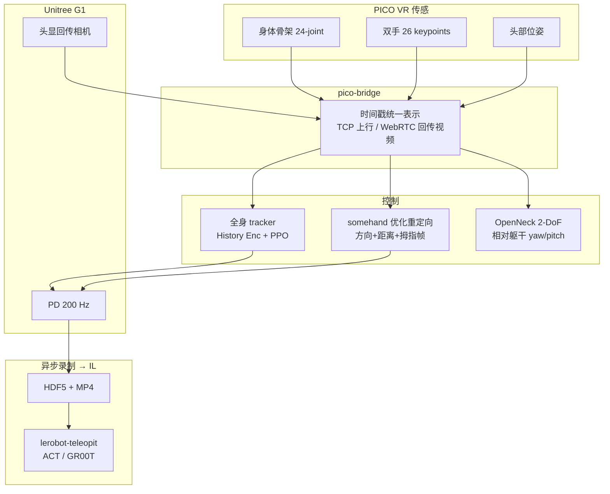
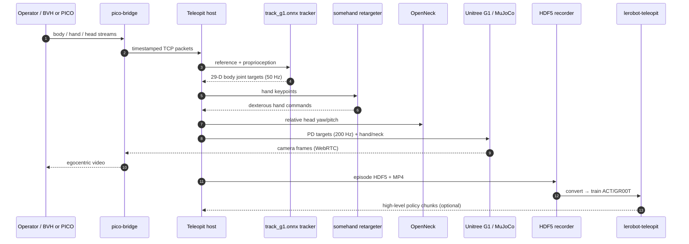

# Teleopit

**Teleopit**（*A Full-Embodiment Humanoid Teleoperation System*，西湖大学 / 上海创智学院，arXiv:2608.01834）用 **PICO VR** 作为统一操作员意图源，在 **Unitree G1** 上同时提供 **动态可行全身跟踪、连续跨形态灵巧手控制与 2-DoF 主动视点**，并以异步 runtime 连接传感、控制、视觉反馈与录制。跟踪侧在 **mjlab** 中用 PPO 训练，配合 **History Encoder** 与 **failure-aware rewind sampling**；手侧重用 **归一化指方向 + 指尖距离 / 拇指帧** 目标做在线优化重定向。官方五仓栈见项目页；主实现 [BotRunner64/Teleopit](https://github.com/BotRunner64/Teleopit)。

## 英文缩写速查

| 缩写 | 英文全称 | 简要说明 |
|------|----------|----------|
| Teleopit | Full-Embodiment Humanoid Teleoperation | 本文系统：VR→全身+灵巧手+视点 |
| VR | Virtual Reality | PICO 提供身体 / 手 / 头统一传感 |
| PPO | Proximal Policy Optimization | 全身 tracker 在 mjlab 中的 RL 算法 |
| MPJPE | Mean Per-Joint Position Error | 跟踪姿态误差（持出 mocap/PICO） |
| SR | Success Rate | 10 s 窗口滚出未提前终止的比例 |
| ACT | Action Chunking with Transformers | 96 条 Teleopit 演示上的模仿策略之一 |
| GR00T | Generalist Robot 00 Technology | N1.7 在同数据集上的 VLA 策略 |
| PD | Proportional-Derivative Control | 50 Hz 策略目标 → 200 Hz 关节跟踪 |

## 核心信息

| 字段 | 内容 |
|------|------|
| 机构 | 西湖大学（Westlake University）、上海创智学院（Shanghai Innovation Institute）；通讯 Xiangru Huang |
| 平台 | Unitree **G1**（29 DoF）；LinkerHand 等灵巧手；**OpenNeck** 2-DoF 主动颈 |
| 输入 | PICO：24-joint body + 每手 26 keypoints + head pose |
| 输出 | 身体关节目标 + 灵巧手命令 + 2-DoF 视点；策略 **50 Hz**，PD **200 Hz** |
| 仿真 | **mjlab**；8×A800、65536 并行 env，约 **50 h** 训练 |
| 下游 | 瓶放置任务：**96** 条成功演示 → ACT **90.0%** / GR00T N1.7 **95.0%**（各 20 trial） |
| 代码 | [Teleopit](https://github.com/BotRunner64/Teleopit) + [somehand](https://github.com/BotRunner64/somehand) + [pico-bridge](https://github.com/BotRunner64/pico-bridge) + [OpenNeck](https://github.com/BotRunner64/OpenNeck) + [lerobot-teleopit](https://github.com/BotRunner64/lerobot-teleopit) |

## 为什么重要

- **填「VR 全身体 + 连续灵巧手」缺口：** 论文对照 [TWIST2](./paper-twist2.md)（全身与主动视觉完备，手常作离散夹爪）与 HumDex（连续灵巧手但依赖定制惯性衣/手套）——Teleopit 坚持 **单一 VR 传感** 覆盖身体、手与头。
- **跟踪面向 live VR 而非仅干净 mocap：** History Encoder（H=10）补单帧缺失的动量/接触上下文；failure-aware rewind 把失败前片段反复练，而不是另建难度模型。持出集上 mocap SR **91.7%**、PICO SR **100.0%**，高于 TWIST2 / SONIC / HoloMotion 同表基线。
- **跨手重定向可迁移：** 归一化指方向去掉骨长尺度；新手只需语义 link 映射，共享目标权重与求解器——工程上对应独立仓 [somehand](https://github.com/BotRunner64/somehand)。
- **采数到自主闭环可复现：** 异步录制 + [lerobot-teleopit](https://github.com/BotRunner64/lerobot-teleopit) 转 LeRobot Dataset；同任务 96 条演示即可训 ACT/GR00T。亦被 [OASIS](./paper-loco-manip-04-oasis.md) 用作仿真 teleop 低层 WBC，被 [MimicLite](./mimiclite.md) 列入跨 codebase 部署策略。

## 流程总览

## 核心机制（方法）

### 1）全身运动跟踪

- Actor 吃可部署观测（参考关节位姿/速度、锚点姿态、本体、投影重力、上一步动作）+ **H=10** 历史经 Conv1d 与全局平均池化后的隐变量；Critic 训练期额外吃全局锚点位置、基座线速度与 14 个跟踪 link 位姿。
- 动作 29 维残差 → 相对默认姿态的关节目标，再由 PD 跟踪；奖励含锚点/身体/关节跟踪与腕掌点（服务下游手控制），并惩罚动作变化、关节限位、自碰与踝加速度。
- **Failure-aware rewind：** 提前终止时高概率保留该 clip，并把参考时间回拨随机偏移，强化失败前过渡。

### 2）优化灵巧手重定向

| 目标 | 作用 |
|------|------|
| Direction | 归一化指段方向对齐，去掉人–机骨长尺度 |
| Distance | 拇指–指尖距离，保 pinch 闭合 |
| Thumb-frame | 拇指坐标系，保对掌几何 |

共享权重、激活阈值与求解器设置；换手只需语义 link 映射。Table 8 在 Dex5、Inspire DFQ、LinkerHand L20/L6、Rohand、Sharpa Wave 等上报告方向/关键点/距离误差与求解时延。

### 3）主动视觉与异步集成

- 头相对躯干的朝向 → deadzone + 指数平滑 → yaw/pitch；约 **CNY 500** 级 2-DoF 机构（OpenNeck）。
- 传感、手优化、视点、身体策略、机器人通信、视频与录制分进程按各自频率运行，避免单流拖垮全局。

## 源码运行时序图

主仓已开源且 README 给出 sim2sim / 资产下载 / 策略路径；运行时序对齐 `scripts/run/run_sim.py` 与配套仓：

复现最短路径：`download_assets.py` 拉取 robots/gmr/ckpt/bvh → `run_sim.py` 加载 `ckpt/track_g1.onnx`；真机与录制见官方文档与 v0.5.0 changelog。IL 路径走 `lerobot-teleopit` 的 `convert_dataset.py` / `train_policy.py`，机载仍由 Teleopit 执行。

## 工程实践

| 项 | 要点 |
|----|------|
| 安装 | `pip install -e .`；ModelScope 拉资产 |
| 烟测 | `run_sim.py` + sample BVH + `track_g1.onnx` |
| 变体 | `g1_29dof_neck_o6.xml` ↔ `track_g1_neck_o6.onnx` |
| 手 | somehand YAML：`configs/retargeting/{left,right,bihand}` |
| 采数格式 | `schema.json` + `episodes.jsonl` + per-episode HDF5（v0.4 旧属性 HDF5 已弃用） |
| 开源状态 | **已开源**（五仓，截至 2026-08-05 项目页核查） |

## 实验与评测

### 跟踪持出对比（Table 6）

| Method | Mocap SR↑ | PICO SR↑ | 备注 |
|--------|-----------|----------|------|
| TWIST2 | 43.1% | 64.2% | 官方发布 tracker |
| SONIC | 75.7% | 82.1% | 规模化 tracking |
| HoloMotion | 64.6% | 97.0% | PICO 子集 SR 高但 mocap 较低 |
| **Teleopit** | **91.7%** | **100.0%** | 两子集 SR 最高；PICO MPJPE 最低 |

消融（Table 7，降配训练）：Full (reduced) 74.0% SR；去 rewind 72.9%；去 history 73.5%。真机展示静姿、跪立/坐立连续过渡与 loco-manipulation（移动拾放、开门、货架等）。

### 时延（视频估计，Figure 12）

全身 ~0.10 s；主动视觉 ~0.05 s；视频回传 ~0.10 s；灵巧手显示配置 ~0.15 s。

### 采数 → 自主（Table 13，瓶放置）

遥操作采集合格率 96/100（96%）；同 96 条演示：ACT 18/20（90.0%），GR00T N1.7 19/20（95.0%）。

## 结论

**Teleopit 的真正贡献是把「便携 VR 全身」推进到「同一传感源下的全身 + 连续灵巧手 + 视点」可部署闭环，并用 History/rewind 把 live VR 跟踪 SR 拉到持出表前列，而不是再堆一套定制动捕衣。**

1. **对照读法** — 相对 TWIST2，补的是连续跨手；相对 HumDex，省的是定制衣/手套；相对 HEFT，主线不是重载，而是全身体演示采集与 IL 闭环。
2. **跟踪数字** — 先看双子集 SR（91.7% / 100%），再看 MPJPE；HoloMotion 在 PICO 子集 SR 也高，但 mocap 子集明显落后——Teleopit 强调两侧同时稳。
3. **History / rewind** — 消融在降配设定下幅度不大，但方向一致：二者服务失败过渡与时序上下文，不是换更大 MLP 的替代品。
4. **手目标** — 迁移成本在语义 link，不在每手重调权重；距离与拇指帧是 pinch/对掌的互补项。
5. **工程门槛** — 五仓版本需匹配（v0.5 起 OpenNeck / somehand / 录制 schema / 宿主策略协议均有 breaking 变更）；烟测走 ONNX + 样例 BVH 即可。
6. **下游读法** — 96 条演示上的 90–95% 说明管线可学，不证明任意家务任务数据效率；OASIS/MimicLite 的引用说明其低层接口已进入社区互操作列表。

## 局限与风险

- **基线训练预算与数据不完全对齐：** Table 6 对比发布 tracker，论文亦注明各法训练数据/奖励/预算不同——SR 领先应结合部署参考分布（含自采 PICO）解读。
- **手求解仍是在线优化：** 跨手免调权，但不等于零标定；语义 link 映射错误会直接坏 grasp。
- **时延为视频估计：** Wi-Fi 路径下 ~100–150 ms 量级，高动态接触任务仍可能吃紧。
- **机体主线是 G1：** 与 [HEFT](./paper-heft.md) 的全尺寸 L7 重载叙事不同；换机体需重训 tracker 与手 YAML。

## 与其他工作对比

| 维度 | Teleopit | TWIST2 | HEFT | TeleGate |
|------|----------|--------|------|----------|
| 传感 | PICO 身体+手+头 | PICO + 颈 | raw VR（重噪声） | 惯性动捕 |
| 手 | **连续优化跨手** | 离散夹爪为主 | 非主线 | 非主线 |
| 跟踪要点 | History + rewind | 便携采集 + visuomotor | PMG + WPC 重载 | 门控专家 + VAE |
| 下游 | ACT / GR00T | 扩散 visuomotor | 重载遥操作 | 高动态跟踪 |
| 开源 | **五仓** | 全栈 | motion_tracking | 数据集需申请 |

## 关联页面

- [Teleoperation](../tasks/teleoperation.md) — 人形遥操作系统对照表
- [Loco-Manipulation](../tasks/loco-manipulation.md) — 行走–操作耦合任务
- [TWIST2](./paper-twist2.md) — 便携 VR 全身 + 主动视觉对照（手多为夹爪）
- [HEFT](./paper-heft.md) — 噪声 VR + 重载全尺寸对照
- [TeleGate](./paper-telegate.md) — 惯性动捕门控专家对照
- [OASIS](./paper-loco-manip-04-oasis.md) — 以 Teleopit 为仿真 teleop 低层 WBC
- [MimicLite](./mimiclite.md) — 跨 codebase 部署列表含 TeleopIT
- [SONIC](../methods/sonic-motion-tracking.md) — Table 6 规模化 tracking 基线
- [Unitree G1](./unitree-g1.md)、[Whole-Body Control](../concepts/whole-body-control.md)、[Motion Retargeting](../concepts/motion-retargeting.md)

## 参考来源

- [teleopit-project.md](../../sources/sites/teleopit-project.md) — 项目页与五仓开源核查
- [teleopit_arxiv_2608_01834.md](../../sources/papers/teleopit_arxiv_2608_01834.md) — 论文摘录与评测表
- [teleopit.md](../../sources/repos/teleopit.md) — 主仓安装 / checkpoint / 版本
- [somehand.md](../../sources/repos/somehand.md) — 灵巧手重定向仓
- 论文：<https://arxiv.org/abs/2608.01834>

## 推荐继续阅读

- [Teleopit 项目页](https://botrunner64.github.io/teleopit-page/)
- [Teleopit 文档（中文）](https://BotRunner64.github.io/Teleopit/zh-Hans/)
- [BotRunner64/Teleopit](https://github.com/BotRunner64/Teleopit)
- [TWIST2（便携采集对照）](./paper-twist2.md)
- [HEFT（重载 VR 对照）](./paper-heft.md)
- [OASIS（Teleopit 低层引用）](./paper-loco-manip-04-oasis.md)
