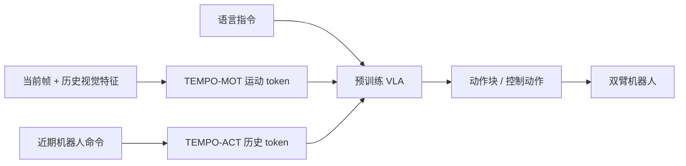
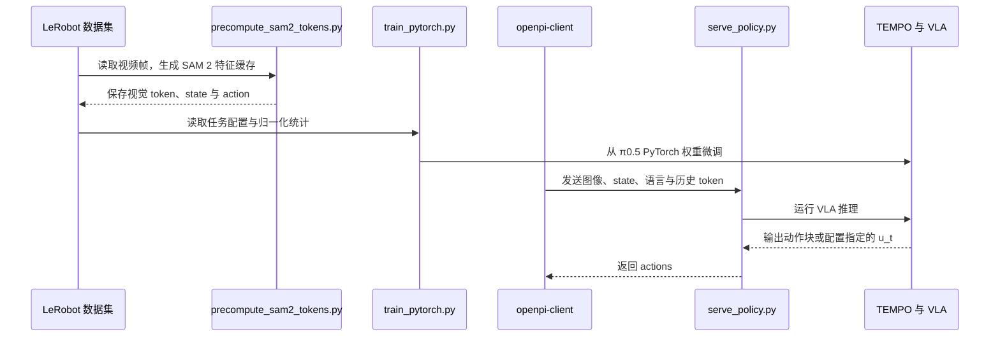

# TEMPO: Learning Temporal Context for Dynamic Robot Manipulation

**一句话定义：** TEMPO 给预训练 VLA 增加“目标正在怎么动”和“机器人刚才做了什么”两种时间线索，让机械臂能更稳地跟踪移动目标，也能判断当前处于任务哪个阶段。

## 英文缩写速查

| 缩写 | 英文全称 | 简要说明 |
|------|----------|----------|
| TEMPO | Temporal Encoding for Motion-aware Policy | 官方实现对方法名的展开 |
| VLA | Vision-Language-Action | 根据视觉、语言条件输出机器人动作的策略 |
| MOT | Motion | TEMPO-MOT：从近期图像特征提取场景运动摘要 |
| ACT | Action | TEMPO-ACT：压缩近期本体感知命令，提供动作/阶段上下文 |
| SAM 2 | Segment Anything Model 2 | 论文默认采用的冻结视频特征编码器 SAM 2.1-Tiny |
| RTC | Real-Time Chunking | 论文用于比较异步动作块执行的基线方法 |
| YAM | Yet Another Manipulator | 实验所用 I2RT YAM Ultra 双臂平台 |

## 为什么重要

单帧图像只告诉策略“瓶子现在在哪里”，却没有直接告诉它瓶子正往哪边、以多快的速度移动。对多阶段操作，几张画面也可能很相似，但正确动作相反，例如“伸手拿瓶”和“放下瓶后撤手”。TEMPO 将这两种缺失的时间信息拆开处理，并作为额外输入接入现成 VLA 骨干；它不试图用更大模型或更低推理延迟替代这些表征。

## 核心原理

| 失败模式 | 单帧策略缺少什么 | TEMPO 输入 | 解决目标 |
|---|---|---|---|
| 运动歧义（motion ambiguity） | 场景变化方向、目标速度，因而难以预测接触时目标位置 | TEMPO-MOT：当前图像特征对历史图像特征做交叉注意力，得到运动 token | 跟踪移动物体并选择拦截时机 |
| 状态混淆（state aliasing） | 机器人近期动作与任务阶段，无法区分外观相似但处于不同阶段的状态 | TEMPO-ACT：将近期本体感知命令按时间分桶并求均值 | 在相反动作之间及时作出承诺 |

### 流程总览

### 两条时间支路

- **TEMPO-MOT（视觉运动）：** 使用每帧视频特征的滚动缓存，当前帧特征作 query，历史特征作 key/value，通过交叉注意力形成运动摘要。论文默认用冻结的 SAM 2.1-Tiny；也比较 Reducio、VidTwin、VideoLaVIT，说明编码器并非只能选 SAM 2。
- **TEMPO-ACT（动作历史）：** 将近期命令划成固定数量的时间桶，每桶取均值。论文设置为 10 个桶、每桶 30 条命令；填充标志用于表示 episode 开始前的空历史。官方代码以形状为 `(10, A)` 的 `action_history` 输入。
- **接入预训练策略：** 两种时间 token 加到 VLM 前缀；动作历史还通过 AdaRMS 残差调制 action expert。初始化为零的条件路径尽量保留原策略行为，原有 flow-matching 动作训练目标不变。论文称增加约 2M 参数（约 0.08%），不改预训练骨干。
- **与异步执行互补：** 异步推理解决 action chunk 基于过期观测执行的问题；TEMPO补的是观测内容缺少运动和阶段信息。较新的图像仍只是快照，两类问题不能仅靠缩短推理延迟消除。

## 源码运行时序图

官方仓库提供数据预处理、PyTorch 微调与策略服务入口。训练前可按 README 对 LeRobot 数据集预计算 SAM 2 特征；服务端接收当前观测和上下文输入后返回动作块。运行环境要求 Python 3.11+、NVIDIA GPU 与 `uv`。

## 工程实践

| 环节 | 可复现入口 / 论文设置 | 实施要点 |
|------|----------------------|----------|
| 数据格式 | LeRobot v2.1 / v3.0；head 相机必需，wrist 相机可选 | 视频帧数、Parquet 行数与 episode 元数据长度必须一致；fps 要与历史汇总配置匹配 |
| 预处理 | `tools/precompute_sam2_tokens.py`、`scripts/compute_norm_stats.py` | 视频特征可按数据集预计算；预测 `u_t` 的设置还需训练 MVAE、编码窗口和训练解码器 |
| 微调 | `scripts/train_pytorch.py`，配置在 `src/openpi/training/config.py` | 配置名区分基线、TEMPO-MOT、TEMPO 两路输入和动作输出头 |
| 部署 | `scripts/serve_policy.py` + `packages/openpi-client` | 推理请求需提供 state、图像、prompt，以及相应配置要求的视觉 token 与 action history |
| 在线时序 | 论文：相机约 30 Hz、策略约 30 Hz；视觉编码并行 | 运动编码器在独立线程消费相机帧并更新 token，控制推理读取最新结果 |

**已开放程度（截至 2026-10-10）：** 官方 GitHub 仓库公开，含 Apache-2.0 实现、安装说明、训练与服务脚本；README 的 TODO 仍将训练数据、训练权重和 I2RT YAM 部署列为待发布。论文称 TEMPO-Bench 包含 5 万余帧带逐帧物体速度标注的数据和运动方向/幅度选择题，但当前 README 未给出数据集下载入口，因此不能把数据下载状态视为已核实。Gemma 组件另受仓库附带许可约束。

## 实验与评测

论文在 I2RT YAM Ultra 双臂工作站上评估 Bottle Handover、Drop Catch、Flick Catch 与 Wine Pour。主结果中 Flick Catch 和 Wine Pour 使用移除“放下并后撤”片段的 trimmed 任务，以便与两种在该片段上完全失败的异步基线进行非平凡比较；完整任务结果须分开读。

| 结果 | 论文报告 |
|------|----------|
| 主表四任务成功率 | TEMPO：Bottle Handover 74%、Drop Catch 66%、Flick Catch 66%、Wine Pour 98.1%；每个值基于 50 次真机 rollout。Wine Pour 指最终留在容器内的质量比例 |
| 完整 Flick Catch / Wine Pour | TEMPO 分别 68% / 97.6%；RTC 与 VLASH 在含完整状态混淆片段的版本上均为 0% |
| Bottle Handover 基座迁移 | π0.5 26%→56%；RTC 44%→80%；VLASH 38%→74% |
| 消融 | Bottle Handover：仅 ACT 52%、仅 MOT 56%、两者合用 74% |
| 推理时延 | RTX PRO 6000 上 TEMPO 中位前向时间 35.3 ms，VLASH 33.8 ms；约 1.5 ms 增量，MOT 编码独立并行运行 |

TEMPO 的意义在于把“看懂运动”和“知道自己做到哪一步”显式作为可测试信号。Drop Catch 是重要反例：论文指出该任务主要受反应时序影响，RTC 更强，支持“表征上下文”和“执行时延”是互补问题，而不是单一方法全面取代另一种。

## 结论

**TEMPO 用两种轻量历史输入补足单帧 VLA 的时间上下文，在多种动态操作任务上提高跟踪与阶段判断表现；它没有消除执行时延，也尚未证明能直接迁移到人形机器人。**

1. **先区分跟丢还是阶段错。** — 目标移动方向/速度缺失，优先看 MOT；动作犹豫、重复或拿放阶段混淆，优先看 ACT。
2. **两路信息互补。** — Bottle Handover 的双路结果高于任一单路；不能把提升全归因于视频特征。
3. **把完整任务结果与 trimmed 结果分开引用。** — 论文为基线比较裁剪了 Flick Catch 和 Wine Pour 的状态混淆阶段；完整任务数另列。
4. **时延比较要注明硬件。** — 35.3 ms 是 RTX PRO 6000 上的策略前向值，不等于目标机器人控制器上的端到端延迟。
5. **复现前核对数据和权重。** — 代码已公开，但 README 仍把训练数据、检查点和 YAM 部署作为 TODO；TEMPO-Bench 的可下载入口未由 README 确认。
6. **先在桌面双臂动态操作验证。** — 论文结果来自 YAM Ultra 工作站；人形移动操作、遮挡、域外速度和不同机械臂仍需独立测试。

## 局限与风险

- 实验覆盖四项双臂桌面操作任务，不能据此推断对所有移动操作、灵巧手或人形机器人均有效。
- MOT 要依赖历史帧缓存和视频特征提取；部署应实测相机频率、缓存同步、线程负载和丢帧影响。
- 论文中策略/相机运行频率约 30 Hz；公布的 35.3 ms 前向时间来自 RTX PRO 6000，不能直接映射到 Jetson 或机载控制硬件。
- 论文发布的 TEMPO-Bench 规模与标注形式明确，但官方仓 README 中数据下载和检查点仍是待发布项，复现者需要自行确认后续 release。
- 同名旧论文节点 [TEMPO（VLA 双频 RL 后训练）](./paper-tempo.md) 是浙江工商大学与 KTH 的另一篇工作（arXiv:2608.07314），与本项目不是同一个 TEMPO。

## 与异步 VLA 的关系

| 路线 | 主要解决问题 | TEMPO 的关系 |
|------|--------------|--------------|
| RTC / VLASH | 让动作块更及时地执行，降低观测陈旧造成的偏差 | 论文用作基线；TEMPO 作为输入表征可与其结合 |
| TEMPO-MOT | 单帧没有目标速度/场景变化信息 | 由当前与历史视觉特征编码运动 |
| TEMPO-ACT | 单帧无法区分视觉相似的阶段 | 用近期机器人动作/本体感知历史提供上下文 |
| TEMPO + UVT | 输入侧缺运动上下文，动作侧目标仍可能难学 | UVT 提供紧凑的视觉运动目标，属于可组合的另一侧改进 |

## 关联页面

- [VLA](../methods/vla.md) — 动态场景中的预训练视觉语言动作策略。
- [Action Chunking](../methods/action-chunking.md) — 策略动作块执行背景。
- [Manipulation](../tasks/manipulation.md) — 操作任务入口。
- [Temporal Convolutional Network](../concepts/temporal-convolutional-network.md) — 时间信息建模的一种不同结构。
- [另一个 TEMPO：双频 RL 后训练](./paper-tempo.md) — 同缩写、不同论文与身份。

## 参考来源

- [TEMPO 论文归档](../../sources/papers/tempo_arxiv_2609_16864.md)
- [TEMPO 项目页归档](../../sources/sites/tempo-dynamic-manipulation.md)
- [TEMPO 官方代码归档](../../sources/repos/tempo-robot-tempo.md)

## 推荐继续阅读

- [arXiv:2609.16864](https://arxiv.org/abs/2609.16864)
- [TEMPO 官方项目页](https://tempo-robot.github.io/)
- [TEMPO 官方实现](https://github.com/tempo-robot/TEMPO)
