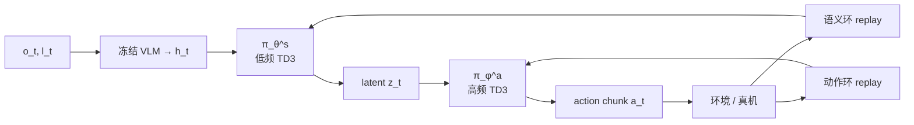

# TEMPO（VLA 双频 RL 后训练）

**TEMPO**（*Semantic-Action Decoupled RL Post-Training for Vision-Language-Action Models*，[arXiv:2608.07314](https://arxiv.org/abs/2608.07314)，[匿名项目页](https://anonymous.4open.science/w/tempo-page/)）来自 **浙江工商大学（Zhejiang Gongshang University）** 与 **瑞典皇家理工学院（KTH Royal Institute of Technology）**：在模块化 VLA（文中实例化 **FLOWER**）上做 **语义–动作解耦、双时间尺度 TD3** 后训练。

## 一句话定义

**别用同一套 RL 节拍去拧整个 VLA**——冻结 VLM，让 semantic projection **慢更新**稳住 latent action，让 action expert **快更新**吃在线控制反馈。

## 英文缩写速查

| 缩写 | 英文全称 | 简要说明 |
|------|----------|----------|
| TEMPO | Two-timescale sEMantic-action decouPled RL pOst-training | 本文框架名（语义–动作解耦双频 RL） |
| VLA | Vision-Language-Action | 视觉–语言–动作策略 |
| TD3 | Twin Delayed DDPG | 两环各自使用的连续控制 RL 算法 |
| SFT | Supervised Fine-Tuning | 离线演示微调基线范式 |
| CALVIN | Composing Actions from Language and Vision | 长程语言条件操作基准 |
| SR\(k\) | Success rate of first \(k\) instructions | 五指令链前 \(k\) 步连续成功率 |

## 为什么重要

- **对准「统一 RL 更新」盲点：** 多数 VLA RL 后训练固定可训子集后仍用同一优化节奏；TEMPO 显式区分语义侧与动作侧的适配速率。
- **保护预训练语义：** 大 VLM 冻结，只 RL 微调 projection，降低表征崩坏与算力。
- **长程链更吃双频：** CALVIN 上相对 FLOWER 的增益随 SR1→SR5 放大（SR5 +3.9 pp）。
- **给出可对照的单环基线：** FLOWER-RL（同一可训模块、单 TD3）说明「能 RL」≠「双频解耦」。
- **开源边界清醒：** 匿名项目页 + 无代码 URL——方法可读，栈不可跑。

## 核心信息

| 字段 | 内容 |
|------|------|
| 机构 | 浙江工商大学（Zhejiang Gongshang University）；瑞典皇家理工学院（KTH Royal Institute of Technology） |
| 发表 | arXiv preprint（2026-08-07） |
| arXiv | [2608.07314](https://arxiv.org/abs/2608.07314) |
| 项目页 | <https://anonymous.4open.science/w/tempo-page/>（匿名；Cloudflare） |
| 代码 | **确认未开源**（截至 2026-08-11） |
| 骨干 | FLOWER（冻结 VL + semantic projection + action expert） |
| 训练 | 两套模块级 TD3；稀疏指令完成奖励；动作:语义更新比 \(\rho=f_a:f_s\) |
| 主要基线 | RT-1 / OpenVLA / π₀ / π₀.₅ / DeFI / FLOWER / FLOWER-RL 等 |

## 核心原理

### 输入 / 输出

| 侧 | 内容 |
|------|------|
| 状态 | \(s_t=(o_t,l_t)\) 图像观测 + 语言指令 |
| 中间量 | \(h_t=\mathrm{VL}(o_t,l_t)\)，\(z_t=\pi_\theta^s(h_t)\) |
| 动作 | action chunk \(\mathbf{a}_t=\pi_\phi^a(z_t)\) |
| 奖励 | 当前指令成功则 \(r=1\)，否则 0（稀疏） |
| 可训 | \(\theta\)（projection）、\(\phi\)（action expert）；VL 冻结 |

### 流程总览

### 关键机制（压缩）

1. **空间拆分：** 语义环在 \((h,z)\) 上学 \(Q^s\)；动作环在 \((z,\mathbf{a})\) 上学 \(Q^a\)；共享同一批 rollout 奖励。
2. **梯度隔离：** projection 更新不回传 VLM、也不直接拧 expert；expert 更新不以 projection 为可微通道。
3. **频率解耦：** \(f_a>f_s\)（文中 **5:1 / 10:1**）避免 latent 漂移过快；**1:1** 双环几乎无增益。
4. **相对单环：** FLOWER-RL 同时改 \(z\) 与映射，长程上更易丢「先开门再取物」类隐式次序。

## 源码运行时序图

**不适用**：截至 **2026-08-11**，匿名项目页未能核验 Code 链接，论文亦无 GitHub；无可对齐的训练/评测入口。去匿名或代码发布后再补本图。

## 工程实践

| 项 | 建议 / 论文设定 |
|----|----------------|
| 起始策略 | 先对 FLOWER（或同构模块化 VLA）做任务 SFT，再上 TEMPO |
| 奖励 | 稀疏指令完成；作者展望语言条件稠密奖励以改善 credit assignment |
| 频率比 | 优先试 \(5:1\)（文中 SR5 最佳档之一）；避免默认 \(1:1\) |
| 任务集规模 | 后训练子任务集合并非越大越好；全文 34 任务设置弱于更聚焦集合 |
| 真机数据 | 文中两任务各约 60 人演示作 SFT 起点，再在线 RL |
| 复现现状 | **未开源**；见 [项目页归档](../../sources/sites/tempo-anonymous-4open.md) |

## 实验与评测

| 设置 | 结果要点（Table I–IV / §IV） |
|------|------------------------------|
| CALVIN ABC→D | TEMPO **SR5 81.7%**、Avg.Len. **4.59** |
| FLOWER | 77.8% / 4.49；FLOWER-RL 78.4% / 4.51 |
| 最强表内基线 DeFI | 81.2% / 4.51；TEMPO 略高 |
| SR1→SR5 掉点 | FLOWER 21.6 pp → TEMPO **18.3 pp** |
| 组件消融 | 只更 projection 或只更 expert 均优于 FLOWER，但不及 full |
| 频率比 | 5:1 / 10:1 抬升；1:1 双环略差于 FLOWER |
| 真机 | 两多阶段任务后期评测奖励高于 FLOWER-RL；抽屉未开足时更能先开抽屉 |

## 结论

**VLA 在线后训练的瓶颈，常常是「语义表征被动作侧更新拖着跑」，而不只是「有没有做 RL」。**

1. **先看长程 SR5 / Avg.Len.** — 短程 SR1 大家都能很高；TEMPO 的故事在链后段。
2. **双环 + 错频缺一不可** — 消融与 1:1 频率说明「拆开模块」或「随便 RL」都不够。
3. **冻结 VLM 是默认工程选择** — 省算力并降低互联网语义被冲刷的风险。
4. **单环 FLOWER-RL 是必对照** — 用来隔离「解耦」贡献，而不是只跟 π₀ 比。
5. **稀疏奖励仍是上限** — 作者自己指出稠密过程奖励是下一步。
6. **选型边界** — 相对 [DeFI](../methods/defi-decoupled-dynamics-vla.md)（正逆动力学解耦预训练）与 SimpleVLA-RL / RLinf 系系统栈，TEMPO 专攻 **模块更新频率**；代码未开前只作方法坐标。

## 局限与风险

- **确认未开源 / 匿名页：** 无法核验实现、超参与随机种子；去匿名后需复核代码状态。
- **骨干绑定：** 主结果建立在 FLOWER 模块边界上；迁到纯 token VLA / 端到端 DiT 需重划「projection vs expert」。
- **稀疏奖励方差：** 长程 credit assignment 仍难；真机曲线早期波动大。
- **增益幅度：** 相对 DeFI 仅约 +0.5 pp SR5——读结果时避免过度外推「碾压」。
- **误区：** 把 TEMPO 当成「任意 VLA 一键 RL」，或把匿名页当成已发布可复现栈。

## 与其他工作对比

| 路线 | 可训范围 | 更新节奏 | 开源/复现 |
|------|----------|----------|-----------|
| SFT / LoRA | 广或参数高效 | 离线监督 | 视模型 |
| VLA-RL / SimpleVLA-RL | LoRA 或全参 | 统一 on-policy 节奏 | 有系统仓者可跑 |
| iRe-VLA | RL 阶段偏 action head | 与 SFT 交替 | 视实现 |
| FLOWER-RL（本文基线） | projection+expert | **单环同频** | 未随文开源 |
| **TEMPO（本文）** | projection+expert | **双环、\(f_a>f_s\)** | **未开源** |
| DeFI | 正逆动力学解耦预训练 | 非本后训练设定 | 见 [DeFI](../methods/defi-decoupled-dynamics-vla.md) |

## 关联页面

- [VLA](../methods/vla.md) — 后训练坐标与经验飞轮
- [Action Chunking](../methods/action-chunking.md) — expert 输出块动作
- [Reinforcement Learning](../methods/reinforcement-learning.md) — TD3 / 在线 RL 总览
- [Online vs Offline RL](../comparisons/online-vs-offline-rl.md) — 后训练数据范式
- [CALVIN](./calvin-benchmark.md) — 主仿真基准
- [DeFI](../methods/defi-decoupled-dynamics-vla.md) — 表中强基线
- [VLA 开源复现景观](../overview/vla-open-source-repro-landscape-2025.md) — 可跑 RL 系统对照
- [VLA 纵深](../../roadmap/depth-vla.md) — Stage 5 RL 微调入口

## 参考来源

- [TEMPO 论文摘录（arXiv:2608.07314）](../../sources/papers/tempo_arxiv_2608_07314.md)
- [匿名项目页归档](../../sources/sites/tempo-anonymous-4open.md)

## 推荐继续阅读

- Liu & Yang, *TEMPO* — [arXiv:2608.07314](https://arxiv.org/abs/2608.07314)
- [匿名项目页](https://anonymous.4open.science/w/tempo-page/)（去匿名后复核）
- FLOWER — 文中实例化骨干（见论文参考文献）
- CALVIN benchmark — <https://github.com/mees/calvin>
