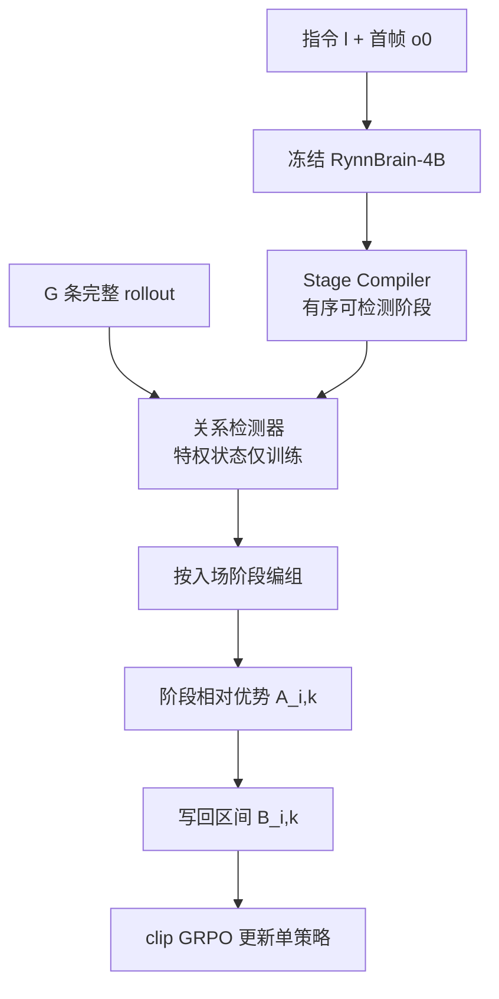

# Temporal GRPO：按阶段写回 VLA 强化学习的优势

**Temporal GRPO**（*Beyond Trajectory-Level Credit in Vision-Language-Action Reinforcement Learning*，[arXiv:2608.13026](https://arxiv.org/abs/2608.13026)）来自 **中国科学院软件研究所（ISCAS）**：在结果驱动的 VLA 后训练里，不要把「整条轨迹成或败」广播到每一步。先构造可检测的有序阶段，只拿 **已经走进同一阶段** 的 rollout 做组内相对比较，再把该阶段优势写回对应动作区间。策略还是一条，目标还是最终成功。

## 一句话定义

**失败轨迹里前几段往往是对的：别用同一个负优势把它们和真正失败的那一段一起打下去。**

## 英文缩写速查

| 缩写 | 英文全称 | 简要说明 |
|------|----------|----------|
| GRPO | Group Relative Policy Optimization | 组内相对优势、不训 value 的策略优化 |
| VLA | Vision-Language-Action | 被后训练的视觉–语言–动作策略 |
| SFT | Supervised Fine-Tuning | 对照热启动：任务专属 OpenVLA-OFT |
| TGRPO | Trajectory-wise GRPO | **另一篇**（arXiv:2506.08440）；本页是阶段条件信用，不是它 |
| SR | Success Rate | 任务成功率；RoboTwin 主指标 |
| \(m_d\) | First-difference stage | LIBERO-Long 上首次阶段结果分歧的那一段 |

## 为什么重要

- **长程 VLA-RL 的默认坑：** 早失败和「抓-运都对、放下失败」在二值结果下拿到同一个 \(\widehat{A}_i<0\)，已经学会的前序子技能被一起抑制。
- **不换架构、不加 critic。** 改的是比较单元和写回区间；完整 rollout、似然比、clip 都还在。
- **数字按视界拆开：** RoboTwin 短/中/长都涨 6–8 点，不是只吃短任务。
- **能看见更新落在哪：** LIBERO-Long 上 Trajectory-GRPO 伤共享前序；本方法前序几乎不动，增益集中在 \(m_d\)。
- **今天不能当复现栈。** 无代码；阶段谓词还靠仿真特权状态。

## 核心信息

| 字段 | 内容 |
|------|------|
| 作者 | Yao Zhou、Hang Gao、Fengge Wu、Changwen Zheng、Wenwen Qiang（通讯） |
| 机构 | 中国科学院软件研究所（ISCAS）。预印本未印单位，按通讯作者主页与合作关系归档 |
| 出处 | arXiv:2608.13026（2026-08-13） |
| 热启动 | 公开任务专属 OpenVLA-OFT SFT；对照共用 |
| 阶段提案 | 冻结 [RynnBrain-4B](./paper-rynnbrain-1-1.md)，每个任务实例编译一次、组内共享 |
| 检测 | 训练期用仿真特权状态；评测不用检测器 |
| 开源（截至 2026-08-15） | **确认未开源**：无项目页、无仓库、论文未承诺 |

## 方法与核心结构

结果驱动 GRPO 把轨迹优势写成 \(\widehat{A}_{i,t}=\widehat{A}_i\)。两条阶段向量不同、最终奖励相同的 rollout 会拿到同一个优势——文中称为 **trajectory-level credit aliasing**。

Temporal GRPO 把比较从「整条轨迹」改成「同一进度下的当前阶段」：

| 步骤 | 做什么 |
|------|--------|
| **语义阶段** | \(F_{\mathrm{sem}}(l,o_0)\)：冻结 RynnBrain-4B 看指令和首帧 |
| **Stage Compiler** | 理顺顺序与前置、写成可检测完成条件；末段 \(m_K\) 对齐任务成功 |
| **对齐** | 稳定满足条件的首次时刻 \(T_{i,k}\)；成功区间 \(B_{i,k}=(T_{i,k-1},T_{i,k}]\)，失败则后缀整段归当前阶段 |
| **入场门控** | \(V_{i,k}=1\) 才进组；没走到的 **不当成该阶段失败** |
| **写回** | \(\widehat{A}_{i,t}\) 只取所属 \(B_{i,k}\) 的 \(\widehat{A}_{i,k}\)；动作块继承区间 |

同一 batch、同一目标更新一条策略，不是按阶段拆成多个 RL 作业。某阶段全员同结果则本步跳过——没有相对排序就没有信号。

### 流程总览

## 源码运行时序图

**不适用**（截至 2026-08-15）：无官方训练 / 评测入口。放出后应补：OpenVLA-OFT SFT → 阶段编译 → 特权检测对齐 → 阶段 GRPO → RoboTwin / LIBERO 评测（评测关掉检测器）。

勿把 [hahans/TGRPO](https://github.com/hahans/TGRPO) 当成本方法实现：那是 **TGRPO**（轨迹级 + 步级融合），本页 Table 1 里是被比较的基线。

## 工程实践

| 项 | 建议 / 论文设定 |
|----|----------------|
| **何时用这篇** | 已有能 rollout 的 VLA，长程稀疏成功，怀疑失败轨迹在惩罚前序子技能 |
| **何时不用** | 今天就要跑通的后训练 → [SimpleVLA-RL](../overview/vla-open-source-repro-landscape-2025.md) / [WCM](./paper-wcm-world-critic-model.md)；要改更新频率而不是信用写回 → [TEMPO](./paper-tempo.md) |
| **阶段必须可检测** | 线性前置 + 稳定完成条件；瞬时接触不算完成 |
| **入场门控不要省** | 没进入的当失败，LIBERO-Long 从 99.1 掉到 92.5 |
| **同阶段才可比** | 取消同阶段编组掉到 90.6，是最大组件跌幅 |
| **Stage-Reward ≠ 本方法** | 阶段进度加成标量后再整轨广播，只有 94.7 / RoboTwin 59.2 |
| **特权状态** | 只在后训练对齐；部署策略不看检测器 |
| **分支 / 回退** | 作者写明线性阶段在分叉、重复、回退时会裂；真机无特权谓词时更裂 |

## 实验与评测

受控 RL 共用 OpenVLA-OFT SFT、场景、rollout / 交互 / 更新预算。RoboTwin 三种子；主指标任务成功率。

| 方法 | Short | Medium | Long & XL | Macro |
|------|-------|--------|-----------|-------|
| \(\pi_0\) / RDT-1B | 45.5 / 24.5 | 58.8 / 47.8 | 43.3 / 27.8 | 49.2 / 33.3 |
| OpenVLA-OFT (SFT) | 21.3 | 47.1 | 46.5 | 38.3 |
| Trajectory-GRPO | 37.8 | 52.6 | 48.7 | 46.4 |
| TGRPO | 43.9 | 58.4 | 54.1 | 52.1 |
| Stage-Reward GRPO | 52.7 | 64.2 | 60.8 | 59.2 |
| SimpleVLA-RL | 64.9 | 72.5 | 69.0 | 68.8 |
| **Temporal GRPO** | **73.2±0.9** | **79.0±0.8** | **75.2±1.1** | **75.8±0.7** |

相对 SimpleVLA-RL：短 +8.3、中 +6.5、长+超长 +6.2。学习曲线在同等交互预算下全程高于 Trajectory-GRPO，长任务仍分开。

**LIBERO-Long 信用探针：** 组内共享前序、在 \(m_d\) 首次分歧。Trajectory-GRPO 的 \(\Delta p_k\) 在前序为负；Temporal GRPO 前序接近 0，最大正增益在 \(m_d\)。消融：全文 **99.1** → 无 Compiler 96.8 → Stage-Reward 94.7 → 无门控 92.5 → 无同阶段编组 90.6 → 纯轨迹 88.4。

## 结论

**VLA 结果 RL 缺的往往不是更密的奖励模型，而是「这条失败轨迹已经走到哪、该怪哪一段」。**

1. **真影响：别广播轨迹优势** — 同一失败标签可以对应完全不同的阶段向量；广播会打掉前序。
2. **真影响：入场门控 + 同阶段编组** — 两个消融跌得最多；没走进来的样本不是该阶段的负例。
3. **真影响：视界一致** — RoboTwin 三段都涨，长任务不是附带。
4. **次要代价：Stage-Reward 不够** — 有阶段信号仍整轨写回，只到 59.2 / 94.7。
5. **次要代价：线性阶段** — 分叉、重复、回退、模糊边界会裂对齐。
6. **部署读法：** 先确认仿真里能稳定检测阶段；真机没有特权谓词就不要假设数字能搬。
7. **工程读法：无代码** — 2026-08-15 只能引用机制和表；复现仍走 SimpleVLA-RL / WCM 等已开源栈。

## 与其他工作对比

| 对照 | 差异读法 |
|------|----------|
| Trajectory-GRPO / 普通结果 GRPO | 比较单元和写回单元都是整条轨迹 |
| TGRPO（arXiv:2506.08440） | 步级+轨迹级融合，**不是**阶段条件编组；有自己的 GitHub |
| Stage-Reward GRPO | 同一套检测，优势仍整轨广播 |
| SimpleVLA-RL | 可跑的 VLA-RL 系统栈；本页在其上再改信用规则，但无代码 |
| [TEMPO](./paper-tempo.md) | 改模块更新频率（语义慢 / 动作快）；本页改优势写回 |
| [Green-VLA](./paper-greenvla-staged-vla-humanoid.md) | 五阶段课程 + 保守 flow RL；「阶段」指训练课，不是 rollout 内信用 |
| [WCM](./paper-wcm-world-critic-model.md) | 换世界模型 critic；本页坚持无 value、只改组相对 |

## 局限与风险

- **未开源：** 不能复现 75.8 或阶段编译器。
- **特权检测：** 数字绑在仿真谓词上；RGB-only 阶段边界是开放问题。
- **线性顺序：** 作者自己把分叉 / 回退写成未来工作。
- **机构行缺失：** 单位按通讯作者主页归档，不是 PDF 题头。
- **混名：** Temporal GRPO ≠ TGRPO ≠ TempFlow-GRPO（图像生成）。

## 关联页面

- [VLA](../methods/vla.md) — 后训练总览；本页是结果 GRPO 的阶段信用
- [Reinforcement Learning](../methods/reinforcement-learning.md) — 在线 RL 与信用分配
- [TEMPO](./paper-tempo.md) — 双频 TD3 后训练；轴正交
- [Green-VLA](./paper-greenvla-staged-vla-humanoid.md) — 分阶段课程，不是轨迹内阶段
- [RoboTwin 2.0](./robotwin.md) — 主仿真榜
- [LIBERO](./libero-benchmark.md) — 信用探针与消融
- [OpenVLA](./openvla.md) — 受控实验骨干（OFT）
- [WCM](./paper-wcm-world-critic-model.md) — 已开源的另一条 VLA-RL critic 路线
- [RynnBrain 1.1](./paper-rynnbrain-1-1.md) — 冻结阶段提案模型的同族
- [VLA 开源复现景观](../overview/vla-open-source-repro-landscape-2025.md) — 今日可跑的 RL 后训练入口
- [Online vs Offline RL](../comparisons/online-vs-offline-rl.md) — 后训练数据范式

## 参考来源

- [temporal_grpo_arxiv_2608_13026.md](../../sources/papers/temporal_grpo_arxiv_2608_13026.md)
- Zhou et al. — <https://arxiv.org/abs/2608.13026>
- 通讯作者主页（机构核查）— <https://qiangwenwen.github.io/>

## 推荐继续阅读

- 论文 HTML — <https://arxiv.org/html/2608.13026>
- SimpleVLA-RL（可跑对照）— <https://github.com/PRIME-RL/SimpleVLA-RL>
- TGRPO（勿混名）— <https://arxiv.org/abs/2506.08440>
- RoboTwin 2.0 — <https://arxiv.org/abs/2506.18088>
- OpenVLA-OFT — <https://arxiv.org/abs/2502.19645>
