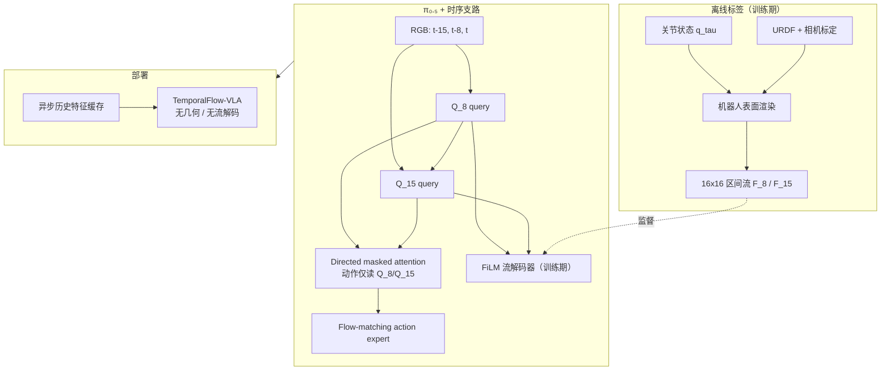

# TemporalFlow-VLA：物理接地执行历史

**TemporalFlow-VLA**（*Learning Physically Grounded Execution History for Long-Horizon Robot Manipulation*，[arXiv:2608.26821](https://arxiv.org/abs/2608.26821)）由 **香港科技大学（广州）**、**浙江大学**、**西蒙菲莎大学（SFU）** 与 **智元机器人（AgiBot）** 提出：在 **π₀.₅** 上并行学习 **两个 chunk 对齐的时序 query**（**Q₈**、**Q₁₅**），用离线 **机器人表面时序流**（关节状态 + URDF + 标定相机）作 **训练期物理监督**；部署时 **无几何渲染、无流估计器**，仅保留紧凑 query 与异步历史特征缓存。

## 一句话定义

**把「近期机器人运动在 RGB 中如何显现」写成训练期可监督的流场目标，再压缩成两个时序 query 供 action expert 读取——部署不必再跑运动估计或几何管线。**

## 英文缩写速查

| 缩写 | 英文全称 | 简要说明 |
|------|----------|----------|
| VLA | Vision-Language-Action | 视觉–语言–动作策略 |
| FM | Flow Matching | π₀.₅ 动作专家的连续 flow 匹配训练 |
| URDF | Unified Robot Description Format | 机器人连杆几何与运动学描述 |
| FK | Forward Kinematics | 由关节角求连杆位姿的正运动学 |
| SR | Success Rate | 任务成功率 |
| FiLM | Feature-wise Linear Modulation | query 调制空间特征预测流场 |

## 为什么重要

- **历史帧≠执行史：** 多阶段操纵中，视觉相似状态可能对应抓取、搬运或恢复等不同相位；单纯堆叠帧对 **顺序与物理演化** 不敏感。
- **训练期物理、部署期轻量：** 与 TraceVLA 等在测试时叠加运动提示不同，密集流 **仅作训练目标**；推理只保留 **Q₈/Q₁₅** 与 action 路径。
- **长程收益集中：** RoboTwin **H=3** Randomized **87.5%**，较 listed 次优 **+14.5 pt**；LIBERO Long **96.60±0.87%**。
- **工程可落地：** 异步缓存历史视觉 token，采样延迟接近 **单帧编码** 开销（LIBERO Long **−7.8%** 累计）。

## 核心信息

| 项 | 内容 |
|----|------|
| **机构** | 香港科技大学（广州）；浙江大学；西蒙菲莎大学（SFU）；智元机器人（AgiBot） |
| **基座** | **π₀.₅**（flow-matching action expert + VLM 前缀） |
| **历史窗** | 头部相机 **t−15、t−8、t**（16 步 chunk 对齐） |
| **时序接口** | **Q₈**（近程 t−8→t）、**Q₁₅**（全程 t−15→t，可读 Q₈）；动作 token **不可直读** 历史图像 patch |
| **监督** | 离线机器人表面流 → 16×16 patch 平均位移；**L = L_action + λ_temp L_temp**（λ_temp=1.0） |
| **训练** | 8×H100，batch/GPU=32；LIBERO 30k / RoboTwin 60k；时序模块约 **+20%** 墙钟 |
| **开源** | **截至 2026-08-31 未列官方代码或权重 URL**（仅 arXiv） |

## 流程总览

## 源码运行时序图

**不适用** — 截至入库日 arXiv 未提供可运行官方代码或权重；复现需自搭 π₀.₅ 微调栈、离线 URDF 流标签管线与 RoboTwin/LIBERO 数据。

## 方法要点

### 机器人表面时序流

- 对区间 ρ∈{8,15}，将源时刻可见机器人表面像素经 **FK + 相机投影** 映射到目标时刻图像平面，形成归一化位移场；按 **14×14 非重叠区域** 池化为 **16×16×2** 目标。
- 仅需 **机器人本体运动** 作辅助监督；时序支路仍接收 **完整 RGB**，物体/场景变化仍可通过 action 目标学习。

### 分层 query 与注意力瓶颈

- **Q₈** 可读：语言、V₈、V₀、自身；**Q₁₅** 额外可读 V₁₅ 与 **Q₈**（单向 Q₈→Q₁₅）。
- 动作 token 经 **联合 masked self-attention** 只能访问 **Q₈/Q₁₅**，强制历史经 **物理监督的紧凑接口** 进入 action expert。

### 异步历史特征缓存

- 执行当前 16 步 chunk 时，后台编码 **t−15/t−8** 视觉 token 入环缓冲；重规划时 **同步编码仅当前帧**，历史从缓存读取。
- 稳态延迟近似 **T_vision + T_joint + T_action**（相对朴素三帧同步编码）。

## 实验读法

### LIBERO（三 seed，500 rollout/suite/seed）

| 套件 | TemporalFlow-VLA |
|------|------------------|
| Spatial | 97.60±0.20% |
| Object | 99.40±0.20% |
| Goal | 96.93±0.61% |
| **Long** | **96.60±0.87%** |
| **Avg.** | **97.63±0.26%** |

### RoboTwin 2.0（12 任务，Clean / Randomized）

| _horizon_ | Avg. SR（Ours） | 读法 |
|-----------|-----------------|------|
| H=1 | 84.3% / 84.0% | 短程非最强 |
| H=2 | 83.5% / 80.8% | 中段开始拉开 |
| H=3 | **89.0% / 87.5%** | **长程多阶段核心收益** |
| **Overall** | **85.5% / 84.2%** | Rand. 较 listed 最强基线 **+8.0 pt** |

### 真机（AgiBot A3，各 45 trial）

| 任务 | Baseline | TemporalFlow-VLA | Δ |
|------|----------|------------------|---|
| 三杯叠放（三阶段） | 57.8% | **77.8%** | +20.0 pt |
| 双瓶装箱（三阶段） | 86.7% | **97.8%** | +11.1 pt |

### 消融要点

- **两 query 无流监督** 已优于 **多帧直喂**（83.6% vs 81.5% Rand.）；加流监督再 **+0.6~+1.5 pt** overall，**H=2 增益最大**。
- 打乱/移除历史均抬高 offline action loss；**打乱** 在 5/6 任务上更伤，支持 **顺序敏感** 假设。

## 结论

**TemporalFlow-VLA 用「机器人表面在图像里怎么动」给时序 latent 贴上可解释的物理标签，在 π₀.₅ 上以极小部署开销换来长程多阶段操纵的显著 SR 提升。**

- **真影响指标：** RoboTwin **H=3** Randomized **87.5%**、Overall **84.2%**；LIBERO Long **96.60%**；AgiBot 三阶段叠杯 **+20 pt**。
- **机制：** **Q₈/Q₁₅ 瓶颈 + 流监督** 比 raw 多帧或无序历史更能编码 **执行相位**；训练期几何、部署期无流解码。
- **代价：** 离线需 **URDF 标定流标签**（+约 20% 训练时间）；仍依赖 **固定历史偏移**（15/8 步），最优时间尺度未系统搜索。
- **与 TraceVLA / MotionVLA：** 后者测试时显式运动提示或轨迹 token；本方法 **部署零运动估计**。
- **与 KEMO / EventVLA：** 后者选 **稀疏关键帧** 或证据记忆；本方法用 **连续区间流** 定义两尺度 query 的物理含义。
- **开源：** **未发布** — 跟进 arXiv / 智元是否释出代码与 checkpoint。
- **选型：** **多阶段、视觉易混淆相位** 的长程双臂/桌面操纵优先；单步短程任务增益有限。

## 与其他工作对比

| 对比轴 | TemporalFlow-VLA | π₀.₅ 多帧基线 | TraceVLA | [KEMO](./paper-kemo-event-driven-keyframe-memory-vla.md) |
|--------|------------------|---------------|----------|----------------------------------------------------------|
| 历史形式 | 2 个流监督 query | 原始帧堆叠 | 图像轨迹提示 | 事件关键帧 |
| 部署几何 | **无** | 无 | 需轨迹估计 | 无 |
| 物理监督 | 机器人表面流 | 无 | 轨迹可视化 | 运动学峰选帧 |
| 长程亮点 | RoboTwin H=3 +14.5 pt | 易顺序不敏感 | 强空间轨迹 | 真机记忆 +23.6 pt |

## 局限与风险

- **无公开代码：** 复现依赖 π₀.₅ 与离线流标签栈，工程门槛高。
- **固定历史尺度：** 论文未 exhaustive 搜索帧数与间隔；跨任务最优窗可能不同。
- **机器人流标签：** 监督侧重 **本体运动在 RGB 的投影**；纯物体运动阶段变化可能仍需 action 损失补足。
- **训练开销：** 时序模块与流解码器使墙钟 **+~20%**。

## 关联页面

- [π₀.₅](./paper-pi05-open-world-vla.md)、[VLA](../methods/vla.md)、[Action Chunking](../methods/action-chunking.md)
- [FlashVLA](./paper-flashvla.md) — 同 π₀.₅ 基座，改解码/异步而非历史表征
- [ForeTime-VLA](./paper-foretime-vla.md) — 另一类「训练期特权、部署期轻量」时序结构
- [KEMO](./paper-kemo-event-driven-keyframe-memory-vla.md)、[EventVLA](./paper-eventvla-visual-evidence-memory.md) — 稀疏视觉记忆路线
- [SparkVLA](./paper-sparkvla.md) — 长程层级 VLA 另一轴
- [Manipulation](../tasks/manipulation.md)

## 参考来源

- [TemporalFlow-VLA 论文摘录](../../sources/papers/temporalflow_vla_arxiv_2608_26821.md)

## 推荐继续阅读

- [arXiv:2608.26821](https://arxiv.org/abs/2608.26821) — 完整注意力掩码、流生成与消融协议
- [π₀.₅ 实体页](./paper-pi05-open-world-vla.md) — 基座 flow 接口与 chunk 设定
- [TraceVLA](https://arxiv.org/abs/2412.04416) — 测试时运动提示对照（若站内已收录请从 VLA 方法页跳转）
