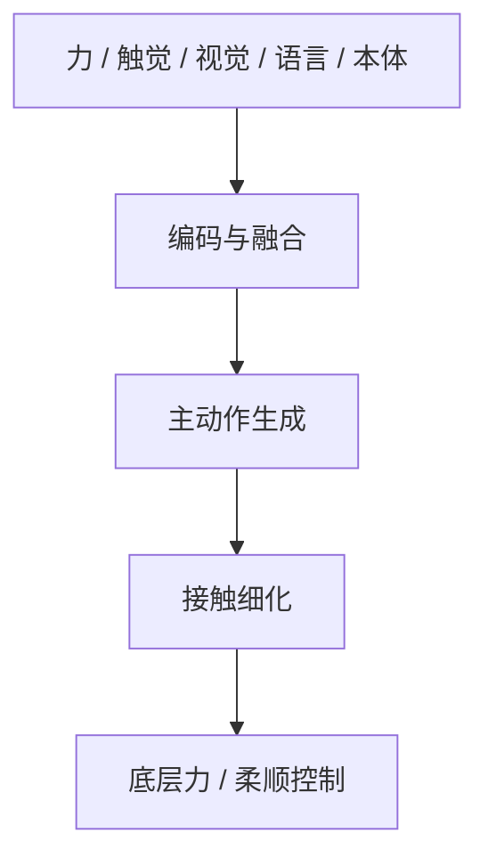

# TF-ART：接触学习要同时画模态和阶段

**TF-ART**（*Learning Physical Interaction: A Survey of Tactile- and Force-aware Robot Learning*；[arXiv:2608.07558](https://arxiv.org/abs/2608.07558)，[项目页](https://lorenzo-0-0.github.io/tactile-force-survey/)，[清单](https://github.com/NTUMARS/Awesome-Tactile-Force-aware-Robot-Learning)）由 **南洋理工大学** 通讯（Jianfei Yang），联合斯坦福、伯克利、MIT、NUS 等：接触敏感操作不只是多装一种传感器，而是力/触觉在 **观测–融合–出动作–细化–底层控制** 里各进哪一层。

## 一句话定义

**用同一套管线轴把触觉/力觉方法定位到「看见什么」和「在第几阶段改动作」，而不是只按传感器或任务堆论文。**

## 英文缩写速查

| 缩写 | 英文全称 | 简要说明 |
|------|----------|----------|
| TF-ART | Tactile/Force-Aware Robot learning Taxonomy | 本文多模态+多阶段层级 |
| VLA | Vision-Language-Action | 清单按主结构分组的一类 |
| DP | Diffusion Policy | 清单分组之一 |
| ACT | Action Chunking Transformer | 清单分组之一 |
| EEF | End-Effector | 力觉常以末端 wrench 进入 |

## 为什么重要

- 视觉在遮挡、变形、接触瞬间不够；力给全局 wrench，触觉给局部压力/纹理。
- 大模型适合语义与粗轨迹，接触环需要低延迟细化与显式力控——二者要画在同一张图上。
- 项目页按约 **266** 篇文献交互浏览，比「再开一份 Awesome」更适合对照站内触觉链。

## 核心信息

| 项 | 内容 |
|----|------|
| **机构** | 南洋理工大学（NTU）；斯坦福大学；加州大学伯克利分校；麻省理工；新加坡国立大学；佐治亚理工等 |
| **开源** | **已开源**（策展清单 + 项目页）；无可运行训练 |

## 核心原理

### 方法栈

TF-ART 自上而下：观测空间 → 编码与融合 → 可选重建 → **主动作生成** → 可选缺失模态预测 → 动作细化 → 机器人端力/柔顺控制。每篇方法只按其主模型结构出现一次，多模态与多阶段属性写在条目下。

### 流程总览

## 工程实践

| 项 | 建议 |
|----|------|
| 读法 | 先问「力/触觉进哪一层」，再问「用了哪种融合」 |
| 对照清单 | 与 [Awesome Touch](./awesome-touch.md) 互补：本页管线轴更宽，Touch 清单更偏 2025–2026 VTLA/WAM |
| 选型 | 接触任务优先看是否有细化层与底层力控，而不是只看 VLA 是否吃 wrench |

## 实验与评测

本文是综述，不做新基准。贡献是对照先前传感/感知/模仿/基础模型综述：只有 TF-ART 把观测、融合、策略、细化、控制、全管线同时标成主组织轴。

## 与其他工作对比

相对传感器硬件综述：本页对象是 **学到的策略–控制流**。相对 [Awesome Touch](./awesome-touch.md)：不是同一策展列表的镜像。相对站内 [接触丰富操作指南](../queries/contact-rich-manipulation-guide.md)：指南给工程清单，本页给文献坐标。

## 结论

**接触学习的第一问题是「力/触觉在管线哪一层起作用」，不是「有没有触觉输入」。**

1. **力与触觉分工** — 全局调节 vs 局部接触几何，不要混成一个「触觉通道」。
2. **多阶段是默认形态** — 高层语义与底层力环频率不同，硬端到端常失败。
3. **清单可检索、代码不可跑** — 复现仍要回到各篇官方仓。
4. **与 Awesome Touch 叠读** — 要 2025–2026 VTLA 精选走 Touch；要管线分类走 TF-ART。

## 局限与风险

- 综述映射依赖作者对「主结构」的判定，跨篇方法可能被放进不同桶。
- Awesome 仓无训练脚本，不能当复现入口。
- 266 篇覆盖不等于每篇都有开源实现。

## 关联页面

- [Tactile Sensing](../concepts/tactile-sensing.md)
- [Contact-Rich Manipulation](../concepts/contact-rich-manipulation.md)
- [触觉与力觉知识链](../overview/hub-tactile.md)
- [Awesome Touch](./awesome-touch.md)
- [接触丰富操作实践指南](../queries/contact-rich-manipulation-guide.md)
- [RL 中的触觉反馈](../queries/tactile-feedback-in-rl.md)

## 参考来源

- [TF-ART 论文摘录](../../sources/papers/tf_art_tactile_force_survey_arxiv_2608_07558.md)
- [项目页归档](../../sources/sites/lorenzo-tactile-force-survey.md)
- [Awesome 清单归档](../../sources/repos/awesome-tactile-force-aware-robot-learning.md)
- [具身智能小站 10 篇盘点（2026-08-18）](../../sources/blogs/wechat_embodied_station_contact_predict_adapt_10_papers_2026-08-18.md)

## 推荐继续阅读

- [TF-ART 项目页](https://lorenzo-0-0.github.io/tactile-force-survey/)
- [NTUMARS Awesome 清单](https://github.com/NTUMARS/Awesome-Tactile-Force-aware-Robot-Learning)
