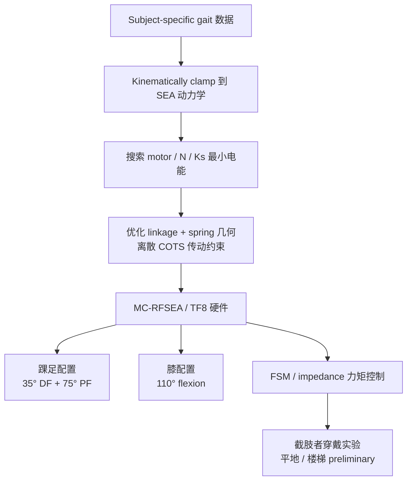

# TF8 / MC-RFSEA：Reaction-Force Series Elastic 仿生膝踝假肢

## 一句话定义

**TF8**（MIT Media Lab Biomechatronics，Matthew Carney 等，[IEEE TMRB 2021](https://doi.org/10.1109/TMRB.2021.3098921)）是面向 **无缆下肢 powered prostheses** 的 **moment-coupled cantilever-beam reaction-force SEA（MC-RFSEA / RFSEA）** 平台：同一执行器可配置为 **仿生踝或膝**，通过 **可更换 flat-plate composite 弹簧** 与 **ball-screw + 高极对 drone motor** 传动，在 **个性化惯量/动态** 与 **生物级 RoM/力矩/功率** 之间做 co-design。

## 英文缩写速查

| 缩写 | 英文全称 | 简要说明 |
|------|----------|----------|
| SEA | Series Elastic Actuator | 串联弹性执行器；TF8 用 cantilever-beam 反力路径测力 |
| MC-RFSEA | Moment-Coupled Reaction-Force SEA | TF8 论文命名的 moment-coupled cantilever-beam RFSEA |
| RFSEA | Reaction-Force Series Elastic Actuator | 反力式 SEA；博士论文中的平台统称 |
| eCOT | electric Cost Of Transport | 电能运输代价；踝配置平地 1.5 m/s 约 0.053 J/kg |
| RoM | Range of Motion | 关节活动范围；平台约 105–110° |
| PS | Parallel Spring | 并联弹簧；BioRob 2020 分析其在楼梯 vs 平地的 energetics 权衡 |

## 为什么重要

- **假肢执行器 co-design 范本**：把 **subject-specific gait** kinematically clamp 到 SEA 动力学，再搜索 motor / gear / spring 的 **最小电能** 组合——与「先选电机再凑传动」的 ad-hoc 流程形成对照。
- **SEA 在穿戴式场景的高性能实例**：相对 [Actuator 102 · 柔顺](../overview/humanoid-actuator-102-compliance-sensing.md) 中 Digit 等腿足 SEA，TF8 把 **反力传感 + 高带宽力矩控制** 推到 **175 N·m 峰值、286 W/kg 功率密度**，并做到 **~1.6 kg 膝系统**。
- **同一硬件、两种关节**：踝（35° 背屈 + 75° 跖屈）与膝（110°）共用 RFSEA 芯部，支撑 **Personalized Bionics for Dynamic Gait** 的「换弹簧板即换用户/profile」叙事。
- **弹簧拓扑选型证据链**：[BioRob 2020 姊妹文](../../sources/papers/tf8_springs_terrain_biorob_2020.md) 说明 **并联弹簧平地省能、楼梯可能更费电** — 解释 TF8 为何走 **串联反力弹簧** 而非 PEA 路线（对照 [IIT 双凸轮 PEA 踝](./paper-dual-cam-parallel-elastic-ankle.md)）。

## 核心信息

| 项 | 内容 |
|----|------|
| **机构** | 麻省理工（MIT）Media Lab · Biomechatronics Group（Hugh Herr 组） |
| **主要作者** | Matthew E. Carney（PhD 2020）；Tony Shu、Roman Stolyarov、Jean-Francois Duval 等 |
| **项目** | [Personalized Bionics for Dynamic Gait](https://www.media.mit.edu/projects/moment-coupled-cantilever-beam-series-elastic-actuator/overview/) |
| **形态** | 无缆 powered 踝足 / 膝假肢共用执行器（TF8） |
| **传动** | 高极对 drone motor → ball screw（可调 lead / 低减速比）→ 关节 |
| **弹性/传感** | Moment-coupled **cantilever-beam** 串联弹簧 + **reaction-force** 测力（FUTEK LCM300 load cell 集成叙事） |
| **规格（TMRB / Thesis）** | 标称 **85 N·m**；重复峰值 **175 N·m**；**105–110°** RoM；执行器 **1.4–1.6 kg**；系统踝 **2.2 kg**（含电池）、膝 **1.6 kg** |
| **控制** | 闭环路 **torque-controlled** 关节，可设 arbitrary impedance；踝 pilot 用 **有限状态机** |
| **开源** | **确认未开源** — 项目页无 GitHub/CAD；定制假肢硬件 + 内嵌 Verdin 等电子栈 |

## 流程总览

## 核心原理

### 1）Reaction-force SEA vs 经典 SEA

- 经典 SEA（Pratt & Williamson 1995，见 [Actuator 102 参考索引](../../sources/papers/humanoid_actuator_102_reference_catalog.md)）在传动链 **串联** 弹簧，用 spring deflection 估计力。
- TF8 用 **cantilever-beam** 弹性体 + **moment-coupled** 几何，使 **关节反力** 与 spring 应变建立可测关系 — 在假肢 **紧凑外形 + 高 RoM** 约束下集成 **FUTEK load cell** 级力传感（见 [FUTEK 案例](https://www.futek.com/prosthetic-leg-force-sensor-robotic-limb-load-cell-futek)）。
- 收益：保留 SEA 的 **柔顺、力控带宽与冲击缓冲**，同时逼近 **生物踝/膝力矩–角度包络**。

### 2）Gait-clamped 电能耗 co-design

1. 将目标关节 kinematics/kinetics **clamp** 到 SEA 状态方程；
2. 在 \((motor, N, K_s)\) 空间搜索 **electric energy optimal** 点；
3. 第二级优化 linkage/spring 形状，在 **离散** ball-screw / motor 库存下逼近目标。

[BioRob 2020](../../sources/papers/tf8_springs_terrain_biorob_2020.md) 在同一框架下比较 **Ks / Kp / RoM**：**并联弹簧** 利于平地但对 **楼梯** 可能增 eCOT；**限制 RoM** 有时比可变传动+PS 更省能 — TF8 选 **串联 + 足够 RoM** 是 terrain-aware 折中。

### 3）个性化：换弹簧板，不换电机芯

- Thesis 强调 commercial prostheses 的 **one-size-fits-all** 局限；TF8 通过 **swap flat-plate composite spring** 调惯量匹配与动态，同一芯部可服务不同 **体重/步态/运动模式**（economy vs sport）。
- 后续膝配置工程（Tony Shu、Eric Chun 等，见 [TF8 knee 升级页](https://elchun.github.io/project_pages/tf8_knee.html)）在既有踝硬件上增加 **end-of-travel stops** 与 **Verdin 电子栈** 集成 — 验证 **平台复用** 路径。

## 源码运行时序图

**不适用** — 截至 **2026-09-19** 项目页与 Media Lab Publications **未列** 官方 GitHub 或可运行仿真/固件包；硬件为 lab-custom prosthesis stack。

## 工程实践

| 项 | 说明 |
|----|------|
| 开源状态 | **确认未开源**（[项目页核查](../../sources/sites/mit_tf8_personalized_bionics.md)） |
| 力传感 | FUTEK **LCM300** load cell；USPS Forever stamp 以 TF8 代表 robotics 创新 |
| 控制栈 | Thesis 踝 pilot：**有限状态机** + 闭环路 torque/impedance；需与 MIT **Agonist-antagonist Myoneural Interface（AMI）** 等神经接口工作（Clites et al. 2018）区分 — 后者是 **体感/神经控制** 层，TF8 是 **机电执行器** 层 |
| 膝升级 | [elchun TF8 knee](https://elchun.github.io/project_pages/tf8_knee.html) 记录 Verdin 安装与行程限位 — **非官方** 维护页 |
| 复现入口 | 论文 + engrXiv 预印本 + MIT PhD thesis；**无** 公开 CAD/BOM |

## 实验与评测

| 场景 | 指标（论文报告） |
|------|------------------|
| 台架 | 力矩/带宽/功率包络验证设计规格 |
| 踝 · 平地 1.5 m/s | eCOT **0.053 J/kg**（TMRB preliminary）；N=3 膝下截肢 treadmill |
| 踝 · 生物对齐 | 净正功 **0.2 J/kg**、峰值力矩 **1.5 N·m/kg**、峰值功率 **4.3 W/kg** 在 intact-limb **1 SD** 内（Thesis） |
| 楼梯 | 1 受试 preliminary（Thesis）；BioRob 2020 提供 stairs eCOT 设计空间分析 |
| 媒体验证 | [IEEE Spectrum Video Friday（2020-08）](https://spectrum.ieee.org/video-friday-mit-media-lab-tf8-bionic-ankle) — 约十余人试穿戴 |

## 结论

TF8 把 **reaction-force SEA + gait-clamped 电能耗优化** 落到可穿戴 powered 膝/踝，在 **质量、RoM 与峰值力矩** 上同时逼近生物包络，是 lower-extremity **SEA co-design** 的标杆硬件论文；**无开源复现路径**，工程读者应将其作为 **架构与指标参照** 而非即插即用栈。

1. **架构真贡献** 是 MC-RFSEA **反力测力 + 可换 composite spring** 的 personalization，而非单一电机选型。
2. **175 N·m / 110° / ~1.6 kg** 定义了 2020 年前后 published powered leg 的 **Pareto 前沿**；读 newer prosthesis 论文应用同一标尺。
3. **BioRob 2020** 说明 PS 与 stairs 的冲突 — 勿把「平地 eCOT 最优」设计直接搬到 **大 RoM 楼梯** 任务。
4. **Torque-controlled impedance** 对 swing vs late-stance 不同惯性条件至关重要（Thesis 强调 high dynamic range）。
5. 与 [MIT Katz QDD 四足执行器](./paper-low-cost-modular-actuator-katz.md) 对照：假肢走 **SEA+高减速 ball screw**，四足走 **QDD+电流估力** — 任务约束（穿戴质量、冲击、RoM）驱动 **相反** 传动哲学。
6. 后续 Carney/Shu 组工作（如 2025 *Science* tissue-integrated bionic knee）在 **AMI 手术 + 膝系统** 上延续 TF8 机电线 — 本页覆盖 **TF8 执行器本体**。

## 与其他工作对比

| 路线 | 代表 | 弹性/传动 | 主要收益 | 与 TF8 差异 |
|------|------|-----------|----------|-------------|
| **MC-RFSEA（TF8）** | 本文 | 串联 cantilever-beam 反力 SEA + ball screw | 高 RoM/力矩、可 swap 弹簧 personalization | 定制硬件、未开源 |
| 经典 SEA | Digit / ANYmal 路线 | 传动链串联弹簧 | 柔顺力控 | 假肢级 RoM/功率密度指标不同 |
| PEA 并联弹性 | [IIT 双凸轮踝](./paper-dual-cam-parallel-elastic-ankle.md) | 并联气弹簧卸荷 | 静态持姿省能 | BioRob 2020：PS 楼梯可能更费电 |
| QDD 准直驱 | [Katz Mini Cheetah 执行器](./paper-low-cost-modular-actuator-katz.md) | 低减速、电流估力 | 高带宽、易 RL | 质量/RoM 不适合无缆假肢 |
| 商业 powered ankle | Össur / Ottobock 等 | 各厂商专有 | 上市产品 | 论文称当时无 commercial 系统达到 TF8 生物 RoM+torque+power 组合 |

## 局限与风险

- **Preliminary 人体数据**：TMRB 踝 eCOT 与 Thesis N=3 样本均为 early cohort； stairs 仅 1 人。
- **无开源**：机械、固件、控制器均不可复现；FUTEK 传感与 custom ball-screw 路径 **非 off-the-shelf**。
- **维护与耐久**：composite spring swap 的 **疲劳/校准** 与临床认证路径论文未展开。
- **控制复杂度**：FSM 踝控制器 vs 全阻抗/学习控制 — 与 newer Science 2025 膝系统相比，TF8 论文阶段 **未** 覆盖 tissue-integrated AMI 全栈。

## 关联页面

- [Actuator 102 · 柔顺与感知](../overview/humanoid-actuator-102-compliance-sensing.md) — SEA 理论位置
- [接触力环带宽](../concepts/contact-force-loop-bandwidth.md) — SEA 力控带宽权衡
- [阻抗控制](../concepts/impedance-control.md) — TF8 闭环路 torque/impedance 控制语境
- [执行器驱动链选型闭环](../queries/actuator-drive-chain-selection-loop.md) — co-design 在 ③ 执行器层
- [IIT 双凸轮 PEA 踝](./paper-dual-cam-parallel-elastic-ankle.md) — 并联弹性对照
- [Katz 低成本 QDD 执行器](./paper-low-cost-modular-actuator-katz.md) — MIT 另一条传动哲学

## 参考来源

- [tf8_reaction_force_sea_tmrb_2021.md](../../sources/papers/tf8_reaction_force_sea_tmrb_2021.md)
- [tf8_carney_phd_thesis_2020.md](../../sources/papers/tf8_carney_phd_thesis_2020.md)
- [tf8_springs_terrain_biorob_2020.md](../../sources/papers/tf8_springs_terrain_biorob_2020.md)
- [mit_tf8_personalized_bionics.md](../../sources/sites/mit_tf8_personalized_bionics.md)

## 推荐继续阅读

- [IEEE TMRB 2021 论文](https://doi.org/10.1109/TMRB.2021.3098921)
- [engrXiv 预印本](https://engrxiv.org/3wt5j/)
- [MIT Media Lab 项目页](https://www.media.mit.edu/projects/moment-coupled-cantilever-beam-series-elastic-actuator/overview/)
- [Matthew Carney Dissertation Defense（Media Lab）](https://www.media.mit.edu/events/matthew-carney-dissertation-defense/)
