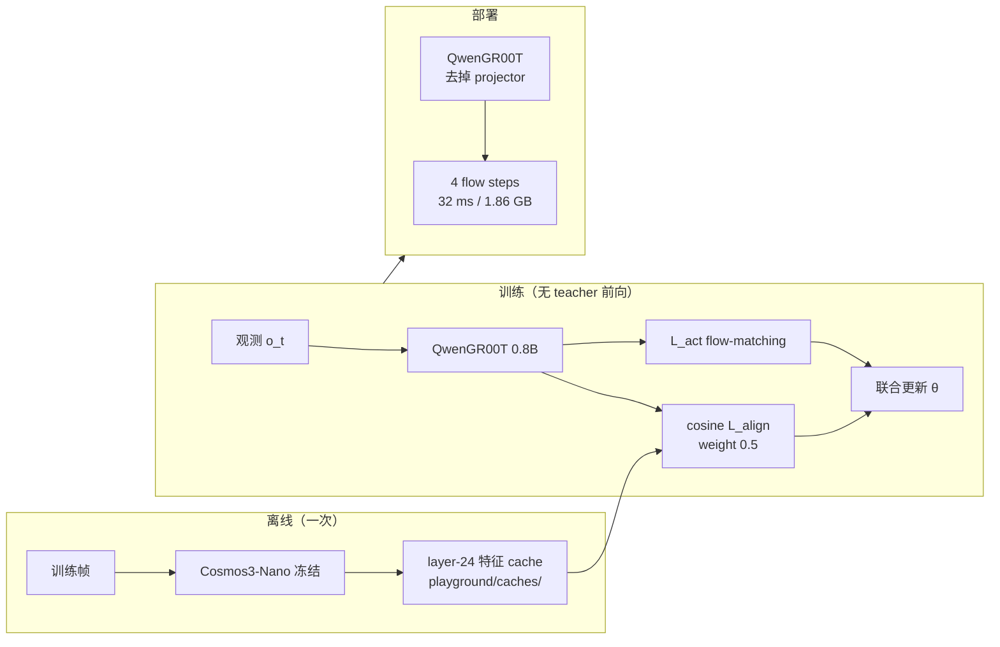
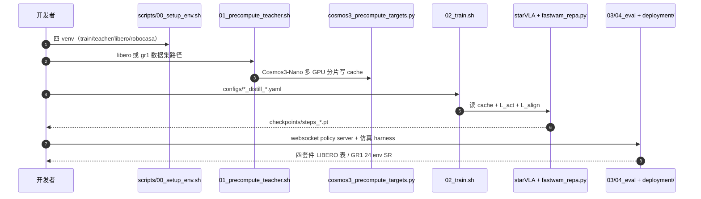

# THAW-VLA（arXiv:2609.24682）

**THAW-VLA**（*Think Like a World Model, Act Like a VLA*，UW–Madison / UIUC，[arXiv:2609.24682](https://arxiv.org/abs/2609.24682)）把 **世界模型的物理 grounding** 以 **表征蒸馏** 方式注入 compact VLA：冻结 teacher（默认 **Cosmos3-Nano**）对训练帧 **一次性预计算** layer-24 特征并缓存；学生 **QwenGR00T**（Qwen3.5-VL 0.8B + flow-matching expert，[StarVLA](../methods/star-vla.md)）在常规 action loss 上加 **cosine 对齐项**（权重 0.5），训练结束 **丢弃 projector**，推理 latency / 显存与未蒸馏 baseline **逐比特相同**。

## 一句话定义

用离线缓存的世界模型中间特征监督 VLA 视觉通路，让 0.8B 策略继承 WAM 级 grounding，而不在控制环里跑生成式世界模型。

## 英文缩写速查

| 缩写 | 英文全称 | 简要说明 |
|------|----------|----------|
| VLA | Vision-Language-Action | 视觉-语言-动作策略 |
| WAM | World Action Model | 联合预测未来与动作的世界动作模型 |
| REPA | Representation Alignment for Diffusion | 中间特征对齐范式；本文用于 WAM→VLA |
| LIBERO | Lifelong Benchmark for Robot Manipulation | 四套件仿真操作基准 |
| GR1 | Fourier GR1 humanoid | RoboCasa-GR1 人形双臂设定 |

## 为什么重要

- **解耦 grounding 与生成：** WAM 的因果/时序结构在 **特征** 里，不必在部署时 roll future — 直接回应 [world-action-models](../concepts/world-action-models.md) 的 **推理成本** 痛点。
- **零部署税：** 相对 DreamZero 等秒级 WAM，THAW-VLA 0.8B 在 RTX 5090 上 **32 ms / 1.86 GB**，图结构与 undistilled QwenGR00T 一致 — 增益可归因 **表征** 而非容量或 test-time compute。
- **小模型追大模型：** RoboCasa-GR1 上 0.8B 从 48.2%→50.5%，距 4B 同架构约 4.3 pt；真机 fruit pick-place 可与 4B π₀.₅ 对齐。
- **Teacher 可换：** V-JEPA2-AC、Fast-WAM、Cosmos3-Nano 均提升同一学生 — 说明信号是 **广谱表征先验**，非两网 fragile 对齐。

## 核心信息

| 字段 | 内容 |
|------|------|
| 机构 | 威斯康星大学麦迪逊分校（UW–Madison）、伊利诺伊大学厄巴纳-香槟分校（UIUC） |
| arXiv | [2609.24682](https://arxiv.org/abs/2609.24682) |
| 项目页 | <https://thaw-vla.trung-dt.com/> |
| 开源状态 | **已开源**（[GitHub](https://github.com/trungdt880/THAW-VLA)，MIT）；HF checkpoint **private** 需申请 |
| 真机 | AgileX Nero 单臂；TRIP-Bag 双臂 handover |

## 流程总览

## 核心原理

- **学生：** QwenGR00T = Qwen3.5-VL backbone + GR00T-style flow-matching action expert；$\mathcal{L}_{\mathrm{act}}$ 为 velocity regression on action chunk。
- **对齐：** 对学生 **pooled image tokens** 经 projector 与 cache 中 teacher 特征做 **方向 cosine**；teacher/student **无需同维**。
- **默认 teacher：** Cosmos3-Nano 8B，读 LM layer 24；LIBERO 双相机 → target_dim 8192，GR1 单 ego → 4096。
- **对照实验：** distill/baseline config 仅差 `use_repa` 与 cache 存在 — 隔离 alignment 项贡献。

## 源码运行时序图

节点对齐 [`sources/repos/thaw-vla.md`](../../sources/repos/thaw-vla.md) README 四阶段脚本。

## 工程实践

| 检查项 | 建议 |
|--------|------|
| Teacher 成本 | Cosmos3 ~33 GB；**预计算一次** 后训练不再加载 teacher |
| 环境隔离 | transformers / robosuite 版本冲突 — 按 README 分四个 venv，勿混装 |
| 复现实验 | distill 与 baseline 成对 config；并发训练改 `MAIN_PORT` |
| Checkpoint | HF 权重须放在 `checkpoints/` 子目录且带 `dataset_statistics.json`，否则动作未归一化 SR≈0 |
| 部署读法 | 推理 **4 flow steps**；alignment 模块已剥离 — 与 [VLA](../methods/vla.md) 小模型部署栈一致 |
| 开源边界 | 代码 MIT 全链路；发布权重 private；Cosmos3 teacher 需自备 |

## 实验与评测读法

- **LIBERO：** 四套件均值 95.3%→**97.9%**（0.8B）；仿真 **4 evaluation runs** 均值（2 seeds × 2 GPUs）。
- **RoboCasa-GR1：** 48.2%→**50.5%**；单 ego、29-D 双臂；仍低于 4B 强基线（如 ACE-Ego-0 72.8%）。
- **真机：** 三任务各 30 trials；fruit 93.3% 追平 π₀.₅ 4B；失败多为 **放置末段误差** 非感知。
- **消融：** 换 InternVL 1B / Qwen3-VL 4B、对齐层 L8–L24、三类 teacher 均稳定增益 — recipe **鲁棒**。

## 与其他工作对比

| 维度 | THAW-VLA（本页） | 在控制环里跑生成式世界模型 | 不做蒸馏的同尺寸 VLA |
|------|-------------------|-----------------------------|------------------------|
| WM 参与时机 | **仅训练期**，teacher 特征离线缓存一次 | **推理期** 每步前向 | 不参与 |
| 部署开销 | 与 baseline **逐比特相同**（4 flow steps / 32 ms / 1.86 GB） | 显著增加延迟与显存 | 同本页 |
| 收益来源 | 视觉通路继承 WAM 级 grounding | 显式未来预测 | — |
| 报告增益 | LIBERO **97.9%**、真机 **+10 pt** | — | 基线 |
| 主要代价 | 需一次性缓存 teacher 特征（磁盘 + 预处理） | 在线算力 | — |

- **这是「把世界模型的知识搬走，但不把世界模型搬上车」：** projector 在训练结束即丢弃，因此它 **不属于** 推理期使用世界模型的那一类方法；比较时若把它和在线 WM 方法放在同一延迟轴上，会错判它的成本结构。
- **可复现性不对称：** 代码 **已开源（MIT）**，但 HF checkpoint **private 需申请**——第三方可以重跑训练流程，未必能直接复现报告的 checkpoint 成绩，引用时应注明。
- **teacher 依赖：** 增益绑定 **Cosmos3-Nano layer-24 特征** 这一具体选择；换 teacher 或换层需重新验证，别把结论读成「任何 WM 特征都能蒸馏出 +10 pt」。

## 结论

**THAW-VLA 证明 WAM 的物理 grounding 可以「训练时借、部署时不还」，是小 budget VLA 追大模型精度的可复现配方。**

1. **离线 cache + cosine 对齐** 是唯一新增项；部署图与 undistilled 相同 — 适合工业 latency 预算。
2. **0.8B 在 LIBERO 近 98%** 说明表征蒸馏可补 data coverage 外的 OOD 短板，而非靠堆参数。
3. **Teacher 族无关性**（JEPA / Fast-WAM / Cosmos）支持「时序预测目标 → 特征先验」叙事，非单点 hack。
4. 复现需 **Cosmos3 预计算 + 四 venv**；HF 权重 private — 自训 distill/baseline 对仍可做 ablation。
5. 与 [GIFT](./paper-gift-intermediate-feature-training.md) 同属 **中间特征监督** 线，但 THAW-VLA teacher 来自 **WAM** 且 **零推理税**。

## 局限与风险

- **Teacher 依赖：** 默认 Cosmos3-Nano 体积与预计算算力不低；换小 teacher 增益递减但仍为正。
- **GR1 绝对 SR：** 50.5% 距 SOTA 4B 仍有差距 — 蒸馏 **缩小** 而非 **消除** 规模差距。
- **真机样本：** 三任务 × 30 trials — 统计力有限；placement 失败提示仍缺精细接触建模。
- **权重访问：** 官方 checkpoint private — 社区复现优先走完整 train pipeline。

## 关联页面

- [VLA](../methods/vla.md)
- [StarVLA](../methods/star-vla.md)
- [World Action Models](../concepts/world-action-models.md)
- [GIFT 中间特征训练](./paper-gift-intermediate-feature-training.md)
- [Manipulation](../tasks/manipulation.md)

## 参考来源

- [thaw_vla_arxiv_2609_24682.md](../../sources/papers/thaw_vla_arxiv_2609_24682.md)
- [thaw-vla-trung-dt-com.md](../../sources/sites/thaw-vla-trung-dt-com.md)
- [thaw-vla.md](../../sources/repos/thaw-vla.md)
- [arXiv:2609.24682](https://arxiv.org/abs/2609.24682)

## 推荐继续阅读

- [THAW-VLA 项目页](https://thaw-vla.trung-dt.com/)
- [GitHub: trungdt880/THAW-VLA](https://github.com/trungdt880/THAW-VLA)
- [StarVLA](https://github.com/starVLA/starVLA)
- [Fast-WAM（arXiv 相关 WAM teacher 消融）](../entities/paper-sa-2606-05254-flash-wam-modality-aware-distillation-for-world.md)
