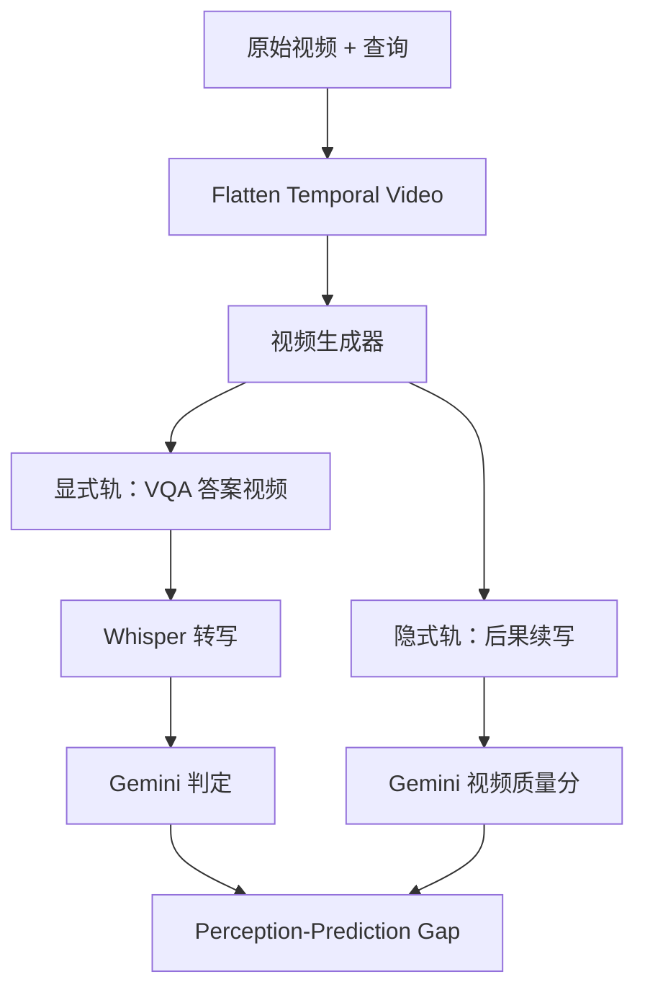
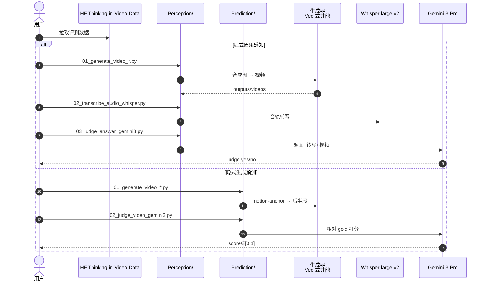

# Thinking in Video（视频生成器能否对真实世界做因果推理？）

**Thinking in Video**（*Can Video Generators Really Reason About the Real World?*，[arXiv:2607.17523](https://arxiv.org/abs/2607.17523)，2026，Yongheng Zhang / Guang Yang / Ruihan Hou / Qiguang Chen 等 · **中南大学 / 腾讯 / 清华大学**；[代码](https://github.com/BRZ911/Thinking-in-Video)、[数据](https://huggingface.co/datasets/BRZ911/Thinking-in-Video-Data)）把「用视频生成模型模拟并推理世界」重定义为一种推理范式，并给出 **Causal-Generative Dual-Judge（CGDJ）** 来审计：模型是否 **读得懂** 因果情景，以及是否 **演得出** 一致的后果视频。

## 一句话定义

**视频不应只是特效产物，而应是构造、延展与验证因果思维的介质；CGDJ 用「扁平时空感知」与「后果生成」双轨测量世界模型一致性，并暴露感知–预测鸿沟。**

## 英文缩写速查

| 缩写 | 英文全称 | 简要说明 |
|------|----------|----------|
| CGDJ | Causal-Generative Dual-Judge | 显式感知 + 隐式生成双轨审计 |
| FTV | Flatten Temporal Video | 多帧铺网格成单张合成图的探测协议 |
| PPG | Perception-Prediction Gap | 感知近零但仍能出像样动力学的鸿沟 |
| VQA | Visual Question Answering | 显式因果轨的问答形式 |
| MLLM | Multimodal Large Language Model | Gemini-3-Pro 等评判器 |
| WM | World Model | 本文审计的「世界模拟器」叙事对象 |
| I2V | Image-to-Video | 多数生成器的条件接口 |

## 为什么重要

- **挑战「世界模拟器」话术：** 开源模型可出 **中等可信续写**，但显式因果感知 **近乎崩溃**——直接服务 [物理保真度输出轴](../overview/world-model-physics-fidelity-outputs.md)「画面连续 ≠ 动力学/因果」。
- **补齐指标缺口：** 分布型保真（光滑、真实感、文对齐）与语义逻辑长期分裂；CGDJ 强制同框架对照。
- **可复现评测资产：** 官方 `Perception/` + `Prediction/` 流水线与 HF 数据公开，便于换生成器比 Gap。
- **与机器人评测互补：** [KineBench](./paper-kinebench.md) 问可执行性；[iKCE](./paper-imagined-rollouts-kinematic-not-dynamic.md) 问动力学敏感；本页问 **因果读写是否对齐**。

## 核心信息

| 项 | 内容 |
|----|------|
| 机构 | 中南大学、腾讯、清华大学 |
| 基准规模 | ~**1500** 视频（Video-MME 900 + 成对因果 600） |
| 评判 | Gemini-3-Pro；Whisper-large-v2 转写 |
| 示例生成器 | Veo 3.1（脚本）；评测覆盖 Wan-2.2-14B、HunyuanVideo-1.5、Sora-2、Veo-3.1 等 |
| 代码 / 数据 | GitHub + HF **已开源**（2026-07-27） |
| 许可证 | API 未见 SPDX；以 README / 引用要求为准 |

## 核心原理（方法）

### Thinking in Video 范式

生成器被要求：把视频情景当作推理题（理解因果结构），并把推理结果 **渲染** 为时间上一致的未来——而非仅选择文本答案或堆叠好看像素。

### Flatten Temporal Video

因多数视频生成器只接受静态图条件：

| 变体 | 做法 | 用途 |
|------|------|------|
| **显式感知** | 均匀采 \(N{=}70\) 帧 → \(7{\times}10\) 网格；上方栅格化 query；合成 \(1280{\times}720\) | 扁平时空 VQA |
| **隐式预测** | \(N{=}7\) 关键帧水平拼接成 motion-anchor「时间箭头」 | 条件化后果生成 |

### Causal-Generative Dual-Judge

| 轨 | 问题 | 评判 |
|----|------|------|
| **Explicit Causal Perception** | 是否读懂时空因果（非仅续写） | 生成视频 + Whisper 转写 + 题面 → Correct/Incorrect |
| **Implicit Generative Prediction** | 是否把后果演成一致未来 | 相对 gold 视频打 Semantic Alignment / Reference Consistency / Physical Validity ∈ [0,1] |

### 流程总览

## 源码运行时序图

节点对齐 [`sources/repos/thinking-in-video.md`](../../sources/repos/thinking-in-video.md)。

- **最短路径：** 配 `GOOGLE_API_KEY` → 跑通 Perception 三阶段或 Prediction 两阶段。
- **换模型：** 按 jsonl 生成到 `outputs/<model>/`，复用 judge 阶段比较 Gap。

## 实验要点（索引级）

| 轴 | 报告口径（以论文 / README 为准） |
|----|--------------------------------|
| 开源生成器 | Wan-2.2-14B、HunyuanVideo-1.5：**显式感知近零**，续写中等可信 |
| 闭源生成器 | Sora-2、Veo-3.1：感知–生成对齐 **更强但仍有限** |
| 主发现 | 清晰 **Perception-Prediction Gap** |
| 附加 | **音画错位** — 口头因果常比画面因果更可靠 |
| 数据构成 | Natural Sciences + Sociology & Humanities 因果子集 |

## 工程实践

| 项 | 实践要点 |
|----|----------|
| 环境 | Python 3.11；`pip install -r requirements.txt` |
| 密钥 | Gemini /（可选）Veo；Whisper 权重 |
| 扩模型 | 只换 Stage-1 生成，保留 judge 脚本以保持标尺 |
| 读结果 | 同时看 `judge` 与 `score`；单看续写分会掩盖感知塌陷 |
| 与机器人榜 | 本基准偏 **通用视频因果**；操纵可执行性另挂 [KineBench](./paper-kinebench.md) |

## 结论

**当前视频生成器最多只是部分具备 Thinking in Video 能力：可以「演得像」，却常常「读不懂」；CGDJ 把这条鸿沟变成可对比的双轨分数。**

1. **范式重定义** — 视频是因果思维介质，不只是渲染输出。
2. **Flatten Temporal Video** — 让只吃静态图的生成器可测时空因果。
3. **双轨必看** — 缺显式感知的高续写分不可解读为世界模拟成功。
4. **开源近零感知** — Wan / Hunyuan 类结果警示「动力学外观」幻觉。
5. **闭源仍有限** — Sora-2 / Veo-3.1 更好，但未消除 Gap。
6. **音画错位** — 文本/音频通道可能掩盖视觉因果失败。
7. **资产可用** — 代码 + HF 数据已开源，便于持续压测新模型。

## 局限与风险

- **评判器依赖：** Gemini-3-Pro 本身有偏；换 judge 需重标定。
- **非操纵专用：** 与 ManiSkill 成功、真机策略相关无直接等价。
- **API 成本：** 大规模扫模型需生成 + 多模态评判预算。
- **许可证不清：** 入库日 GitHub `license: null`；商用前需与作者确认。

## 与相邻工作的对比（分界）

| 对比轴 | Thinking in Video | [KineBench](./paper-kinebench.md) | [Imagined Rollouts…](./paper-imagined-rollouts-kinematic-not-dynamic.md) |
|--------|-------------------|-----------------------------------|---------------------------------------------------------------------------|
| **主问** | 因果读写是否对齐 | 轨迹能否仿真执行 | 想象是否动力学条件化 |
| **对象** | 通用视频生成器 | 具身操纵视频 WM | Latent MBRL WM |
| **协议** | CGDJ + FTV | 6D EEF 闭环 | iKCE + 摩擦扫描 |
| **开源** | 代码+数据 | MIT 管道 | 未开源 diagnostic |

## 关联页面

- [世界模型物理保真度输出轴](../overview/world-model-physics-fidelity-outputs.md)
- [Generative World Models](../methods/generative-world-models.md)
- [Video-as-Simulation](../concepts/video-as-simulation.md)
- [Wan](./paper-wan-video.md) — 文中开源生成器谱系
- [KineBench](./paper-kinebench.md)
- [Imagined Rollouts…](./paper-imagined-rollouts-kinematic-not-dynamic.md)
- [Masked Visual Actions](./paper-masked-visual-actions.md)
- [EWMBench](./ewmbench.md)

## 参考来源

- [Thinking in Video 论文归档（arXiv:2607.17523）](../../sources/papers/thinking_in_video_arxiv_2607_17523.md)
- [BRZ911/Thinking-in-Video 代码索引](../../sources/repos/thinking-in-video.md)
- [具身智能研究室 · 世界模型物理保真度导读](../../sources/blogs/wechat_embodied_ai_lab_world_model_physics_fidelity.md)

## 推荐继续阅读

- [arXiv:2607.17523](https://arxiv.org/abs/2607.17523)
- [GitHub — BRZ911/Thinking-in-Video](https://github.com/BRZ911/Thinking-in-Video)
- [HF Dataset — Thinking-in-Video-Data](https://huggingface.co/datasets/BRZ911/Thinking-in-Video-Data)
- [KineBench](./paper-kinebench.md) — 执行向互补评测
