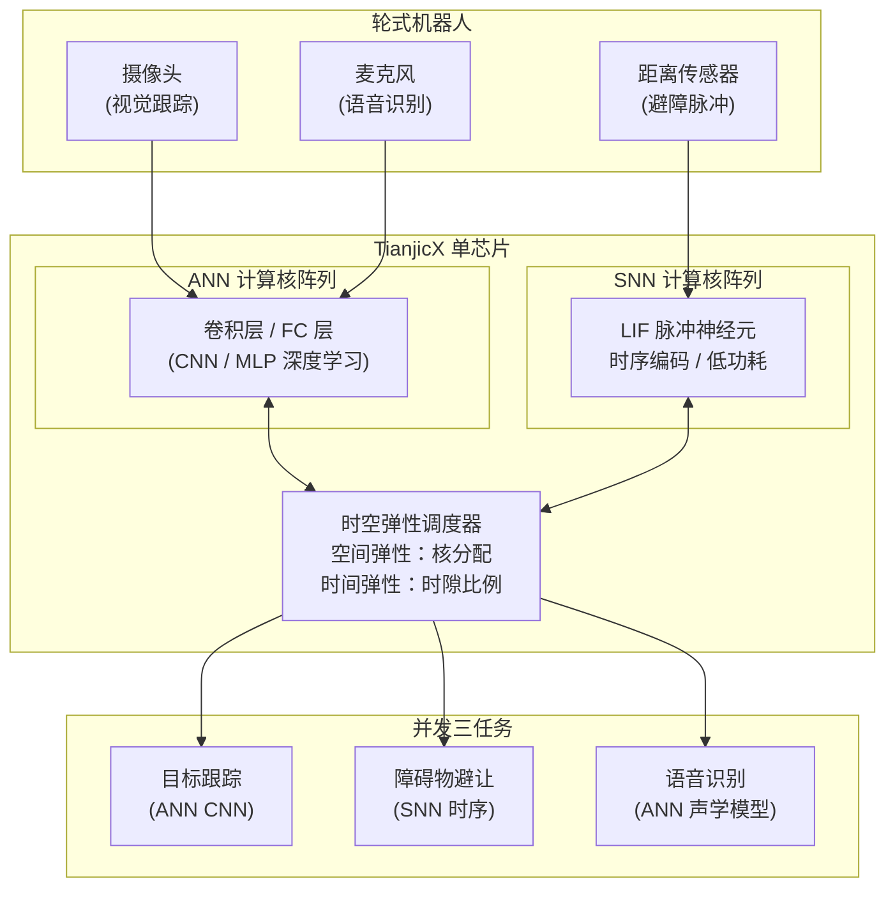

# TianjicX：面向多任务机器人的时空弹性神经形态芯片

**Neuromorphic computing chip with spatiotemporal elasticity for multi-intelligent-tasking robots**（Shi Luping（施路平）等，清华大学类脑计算研究中心，**Science Robotics 2022**，[DOI:10.1126/scirobotics.abk2948](https://doi.org/10.1126/scirobotics.abk2948)）提出 **TianjicX** 神经形态芯片：在单片上以**时空弹性**调度机制动态分配 **ANN（深度学习）**与 **SNN（脉冲神经网络）**计算核，使轮式机器人在**边缘低功耗**条件下并发执行**目标跟踪、障碍物避让、语音识别**三项异构智能任务，是继 Tianjic（Nature 2019）之后清华类脑计算团队在机器人系统级集成方向的里程碑进展。

## 一句话定义

**TianjicX 是清华类脑计算研究中心在单芯片上同时运行 ANN 深度学习与 SNN 脉冲网络的神经形态芯片，通过时空弹性调度实现轮式机器人多任务低功耗并发智能。**

## 英文缩写速查

| 缩写 | 英文全称 | 简要说明 |
|------|----------|----------|
| SNN | Spiking Neural Network | 脉冲神经网络；以稀疏脉冲编码时序信息，天然低功耗 |
| ANN | Artificial Neural Network | 人工神经网络（含 CNN / MLP 等深度学习架构） |
| LIF | Leaky Integrate-and-Fire | 泄漏积分放电模型；SNN 中最常用的神经元模型 |
| CBICR | Center for Brain-Inspired Computing Research | 清华大学类脑计算研究中心；TianjicX 研发机构 |
| STDP | Spike-Timing-Dependent Plasticity | 脉冲时序依赖可塑性；SNN 本地学习规则 |
| FPGA | Field-Programmable Gate Array | 现场可编程门阵列；TianjicX 前期验证平台 |
| NPU | Neural Processing Unit | 神经处理单元；TianjicX 对标的 ANN 专用加速器 |

## 为什么重要

- **单芯片异构并发：** ANN 精度高但功耗大；SNN 低功耗但表达力受限；TianjicX 是**两者在同芯片并发运行的完整系统演示**，突破了"要性能还是要功耗"的二选一困境。
- **机器人实体验证：** 不只是芯片 benchmark，而是**集成到真实轮式机器人上跑通三任务**——目标跟踪（视觉）、避障（距离传感时序）、语音识别（声学）——这是芯片研究与机器人系统研究的重要交叉点。
- **Tianjic 谱系承接：** 2019 年 Nature 发表的 Tianjic 首次证明 ANN+SNN 可共存于单芯片，TianjicX 进一步引入**时空弹性**使多任务分时/空间动态调度成为可能，为后续 [NeuroGPR](./paper-neurogpr-brain-inspired-place-recognition.md) 等工作奠定基础。
- **边缘机器人计算范式：** 为受功耗约束的移动机器人提供了比纯 GPU/TPU 更轻量的板载智能计算路径。

## 芯片架构总览

## 核心机制（提炼）

| 机制 | 设计 | 作用 |
|------|------|------|
| **空间弹性** | 芯片核在 ANN/SNN 模式间动态重配 | 不同任务按需分配计算核数量 |
| **时间弹性** | 各任务计算时隙比例运行时可调 | 高优先任务获更多时隙，低优先省功耗 |
| **ANN 核** | 支持卷积、池化、全连接 | 处理视觉跟踪与语音识别精度敏感任务 |
| **SNN 核** | LIF 脉冲神经元、STDP 学习 | 处理距离传感器时序脉冲，极低脉冲稀疏功耗 |
| **片上互联** | ANN↔SNN 核间低延迟路由 | 允许 ANN 输出激活 SNN，或 SNN 触发 ANN |

## Tianjic 系谱对比

| 芯片 | 发表 | 核心创新 | 机器人演示 | 任务数 |
|------|------|----------|-----------|--------|
| **Tianjic** | Nature 2019 | ANN+SNN 首次单芯片共存 | 无人自行车平衡 + 识别 | 2 |
| **TianjicX** | Science Robotics 2022 | **时空弹性**多任务调度 | 轮式机器人三任务并发 | **3** |
| **NeuroGPR** 应用 | Science Robotics 2023 | 混合 ANN+SNN 多模态位置识别 | 四足机器人场所识别 | 1（专项） |

## 实验与评测

- **三任务并发验证：** 目标跟踪成功率、避障响应延迟、语音识别准确率三项指标同时达到可用水平（论文 Table 1–2）。
- **功耗对比：** 相比全 ANN 方案，TianjicX 混合方案在相同任务集下总功耗显著降低（论文 Fig. 5，具体数值见原文）。
- **多任务竞争验证：** 通过调整时空弹性参数，在计算资源竞争场景下验证三任务协同不崩溃。
- **机器人闭环：** 轮式机器人在室内环境完成"跟踪目标人 + 躲避障碍 + 响应语音指令"联合演示。

## 局限与风险

- **编程工具链：** SNN 模型的设计与训练工具链（如 SpikingJelly、Norse）成熟度远低于 PyTorch/TensorFlow；移植和调试门槛高。
- **ANN 精度上限：** 受芯片资源约束，ANN 核的模型规模远小于 GPU 服务器方案；复杂场景下精度仍低于专用加速器。
- **演示平台限制：** 轮式机器人演示相对简单；足式/人形等动力学复杂平台的集成尚未验证。
- **无公开代码：** 截至入库日（2026-07-20）无 GitHub 或 IP 授权开放；学术复现需依赖论文描述。
- **SNN 训练难度：** SNN 梯度不连续，STBP（时空反向传播）等代理梯度方法精度仍有差距；多任务端到端训练复杂度高。
- **源码运行时序图：** 不适用（无公开可运行代码）。

## 工程实践

- **类脑计算研究入口：** 国内研究者可通过清华 CBICR 的合作渠道了解 TianjicX 开发板；商业化产品（寒武纪、燧原等）可作为替代平台对比评估。
- **SNN 框架替代：** 开源 SNN 框架推荐 SpikingJelly（北京大学）、Norse（PyTorch 生态）；训练后可映射至 FPGA 原型验证混合推理效果。
- **低功耗机器人计算路线：** 若主要目标是降低边缘功耗而非复现 TianjicX，可先评估 Jetson Orin NX（ANN 专用）与 Intel Loihi 2（SNN 专用）的混合部署方案。
- **ANN+SNN 混合设计原则：** 将**高精度、低频决策**任务（如目标识别）分配给 ANN 核；将**高频、时序响应**任务（如传感器脉冲处理）分配给 SNN 核——TianjicX 的核心分工思路。

## 参考来源

- [深蓝AI：近五年 Science Robotics 中国顶尖高校盘点](../../sources/blogs/wechat_shenlan_scirobotics_china_top3_2026-07-02.md)
- [TianjicX 神经形态芯片论文归档（Science Robotics 2022）](../../sources/papers/tianjicx_neuromorphic_scirobotics_2022.md)
- Shi Luping et al., *Neuromorphic computing chip with spatiotemporal elasticity for multi-intelligent-tasking robots*, [Science Robotics 2022](https://doi.org/10.1126/scirobotics.abk2948)
- Pei et al., *Towards artificial general intelligence with hybrid Tianjic chip architecture*, Nature 2019（前代 Tianjic）

## 关联页面

- [NeuroGPR：脑启发多模态混合神经网络位置识别](./paper-neurogpr-brain-inspired-place-recognition.md)
- [Locomotion 任务页](../tasks/locomotion.md)

## 推荐继续阅读

- [Science Robotics 论文页](https://doi.org/10.1126/scirobotics.abk2948)
- [清华大学类脑计算研究中心（CBICR）](https://cbicr.tsinghua.edu.cn/)
- Pei et al., *Towards artificial general intelligence with hybrid Tianjic chip architecture*, [Nature 2019](https://doi.org/10.1038/s41586-019-1424-8)
