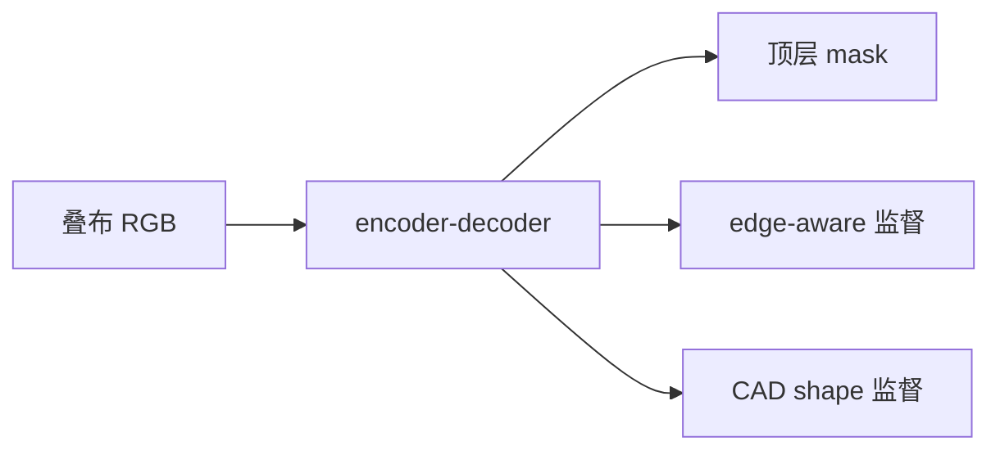

# 顶层布料分割：软物体操作常输在边界

**顶层布料分割**（*Precise Top-Layer Fabric Segmentation for Fabric Destacking with Edge- and Shape-Aware Deep Networks*；[arXiv:2608.10648](https://arxiv.org/abs/2608.10648)，[代码](https://github.com/bhattner143/top-layer-fab-seg)）由 **香港大学 / 大阪大学** 提出（IEEE ICMA 2025）：布料分拣要先认出最上一层，层间边界细、外观几乎一样。

## 一句话定义

**在 encoder-decoder 上同时用边缘分支和 CAD 形状分支监督，专门分割叠布的最顶层区域。**

## 英文缩写速查

| 缩写 | 英文全称 | 简要说明 |
|------|----------|----------|
| Destacking | Fabric destacking | 从叠层中取走顶层布料 |
| CAD | Computer-Aided Design | 形状分支的参考 mask 来源 |
| IoU | Intersection over Union | 分割评测常用（正文未给表） |
| EEF | End-Effector | 下游抓取执行层，本文不做 |
| ICMA | IEEE International Conference on Mechatronics and Automation | 发表会议 |

## 为什么重要

- 软物体操作失败经常发生在感知：抓偏一层或抓到两层。
- 纯语义分割被纹理骗，纯边缘分割被褶皱骗；需要形状先验。
- 提醒策略工作：分拣基准若没有顶层 mask，成功率不可读。

## 核心信息

| 项 | 内容 |
|----|------|
| **机构** | 香港大学（HKU）；大阪大学（Osaka University） |
| **会议** | IEEE ICMA 2025 |
| **开源** | **宣称开源 / 仓为空**（2026-08-18） |

## 核心原理

### 方法栈

主干 encoder-decoder。**edge-aware branch** 强化层间边界；**shape-aware branch** 用 CAD 参考 mask 拉整体外形。两路只作训练监督，推理走主干。

### 流程总览

## 工程实践

| 项 | 建议 |
|----|------|
| 源码运行时序图 | **不适用**（GitHub 空仓） |
| 落地 | 先自备真机叠布数据；不要等官方仓 |
| 下游 | mask 之后才是吸盘/夹爪轨迹，本文停在感知 |

## 实验与评测

真机布料数据集上优于已有语义/边缘基线，并做多分支消融。摘要未报告具体 IoU / 边界 F 值——读论文图表，不要引用公众号转述当数字。

## 与其他工作对比

相对通用分割：任务定义是 **顶层实例**，不是「布料 vs 背景」。相对 [双臂灵巧抓取](./paper-real-bi-dex-grasp.md)：本页解决薄层感知，后者解决大物体双臂接触。相对接触策略综述：分拣链路的瓶颈可以在视觉边界，而不在力控。

## 结论

**叠布分拣先把顶层边界和整体形状同时监督住，再谈抓取策略。**

1. **双分支是训练技巧** — 推理仍是一张 mask。
2. **CAD 形状很关键** — 没有参考外形时方法降级。
3. **代码未落地** — 入库日仓为空，复现只能按论文重写。
4. **别把分割成功率当抓取成功率。**

## 局限与风险

- 官方仓为空，无法核对训练超参与数据协议。
- CAD mask 假设布料外形已知；乱堆异形布可能失效。
- 未涉及滑移、粘连、双层同时抬起的力学。

## 关联页面

- [Manipulation](../tasks/manipulation.md)
- [Contact-Rich Manipulation](../concepts/contact-rich-manipulation.md)
- [感知栈选型闭环](../queries/robot-perception-stack-selection-loop.md)
- [真机双臂灵巧抓取](./paper-real-bi-dex-grasp.md)

## 参考来源

- [论文摘录](../../sources/papers/top_layer_fabric_seg_arxiv_2608_10648.md)
- [GitHub 归档](../../sources/repos/top-layer-fab-seg.md)
- [具身智能小站 10 篇盘点（2026-08-18）](../../sources/blogs/wechat_embodied_station_contact_predict_adapt_10_papers_2026-08-18.md)

## 推荐继续阅读

- [arXiv:2608.10648](https://arxiv.org/abs/2608.10648)
- [bhattner143/top-layer-fab-seg](https://github.com/bhattner143/top-layer-fab-seg)（持续核是否仍空）
