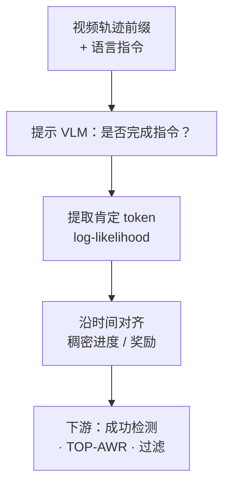
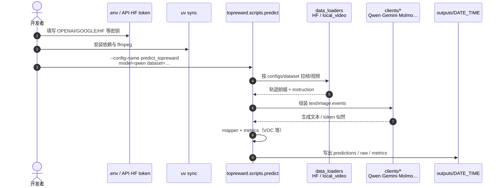

# TOPReward：Token 概率作零样本机器人进度奖励

**TOPReward**（*Token Probabilities as Hidden Zero-Shot Rewards for Robotics*，[arXiv:2602.19313](https://arxiv.org/abs/2602.19313)，[项目页](https://topreward.github.io/webpage/)，[代码](https://github.com/TOPReward/TOPReward)）由 **华盛顿大学（UW）** / **艾伦人工智能研究所（AI2）** / **亚马逊（Amazon）** / **北卡罗来纳大学教堂山分校（UNC–Chapel Hill）** 提出：不训练专用 reward 模型，直接读预训练**视频 Vision-Language Model（VLM）**内部对肯定回答 token 的概率，估计多样真机操作任务的进度。

## 一句话定义

**把「指令 + 轨迹前缀」喂给视频 VLM，用肯定完成 token（如 `True`）的 log-likelihood 当作训练无关的稠密进度奖励。**

## 英文缩写速查

| 缩写 | 英文全称 | 简要说明 |
|------|----------|----------|
| TOPReward | Token Probabilities as Hidden Zero-Shot Rewards | 本文方法：token 似然作零样本进度 |
| VLM | Vision-Language Model | 提供视频–语言先验的骨干 |
| GVL | Generative Value Learning | 让 VLM 生成完成百分比的对照基线 |
| VOC | Value-Order Correlation | 进度曲线与真值完成序的秩相关指标 |
| AWR / TOP-AWR | Advantage-Weighted Regression | 用 TOPReward 作 advantage 权重的 BC |
| OXE | Open X-Embodiment | 大规模跨本体操作数据评测轴之一 |
| ManiRewardBench | Manipulation Reward Benchmark | 作者自建真机进度/奖励基准 |

## 为什么重要

- **过程奖励零样本落地：** 属于 [过程奖励建模](../concepts/progress-reward-modeling.md) 中「冻结基础模型打分」范式，但刻意避开 VLM 数值生成弱点。
- **跨平台证据：** OXE（39 数据集）+ ManiRewardBench（113 任务 / Franka·YAM·SO-100/101 等）上，开源骨干（尤其 Qwen3-VL）相对 GVL 提升巨大。
- **可复现工程入口：** MIT 代码仓 + HF 上的 ManiRewardBench 子集，适合做数据过滤、成功检测与离线加权 BC。

## 核心信息

| 项 | 内容 |
|----|------|
| **机构** | 华盛顿大学（UW）；艾伦人工智能研究所（AI2）；亚马逊（Amazon）；北卡罗来纳大学教堂山分校（UNC–Chapel Hill） |
| **问题** | 通用、指令条件、跨域可迁移的过程奖励；避免任务特定 reward 训练 |
| **核心机制** | 轨迹前缀上查询「是否完成指令」→ 取 `True` 等 token 的 log-likelihood → 时序对齐成进度 |
| **评测** | OXE Mean VOC（Qwen3-VL）**0.857**；ManiRewardBench Mean VOC **≈0.94–0.95** |
| **下游** | 成功检测（ROC-AUC）；SO-100 上 TOP-AWR 相对 BC 提升成功次数 |
| **开源** | **已开源（MIT）**：<https://github.com/TOPReward/TOPReward>；基准数据见 HF `ajyanggg/manirewardbench_*` |

## 流程总览

## 核心原理

1. **Prompted video–language inference** — 不问「完成了百分之几」，而问「当前前缀是否已完成该指令」。
2. **Token-probability reward** — 用肯定回答 token 的似然，绕过数值生成与弱指令跟随。
3. **Prefix alignment** — 对越来越长的前缀重复打分，得到单调性更好的进度曲线；实验中常做 **per-episode min-max** 归一（跨轨迹绝对可比性受限）。
4. **对照 GVL** — GVL 让模型在打乱帧上输出 0–100% 完成度；TOPReward 在开源 VLM 上通常更稳、更单调。

## 源码运行时序图

官方仓库 [TOPReward/TOPReward](https://github.com/TOPReward/TOPReward)（归档见 [sources/repos/topreward.md](../../sources/repos/topreward.md)）以 Hydra 实验配置驱动推理，不训练专用 reward 权重：

- **最短复现路径：** `uv sync` → `.env` → `predict_topreward`（或 `run_predict.sh`）→ 查看 `outputs/`。
- **对照基线：** 同一入口换 `predict_gvl`；本地单视频可用 `dataset=local_video` + `data_loader=local`。

## 工程实践

| 项 | 建议 |
|----|------|
| 骨干选择 | 优先试 **Qwen3-VL-8B**（项目页开源骨干上优势最大）；Molmo-2 亦可用 |
| 提示与模板 | Qwen 等可能需 `prediction.add_chat_template=true` |
| 标定 | 先做 episode 内归一；跨轨迹比较前先想清楚 VOC vs 绝对进度 |
| 成功检测 | 用末几帧平均 log-likelihood，不要只用 VOC（失败轨迹也可能高 VOC） |
| 离线 IL | 用进度差分 / advantage 做 [AWR](../methods/awr.md) 加权（TOP-AWR） |
| 依赖 | `uv`、ffmpeg、可选 HF token；商用模型需对应 API key |
| License | 仓 MIT；注意 NOTICE 中 OpenGVL / LeRobot 衍生文件 |

## 实验与评测

### 进度估计（Mean VOC，越高越好）

| 设定 | 骨干 | GVL | TOPReward |
|------|------|-----|-----------|
| OXE（39 datasets） | Qwen3-VL-8B | 0.194 | **0.857** |
| OXE | Molmo-2-8B | -0.016 | **0.417** |
| ManiRewardBench（汇总） | Qwen3-VL-8B | ~0.2–0.5 | **≈0.94–0.95** |

ManiRewardBench 分平台（LeRobot / Franka / 双臂·单臂 YAM）上，Qwen3-VL + TOPReward 均约 0.94–0.95；曲线相对 Gemini-GVL 更平滑、更贴合真值完成。

### 成功检测与真机 TOP-AWR

- ManiRewardBench 失败子集：Qwen3-VL 上 ROC-AUC TOPReward **0.654** vs GVL **0.519**（Gemini 上两者接近）。
- 单臂 SO-100、每任务约 50 条噪声演示：6 个任务上 TOP-AWR 成功次数均 ≥ 标准 BC。

## 结论

**在开源视频 VLM 上，用完成 token 似然作零样本进度，往往比让模型「报百分比」更可靠；工程价值主要在过滤/成功检测/加权 BC，而非替代在线 RL 的标定奖励。**

1. **真影响指标是 VOC + 成功检测 AUC** — 不要只看曲线好看。
2. **骨干决定上限** — Qwen3-VL 上收益最大；换弱视频理解模型会掉点。
3. **VOC ≠ 成功** — 早停失败轨迹仍可能高秩相关。
4. **归一在 episode 内** — 跨轨迹绝对进度需额外标定。
5. **下游优先 TOP-AWR / 过滤** — 比直接当在线 RL 稠密奖励更稳妥。
6. **复现从官方 `predict_topreward` 起步** — 对照跑 `predict_gvl`。

## 局限与风险

- 细粒度空间推理不足时，进度信号噪声大（VLM 感知上限）。
- Per-episode min-max 限制跨轨迹绝对比较。
- 逐步查询大 VLM 成本高，难直接作高频在线 reward。
- 性能绑定底层视频理解；模型升级会带动方法，但也会换 API/部署成本。

## 与其他工作对比

| 工作 | 关系 |
|------|------|
| [过程奖励建模](../concepts/progress-reward-modeling.md) / [综述](./paper-progress-reward-modeling-survey.md) | TOPReward = 冻结 VLM 打分范式的具体实现 |
| GVL / OpenGVL | 生成式完成百分比；本仓内建对照，开源骨干上通常弱于 TOPReward |
| [AWR](../methods/awr.md) | TOP-AWR 用 TOPReward 作 advantage，不改 AWR 回归形式 |
| [Open X-Embodiment](../concepts/open-x-embodiment.md) | 大规模进度估计评测床之一 |
| 需训 reward 的 PRM | TOPReward **零训练**；换来的是对骨干与归一的依赖 |

## 关联页面

- [过程奖励建模](../concepts/progress-reward-modeling.md) — 接口×范式定位
- [Progress Reward Survey](./paper-progress-reward-modeling-survey.md) — 领域地图
- [AWR](../methods/awr.md) — TOP-AWR 下游
- [Imitation Learning](../methods/imitation-learning.md) — 加权 BC 语境
- [VLA](../methods/vla.md) — 指令条件操作策略侧
- [PRM-as-a-Judge](./paper-prm-as-a-judge.md) — 同类「冻结进度模型」，但输出 OPD 过程评测而非 token 似然奖励
- [Open X-Embodiment](../concepts/open-x-embodiment.md) — OXE 评测轴

## 参考来源

- [sources/papers/topreward_arxiv_2602_19313.md](../../sources/papers/topreward_arxiv_2602_19313.md)
- [sources/sites/topreward-github-io.md](../../sources/sites/topreward-github-io.md)
- [sources/repos/topreward.md](../../sources/repos/topreward.md)

## 推荐继续阅读

- [项目页](https://topreward.github.io/webpage/) — 交互式进度演示与真机视频
- [arXiv:2602.19313](https://arxiv.org/abs/2602.19313) — 全文
- [GitHub: TOPReward/TOPReward](https://github.com/TOPReward/TOPReward) — 推理与评测代码
