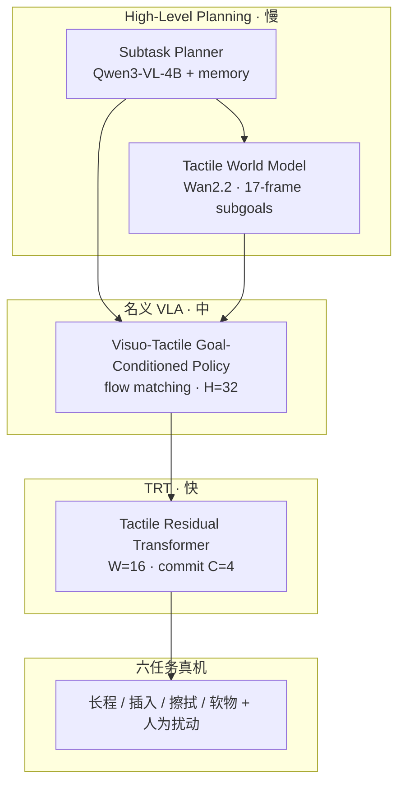

# TouchWorld：预测–反应式触觉基础模型（灵巧操作）

**TouchWorld**（*A Predictive and Reactive Tactile Foundation Model for Dexterous Manipulation*，arXiv:[2607.07287](https://arxiv.org/abs/2607.07287)，[项目页](https://phanes-lab.github.io/TouchWorld-website/)，哈工大深圳 / PHANES AI，通讯作者 **Shuo Yang**）把触觉同时用作 **未来接触子目标预测** 与 **高频在线残差纠偏**，在层级策略里显式分离 **慢语义规划、触觉世界模型、名义 VLA 动作块生成、快触觉反馈** 四条时间尺度。

## 一句话定义

**用触觉世界模型预见「这一子任务接触应长成什么样」，用 TRT 在控制环里把名义 VLA 动作块修到真实接触上——既保留 VLA 语义泛化，又把毫秒级滑移/错位/力失配拉回轨道。**

## 英文缩写速查

| 缩写 | 英文全称 | 简要说明 |
|------|----------|----------|
| VLA | Vision-Language-Action | 视觉–语言–动作多模态策略；TouchWorld 名义层为视触觉目标条件扩散 VLA |
| TWM | Tactile World Model | 触觉世界模型；预测 17 帧视触觉子目标，基于 Wan2.2-TI2V-5B |
| TRT | Tactile Residual Transformer | 触觉残差 Transformer；在 $W=16$ 滑动名义窗口上做高频残差 |
| SP | Subtask Planner | 子任务规划器；Qwen3-VL-4B + 记忆，输出可执行子任务 |
| FM | Flow Matching | 名义策略用 flow matching 生成 $H=32$ 动作块 |
| CRM | Contact-Rich Manipulation | 依赖接触力、摩擦与形变的操作任务族 |
| BC | Behavior Cloning | 四阶段训练以分模块模仿学习为主，非全栈端到端反传 |

## 核心信息

| 字段 | 内容 |
|------|------|
| 机构 | 哈尔滨工业大学（深圳）（Harbin Institute of Technology, Shenzhen）；PHANES AI |
| 通讯作者 | Shuo Yang（shuoyang@hit.edu.cn） |
| 平台 | 人形 + **Wuji** 灵巧手 + **JQ-Industries** 触觉手套 |
| 遥操 | Meta Quest + Touch Plus + Wuji Glove |
| 评测 | **6** 任务 ×（干净 + 人为扰动）；每任务 **200** 训练轨迹、**100** 评测 rollout |
| 开源状态 | **截至 2026-07-16**：项目页 **仅列 Paper**，**未列** GitHub / 权重 / 数据集链接 |

## 为什么重要

- **「触觉基础模型」的双角色：** 不只把触觉当观测流，而是 **预测接触参考（TWM）+ 快反馈纠偏（TRT）**——对应人类操作里「预期手感」与「滑了一下立刻修」。
- **多时钟层级实证：** 单体 VLA 把慢语义、动作块与快触觉绑死会损害接触丰富长程任务；TouchWorld 在 **人为扰动** 设置优势更大（**+18.5 pt** vs FTP-1），说明 **快残差层** 对局部失配关键。
- **与 T-Rex / OmniTacTune 形成三角对照：** [T-Rex](./paper-trex-tactile-reactive-dexterous-manipulation.md) 强调 **大规模触觉 mid-training + MoT 双专家**；[OmniTacTune](./paper-omnitactune-tactile-residual-adaptation.md) 强调 **冻结视觉 + 短预算真机 RL 残差**；TouchWorld 走 **层级规划 + 触觉世界模型 + 名义 VLA + TRT**，并建立 **六任务长程 benchmark**。
- **子任务 + 触觉子目标：** 记忆增强 **4B** 子任务规划器在下游执行成功率上 **优于 zero-shot 32B**，提示 **任务相位监督** 比单纯放大 VLM 更重要。

## 核心贡献

| 模块 | 要点 |
|------|------|
| **层级策略** | SP + TWM（High-Level Planning）→ Visuo-Tactile Goal-Conditioned Policy → TRT 残差 |
| **Tactile World Model** | Wan2.2-TI2V-5B；**EgoTouch** 人视频预训练 + **10 h** 机端演示微调；17 帧视触觉子目标 |
| **名义 VLA** | 触觉 **图像化** 与 RGB 同路；flow matching；$H=32$ 动作块（Wuji 平台 **120 维** 动作向量） |
| **TRT** | $W=16$ 滑动名义窗口、每 $C=4$ 步提交；**58 维** 触觉敏感残差子空间 |
| **六任务 benchmark** | 长程语义 / 精密插入 / 持续擦拭 / 软物体 + **人为扰动** 评测 |
| **主结果** | 干净 **65.0%**、扰动 **53.7%** 宏平均；最强基线 FTP-1 **49.3% / 35.2%** |

## 方法

### 四层多时钟架构

1. **Subtask Planner（慢）：** 输入任务指令、当前视觉与高阶记忆 $m_t$，输出可执行子任务 $\ell_t^{\mathrm{sub}}$；记忆携带历史子任务、预测子目标与执行状态。
2. **Tactile World Model（慢刷新）：** 仅在子任务或接触相关相位变化时刷新；预测当前子任务的 **视触觉子目标** $g_t$（17 帧 clip 或终端子目标栅格）。
3. **Visuo-Tactile Goal-Conditioned Policy（中）：** 条件于子任务、$g_t$（若有）、多视角 RGB、本体、触觉图像；flow matching 生成名义块 $\hat{\mathbf{A}}_{t:t+H-1}$。
4. **TRT（快）：** 读滑动名义窗口 $\hat{\mathbf{A}}_{\tau:\tau+W-1}$、近期触觉/本体历史与 VLA 上下文 token $\mathbf{c}_t$，输出残差 $\Delta\mathbf{A}$，得到 $\tilde{\mathbf{A}}=\hat{\mathbf{A}}+\Delta\mathbf{A}$。

### 触觉表征分工

- **名义 VLA 支路：** 原始触觉 **渲染为图像**，与视觉同形式，避免在 VLA 骨干引入多类触觉编码器。
- **TRT 支路：** 图像式触觉图、矩阵触觉、低维状态分别轻量编码后融合——面向 **短程、局部、接触瞬变** 信号。

### 四阶段训练

| 阶段 | 模块 | 数据 / 要点 |
|------|------|-------------|
| 1 | Subtask Planner | **128,866** 条语义率 SFT 样本；Qwen3-VL-4B LoRA |
| 2 | Tactile World Model | EgoTouch 人预训练 → **10 h** 机端子目标片段 |
| 3 | 名义 Visuo-Tactile Policy | 遥操模仿 + flow matching（**30k** steps） |
| 4 | VLA + TRT 耦合 | 冻结名义 VLA；TRT 学演示高频动作与名义窗口之差 |

各模块 **先分尺度监督、再耦合残差**，避免端到端反传把快反馈梯度拖垮慢规划。

## 流程总览

## 实验要点（归纳）

| 设置 | 要点 |
|------|------|
| 宏平均 SR（干净 / 扰动） | TouchWorld **65.0% / 53.7%**；FTP-1 **49.3% / 35.2%**；π₀.₅ **40.7% / 27.7%** |
| 难点任务 | Power Plug、Pot Wiping、Tissue Pulling 增益最大（预测 + 快修正并重） |
| 消融 | **去触觉** 降幅最大；**去 TRT** 特别伤扰动设置；**去 SP** 伤长程；**去 TWM** 弱接触目标条件 |
| TWM 预测 | Temporal Contact Acc. **86.3%** vs copy **70.4%**、NN **77.5%** |
| Planner | 记忆增强 4B：**88%** 子任务准确率 vs zero-shot 32B **69%** |

### 六任务（评测集）

Water Flower、Tabletop Clearing、Cup Insertion、Power Plug Insertion、Pot Wiping、Tissue Pulling。

## 工程实践与开源状态

- **项目页核查（2026-07-16）：** [phanes-lab.github.io/TouchWorld-website](https://phanes-lab.github.io/TouchWorld-website/) 资源区 **仅有 Paper 链至 arXiv PDF**；**未见** 官方 GitHub、Hugging Face 或数据集下载。**复现入口暂不可用**；后续若发布代码/权重，应补 `sources/repos/` 并更新本页。
- **部署调度：** 名义 chunk $H=32$；TRT 窗口 $W=16$、提交间隔 $C=4$；TWM 在稳定相位 **复用上一子目标** 以降低算力。
- **降级模式：** 若 SP/TWM 不可用，可退回原始任务 prompt、关闭预测子目标条件，名义 VLA + TRT 仍可执行。

## 常见误区或局限

- **误区：「再加触觉 token 就等于触觉基础模型」。** TouchWorld 的核心是 **预测子目标 + 快残差层级**，不是把触觉拼进单体 VLA。
- **误区：「TouchWorld 取代 T-Rex」。** T-Rex 主攻 **双手 58-DoF + 100 h 触觉 play 数据集 + MoT 异步专家**；TouchWorld 主攻 **人形长程六任务 + 触觉世界模型 + 子任务接口**——可并列阅读选型。
- **局限：任务与本体：** 仅 **六类** 代表任务；换触觉布局或手型需标定与小量适应（论文自述）。
- **局限：TWM 视野：** 当前为 **短视界** 视触觉子目标；长程多模态未来与不确定性建模列为未来工作。
- **局限：开源：** 截至入库日 **无公开代码/权重**，工程复现需等待官方发布。

## 与其他工作对比

| 维度 | TouchWorld | T-Rex | OmniTacTune | FTP-1 |
|------|------------|-------|-------------|-------|
| 触觉角色 | **预测子目标 + TRT 残差** | **MoT 高频触觉专家** | **冻结视觉 + RL 残差** | **单体触觉策略** |
| 长程结构 | **SP + 记忆** | 语言指令 + 人预训练 | 物体关键点流 | 任务 prompt |
| 世界模型 | **TWM（视触觉 clip）** | 未来视觉潜变量 | 无 | 无 |
| 平台 | 人形 + Wuji + 压力手套 | 58-DoF 双手 Vega-1 | xArm7 + GelSight | 多传感器泛化 |
| 干净宏平均 SR | **65.0%**（六任务） | **65.0%**（十二任务） | 93.75%（四任务单臂） | **49.3%**（同 benchmark） |

## 与其他页面的关系

- 与 [VLA](../methods/vla.md)：TouchWorld 名义层是 **视触觉图像 + 子任务/子目标条件** 的 flow-VLA，并外挂 **TRT** 解决频率失配。
- 与 [视触觉融合](../concepts/visuo-tactile-fusion.md)：提供 **「预测通路 + 反应通路」** 的层级实例，补充阶段切换 / 门控 / 残差 RL 之外的第四范式。
- 与 [接触丰富操作](../concepts/contact-rich-manipulation.md)：六任务覆盖 **长程语义 + 精密插入 + 持续接触 + 软物 + 扰动恢复**。
- 与 [T-Rex](./paper-trex-tactile-reactive-dexterous-manipulation.md)、[OmniTacTune](./paper-omnitactune-tactile-residual-adaptation.md)：2026 触觉灵巧操作 **端到端 mid-training / 层级世界模型 / 插件式 RL 残差** 三条主线对照。

## 推荐继续阅读

- 论文 HTML：<https://arxiv.org/html/2607.07287v2>
- 项目页（结果表、TWM demo、采集画廊）：<https://phanes-lab.github.io/TouchWorld-website/>
- [T-Rex 实体页](./paper-trex-tactile-reactive-dexterous-manipulation.md) — 双手触觉反应式 VLA 与数据集轴
- [OmniTacTune 实体页](./paper-omnitactune-tactile-residual-adaptation.md) — 短预算真机触觉残差 RL 轴

## 参考来源

- [TouchWorld 论文摘录（arXiv:2607.07287）](../../sources/papers/touchworld_arxiv_2607_07287.md)
- [TouchWorld 项目页](../../sources/sites/touchworld-phanes-lab.md)

## 关联页面

- [VLA（Vision-Language-Action）](../methods/vla.md)
- [Visuo-Tactile Fusion（视触觉融合）](../concepts/visuo-tactile-fusion.md)
- [Contact-Rich Manipulation（接触丰富操作）](../concepts/contact-rich-manipulation.md)
- [Manipulation（操作任务）](../tasks/manipulation.md)
- [T-Rex：触觉反应式灵巧操作](./paper-trex-tactile-reactive-dexterous-manipulation.md)
- [OmniTacTune：触觉残差真机适应](./paper-omnitactune-tactile-residual-adaptation.md)
