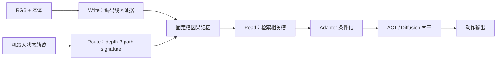
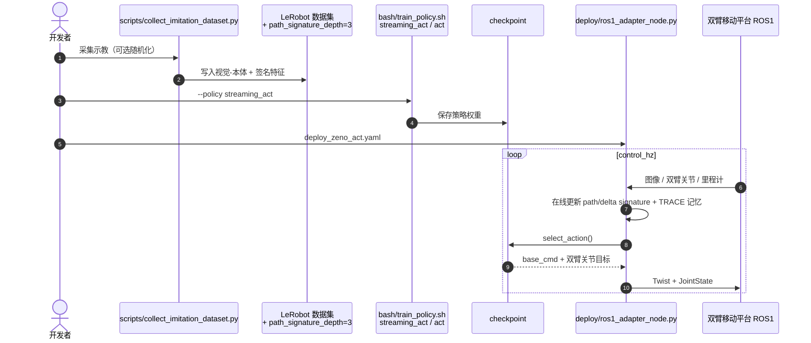

# TRACE：轨迹路由因果记忆

**TRACE**（*Trajectory-Routed Causal Memory for Delayed-Evidence Visuomotor Imitation*，[arXiv:2606.14551](https://arxiv.org/abs/2606.14551)，[项目页](https://jeong-zju.github.io/trace/)，[代码](https://github.com/Jeong-zju/corl-trace)）由 **芝诺机器人（Zeno AI）**、**浙江大学**、**浙江工业大学** 与 **悉尼大学** Zihao Li、Ranpeng Qiu 等提出：为视觉运动模仿策略增加**有界固定槽因果记忆**，用**路径签名**（path signature）路由读写，在早期线索离开视野后仍能选对分支。

## 一句话定义

**线索可见时写入固定槽记忆，用机器人轨迹的序敏感签名当地址，分支点再从记忆里读出缺失的因果上下文。**

## 英文缩写速查

| 缩写 | 英文全称 | 简要说明 |
|------|----------|----------|
| TRACE | Trajectory-Routed Causal Evidence | 本文记忆框架 |
| ACT | Action Chunking Transformer | 回归类骨干 + adapter |
| DP | Diffusion Policy | 扩散类骨干 + adapter |
| IL | Imitation Learning | 行为克隆目标不变 |
| SIPM | （仓库内数据集命名） | 带 path signature 的示教数据形态 |

## 为什么重要

- **当前观测不足：** 长视界操作里，两段历史在分支点可能**视觉极似**但应执行不同动作。
- **有界记忆：** 固定槽 latent 记忆长 episode 不膨胀；比无限堆叠历史或纯 RNN 更可控。
- **轨迹路由而非时间戳：** path signature 提供**序敏感**轨迹键，不依赖人工任务标签。
- **即插即用：** 轻量 adapter 条件化骨干，**不改**动作头与 IL 损失；官方 [corl-trace](https://github.com/Jeong-zju/corl-trace) 已开源。

## 核心信息

| 项 | 内容 |
|----|------|
| **机构** | 芝诺机器人（Zeno AI）；浙江大学（ZJU）；浙江工业大学（ZJUT）；悉尼大学（USYD） |
| **评测** | 5 项真机延迟证据任务；每项 **25** rollouts |
| **骨干** | ACT（TRACE Regression）、Diffusion Policy（TRACE Diffusion） |
| **开源** | **已开源** — [Jeong-zju/corl-trace](https://github.com/Jeong-zju/corl-trace) |

## 流程总览

## 源码运行时序图

官方仓库 [Jeong-zju/corl-trace](https://github.com/Jeong-zju/corl-trace)（归档见 [sources/repos/corl-trace.md](../../sources/repos/corl-trace.md)）：

- **训练最短路径：** `environment.yml` → `collect_imitation_dataset.py` → `train_policy.sh --policy streaming_act`。
- **部署：** 单进程 ROS1 节点；checkpoint 依赖 signature 时节点内在线计算（见 `deploy/README.md`）。

## 实验与评测

### 平均阶段进度（5 任务）

| 方法 | 平均进度 |
|------|----------|
| ACT | 25.50% |
| Diffusion Policy | 25.00% |
| **TRACE Regression** | **69.23%** |
| **TRACE Diffusion** | **59.53%** |

### 分项示例（项目页报告）

| 任务 / 分支 | TRACE Regression 进度 |
|-------------|----------------------|
| Book（desk 起点） | 83.00% |
| Book（bed 起点） | 83.00% |
| Laundry（clean-side） | 81.00% |
| Cable（matched-device） | 51.00% |
| Medicine（左/右托盘） | 各 76.67% |

## 与其他工作对比

> 前两行是论文自带的同协议基线（同 5 任务、每项 25 rollouts，可比）；后几行是路线定位，**不共享评测协议**，不要把进度数字并排读。

| 对照 | 差异读法 |
|------|----------|
| [ACT](../methods/action-chunking.md)（基线，25.50%） | 靠固定长度观测窗 + 动作块，分支点两段历史视觉极似时只能猜；TRACE 在同一骨干上加 adapter 即到 **69.23%**——增益来自记忆而非动作头 |
| **Diffusion Policy**（基线，25.00%） | 多模态动作分布解决的是「同一状态有多种合理动作」，但分支歧义的根因是**状态信息不全**，所以扩散头本身不救；TRACE Diffusion 到 **59.53%** 说明记忆与骨干正交 |
| **堆长历史 / RNN 记忆**（要替代的默认做法） | 无限堆叠历史让长 episode 的上下文线性膨胀，RNN 则把记忆压进不可寻址的隐状态；TRACE 用 **有界固定槽 + 可寻址读写**，长度不膨胀且可诊断写了什么 |
| **时间戳 / 人工阶段标签路由** | 需要按任务手工切阶段，换任务就重标；TRACE 用 depth-3 **path signature** 作序敏感键，绑定机器人实际走过的轨迹，不依赖标注 |
| [SAI](./paper-sai-sequential-asymmetric-imitation.md) | 同团队的互补答案：SAI 修的是**伙伴分布**（协作时序），TRACE 修的是**证据时序**（线索已离场）。两者在不同轴上，可叠加 |
| [Zeno-1](./paper-zeno-1-collaborative-intelligence.md) | Zeno-1 在基础模型尺度报告「持久交互记忆」这一能力；TRACE 是同一叙事的 **模块级、可开源的实现参考**，规模与评测协议均不同 |

## 结论

**延迟证据长视界操作里，有界因果记忆 + 轨迹签名路由能大幅拉开 ACT/DP 与 TRACE 的差距，且官方栈可复现训练与 ROS1 部署。**

1. **问题定义清晰：** 分支点视觉歧义来自**已不可见的早期线索**，不是单纯「历史太短」。
2. **路径签名作键** 避免手工阶段标签；与机器人实际走过的轨迹绑定。
3. **69.23% vs 25.50%** 平均进度是选型时的硬指标；Cable 51% 说明最难分支仍有空间。
4. **adapter 设计** 允许在现有 ACT/DP 栈上增量试验，不必重写动作头。
5. **开源可跑通：** 采集 → `streaming_act` 训练 → `deploy_zeno_act.yaml` 闭环。
6. **与 Zeno-1 记忆叙事一致：** Zeno-1 报告「持久交互记忆」；TRACE 给出可开源的模块级实现参考。
7. **权重未bundled：** 真机 checkpoint 需按 `bash/defaults/zeno-ai/` 自备数据后训练。

## 局限与风险

- **真机数据与 checkpoint** 未随仓库完整发布；复现 5 任务需准备 Zeno-AI 形态数据集。
- **ROS1 部署栈** 与具体双臂移动平台绑定；迁移需改 `deploy/configs` 话题与关节名。
- **路径签名深度** 固定为 3（论文/默认采集）；更长视界歧义可能需要调参或更深签名。

## 工程实践

| 项 | 建议 |
|----|------|
| 起步 | 先用 Meta-World / RoboCasa 配置验证 `streaming_act` 训练链 |
| 采集 | `collect_imitation_dataset.py --path-signature-depth 3` 与训练配置一致 |
| 部署 | 检查 `image.color_order` 与训练一致；signature 型 checkpoint 勿删在线计算 |
| 对照 | 同数据上跑纯 ACT 基线，确认增益来自记忆而非数据差异 |

## 关联页面

- [Imitation Learning](../methods/imitation-learning.md)
- [SAI](./paper-sai-sequential-asymmetric-imitation.md)
- [Zeno-1](./paper-zeno-1-collaborative-intelligence.md)

## 参考来源

- [TRACE 论文摘录](../../sources/papers/trace_causal_memory_arxiv_2606_14551.md)
- [TRACE 项目页归档](../../sources/sites/trace.md)
- [corl-trace 仓库归档](../../sources/repos/corl-trace.md)

## 推荐继续阅读

- [arXiv:2606.14551](https://arxiv.org/abs/2606.14551)
- [TRACE 项目页](https://jeong-zju.github.io/trace/)
- [GitHub: Jeong-zju/corl-trace](https://github.com/Jeong-zju/corl-trace)
