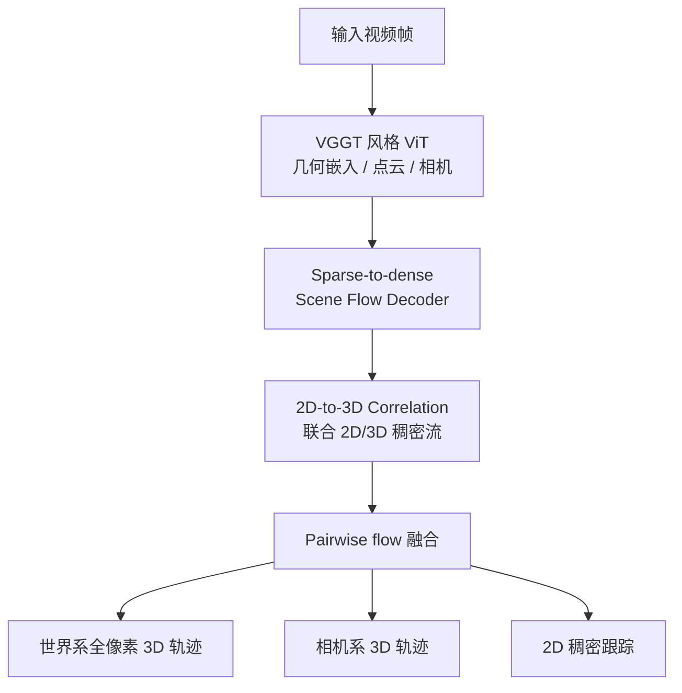
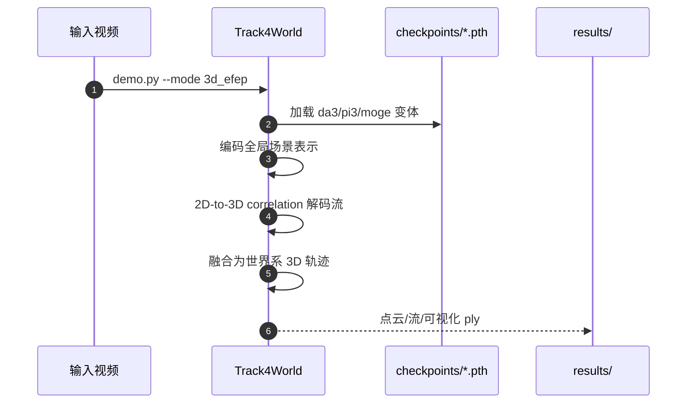

# Track4World：前馈世界系全像素稠密 3D 跟踪

**Track4World**（*Feedforward World-centric Dense 3D Tracking of All Pixels*，[arXiv:2603.02573](https://arxiv.org/abs/2603.02573)，[项目页](https://jiah-cloud.github.io/Track4World.github.io/)，**ECCV 2026**，**香港科技大学（HKUST）** × **腾讯 ARC Lab**）从单目视频 **一次前馈** 估计 **世界坐标系下每个像素的稠密 3D 轨迹**：在 VGGT 风格全局 3D 场景表示上，用 **2D-to-3D correlation** 同时预测任意帧对的 2D/3D 稠密流，再融合为 holistic tracking。

## 一句话定义

**把「全视频、全像素、世界系 3D 对应」从前馈几何骨干里直接解出来，而不是只做首帧稀疏跟踪或慢速优化稠密跟踪。**

## 英文缩写速查

| 缩写 | 英文全称 | 简要说明 |
|------|----------|----------|
| VGGT | Visual Geometry Grounded Transformer | 全局 3D 场景表示灵感来源 |
| EPE | End-Point Error | 2D/3D 流端点误差 |
| APD | Average Percent of Points within Delta | 3D 跟踪阈值内点比例 |
| AJ | Average Jaccard | 2D 跟踪常用指标 |
| DA3 | Depth Anything 3 | 默认骨干之一；支持 `--metric_scale` 米制输出 |
| ECCV | European Conference on Computer Vision | 2026 接收会议 |
| TAPVid-3D | — | 动态视频 3D 点跟踪评测协议 |

## 核心信息

| 字段 | 内容 |
|------|------|
| **机构** | 香港科技大学（HKUST）；腾讯 ARC Lab（Tencent ARC / PCG） |
| **arXiv** | [2603.02573](https://arxiv.org/abs/2603.02573) |
| **会议** | ECCV 2026（Accepted） |
| **骨干** | `track4world_da3` / `track4world_pi3` / `track4world_moge` |
| **开源（截至 2026-09-15）** | **已开源** — [GitHub](https://github.com/TencentARC/Track4World) + [HF 权重](https://huggingface.co/TencentARC/Track4World)（Tencent Green License） |

## 为什么重要

- **稠密 3D 跟踪的前馈化**：相对 SpatialTrackerV2 / POMATO 等多阶段或优化框架，把 **2D+3D 联合流** 与 **世界系对齐** 写进单次推理。
- **机器人/4D 上游**：动态 egocentric 或操作视频可获得 **metric（DA3）或相对尺度** 的 **全像素 3D 运动场**，服务重建、动态物体跟踪与视觉策略几何特征。
- **与 D4RT 互补且可对比**：同为动态时空对应；[D4RT](./paper-d4rt.md) 用查询解码、截至入库日 **未开源**；Track4World 提供 **WorldTrack × OpenD4RT** 公平对比脚本。

## 流程总览

## 源码运行时序图

官方代码 **已开源**（Python + PyTorch）：

复现：`conda` 环境 → 下载 `checkpoints/` → `python demo.py --mode 3d_efep --coordinate world_depthanythingv3`。

## 评测摘要

| 基准 | Track4World 要点（论文/项目页） |
|------|--------------------------------|
| Kubric-3D val | EPE3D **0.1537**，AccS **0.5494**（short）；显著优于 RAFT-3D / Any4D 等 |
| KITTI / BlinkVision | 域外 EPE3D **0.0742 / 0.1135**，AccS **0.6929 / 0.5091** |
| TAPVid-3D 世界系 | 平均 APD L-16 **0.5636**，领先 SpatialTrackerV2 / POMATO |
| 2D 跟踪 | Kinetics AJ **59.1**；RoboTAP **70.9**；RGB-S **78.2** |
| 相机位姿 | Bonn ATE **0.009** |

## 结论

**Track4World 把世界系稠密 3D 跟踪做成可复现的前馈管线，并公开了与 OpenD4RT 的公平对比协议。**

- **真影响指标**：在 **全像素** 设定下，2D/3D 流与 3D 跟踪是否 **同时** 领先，而非只优化单一任务头。
- **骨干选型**：要 **米制** 优先 `da3` + `--metric_scale`；Pi3/MoGe 为相对尺度、速度/精度权衡不同。
- **与 D4RT**：D4RT 强调 **统一查询式 4D**；Track4World 强调 **VGGT 式表示 + 流解码** 且 **已开源**——动态几何栈可并行评估。
- **工程注意**：依赖 Pi3、Grounded-SAM-2 等子模块；世界系可视化建议先跑 DINO+SAM2 动态分割（README Option B）。
- **机器人用法**：作 **动态场景 4D 特征提取器**，不要与静态 SLAM pointmap 混为一谈。

## 局限与风险

- **算力与依赖**：完整 Demo 需 CUDA 12.1 与多个大型子模块；高保真可视化加载慢。
- **尺度语义**：仅 DA3 变体保证 metric scale；跨骨干对比需读 README 坐标系说明。
- **许可**：HF 权重为 Tencent Green License，商用需读模型卡。

## 关联页面

- [D4RT](./paper-d4rt.md) — 查询式 4D 重建对照（未开源）
- [VGG-T³](./paper-vgg-ttt.md) — 离线 VGGT 线性化几何
- [state-estimation](../concepts/state-estimation.md) — 状态估计 hub
- [TAPVid-MV](./paper-tapvid-mv.md) — 多视角 3D 跟踪基准邻域

## 参考来源

- [sources/papers/track4world_arxiv_2603_02573.md](../../sources/papers/track4world_arxiv_2603_02573.md)
- [sources/sites/track4world-project.md](../../sources/sites/track4world-project.md)
- [sources/repos/track4world.md](../../sources/repos/track4world.md)

## 推荐继续阅读

- [Track4World GitHub](https://github.com/TencentARC/Track4World)
- [Hugging Face 模型卡](https://huggingface.co/TencentARC/Track4World)
