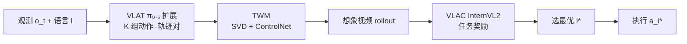

# TrAct：用视觉轨迹桥接机器人控制与视觉预测

**TrAct**（*Bridging Robot Control and Visual Prediction with Visual Tracks*，[arXiv:2608.24101](https://arxiv.org/abs/2608.24101)，Zhi Cao / Howard Ji / Kevin Zhang / Kuangzhi Ge / Li Fei-Fei / Jiajun Wu / Huang Huang · **密歇根大学（UMich）** / **斯坦福大学（Stanford）**）提出：机器人动作低维且具身相关，难以直接条件化视频世界模型；**2D 视觉轨迹**描述任务相关点在图像中的运动，可作为 **控制与预测之间的具身无关中间接口**。

## 一句话定义

**VLAT 在 π₀.₅ 上联合采样动作–轨迹对，轨迹条件世界模型想象各候选的视觉后果，VLAC 选得分最高的 rollout 所配动作执行。**

## 英文缩写速查

| 缩写 | 英文全称 | 简要说明 |
|------|----------|----------|
| TrAct | Track & Act | 本文轨迹–动作–世界模型闭环框架 |
| VLAT | Vision-Language-Action-and-Track | 联合预测动作块与 2D 点轨迹的 VLA 扩展 |
| TWM | Track-Conditioned World Model | 以轨迹 ControlNet 条件化的 SVD 视频世界模型 |
| AWM | Action-Conditioned World Model | 动作 cross-attention 条件化的对照 WM |
| VLAC | Vision-Language-Action-Critic | 对想象视频打分的 VLM 奖励模型（InternVL2） |
| SVD | Stable Video Diffusion | TWM/AWM 的视频生成骨干 |
| TSR | Temperature-Scaled Resampling | flow-matching 采样时放大噪声以增候选多样性 |
| LIBERO-INTEGRAL | — | 本文新基准：LIBERO-PRO/Plus 鲁棒性 + UR5 跨具身共 20 任务 |

## 为什么重要

- **动作–像素映射欠定：** 同一动作在不同几何/接触下对应不同视觉变化；动作条件 WM 常忽略错误动作、靠视觉先验幻觉成功（与 [SC3-Eval](./paper-sc3-eval.md) 等问题同族）。
- **轨迹是稠密图像空间接口：** 不同机器人可诱导相似场景点运动；轨迹直接指定点如何移动，比低维动作向量更适合条件化视频预测。
- **闭环选优而非开环 VLA：** 在强基线 [π₀.₅](./paper-pi05-open-world-vla.md) 上，**轨迹条件想象 + VLAC** 把 LIBERO-INTEGRAL 平均成功率从 **27%** 提到 **55%**，真机 Franka 从 **49%** 提到 **76%**。
- **新基准 LIBERO-INTEGRAL：** 标准 LIBERO 近饱和（TrAct 98.3%）；INTEGRAL 组合物体/任务/相机/初始化变化与 Franka→UR5 跨具身，更能测分布外泛化。

## 核心信息

| 字段 | 内容 |
|------|------|
| 作者 | Zhi Cao、Howard Ji、Kevin Zhang、Kuangzhi Ge、Li Fei-Fei、Jiajun Wu、Huang Huang |
| 机构 | 密歇根大学（UMich）；斯坦福大学（Stanford） |
| 出处 | arXiv:2608.24101（2026-08） |
| 平台 | 仿真 LIBERO / LIBERO-INTEGRAL；真机 Franka Panda（双 RGB：agent + wrist） |
| 骨干 | VLAT 基于 flow-matching [π₀.₅](./paper-pi05-open-world-vla.md)；TWM 基于 SVD + ControlNet |
| 预训练 | VLAT：76K DROID + 150K EgoDex（1:2），30K 步；TWM/AWM：76K DROID，30K 步 |
| 轨迹监督 | 7 夹爪 mesh 点 + 腕部 5×5 背景网格；背景轨迹 CoTracker；EgoDex 仅训轨迹头 |
| 开源（截至 2026-09-13） | 论文写 *Code, data, and trajectories will be released*；**无项目页/仓库/HF** → **待发布** |

## 方法与核心结构

### 三阶段推理

给定观测 \(o_t\) 与语言 \(l\)：

1. **VLAT** 采样 \(K\) 组 \((a_i,\tau_i)\)：动作块 \(a_i\in\mathbb{R}^{H\times d_a}\)（16 步）与 2D 轨迹 \(\tau_i\in\mathbb{R}^{N\times H\times 2}\)。
2. **TWM** 对每个 \(\tau_i\) 生成未来视频 \(\hat{v}_i=p_\phi(o_t,\tau_i)\)；agent 轨迹渲染为红色、wrist 为蓝色 ControlNet 通道。
3. **VLAC** 评分 \(s_i=R_\psi(\hat{v}_i,l)\)，执行 \(a_{i^*}\)，\(i^*=\arg\max_i s_i\)。

联合训练目标：

\[
\mathcal{L}_{\text{VLAT}}=\mathcal{L}_{\text{flow}}(a,a^{*})+\lambda\mathcal{L}_{\text{flow}}(\tau,\tau^{*})
\]

**AWM 对照：** 动作用 MLP 编码到 CLIP 空间再 cross-attention 注入 SVD，其余训练/评测协议相同。

### 流程总览

### 轨迹表示设计

- **夹爪点：** 7 个固定 mesh 偏移，由位姿与标定投影；agent 视角 **仅** 输出夹爪轨迹（关注末端运动）。
- **场景点：** 腕部视角 5×5 均匀网格 + CoTracker 跟踪，捕捉相对环境的运动。
- **跨数据统一 slot：** DROID / EgoDex / Bridge 用固定 slot 布局与 mask，使人类视频与机器人数据共训轨迹头；机器人数据额外监督动作头。

## 源码运行时序图

**不适用** — 截至 **2026-09-13** 论文承诺发布代码、数据与轨迹，但尚无官方 GitHub / Hugging Face 或可运行 README；待仓库开放后按 `sources/repos/` 与 README 入口补 mermaid `sequenceDiagram`。

## 评测与指标

### 视频预测（TWM vs AWM，Table 1 仿真 agent 视角）

| 指标 | AWM | TWM |
|------|-----|-----|
| PSNR ↑ | 15.12 | **24.51** |
| SSIM ↑ | 0.482 | **0.843** |
| LPIPS ↓ | 0.438 | **0.106** |
| FVD ↓ | 129 | **38** |

轨迹条件在真机/仿真、agent/wrist 四设置上 **五项指标全胜**。

### 标准 LIBERO（Table 2，四套件平均）

| 方法 | Avg. SR |
|------|---------|
| π₀.₅ | 96.8% |
| VLAT | 98.0% |
| VLAT+AWM | 98.0% |
| **TrAct** | **98.3%** |

套件近饱和，增益有限；难例见 LIBERO-INTEGRAL。

### LIBERO-INTEGRAL（Table 3，20 任务平均）

| 方法 | Avg. SR |
|------|---------|
| π₀.₅ | **27%** |
| VLAT | 44% |
| VLAT+AWM | 49% |
| **TrAct** | **55%** |

TrAct 在 Object / Camera / RobotInit / Cross-Embodiment 四类上均为最佳或并列最佳；三 seed 均值 **54.7%** vs VLAT+AWM **49.0%**（CI 不重叠）。

### 真机 Franka（5 个 OOD 任务 × 常规/换背景，Table 4 平均）

| 方法 | Avg. SR |
|------|---------|
| π₀.₅ | 49% |
| π₀.₅ + VLAC | 65% |
| VLAT | 55% |
| VLAT+AWM | 66% |
| **TrAct** | **76%** |

换背景时 VLAT+AWM 跌至 **40%**，TrAct 仍 **70%**——轨迹锚定图像空间运动，对视觉域移更稳。

## 工程实践

| 环节 | 要点 |
|------|------|
| 微调数据 | LIBERO 2K episodes；真机 400 条 @ 15 Hz（4 训练任务） |
| VLAT 微调 | 5K 步（LIBERO）；50K 步（真机）；联合 16 步 action+track chunk |
| WM 微调 | TWM/AWM 各 25K 步，batch 16 |
| VLAC | 同数据上 5K（仿真）/ 4K（真机）步，用预测 rollout + 任务完成奖励 |
| 推理候选 | 仿真 K=20、真机 K=16；TSR noise scale=2，k=3（仿真）/4（真机） |
| 算力 | 预训练 4×H100；更大 TrAct+ 用 8×H100、DROID+Bridge+EgoDex 混合 |

## 局限与风险

- **延迟与算力：** 每步需 K 次 WM rollout + VLAC 评分；K=5 已恢复大部分选优收益，但仍远高于开环 π₀.₅。
- **轨迹质量依赖：** 训练/推理假设 CoTracker 与夹爪投影可靠；遮挡或标定误差会传导到 TWM。
- **开源未齐：** 代码、LIBERO-INTEGRAL 轨迹与真机数据 **待发布**，暂无法复现完整闭环。
- **与 [Ctrl-World](./paper-ctrl-world.md) 接口不同：** 后者用笛卡尔动作帧级条件 SVD；TrAct 强调 **轨迹比动作更适合条件化像素未来**，二者可并列阅读而非简单替换。

## 结论

**TrAct 把「轨迹」做成控制与世界模型之间的共享语言：联合预测动作–轨迹、用轨迹（而非动作）条件视频想象，再用 VLAC 闭环选优，在难 LIBERO-INTEGRAL 与真机 OOD 上显著超过 π₀.₅ 与动作条件 WM。**

- **真影响指标的是轨迹条件想象：** TWM 开环视频质量全面优于 AWM，且 VLAC 选优在 INTEGRAL 与真机带来 **+6~+10 pp** 于 VLAT+AWM。
- **VLAT 单独已有益：** 联合轨迹监督把 INTEGRAL 从 27% 拉到 44%，说明轨迹头本身改善鲁棒性，不只服务 WM。
- **视觉域移下轨迹更稳：** 换背景时 AWM 选优失效，TWM 仍保持优势——部署读法应优先在 **外观变化大** 的场景启用轨迹接口。
- **标准 LIBERO 不足以区分方法：** 选型评测应包含 INTEGRAL 类 **相机/物体/具身 shift** 协议。
- **代价是推理算力：** K 与 WM 去噪步数决定延迟；K=5 为低延迟折中，K=20 为论文主结果设定。
- **待开源后工程价值在完整栈：** VLAT 预训练混合（DROID+EgoDex+Bridge）、轨迹 slot 布局与 VLAC 微调配方是复现关键。

## 关联页面

- [生成式世界模型](../methods/generative-world-models.md) — 动作/轨迹条件视频 WM 谱系
- [VLA](../methods/vla.md) — π₀.₅ 与闭环扩展
- [π₀.₅](./paper-pi05-open-world-vla.md) — VLAT 骨干与主基线
- [Ctrl-World](./paper-ctrl-world.md) — SVD 动作条件 WM + policy-in-the-loop
- [SC3-Eval](./paper-sc3-eval.md) — 多视角想象评估与防漂移
- [PhysisForcing](./paper-physisforcing.md) — CoTracker 轨迹作训练期物理对齐的另一用法
- [操作任务](../tasks/manipulation.md) — 操纵 WM / 闭环选优主线

## 参考来源

- [TrAct 论文归档](../../sources/papers/tract_arxiv_2608_24101.md)
- 论文：<https://arxiv.org/abs/2608.24101>

## 推荐继续阅读

- [π₀.₅ 论文](https://arxiv.org/abs/2504.16054) — flow-matching VLA 骨干
- [VLAC 论文](https://arxiv.org/abs/2509.15937) — 本文奖励模型框架
- [CoTracker](https://arxiv.org/abs/2307.07635) — 背景轨迹提取
- [Ctrl-World 项目页](https://ctrl-world.github.io/) — 动作条件 SVD WM 对照
