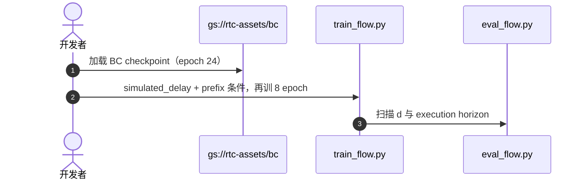

# Training-Time RTC（训练期动作前缀条件化 · arXiv:2512.05964）

**Training-Time Action Conditioning for Efficient Real-Time Chunking**（[arXiv:2512.05964](https://arxiv.org/abs/2512.05964)，[PI 博客更新](https://www.pi.website/research/real_time_chunking)）由 **物理智能（Physical Intelligence）** 与 **加州大学伯克利分校（UC Berkeley）** 提出：在 [Real-Time Chunking](./paper-real-time-chunking.md) 的异步 chunk 框架上，把 **推理期伪逆 inpainting** 换成 **训练期 prefix 条件化**，接口与 runtime 不变，但去掉每步去噪的额外计算。

## 一句话定义

> **训练时随机模拟推理延迟，让 flow 策略只 denoise postfix；推理时喂已提交 prefix 即可，不必在采样环里做 inpainting。**

## 英文缩写速查

| 缩写 | 英文全称 | 简要说明 |
|------|----------|----------|
| T-RTC | Training-Time Real-Time Chunking | 本文训练期前缀条件化方案 |
| RTC | Real-Time Chunking | 2025-06 推理期 inpainting 版 |
| VJP | Vector-Jacobian Product | inference-time RTC 每步去噪的额外开销来源 |
| VLA | Vision-Language-Action | π₀.₆ 等 chunk 策略载体 |
| CFM | Conditional Flow Matching | 动作 chunk 训练目标 |

## 为什么重要

- **补齐 RTC 的工程税：** inference-time 版为 soft mask 付 VJP 成本，延迟越高越吃亏；T-RTC 把条件化前移到训练，**推理路径与标准 flow 采样相同**。
- **与 π\*₀.₆ 产品线绑定：** 博客写明 **咖啡演示** 使用 training-time 版，不要与 2025-06 纯推理 RTC 混读成功率。
- **和 WAM 实证对读：** [WAM 异步部署](./paper-wam-realtime-async.md) 把 training-time 前缀条件标为 **train** 策略且综合最好；本文给出 PI 侧正式方法与 Kinetix / 真机证据。

## 核心原理

- 符号与 [RTC](./paper-real-time-chunking.md) 一致：预测 horizon \(H\)、执行 horizon \(s\)、推理 delay \(d\)；prefix 为上一 chunk 已来不及改的前 \(d\) 步。
- **Inference-time RTC：** 去噪中对 overlap 做 pseudoinverse guidance（含 soft mask）。
- **Training-time：** 直接学 \(p(A_{t+d:H}\mid o_t, A_{t:t+d})\)：
  1. 每个 action token 可有独立 flow timestep（adaLN-zero 不改参数量）；
  2. prefix 用 **干净 GT**、timestep=1；postfix 正常噪声化；
  3. loss **只算 postfix**；训练时 **随机采样 \(d\)** 覆盖未知真机延迟。
- 生成接口与 inference-time RTC Algorithm 1 **同形**，可 drop-in。

## 评测

- **Kinetix**（与 RTC 同设定，\(H=8\)）：delay 0–4；T-RTC 在 **delay≥2** 成功率高于 inference-time RTC；二者共享未条件化的 base checkpoint 再各微调 8 epoch 以对齐算力。
- **真机 π₀.₆**：box building、espresso making；相对 inference-time RTC **算力更省**且任务表现与速度 **不差**（论文与 PI 博客口径）。

## 与其他工作对比

| 维度 | Training-Time RTC | 对照 |
|------|-------------|------|
| 前缀约束方式 | 训练期对已提交 prefix 条件化，推理直接喂 prefix，采样与标准 flow 相同 | [Real-Time Chunking](./paper-real-time-chunking.md)：推理期 pseudoinverse inpainting，对整个 overlap 做 soft 约束，每步去噪付 VJP 开销 |
| 高 delay 表现 | Kinetix 上 delay≥2 成功率高于 inference-time RTC（同 base checkpoint、各微调 8 epoch） | [Real-Time Chunking](./paper-real-time-chunking.md)：真机注入 +100 / +200 ms 后吞吐基本持平，时间集成失败 |
| 训练目标 | 随机采样 delay，loss 只算 postfix | [REMAC](./paper-remac.md)：delay 条件 mask 监督可执行后缀 + 自条件课程，额外强调 intra-chunk 不一致 |
| 是否改 VLA 权重 | 改；需微调策略 | [FutureRTC](./paper-futurertc.md)：冻结 VLA，前挂 adapter 预测执行时刻视觉 latent 与本体状态 |

## 结论

**若可接受少量微调预算，training-time 前缀条件化是 inference-time inpainting 的更省延迟默认项；高 delay 仿真增益更明显。**

- 不改模型宽度、不改 robot runtime，只改 loss / token-wise τ 与 prefix 喂法
- 真机 π₀.₆ 配方与 openpi 一键入口 **未** 与 Kinetix 仓同等开放，复现先走仿真或社区 fork
- 与 [REMAC](./paper-remac.md)、[FutureRTC](./paper-futurertc.md) 同属「训练适配异步」谱系，但 T-RTC 是 PI 官方 RTC 续篇
- 部署 inference-time RTC 仍可用 [LeRobot RTC 文档](https://huggingface.co/docs/lerobot/rtc) 或 [openpi-rtc](../../sources/repos/openpi-rtc.md)

## 源码运行时序图

仿真微调对齐 [real-time-chunking-kinetix](https://github.com/Physical-Intelligence/real-time-chunking-kinetix)：

## 局限与风险

- **部分开源**：Kinetix + `simulated_delay` 在官方仿真仓；π₀.₆ 咖啡/盒装权重与数据 **未** 完整进 [openpi](../../sources/repos/openpi.md)。
- 训练时随机 \(d\) 的分布需与部署延迟匹配；单 checkpoint 泛化所有 delay 仍有限（论文亦讨论 per-delay 微调可能更优）。
- 只条件 **prefix**（红区），不像 inference-time 那样 soft 约束整个 overlap（黄区）——trade-off 是速度 vs 边界柔性。

## 关联页面

- [Real-Time Chunking（推理期）](./paper-real-time-chunking.md)
- [Action Chunking](../methods/action-chunking.md)
- [π\*₀.₆ / RECAP](./paper-rcl-2511-14759-0-6-a-vla-that-learns-from-experience.md)
- [LeRobot](./lerobot.md)

## 参考来源

- [training_time_rtc_arxiv_2512_05964](../../sources/papers/training_time_rtc_arxiv_2512_05964.md)
- [real_time_chunking_arxiv_2506_07339](../../sources/papers/real_time_chunking_arxiv_2506_07339.md)
- [real-time-chunking-kinetix](../../sources/repos/real-time-chunking-kinetix.md)

## 推荐继续阅读

- [arXiv:2512.05964](https://arxiv.org/abs/2512.05964)
- [arXiv:2506.07339](https://arxiv.org/abs/2506.07339)（推理期 RTC）
