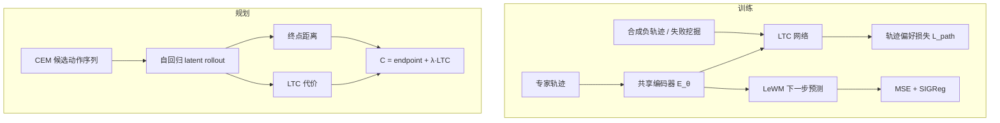
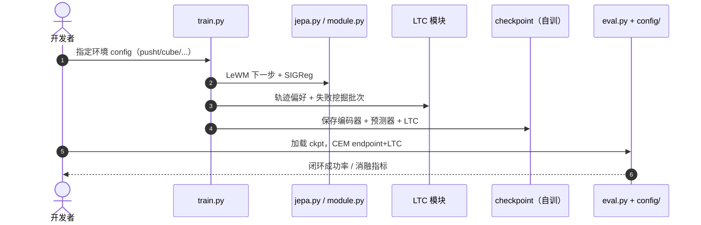

# Traj-LeWM：潜轨迹代价的路径感知世界模型规划

**Traj-LeWM**（*Path-Aware World-Model Planning via Latent Trajectory Cost*，[arXiv:2608.14125](https://arxiv.org/abs/2608.14125)；[代码](https://github.com/XiaodiHuang-code/Traj_LeWM)）在 [LeWM](./paper-lewm.md) 的像素端到端 JEPA 骨干上，保留 **下一步预测 + SIGReg + 终点距离**，新增 **Latent Trajectory Cost (LTC)**：把完整目标条件 latent 轨迹映射为标量代价，用于 **表征塑形** 与 **CEM 候选排序**。

## 一句话定义

**在 LeWM 式轻量 JEPA 世界模型上，用可学习的潜轨迹代价 LTC 补充「只看终点」的规划信号：训练期用轨迹偏好监督共享编码器，规划期联合 endpoint 与 LTC 排序动作序列。**

## 英文缩写速查

| 缩写 | 英文全称 | 简要说明 |
|------|----------|----------|
| Traj-LeWM | Trajectory-augmented LeWM | 本文方法 |
| LTC | Latent Trajectory Cost | 目标条件完整潜轨迹标量代价 |
| LeWM | LeWorldModel | 轻量像素 JEPA WM 基座 |
| CEM | Cross-Entropy Method | 测试时隐空间 MPC |
| JEPA | Joint-Embedding Predictive Architecture | 联合嵌入预测架构 |
| SIGReg | Sketched Isotropic Gaussian Regularizer | LeWM 防坍塌正则 |

## 为什么重要

- **暴露 LeWM 规划盲区：** 同起终点、相近终点距离的候选，闭环执行可差很多——仅 endpoint 排序不够（Cube 上 LeWM **74%** vs DINO-WM **86%**）。
- **轻量：** LTC **<1M** 参数；仍处 LeWM 量级，非另起一套大模型。
- **真机点：** Franka FR3 上 20 任务 **50%→70%**，说明路径信号不只仿真有效。
- **与同组 SRD 正交：** [SRD](./paper-state-readout-decoupling.md) 改 rollout 载体；Traj-LeWM 改 **如何评价** 完整轨迹。

## 核心信息

| 项 | 内容 |
|----|------|
| **机构** | 中科院自动化所；上海交大；清华深研院；香港大学；中科大；北大等 |
| **基座** | LeWM 编码器 + 预测器（保 \(L_{\text{pred}}+\text{SIGReg}\)） |
| **任务** | Push-T、OGBench-Cube、Reacher、Two-Room；Franka FR3 |
| **开源** | **已开源（代码）** MIT：[Traj_LeWM](https://github.com/XiaodiHuang-code/Traj_LeWM)；**无** 预置 checkpoint |

## 流程总览

## 核心原理

### 两类缺失的轨迹信息

1. **训练：** 下一步损失只约束局部转移，未要求编码器保留「整段轨迹相对目标」的信息。
2. **规划：** 仅用 \(\|\hat z_T - z_g\|\) 排序；预测终点近 ≠ 执行好。

### LTC 与偏好来源

LTC 输入为 goal-relative 完整 latent 轨迹，输出标量代价。偏好数据来自：

- 目标错配的专家轨迹（正 > 负）；
- 终点保持的 latent 扰动负样本；
- **失败挖掘：** 仅用 endpoint 做闭环规划，收集失败轨迹作 hard negative（**不改变** 预测器转移训练数据）。

规划时（IQR 校准）：

\[
C = C_{\text{endpoint}} + \lambda \cdot \frac{\mathrm{IQR}(C_{\text{endpoint}})}{\mathrm{IQR}(\mathrm{LTC})} \cdot \mathrm{LTC}
\]

## 源码运行时序图

官方仓 [XiaodiHuang-code/Traj_LeWM](https://github.com/XiaodiHuang-code/Traj_LeWM)：

- **依赖：** Python 3.10、CUDA PyTorch；README 为 source-only，需自备数据与 LeWM 式训练预算。
- **与 LeWM 关系：** 可直接视为 LeWM + `module.py` 中 LTC 与偏好管线扩展。

## 实验与评测

| 任务 | LeWM | Traj-LeWM | Δ |
|------|------|-----------|---|
| Push-T | 96% | **99%** | +3 |
| OGBench-Cube | 74% | **88%** | +14 |
| Reacher | 86% | **93%** | +7 |
| Two-Room | 87% | **94%** | +7 |

（三 seed 均值，表内最佳加粗。）

- **真机：** Franka FR3，20 任务，**50%→70%**。
- **消融：** 去掉 LTC 仅保留 endpoint 会损失 Cube/Two-Room 上显著的 success-discrimination；endpoint-matched 对照支持「中间路径」而非仅终点噪声。

## 与其他工作对比

| 对照 | 差异读法 |
|------|----------|
| [LeWM](./paper-lewm.md)（本文基座与主基线） | 本页最硬的一组：编码器、预测器、CEM 全部保留，只加 LTC 与偏好管线。四任务三 seed 均值 Push-T 96→99、Cube 74→88、Reacher 86→93、Two-Room 87→94；真机 FR3 20 任务 50%→70%。差别在**候选怎么排序**——终点距离 vs 终点 + 整段路径形状 |
| **DINO-WM**（论文引用的强对照） | 暴露盲区用的参照：Cube 上 LeWM 74% 落后 DINO-WM 86%，本文主张这个差距不全是表征能力问题，而是 endpoint-only 打分丢了路径信息——加 LTC 后 88% |
| **endpoint-matched 消融** | 排除「终点噪声」这一替代解释的关键对照：终点距离配平后 LTC 仍有区分度，说明起作用的是**中间路径**而非终点估计更准 |
| [SRD（State–Readout Decoupling）](./paper-state-readout-decoupling.md) | 同生态的正交改动：SRD 改 rollout 载体（减误差累积），Traj-LeWM 改候选评价。两篇互相点名可叠加，但**未做联合实验**，组合收益属待验证 |
| [CausalVAE WM Plug-in](./paper-causalvae-world-models.md) | 第三个切口：改 latent 因子的因果可识别性。三者分别动 rollout / 打分 / 表征结构，可用来定位自己栈里的瓶颈在哪一环 |
| [生成式世界模型](../methods/generative-world-models.md) | 范式边界：本文是**非生成式 JEPA 规划**，不重建像素、不做视频预测，也不是 VLA 的替代——与视频 WM 的指标体系不通用 |

## 结论

**总判：Traj-LeWM 用 <1M 参数的 LTC 把「轨迹形状」补进 LeWM 的训练与规划，在最难的 Cube 上 +14 pp，并给出真机增益——适合已跑通 LeWM 但 endpoint-only 规划触顶的团队。**

1. 先复现 LeWM 基线，再开 LTC 与失败挖掘——偏好数据管线是增益来源之一。
2. Cube / Two-Room 优先试联合打分；Push-T 增益较小但仍一致为正。
3. 与 [SRD](./paper-state-readout-decoupling.md) 可叠加：解耦 rollout 减误差累积，LTC 改候选评价。
4. 无官方权重：按 README 自训或对齐 LeWM 数据管线。
5. 仍是非生成式 JEPA 规划，不是视频 WM 或 VLA 替换。

## 局限与风险

- 依赖离线专家轨迹与合成负样本质量；失败挖掘增加训练循环复杂度。
- 源码发布无 checkpoint，复现成本高于 [LeWM](./paper-lewm.md)（HF 权重齐全）。
- LTC 与 endpoint 的 λ/IQR 校准需按环境调；真机仅 20 任务试点。

## 关联页面

- [LeWM](./paper-lewm.md)
- [State–Readout Decoupling](./paper-state-readout-decoupling.md)
- [CausalVAE WM Plug-in](./paper-causalvae-world-models.md)
- [生成式世界模型](../methods/generative-world-models.md)
- [操作任务](../tasks/manipulation.md)

## 参考来源

- [Traj-LeWM 论文归档](../../sources/papers/traj_lewm_arxiv_2608_14125.md)
- [Traj_LeWM 仓库归档](../../sources/repos/traj-lewm.md)
- 论文：<https://arxiv.org/abs/2608.14125>

## 推荐继续阅读

- [LeWM 实体页](./paper-lewm.md) 与 [arXiv:2603.19312](https://arxiv.org/abs/2603.19312)
- [官方 Traj_LeWM 仓库](https://github.com/XiaodiHuang-code/Traj_LeWM)
