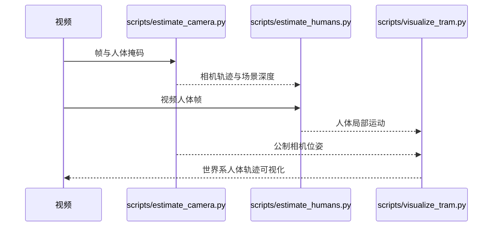

# TRAM：Global Trajectory and Motion of 3D Humans from in-the-wild Videos

## 一句话定义

**TRAM** 把相机运动与人体局部运动分别恢复，再将两者组合，得到野外单目视频中的**世界坐标人体轨迹**。

## 英文缩写速查

| 缩写 | 英文全称 | 简要说明 |
|------|----------|----------|
| TRAM | Trajectory and Motion of 3D Humans | 全局人体运动恢复方法 |
| SLAM | Simultaneous Localization and Mapping | 估计移动相机轨迹与场景深度 |
| VIMO | Video-based Human Motion Regressor | 回归相机坐标人体运动的时序模型 |

| WBC | Whole-Body Control | 协调全身关节满足多任务/约束的控制层 |
| RL | Reinforcement Learning | 通过与环境交互学习策略的范式 |
| Loco-Manip | Loco-Manipulation | 行走与操作动力学耦合的全身任务 |

## 为什么重要

移动相机视频中，画面里的人体位移可能来自人或相机。没有世界尺度和相机轨迹，下游机器人重定向会误用根部速度和方向。

## 方法

第一阶段使用双重掩码增强 DROID-SLAM，抑制动态人体对背景几何估计的污染，并将相对场景深度与公制深度预测对齐；第二阶段由 VIMO 估计相机系人体姿态，组合公制相机位姿得到世界系运动。

## 实验与评测

官方项目页报告相较先前工作，全局运动误差下降约 60%；这是**人体重建**的比较，不是机器人动作跟踪成功率。ECCV 2024 工作。

## 与其他工作对比

[WHAM](./wham-world-human-motion.md) 结合图像、相机角速度与足部接触恢复人体；TRAM 显式拆分相机轨迹、公制尺度和 VIMO 姿态分支。[GVHMR](./gvhmr.md) 则强调重力对齐的坐标系。

## 结论

**视频转机器人动作前，先分离移动相机与人体根运动；公制尺度和相机轨迹质量会成为下游重定向的误差上限。**

1. 动态人体应从 SLAM 背景估计中排除。
2. 单目尺度必须借助额外深度约束恢复。
3. 人体重建结果仍需机器人形态与动力学适配。

## 工程实践

先核对相机公制轨迹和人体根速度，再交给机器人骨架映射；[官方仓库](https://github.com/yufu-wang/tram) 的 README 明确了三步运行脚本及模型准备。修改版 DROID-SLAM 需单独编译，SMPL 模型需按许可取得。

## 局限与风险

低纹理或动态背景会损害 SLAM，深度尺度估计也会传播到人体位移；没有直接解决物体接触、机器人关节限制与执行器动力学。

## 源码运行时序图

脚本顺序与[官方 README 归档](../../sources/repos/tram.md)一致。

## 项目资源与工程补充

### 核心信息

| 字段 | 内容 |
|------|------|
| 编号 | 17/64 |
| 分组 | C 数据入口 |
| 机构 | 宾夕法尼亚大学 |
| 论文/项目 | https://yufu-wang.github.io/tram4d/ |

### 核心机制（归纳）

#### 1）策展导读要点

数据入口：野外视频到全局人体轨迹。输入是野外单目视频；实现上恢复全局人体轨迹、相机运动和三维人体姿态，为后续机器人重定向提供带世界坐标的动作源；价值在于把互联网视频从局部姿态提升到可用的全局运动数据。

#### 2）策展导读要点

机构：宾夕法尼亚大学

### 常见误区

1. 运动小脑条目解决 **身体层** 问题，不替代 VLA/世界模型的任务规划。

### 实验与评测

- 本页在公众号/survey **策展编译**基础上补充机制归纳；**量化 benchmark、消融与实机指标以原文 PDF / 项目页为准**（链接见 [参考来源](#参考来源)）。
- 与同栈姊妹篇对照时，请回到对应 **技术地图 / 42 篇栈 / BFM 地图 / VLN 地图** 总览中的实验段落。

## 关联页面

- [WHAM](./wham-world-human-motion.md)
- [GVHMR](./gvhmr.md)

- 技术地图：[humanoid-motion-cerebellum-technology-map.md](../overview/humanoid-motion-cerebellum-technology-map.md)
- 分类 hub：[motion-cerebellum-category-03-data-pipeline.md](../overview/motion-cerebellum-category-03-data-pipeline.md)

## 参考来源

- [Day 1 文章逐篇索引](../../sources/blogs/humanoid_motion_intelligence_day1_data_retargeting_2026_10_02.md)
- [官方运行入口](../../sources/repos/tram.md)
- [项目页开放状态](../../sources/sites/tram4d-project.md)
- [官方项目页](https://yufu-wang.github.io/tram4d/)
- [论文](https://arxiv.org/abs/2403.17346)

- [motion_cerebellum_survey_17_tram.md](../../sources/papers/motion_cerebellum_survey_17_tram.md)
- [motion_cerebellum_64_catalog.md](../../sources/papers/motion_cerebellum_64_catalog.md)
- [wechat_embodied_ai_lab_humanoid_motion_cerebellum_survey.md](../../sources/blogs/wechat_embodied_ai_lab_humanoid_motion_cerebellum_survey.md)

## 推荐继续阅读

- [TRAM 项目页](https://yufu-wang.github.io/tram4d/)

- [运动小脑技术地图](../overview/humanoid-motion-cerebellum-technology-map.md)
- [人形 RL 身体系统栈](../overview/humanoid-rl-motion-control-body-system-stack.md)
