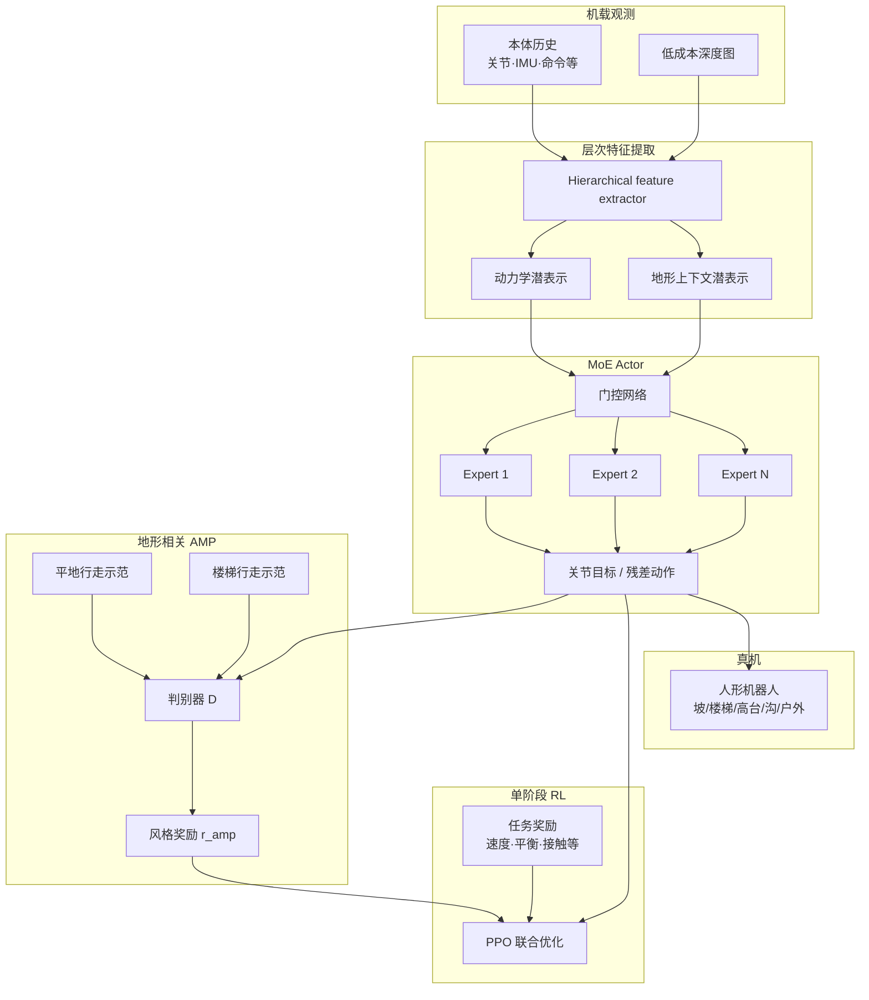

# TRAMP：地形相关对抗运动先验的视觉辅助双足行走

**TRAMP**（*Vision-Assisted Bipedal Locomotion on Challenging Terrains via Terrain-Related Adversarial Motion Priors*，上海交通大学，[IEEE RA-L 2026](https://doi.org/10.1109/LRA.2026.3707326)；[ResearchGate 全文入口](https://www.researchgate.net/publication/408100590_Vision-Assisted_Bipedal_Locomotion_on_Challenging_Terrains_via_Terrain-Related_Adversarial_Motion_Priors)）提出**轻量单阶段**强化学习框架：在**仅机载本体 + 低成本深度**条件下，用**层次特征提取器**压缩动力学与地形上下文，经 **MoE actor** 做地形感知行为调制，并以**平地与楼梯**行走示范构造**地形相关对抗运动先验（terrain-related AMP）**，在统一策略内兼顾穿越性与步态自然性。

## 一句话定义

**不靠显式高程图管线或多阶段 teacher–student，而是用「层次潜特征 + MoE 调制 + 双地形示范的 AMP」在单阶段 RL 里同时学深度感知与地形相容步态。**

## 英文缩写速查

| 缩写 | 英文全称 | 简要说明 |
|------|----------|----------|
| TRAMP | Terrain-Related Adversarial Motion Priors | 本库简称；论文全名中的核心方法 |
| AMP | Adversarial Motion Prior | 判别器约束状态转移接近专家运动分布 |
| MoE | Mixture-of-Experts | 门控组合多专家子网络，做地形感知行为调制 |
| RL | Reinforcement Learning | 单阶段 PPO 类 on-policy 训练（具体算法待 PDF 核实） |
| PPO | Proximal Policy Optimization | 人形 locomotion 常用底层优化器 |
| RA-L | IEEE Robotics and Automation Letters | 发表期刊 |
| SJTU | Shanghai Jiao Tong University | 上海交通大学 |

## 为什么重要

- **单阶段 vs 多阶段感知栈：** 相对 [MoRE](./paper-amp-survey-08-more.md)（先深度 base 再叠 AMP+MoE）、[DPL](./paper-notebook-dpl-depth-only-perceptive-humanoid-locomotion-vi.md)（重建模块 + 多教师蒸馏），TRAMP 把感知、地形调制与风格先验压进**一条 RL 训练链**，降低管线维护成本。
- **地形相关 AMP 的示范设计：** 摘要用**平地 + 楼梯**两类示范构造先验，而非单一参考轨迹或全地形混合判别器——与 [T-GMP](./paper-motion-cerebellum-t-gmp.md) 的 CVAE 生成式多地形流形、[ParkourFormer](./paper-parkourformer.md) 的未来步 AMP 监督形成不同技术路线。
- **MoE 用于地形行为调制：** 与 [CMoE](./paper-cmoe.md) 等「对比学习防 MoE 塌缩」同期工作对照；TRAMP 强调**层次特征 → MoE actor** 与 AMP 的联合，而非分阶段 gait/terrain 分支。
- **工程传感器栈克制：** 明确只要**低成本深度**而非 RGB-D/LiDAR 高程图，适合算力与硬件预算受限的双足平台部署。

## 核心信息

| 项 | 内容 |
|----|------|
| **机构** | 上海交通大学（SJTU），机械工程学院 |
| **作者** | Yunpeng Liang、Kaiqi Yang、Zhenyu Fang、Yanzheng Zhao、Weixin Yan |
| **发表** | IEEE RA-L Vol. 11 No. 8, pp. 9622–9629；online 2026-06-25 |
| **DOI** | [10.1109/LRA.2026.3707326](https://doi.org/10.1109/LRA.2026.3707326) |
| **资助** | Mscape Technology Co. Ltd（Crossref） |
| **感知** | 机载本体 + **低成本深度**（分辨率/频率等 **需读 PDF**） |
| **平台** | **物理人形真机**（摘要未写型号；与 Mscape 资助相关，**待 PDF 核实**） |
| **验证地形** | 坡道、楼梯、高台、宽沟；户外杂乱场景 |
| **开源** | **确认未开源**（截至 2026-08-20）：无项目页/官方仓；全文见 ResearchGate |

## 流程总览

> 图示依据摘要归纳；判别器是否显式条件于地形嵌入、专家数量与 critic 特权项 **需以 IEEE RA-L 正文为准**。

## 核心原理（归纳）

### 1）层次特征提取

- **输入：** 本体序列 + 深度帧。
- **输出：** 紧凑潜变量，分别承载**机器人动力学**与**地形上下文**（摘要表述为 compact latent representations）。
- **意图：** 避免把高程图重建或几何辅助损失当作必需中间层，让策略直接从「动力学–地形」联合潜空间做决策。

### 2）MoE actor 与地形行为调制

- 门控网络根据潜表示在多个 expert 间分配权重，使不同地形/接触模式激活不同子策略。
- 与「单 MLP + 大深度 CNN」相比，MoE 提供**显式分工**接口，缓解多地形梯度干扰（具体 expert 数与门控损失待 PDF）。

### 3）地形相关对抗运动先验

- **示范来源：** **平地**与**楼梯**两类 locomotion 数据（摘要未说明 MoCap 或仿真专家策略）。
- **作用：** 在统一策略内鼓励**地形相容**的运动模式，而非用单一风格判别器约束所有场景。
- **与标准 AMP 的差异：** 「terrain-related」暗示判别或奖励与地形类别/嵌入相关；细节（单判别器 vs 多判别器、状态定义）待全文。

### 4）训练与部署立场

- **单阶段：** 不依赖「先盲走再蒸馏深度」或「先重建再高程策略」的常见两阶段拆分。
- **摘要结论：** 仿真 + 真机均报告**鲁棒、节能**行走与稳定足–地形接触；**无量化表**收录于本库（需 PDF）。

## 源码运行时序图

**不适用**（截至 2026-08-20：无官方可运行代码仓或 README 训练入口）。若作者后续发布仓库，应按 `sources/repos/` 与 README 补 `sequenceDiagram`。

## 工程实践（读法）

| 主题 | 建议 |
|------|------|
| 何时参考 TRAMP | 需要**单阶段**深度人形行走，且愿用 **AMP + MoE** 而非高程图/多教师管线 |
| 与 MoRE 选型 | MoRE 两阶段 + gait command + 多判别器；TRAMP 单阶段 + 双地形示范 AMP —— 训练复杂度 vs 步态切换能力 trade-off |
| 与 T-GMP 选型 | T-GMP 用 CVAE 生成地形条件流形；TRAMP 用更简单「平地/楼梯示范 + 地形相关 AMP」 |
| 复现前置 | 全文 PDF（ResearchGate / IEEE）；确认仿真器、深度相机型号、MoE/AMP 超参与示范数据采集流程 |
| 部署注意 | 低成本深度意味着域隙与噪声更敏感；摘要强调节能，部署时需同时看速度与功耗指标（正文） |

## 局限与风险

- **摘要级入库：** Cloud 环境无法下载 ResearchGate PDF；本页**未收录** Table 级 benchmark、消融与网络维度，读者须以原文为准。
- **开源状态：** 无代码/权重；工程复现只能自研或等待作者发布。
- **平台未公开：** 真机型号与 DoF 在摘要中缺失，跨平台迁移（如 G1 / Oli / 自研双足）需谨慎。
- **示范覆盖：** 仅明确平地 + 楼梯示范；跑酷级沟壑/高台是否靠任务奖励泛化，需读实验节。
- **与 T-GMP 勿混淆：** 同为「地形 + AMP」主题，但机构、方法与发表载体均不同（HIT/Leju arXiv vs SJTU RA-L）。

## 实验与评测（摘要可见）

| 维度 | 摘要信息 |
|------|----------|
| 仿真 | 有（细节待 PDF） |
| 真机 | 物理人形机器人 |
| 地形 | 坡道、楼梯、高台、宽沟、户外杂乱 |
| 指标 | 鲁棒性、**能效**、足–地形接触稳定性（无数值） |

## 结论

**TRAMP 的价值在于把「视觉感知 + 地形行为分工 + 风格先验」焊进单阶段 RL，用双地形 AMP 示范替代更重的几何中间表示或多阶段蒸馏。**

- 若你的瓶颈是**管线阶段过多**，应优先对照 TRAMP 的单阶段设计与 [MoRE](./paper-amp-survey-08-more.md)/[DPL](./paper-notebook-dpl-depth-only-perceptive-humanoid-locomotion-vi.md) 的多模块方案。
- **MoE + 层次潜特征**是摘要明确点名的两件套；是否在 MoE 上还需对比学习防塌缩（如 [CMoE](./paper-cmoe.md)），要看正文消融。
- **平地/楼梯双示范 AMP** 是差异化假设：比「单参考 AMP」更贴楼梯，又比「每地形一判别器」更轻；实际是否覆盖宽沟/高台需读实验。
- 传感器侧押注**低成本深度**，适合预算型双足，但域随机化/延迟标定细节决定 sim2real。
- **截至入库日未开源**；选型时按 IEEE RA-L + ResearchGate 全文评估，勿假设有官方复现仓。
- 与 [T-GMP](./paper-motion-cerebellum-t-gmp.md) 并列阅读可看清「生成式地形流形」vs「判别式双示范先验」两条路。

## 与其他页面的关系

- 任务索引：[楼梯/障碍感知 locomotion](../tasks/stair-obstacle-perceptive-locomotion.md)、[Humanoid Locomotion](../tasks/humanoid-locomotion.md)
- 方法：[AMP 奖励](../methods/amp-reward.md)、[强化学习](../methods/reinforcement-learning.md)
- 对照实体：[MoRE](./paper-amp-survey-08-more.md)、[T-GMP](./paper-motion-cerebellum-t-gmp.md)、[CReF](./paper-cref.md)、[ParkourFormer](./paper-parkourformer.md)

## 参考来源

- [tramp_vision_assisted_bipedal_locomotion_ieee_lra_2026.md](../../sources/papers/tramp_vision_assisted_bipedal_locomotion_ieee_lra_2026.md)
- [tramp-researchgate-publication.md](../../sources/sites/tramp-researchgate-publication.md)

## 推荐继续阅读

- Liang et al., *Vision-Assisted Bipedal Locomotion on Challenging Terrains via Terrain-Related Adversarial Motion Priors*, IEEE RA-L, 2026 — <https://doi.org/10.1109/LRA.2026.3707326>
- Escontrela et al., *Adversarial Motion Priors Make Good Substitutes for Complex Reward Functions*, IROS 2022 — AMP 基础
- Wang et al., *MoRE: Mixture of Residual Experts for Humanoid Lifelike Gaits on Complex Terrains* — 两阶段深度 + MoE + 多判别器 AMP 对照
