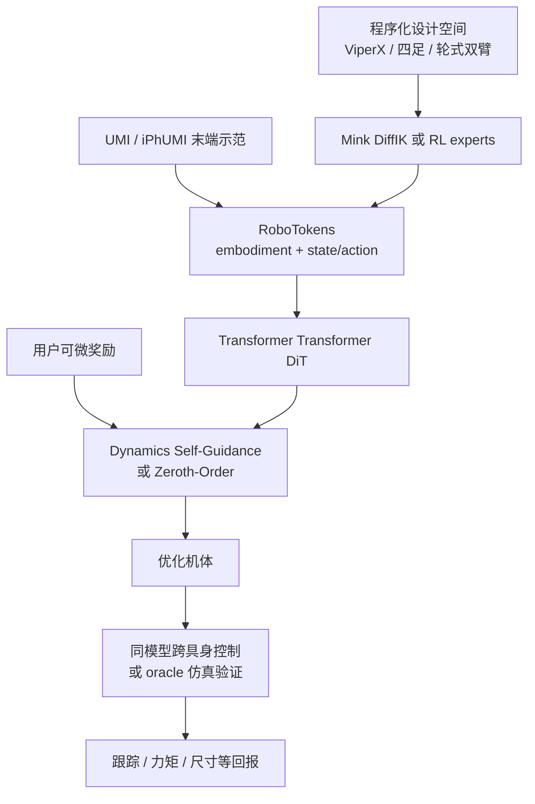
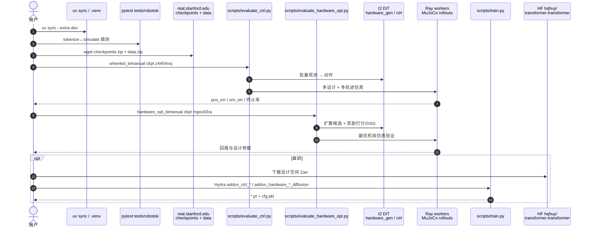

# Transformer Transformer（运动条件机器人共设计 · arXiv:2607.25798）

**Transformer Transformer**（Ha、Liu、Song；Stanford / Columbia；[项目页](https://transformer-transformer.github.io/)，[arXiv:2607.25798](https://arxiv.org/abs/2607.25798)，[代码](https://github.com/real-stanford/transformer-transformer)）把 **完整机体生成** 与 **跨具身跟踪控制** 收进同一个在 **RoboTokens** 上训练的扩散 Transformer：给末端示范与用户奖励 → 扩散出连杆/关节/电机/惯量 → 同一网络控制验证。命名双关：第一个 Transformer 指可变形态机器人，第二个指 self-attention。

## 一句话定义

**用统一 token 序列描述「机体 + 动力学」，训练一个 DiT 同时当生成器、评分器与跨具身控制器；推理时把自有动力学预测接到任意可微奖励上，用 Dynamics Self-Guidance 把采样推向高回报机体。**

## 英文缩写速查

| 缩写 | 英文全称 | 简要说明 |
|------|----------|----------|
| DiT | Diffusion Transformer | 以 Transformer 为骨干的扩散模型（本文架构） |
| DDIM | Denoising Diffusion Implicit Models | 本文训练/采样噪声调度 |
| RoboTokens | Robot Tokens | 连杆/关节/电机与 state/action 的统一 typed token |
| DSG | Dynamics Self-Guidance | 用模型自身动力学预测的奖励梯度引导机体扩散 |
| CMA-ES | Covariance Matrix Adaptation Evolution Strategy | 黑盒共设计基线 |
| UMI | Universal Manipulation Interface | 人类示范末端轨迹来源 |
| ALOHA | A Low-cost Open-source Hardware System for Bimanual Teleoperation | 真机抛布验证平台 |
| DiffIK | Differential Inverse Kinematics | 非腿式设计空间的 Mink 控制 oracle |
| WBC | Whole-Body Control | 腿式空间用 RL expert 采集/验证 |
| MJCF | MuJoCo XML Format | RoboTokens 对照的文本机体描述 |

## 为什么重要

- **把「换机体」变成一等公民：** 不只训更强策略，而是为给定运动与奖励 **生成完整硬件**（含执行器与惯量），并用同模型验证。
- **奖励零样本：** 训练目标是动力学建模，而非单奖励过拟合；推理期可换跟踪/力矩/尺寸等项组合。
- **速度数量级：** GPU 并行候选 × 非自回归整段动力学 → 相对 CMA-ES 从小时级压到秒～分钟级。
- **真机闭环：** 优化后的 ALOHA2 抛布展开可制造落地，不只是仿真榜。
- **工程齐全：** 代码、ckpt、轨迹、RL experts、HF 训练 Zarr 均已公开（见开源核查）。

## 核心信息

| 项 | 内容 |
|----|------|
| 机构 | 斯坦福大学（Stanford）、哥伦比亚大学（Columbia University） |
| 任务 | Motion-conditioned robot co-design + cross-embodiment control |
| 输入 | 末端轨迹（UMI / iPhUMI）+ 用户可微奖励 |
| 输出 | 完整刚体关节机体 + 可执行控制（同模型或空间 oracle） |
| 设计空间 | ViperX 固定基；四足操作（UMI-on-Legs）；轮式双臂洗碗 |
| 仿真栈 | MuJoCo / MJX；Mink DiffIK；Brax/Playground PPO experts |
| 真机 | ALOHA2 cloth flinging：跟踪误差 −73%，峰值关节速度 −30% |
| 代码 | [real-stanford/transformer-transformer](https://github.com/real-stanford/transformer-transformer)（MIT + 上游例外） |
| 开源核查 | **已开源**（2026-07-30）：全栈 + lab ckpt/data + HF 训练 Zarr |

## 核心原理（方法）

### RoboTokens

- **Complete：** 5 类 embodiment token + 状态/动作 token，覆盖 MJCF 级刚体关节机器人。
- **Flexible：** ID 互指连通性 → 可变 DoF / 被动关节（如 Cassie）。
- **Consistent：** 预处理折叠冗余变换，降低等价表述方差。
- **Optimizable：** 连续值序列可扩散，相对自回归 MJCF 文本具备全局可控与可微性。
- **紧凑：** Menagerie 11 机 → 约 28–101 tokens，比语言化 MJCF **27–110×** 短。

### 掩码条件 = 多角色

| 用例 | 条件 / 掩码 | 扩散对象 |
|------|-------------|----------|
| 无条件生成 | 无 | 完整机体 |
| Motion→机体（hardware_gen） | 目标 EE 轨迹 | embodiment + dynamics |
| 跨具身控制（ctrl） | embodiment + 状态 + 目标运动 | actions |

### Dynamics Self-Guidance

1. 并行扩散 $n$ 个候选（Zeroth-Order：仅用预测动力学上的奖励打分取最优）。
2. DSG：把奖励对 embodiment 的梯度按 classifier-guided DDIM 注入每步去噪。
3. 多轨迹：diffusion composition 平均各条件噪声预测，优化整任务分布（如 26 条洗碗 hold-out）。

### 流程总览

## 源码运行时序图

节点对齐 [`sources/repos/transformer-transformer.md`](../../sources/repos/transformer-transformer.md) 与官方 `docs/starter.md`。

- **最短评测：** 装环境 → `pytest tests/robotok` → 下 ckpt/data → `evaluate_ctrl.py` 或 `evaluate_hardware_opt.py`。
- **DSG 开关：** `hardware_optimizer@eval_fn.hardware_optimizer_fn=guided_diffusion`。
- **训练：** 见 `docs/training.md`；大 Zarr 走 HF，小包评测走 lab 服务器。

## 工程实践

| 项 | 实践要点 |
|----|----------|
| 环境 | Ubuntu + NVIDIA；Python 3.12 + `uv`；评测需 GPU（ctrl 用 Ray） |
| 烟测 | `pytest tests/robotok` ≈ 811 passed，不依赖下载 |
| 优化器 | 默认 Zeroth-Order（64 候选×9 seeds）；样本贵时用 guided_diffusion |
| 数据成本 | 四足：每离散选择一条 RL expert（文称约 16 h A100/策略，共 128） |
| W&B | 脚本默认打点 `transformer-transformer`；可 `WANDB_MODE=offline` |
| 许可 | 主体 MIT；DiT/MAE 衍生文件为上游非商用许可——商用前核 `t2/model/` |
| 流形边界 | 生成不外推训练拓扑/长度；扩设计空间须扩数据 |

## 实验与评测

| 设定 | 结果要点 |
|------|----------|
| vs CMA-ES | 三空间多奖励：更快达到或超过进化基线；多轨迹双臂 CMA-ES >3 h vs 本文 <1 min |
| Test-time scaling | 并行种子↑ → 回报↑，约 1 分钟后平台期 |
| 奖励零样本 | 换跟踪/力矩/尺寸项会重塑腿型、DoF、安装位与连杆尺度 |
| 自验证控制 | 与 RL oracle 回报 Pearson r ≈ 0.53（有离群） |
| ALOHA 真机 | 误差 13.0→3.5 cm；峰值速度 2.57→1.82 rad/s；倒置安装 + 加长连杆 |

## 结论

**Transformer Transformer 把「为运动选机体」做成可 GPU 并行的统一扩散动力学模型：同一套 RoboTokens + DiT 既生成完整硬件，又做跨具身控制；Dynamics Self-Guidance 让未见奖励在推理期可优化，并已用 ALOHA 抛布证明可制造。**

1. **选型锚点：** 需要离散+连续机体搜索、且有末端示范时，优先于纯 CMA-ES 黑盒环。
2. **与 VGDS 分工：** [Shape Your Body](./paper-shape-your-body-value-gradient-design.md) 擅固定拓扑连续参数的价值梯度搜；本文擅 **完整机体分布生成 + 同模型控制验证**。
3. **读指标：** 看仿真 oracle 回报与 test-time 曲线；自验证 r=0.53 说明控制器仍不能完全替代空间专家。
4. **真机读法：** 抛布同时打运动学可达与未建模气动/布料——优化安装与连杆比只刷仿真更硬。
5. **复现预算：** 评测跟 starter 即可；复现训练需数百 GB Zarr 与大量 RL 数据生成。
6. **许可注意：** 商用排查 DiT/MAE 衍生文件与 Menagerie 资产许可。

## 与其他工作对比

| 维度 | Transformer Transformer（本文） | [Shape Your Body / VGDS](./paper-shape-your-body-value-gradient-design.md) | CMA-ES 共设计 |
|------|--------------------------------|--------------------------------------------------------------------------|---------------|
| 优化变量 | 离散+连续完整机体（+控制） | 固定拓扑连续参数 | 同设计空间参数 |
| 控制 | 同模型跨具身 / 空间 oracle | 冻结多具身策略 | 每候选仿真+控制器 |
| 未见奖励 | DSG / Zeroth-Order 零样本 | 依赖训练任务价值 | 直接优化给定奖励 |
| 典型耗时 | 秒～约 1 分钟（4090 级） | 训一次后 1–2 min/设计 | 小时级（多轨迹） |
| 开源 | **全栈+ckpt** | 入库时 code soon | 通用库 |

## 局限与风险

- **几何与场景：** 仅 primitive；无任意 mesh、可变形、场景/接触目标编码。
- **控制器头：** 扩散机体上与 RL oracle 相关有限；离群设计会摔而截断回报。
- **Test-time 平台：** 约一分钟后增益饱和，不像 LLM 推理可无限堆。
- **数据贵：** 新设计空间需 Mink 或大量 RL expert，扩展成本高。
- **流形内插：** 不能从四足数据外推六足等未见拓扑。

## 关联页面

- [Shape Your Body](./paper-shape-your-body-value-gradient-design.md) — 多具身价值梯度共设计对照
- [ALOHA](./aloha.md) — 真机抛布硬件语境
- [扩散模型](../concepts/diffusion-model.md) — DiT / DDIM 底座
- [跨具身策略迁移选型](../queries/cross-embodiment-transfer-strategy.md) — 控制侧跨机 vs 本文设计侧生成
- [双臂操作](../tasks/bimanual-manipulation.md) — 洗碗 / ALOHA 双臂任务场
- [遥操作](../tasks/teleoperation.md) — UMI / ALOHA 数据采集入口
- [强化学习](../methods/reinforcement-learning.md) — 四足 expert 数据生成
- [人形体脑共设计笔记](./paper-notebook-toward-humanoid-brain-body-co-design-joint-optim.md) — 相关共设计谱系

## 参考来源

- [论文摘录](../../sources/papers/transformer_transformer_arxiv_2607_25798.md)
- [项目页归档](../../sources/sites/transformer-transformer-github-io.md)
- [代码仓库归档](../../sources/repos/transformer-transformer.md)
- Ha, Liu, Song, *Transformer Transformer: A Unified Model for Motion-Conditioned Robot Co-design* (arXiv:2607.25798)

## 推荐继续阅读

- [项目页](https://transformer-transformer.github.io/) — 视频、图说与局限
- [GitHub starter](https://github.com/real-stanford/transformer-transformer/blob/main/docs/starter.md) — ckpt 表与评测命令
- [arXiv:2607.25798](https://arxiv.org/abs/2607.25798) — 附录奖励与超参
- [Shape Your Body](https://nico-bohlinger.github.io/shape-your-body/) — 价值梯度共设计对照
- [UMI](https://umi-gripper.github.io/) — 示范接口前序
