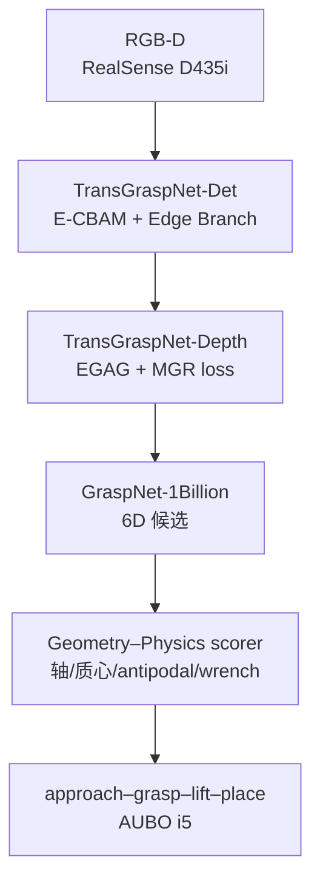

# TransGraspNet：透明实验器皿的几何–物理一致抓取

**TransGraspNet**（*Physically and Geometrically Consistent Manipulation of Transparent Labware*，[arXiv:2607.29567](https://arxiv.org/abs/2607.29567)）由 **北京大学**、**上海交通大学** 与 **南方科技大学** 提出：针对「Robot Scientist」场景中 **含液透明玻璃器皿** 的安全操作，把检测、深度补全与抓取评分显式绑成 **边界一致 → 表面一致 → 物理一致** 的全栈框架，并在真机 clutter 与高速运液上验证闭环可靠性。

## 一句话定义

**不要只把透明物体各模块单独刷榜，而要用轮廓先验约束深度、用法向保真支撑力闭合，再用质心/主轴/力旋量把 GraspNet 候选重排成「能抓还能直立运走」的抓取。**

## 英文缩写速查

| 缩写 | 英文全称 | 简要说明 |
|------|----------|----------|
| CBAM | Convolutional Block Attention Module | 通道/空间注意力；本文用增强版 E-CBAM 抑背景泄漏 |
| EGAG | Edge-Guided Attention Gate | 边界门控的深度补全融合模块 |
| TDCNet | Transparent Depth Completion Network | 深度补全骨干（文内基于此扩展） |
| PCA | Principal Component Analysis | 估物体主轴与质心，用于 upright 抓取约束 |
| GSR | Grasp Success Rate | 真机闭环成功率（含抬起/运输/放置） |
| RGB-D | Red-Green-Blue + Depth | 彩色与深度联合观测 |

## 为什么重要

- **安全关键场景：** 含液烧杯/锥形瓶的几何误差会放大为倾斜、滑移与化学洒出；一般「能捡起来」不等于「能运走」。
- **诊断跨阶段误差：** 透明物体上，边界错 → depth bleeding → 法向崩 → 任务无关抓取打分偏爱倾斜边沿——单独刷分割 AP 或深度 RMSE 都不够。
- **工程可插拔：** 初始 6D 候选直接用公开 [GraspNet-1Billion](../methods/grasp-pose-estimation.md)，物理一致性以 **后处理重打分** 形式接入，便于对照 [AnyGrasp](./anygrasp.md) 等检测式栈。

## 核心信息

| 项 | 内容 |
|----|------|
| 机构 | 北京大学（通讯 Lifeng Zhou）；上海交通大学；南方科技大学 |
| 任务 | 透明实验玻璃器皿：分割 → 深度补全 → 6-DoF 抓取 → 运液放置 |
| 硬件 | AUBO i5 六轴 + CTAG2F90C 自适应平行夹爪 + 眼在手上 RealSense D435i |
| 数据 | Trans10K / ClearGrasp 预训练；自建 **RobotSci-Glass**（20 类 / 15 透明；5,000+ 感知图；200 深度金标场景） |
| 开源 | **确认未开源**（截至 2026-08-05；无项目页/官方仓） |

## 流程总览

## 核心原理 / 方法

### 1. 边界一致：TransGraspNet-Det

- 骨干：Mask R-CNN + ResNet-101。
- **E-CBAM**：抑制透过玻璃看到的背景纹理泄漏。
- **Edge Branch**：显式轮廓概率监督，提升 Boundary F（对下游几何约束比全局 AP 更关键）。
- 训练：Trans10K 预训练 20 epoch → RobotSci-Glass 感知子集微调 10 epoch。

### 2. 表面一致：TransGraspNet-Depth

- 骨干：TDCNet + ClearGrasp 预训练权重；冻结前三层 encoder，更新 decoder 与 EGAG。
- **边界门控**：用可靠轮廓约束 RGB 引导的深度填充，抑制跨边界扩散（depth bleeding）。
- **几何保持损失**：同时压深度误差与表面法向误差，避免「像素平滑但圆柱曲率崩」。

### 3. 物理一致：抓取重打分

对 GraspNet 原始分数 $S_{\mathrm{raw}}$ 叠加：

| 项 | 作用 |
|----|------|
| 径向 / 角度对齐 | 接近方向贴近物体主轴，抑制倾斜边沿抓取 |
| 质心对齐 | 抓取中心靠近质心投影，降低运液惯性矩 |
| Antipodal | 摩擦锥内对向接触指示 |
| Wrench-space $Q$ | 接触 wrench 凸包半径，度量扰动鲁棒 |

权重用 **200** 条成功/失败标注做线性回归标定（无需反传训练）。

## 源码运行时序图

**不适用** — 截至入库日（2026-08-05）论文与公开检索均无官方代码仓或可运行发布物；若后续开源，应按 Det → Depth → GraspNet 候选 → 物理重打分 → 真机执行补 `sequenceDiagram`。

## 工程实践

| 项 | 做法 |
|----|------|
| 深度金标 | 对透明器皿做 **不透明涂层**，用 RealSense 采近无噪声深度作 GT（仅 200 场景） |
| 成功判据（真机） | 识别定位 → 抬升 30 cm 持握 3 s → 水平移 20 cm → 直立放置无倾倒 |
| 运液测试 | 50 ml 锥形瓶 + 100 ml 玻璃瓶，各半满染色液体；轨迹 30 cm，$v=0.5\,\mathrm{m/s}$，$a=1.0\,\mathrm{m/s^2}$ |
| 算力 | RTX 4090；PyTorch；AdamW batch 8（深度阶段） |
| 与现有栈拼接 | GraspNet 候选可替换为 [AnyGrasp](./anygrasp.md) 等 SDK；关键是保留 **质心/直立/wrench** 重排 |

## 实验与评测

| 评测面 | 结果（文内） |
|--------|--------------|
| RobotSci-Glass 分割消融 | Full：APmask **78.5%**，Boundary F **65.3%**（相对基线 +6.0 / +17.1） |
| ClearGrasp 分割 | Boundary F **65.1%**（Mask R-CNN 52.1 / TransLab 58.6） |
| ClearGrasp Test-Real 深度 | RMSE **0.043 m**，δ&lt;1.25 **91.5%**（优于 ClearGrasp / NLSPN / TDCNet-Base） |
| Top-1 抓取几何质量 | Succ **98%**，角度误差 **3.8°**，偏心 **8.5 mm**（视觉置信基线 94% / 22.5° / 35.2 mm） |
| 真机闭环（各 50 次） | Simple **96%**，Clutter **86%**，平均 **91%** |
| 动态运液 | **零洒出**（0.5 m/s） |

## 与其他工作对比

| 工作 | 差异读法 |
|------|----------|
| ClearGrasp | 多阶段透明深度；本文把边界先验接到可部署补全，并闭环到抓取执行 |
| TransLab | 透明实例分割强在语义 AP；本文优先 **Boundary F** 服务几何下游 |
| GraspNet / AnyGrasp | 通用检测式抓取；本文在其候选之上加 **含液 upright / wrench** 任务约束 |
| 端到端 VLA / IL | 可学「倒水」技能链；本文走 **可调试模块化感知–规划**，更易做安全审计 |

## 结论

**跨阶段一致性比单模块刷榜更能决定含液透明器皿能不能安全运走：边界与法向保真是物理抓取评分的前提，质心/wrench 重排把「能捡」升级为「能直立运输」。**

1. **先修边界，再补深度** — 透明场景上 Boundary F 对抓取比全局 AP 更关键。
2. **GraspNet 不必重训也能特化** — 任务级物理重打分成本低，适合实验室玻璃器皿 upright 约束。
3. **闭环评测要含放置与运液** — 仅抬起成功会掩盖倾斜抓取在加速段的洒出风险。
4. **深度金标可用涂层捷径** — 小规模（文内 200 场景）域微调即可显著降法向误差。
5. **复现受阻** — 截至入库日无代码与 RobotSci-Glass 发布；选型时先当方法坐标，勿假设可直接部署权重。

## 局限与风险

- **未开源：** 无法复现权重/数据集；工程落地需自建透明器皿数据与打分标定。
- **末端假设：** 平行夹爪 + 侧抓烧杯叙事；多指/倾倒倒液技能不在本文范围。
- **场景域：** 实验室桌面 clutter；户外强光、严重遮挡与未知化学品形态需另做域适应。
- **评分线性标定：** 200 条启发式拟合，换夹爪/摩擦条件应重标定，勿当作通用力闭环控制器。

## 关联页面

- [Grasp Pose Estimation](../methods/grasp-pose-estimation.md) — GraspNet → AnyGrasp 检测式谱系
- [Query：抓取策略选型](../queries/grasp-policy-selection.md) — 透明/反光失败模式的专用补丁入口
- [AnyGrasp vs GraspNet](../comparisons/anygrasp-vs-graspnet.md) — 候选生成家族内部选型
- [AnyGrasp](./anygrasp.md) — 可替换的稠密抓取候选 SDK
- [Manipulation](../tasks/manipulation.md) / [抓取枢纽](../overview/hub-grasp.md)
- [目标检测](../methods/object-detection.md) — 实例分割前置感知层
- [Query：机器人视觉感知栈选型](../queries/robot-perception-stack-selection-loop.md) — 透明物体对深度/分割栈的冲击

## 推荐继续阅读

- 论文 PDF：<https://arxiv.org/pdf/2607.29567>
- Sajjan et al., *ClearGrasp*（ICRA 2020）— 透明深度补全经典基线
- Fang et al., *GraspNet-1Billion*（CVPR 2020）— 本文候选生成器上游
- TransCG 数据集与深度补全：<https://graspnet.net/transcg>（相关透明抓取生态，非本文仓库）

## 参考来源

- [transgraspnet_arxiv_2607_29567.md](../../sources/papers/transgraspnet_arxiv_2607_29567.md) — 本页编译来源（arXiv:2607.29567）
