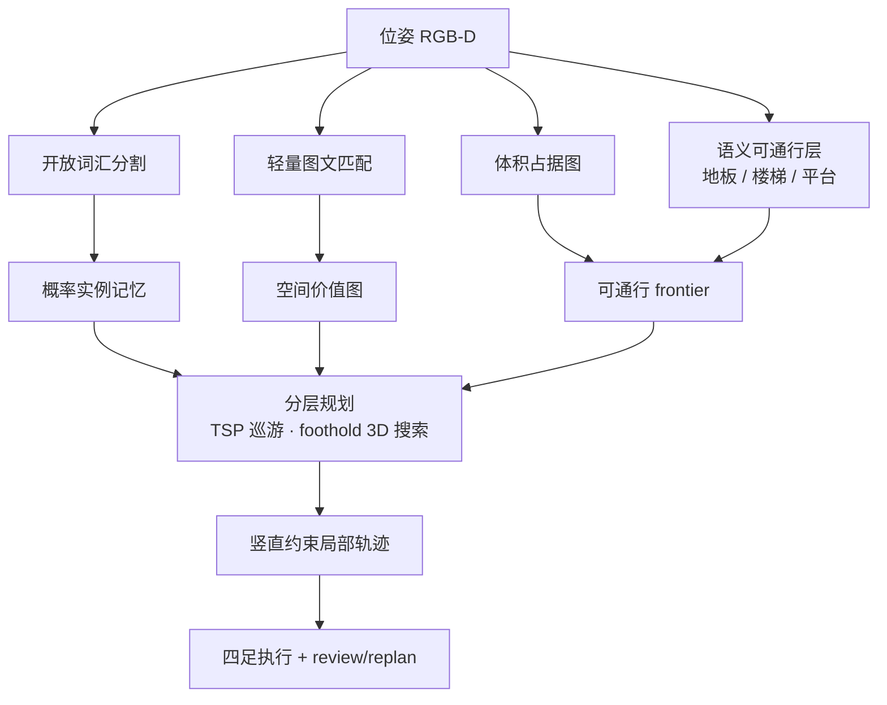

# TravExplorer（可通行感知跨楼层具身探索）

**TravExplorer**（*Cross-Floor Embodied Exploration via Traversability-Aware 3-D Planning*，[arXiv:2605.19958](https://arxiv.org/abs/2605.19958)，[项目页](https://wuyi2121.github.io/TravExplorer/)）由 **上海交通大学** 提出：把零样本 ObjectNav 从「平面地图 + 单楼层」推进到 **楼梯/平台统一度量帧的 3D 可通行规划**，并在 Unitree Go2 上做无先验地图的开放词汇寻物。

## 一句话定义

**用可通行层体积图表示地板–楼梯–平台，再以轻量开放词汇语义引导分层规划，让四足在未见地图的多楼层室内完成零样本目标导航。**

## 英文缩写速查

| 缩写 | 英文全称 | 简要说明 |
|------|----------|----------|
| TravExplorer | Traversability-aware Explorer | 本文系统名 |
| ZSON | Zero-Shot Object Navigation | 零样本目标物体导航 |
| ObjectNav | Object-Goal Navigation | 按类别/开放词汇找物体 |
| FOV | Field of View | 视野；楼梯观测不全时触发主动感知 |
| TSP | Travelling Salesman Problem | 全局 frontier/假说巡游顺序 |
| SPL | Success weighted by Path Length | 路径效率加权成功率 |

## 核心信息

| 字段 | 内容 |
|------|------|
| **机构** | 上海交通大学（Shanghai Jiao Tong University） |
| **arXiv** | [2605.19958](https://arxiv.org/abs/2605.19958) |
| **项目页** | <https://wuyi2121.github.io/TravExplorer/> |
| **代码** | <https://github.com/wuyi2121/TravExplorer> — **宣称将开源 / 占位仓**（截至 **2026-08-04**） |
| **仿真** | Habitat；HM3D / MP3D，共 **4,195** episodes |
| **真机** | Unitree Go2；单楼层 + 跨楼层；**50** 次试验（项目页） |
| **相关组件** | [SCAN-Planner](https://github.com/wuyi2121/SCAN-Planner)（局部规划）；[Elevator-LIO](https://github.com/xiaofan4122/Elevator-LIO)（多楼层定位） |

## 为什么重要

- **补齐四足 × 跨楼层 ObjectNav：** 楼梯不是「传送门」而是可通行支撑面，规划与定位必须在统一 3D 帧内一致。
- **语义与几何解耦但闭环：** 开放词汇分割 + 图文匹配只提供引导，可执行性仍由可通行层与 foothold 搜索保证。
- **课程/选型锚点：** 具身实战营把 TravExplorer 标为 Day1 VLN/导航框架节点，可与 [ZONDA](./paper-zonda.md)（多楼层 + 行人、轮腿双足）对照选型。

## 流程总览

## 核心原理

### 1）3D traversable frontier

在支撑面上提取 frontier，用 2D ray casting 保效率、用 3D 语义可通行保跨楼层一致性；对楼梯近距但观测不全的 **blind-spot frontier** 做 FOV-aware 主动感知。

### 2）空间语义引导

在线开放词汇分割累积为 **概率实例图**；快速 image-to-text matching 投影为 **空间价值图**，把探索预算压到语义上更可能的区域。

### 3）分层跨楼层规划

目标假说 / 可通行 frontier / 楼梯地标上做 TSP 式巡游 → foothold 引导 3D 图搜索 → execute–review → 竖直约束局部优化，避免只在平面代价地图上「假装能爬楼」。

## 源码运行时序图

**不适用（截至 2026-08-04）。** 官方仓仅为占位 README/assets，无可辨识的训练、仿真评测或真机部署入口；复现需等待代码发布，并可先对照 SCAN-Planner / Elevator-LIO 子系统。

## 工程实践

| 项 | 建议 |
|----|------|
| 仿真基线 | Habitat HM3D/MP3D ObjectNav；对照 VLFM / ASCENT / ApexNav |
| 真机定位 | 多楼层优先 Elevator-LIO 一类 LIO，勿假设单平面 SLAM |
| 局部规划 | 足式需 foothold/竖直约束，勿直接套用轮式 DWA 平面假设 |
| 课程对照 | [四足×VLN 实战营总览](../overview/quadruped-vln-embodied-workshop.md) Day1 框架节点 |

## 实验与评测

- **仿真：** 4195 episodes；项目页强调多楼层 SR 相对强基线约 **+15.4%** 量级优势（以论文表为准）。
- **真机：** Go2 无先验地图开放词汇寻物；项目页叙述整体成功率约 **64%**（含单楼层与跨楼层 demo）。

## 结论

TravExplorer 把 **可通行几何** 提升为一等公民，使四足零样本 ObjectNav 能认真处理楼梯与叠层空间，而不是只在平面语义热力图上贪心。

- 跨楼层 ObjectNav 先问「支撑面是否连通」，再问「语义分数高不高」。
- 开放词汇分割适合做实例记忆，图文匹配适合做空间先验，二者都替代不了 foothold 级规划。
- 真机成败高度依赖多楼层定位（电梯/楼梯非惯性）与局部 3D 规划，不仅是 VLM 选点。
- 代码尚未完整发布时，用 SCAN-Planner + Elevator-LIO + 自研语义层搭最小闭环更务实。
- 与 ZONDA 选型：要 **四足可通行 3D** 看 TravExplorer；要 **动态行人 + 已公开方法细节** 先读 ZONDA（亦未开源）。

## 局限与风险

- **开源未落地：** 占位仓无法直接复现论文数字。
- **语义延迟：** 虽用轻量引导，开放词汇分割在 Orin 级机载仍可能成瓶颈。
- **动态障碍：** 主文强调几何可通行与跨楼层，行人等动态目标需另叠模块（见 [dynamic-obstacle-filtering](../concepts/dynamic-obstacle-filtering.md)）。

## 与其他工作对比

| 工作 | 相对 TravExplorer |
|------|-------------------|
| [ZONDA](./paper-zonda.md) | 同攻多楼层 ObjectNav；ZONDA 强动态行人与轮腿双足，TravExplorer 强 3D 可通行与四足 |
| [LOVON](./paper-notebook-lovon-legged-open-vocabulary-object-navigator.md) | 足式开放词汇导航相关 notebook 实体，粒度偏索引 |
| [Uni-LaViRA](./paper-uni-lavira.md) | training-free 统一导航 agent，不绑定可通行体积图 |

## 关联页面

- [零样本目标导航](../tasks/zero-shot-object-navigation.md)
- [视觉–语言导航](../tasks/vision-language-navigation.md)
- [四足分层导航栈](../concepts/hierarchical-quadruped-navigation-stack.md)
- [具身语义认知地图](../concepts/embodied-semantic-cognitive-map.md)
- [四足×VLN 实战营总览](../overview/quadruped-vln-embodied-workshop.md)

## 参考来源

- [TravExplorer 论文摘录（arXiv:2605.19958）](../../sources/papers/travexplorer_arxiv_2605_19958.md)
- [TravExplorer 项目页](../../sources/sites/wuyi2121-travexplorer.md)
- [TravExplorer 代码仓](../../sources/repos/travexplorer.md)
- [四足×VLN 实战营课程大纲](../../sources/courses/quadruped_vln_embodied_workshop_2day.md)

## 推荐继续阅读

- 项目页真机与对比视频：<https://wuyi2121.github.io/TravExplorer/>
- [Habitat-Sim](./habitat-sim.md) — 室内 ObjectNav 仿真宿主
