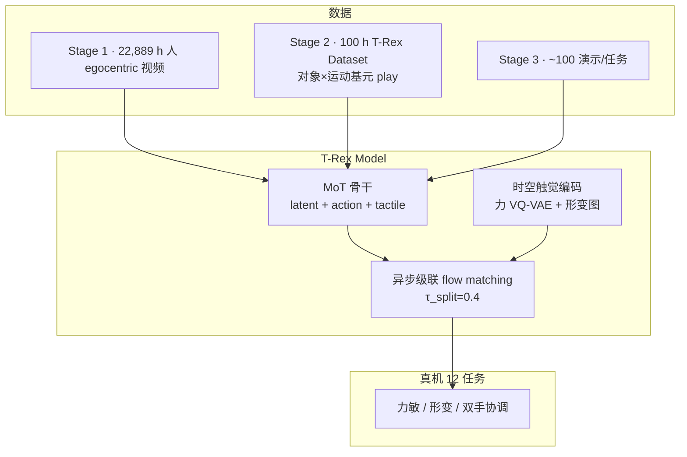
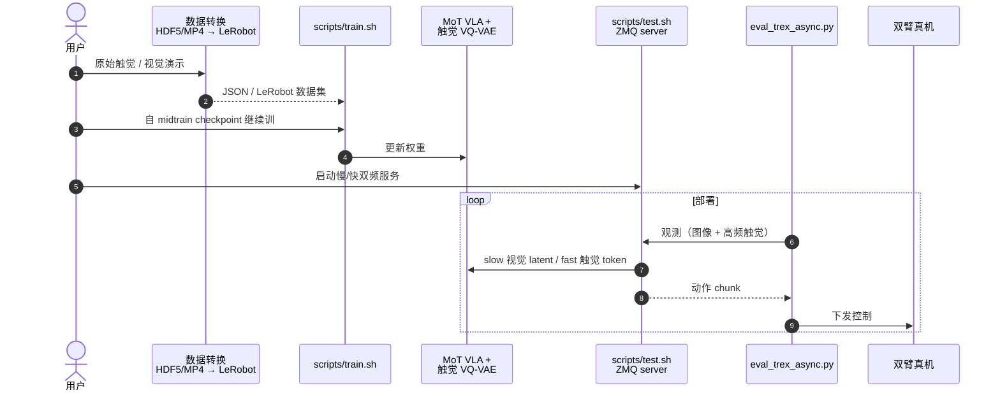

---

type: entity
tags: [paper, vla, tactile-sensing, dexterous-manipulation, flow-matching, bimanual, contact-rich, imitation-learning, egocentric-video, dataset, berkeley, nvidia, stanford, nvidia-gear]
status: complete
updated: 2026-07-24
arxiv: "2606.17055"
code: https://github.com/ZhuoyangLiu2005/T-Rex
related:
  - ../methods/vla.md
  - ../methods/egoscale.md
  - ../methods/imitation-learning.md
  - ../methods/diffusion-policy.md
  - ../tasks/manipulation.md
  - ../tasks/bimanual-manipulation.md
  - ../concepts/contact-rich-manipulation.md
  - ../concepts/visuo-tactile-fusion.md
  - ../concepts/tactile-sensing.md
  - ../entities/nvidia-gear-lab.md
  - ../entities/paper-touchworld-tactile-foundation-dexterous-manipulation.md
  - ../entities/paper-omnitactune-tactile-residual-adaptation.md
sources:
  - ../../sources/papers/trex_arxiv_2606_17055.md
  - ../../sources/sites/tactile-reactive-dexterous-github-io.md
  - ../../sources/repos/t-rex-zhuoyangliu.md
summary: "T-Rex（arXiv:2606.17055，Berkeley / NVIDIA / Stanford 等）用 100 小时触觉同步 play 数据、变频率 MoT 与时空触觉 VQ-VAE，在 12 项双手触觉反应真机任务上达 65% 宏平均成功率，较最强基线 EgoScale +30 个百分点，并证明朴素拼接触觉会损害 VLA。"
---

# T-Rex：触觉反应式灵巧操作

**T-Rex**（Tactile-Reactive Dexterous Manipulation，arXiv:[2606.17055](https://arxiv.org/abs/2606.17055)，[项目页](https://tactile-reactive-dexterous.github.io/)，[代码](https://github.com/ZhuoyangLiu2005/T-Rex)）研究如何把 **高频触觉闭环** 接入 **大规模预训练 VLA**，而不牺牲视觉–语言规划能力。论文同时开源 **T-Rex Dataset**（触觉同步双手遥操作 play）、提出 **变频率 Mixture-of-Transformer（MoT）** 与 **时序触觉 VQ-VAE**，并建立 **12 项接触丰富真机基准**。

## 一句话定义

**用慢速 visuomotor 专家规划动作块、用快速触觉专家在 chunk 内多次残差精修，配合人视频预训练与触觉 mid-training，把毫秒级力反馈写进灵巧 VLA 而不拖垮主策略频率。**

## 英文缩写速查

| 缩写 | 英文全称 | 简要说明 |
|------|----------|----------|
| VLA | Vision-Language-Action | 视觉–语言–动作多模态策略 |
| MoT | Mixture-of-Transformer | 多专家 Transformer 骨干；T-Rex 含 latent / action / tactile 三专家 |
| VQ-VAE | Vector Quantized Variational Autoencoder | 向量量化 VAE；压缩 16 帧力历史为离散触觉 token |
| FM | Flow Matching | 条件流匹配生成动作块；T-Rex 在 τ=0.4 处异步级联去噪 |
| DoF | Degrees of Freedom | Vega-1 双臂 + 双手合计约 58 自由度控制 |
| CRM | Contact-Rich Manipulation | 依赖接触力、摩擦与形变的操作任务族 |
| BC | Behavior Cloning | 三阶段训练以模仿学习为主，含遥操作 mid-training |
| KV | Key-Value Cache | action 专家积分上段后缓存，供 tactile 专家复用 |

## 为什么重要

- **填补触觉 VLA 三角空白：** 同时给出 **开源触觉数据集**、**可扩展训练配方** 与 **标准化 12 任务评测**——此前学习式灵巧操作多忽视触觉或只用静态编码。
- **「触觉必须集成对」的实证：** **π₀.₅ + tactile 朴素条件化** 平均成功率 **6%**，低于无触觉 **π₀.₅（17%）**；T-Rex 用 **异步高频专家 + 时序 VQ-VAE** 达 **65%**，说明问题在架构与训练阶段而非「有没有触觉传感器」。
- **与 EgoScale 互补：** 同属 Berkeley / NVIDIA 灵巧线，[EgoScale](../methods/egoscale.md) 解决 **人视频规模预训练**；T-Rex 在 **mid-training** 引入 **100 h 触觉同步 play**，把接触动力学写进策略。
- **数据效率：** 触觉 mid-training 后，**少量（~100）任务演示** 即可在力敏/形变任务上快速爬升成功率，优于从零训练。

## 核心贡献

| 模块 | 要点 |
|------|------|
| **T-Rex Dataset** | **100 h** 触觉同步双手遥操作；**207** 物体 × **22** 运动基元 → **502** 有效组合；30 Hz 多模态 bundle + 300 Hz 底层控制 |
| **T-Rex Model** | **MoT** 三专家 + **τ_split=0.4** 异步级联 flow matching；触觉专家在 chunk 偏移 **{0,4,8,12}** 重触发 |
| **时空触觉编码** | 每指 **16 帧 6D 力/力矩** → **VQ-VAE（K=64）**；当前力直投 + **形变深度图 ResNet** |
| **三阶段训练** | **22,889 h** 人 egocentric 预训练 → **100 h** 触觉 mid-training → **~100** 条/任务后训练 |
| **12 任务基准** | 力敏接触 / 形变感知 / 双手力–形变；**16** 次随机试验/任务 |

## 方法

### 平台与数据

- **硬件：** **Dexmate Vega-1** 双臂（各 7-DoF）+ **Sharpa Wave** 22-DoF 灵巧手；十指指尖 **形变图 + 6 轴力/力矩**。
- **感知：** 头部 **ZED X Mini** 立体 + 双腕广角相机；**Manus 手套 + VIVE** 遥操与部署控制栈一致。
- **采集哲学：** 不追少数长任务，而覆盖 **对象 × 运动基元** 组合（wrap、peel、insert、screw 等 **22** 类），用短、可复用接触丰富行为拼成长程技能。

### 变频率 MoT 与异步级联

视觉与语言告诉机器人 **做什么、粗轨迹**；触觉在 **毫秒尺度** 决定蛋是否碎、卡片是否滑脱。T-Rex 因此拆分：

1. **Latent 专家：** 未来视觉潜变量预测，提供时序上下文。
2. **Action 专家（低频）：** 在 flow 上段 **τ: 1→0.4** 积分 **6** 步，产出粗动作并 **冻结缓存 KV**。
3. **Tactile 专家（高频）：** 克隆缓存，在 **τ: 0.4→0** **4** 步完成残差去噪；**每个慢 tick 触发 4 次快 tick**，昂贵视觉计算被摊销。

### 训练配方

| 阶段 | 数据 | 训练对象 |
|------|------|----------|
| **人 egocentric 预训练** | **22,889 h** 第一人称视频 | latent + action 专家（**无触觉**） |
| **触觉 mid-training** | **100 h** T-Rex Dataset | action 专家适配机端观测；**tactile 专家从零训练**；含视觉/触觉 **延迟增广** |
| **任务后训练** | **~100** 演示/任务 | 全模型轻量微调 |

辅助 **未来视觉预测损失**（λ_future=0.5）防止高频触觉反射脱离任务语义。

## 流程总览

## 实验要点（归纳）

| 设置 | 要点 |
|------|------|
| 宏平均成功率 | **T-Rex 65%**；最强基线 **EgoScale 35%**；**ViTacFormer 3%** |
| 触觉消融 | 去触觉 **−23 pt**（65→42）；**时序 VQ-VAE 力编码** 优于 MLP/仅形变 |
| 架构消融 | 同步去噪 **−5 pt**；**预训练 + mid-training** 缺一不可（仅预训练 45%，仅 mid 34%，从零 18%） |
| 数据效率 | 有 mid-training 时，后训练演示从少到多成功率爬升明显快于无 mid-training |
| 关键反例 | **π₀.₅ + tactile** 说明「把触觉当额外条件拼进 VLA」不足 |

### 12 任务族（示例）

Flip Page、Transfer Egg、Wipe Plate、Apply Toothpaste、Split Cup、Sort Mahjong、Open Lock、Refill Tablet、Acid-Base Neutralization、Extract Card、Deal Poker、Screw Lightbulb。

## 源码运行时序图

官方仓库 [ZhuoyangLiu2005/T-Rex](https://github.com/ZhuoyangLiu2005/T-Rex)：数据经 `utils/gen_json_…` / `convert_inlab_to_lerobot.sh`；post-train 用 `scripts/train.sh`；推理 `scripts/test.sh`（ZMQ）；真机客户端 `hardware_code/eval/eval_trex_async.py`。一次完整运行如下：

- **双频推理**：视觉慢时钟与触觉快时钟分离，是复现接触反应的关键。
- **完整预训练**在其他分支；`main` 侧重 post-train + 部署。

## 结论

**触觉能否提升 VLA，取决于频率解耦与训练阶段：朴素拼接触觉可把 π₀.₅ 从 17% 砸到 6%；异步高频专家 + 时序力 VQ-VAE 才到 65% 宏平均。**

1. **主数字** — 12 任务宏平均 **T-Rex 65%** vs 最强基线 EgoScale **35%**（+30 pt）；去触觉 **−23 pt**（65→42）。
2. **反例必记** — **π₀.₅ + tactile 朴素条件化仅 6%**，低于无触觉 π₀.₅（**17%**）——问题在架构/配方，不在「有没有传感器」。
3. **三阶段不可省** — **22,889 h** 人视频预训练 → **100 h** 触觉 mid-training → **~100** 条/任务后训练；仅预训练 45%、仅 mid 34%、从零 18%。
4. **异步级联** — action 专家 τ:1→0.4 出粗动作并缓存 KV；tactile 专家 τ:0.4→0 残差去噪，每个慢 tick 触发 4 次快 tick；同步去噪约 **−5 pt**。
5. **表征** — 每指 16 帧 6D 力 → VQ-VAE（K=64）优于 MLP/仅形变；辅助未来视觉损失防触觉反射脱离任务语义。
6. **边界** — Screw Bulb 等仍低（**35%**）；项目页强调 **50 h** 已开源子集，完整 100 h 以后续发布为准。

## 常见误区或局限

- **误区：「有触觉传感器就能提升 VLA」。** 论文显示 **朴素条件化可显著降性能**；需要 **频率解耦 + 时序力表征 + 专用 mid-training**。
- **误区：「T-Rex 取代 EgoScale」。** 二者共享人预训练思想，但 **EgoScale 主攻人视频缩放律**，T-Rex 主攻 **触觉反应式 mid-training**；可组合阅读而非互斥。
- **局限：触觉硬件：** 指尖形变 + 力/力矩仍 **稀疏**；掌心密集触觉、跨传感器泛化列为未来工作。
- **局限：长程高公差任务：** 遥操作困难的拧紧等任务成功率仍低（Screw Bulb **35%**）；论文建议 **RL 或在线精炼** 补充 BC。
- **局限：数据集开源规模：** 项目页强调 **50 h** 已开源子集；完整 **100 h** 以论文与后续发布为准。

## 与其他工作对比

| 维度 | T-Rex | TouchWorld | EgoScale | π₀.₅ + tactile | RDP / ViTacFormer |
|------|-------|------------|----------|----------------|-------------------|
| 预训练 | **22k+ h 人视频** | EgoTouch 人触觉 + 机端演示 | **20k+ h 人视频** | π 系 VLA 预训练 | 任务数据从零或小规模 |
| 触觉 | **专用高频专家 + VQ-VAE** | **TWM 子目标 + TRT 残差** | 无 | 朴素拼接力信号 | 慢–快或 ACT 式融合 |
| 长程结构 | 语言指令 | **SP + 记忆子任务** | 语言指令 | 语言指令 | 任务 prompt |
| 平台 | **58-DoF 双手灵巧** | 人形 + Wuji 压力手套 | 灵巧手 VLA | 同平台微调 | 同平台对比 |
| 宏平均 SR | **65%**（12 任务） | **65%**（6 任务） | **35%** | **6%** | **3–6%** |

## 与其他页面的关系

- 与 [VLA](../methods/vla.md)：同属 flow-VLA 族，但 T-Rex 显式解决 **视觉帧率 vs 触觉频率** 不匹配。
- 与 [EgoScale](../methods/egoscale.md)：共享 **人预训练 + 机端 mid-training** 骨架；T-Rex 把 mid-training 换成 **触觉 play** 并新增 **高频专家**。
- 与 [视触觉融合](../concepts/visuo-tactile-fusion.md)：T-Rex 是 **VLA 尺度** 的「接触后触觉主导」实例，含 **时序力 token 化** 读点。
- 与 [OmniTacTune](./paper-omnitactune-tactile-residual-adaptation.md)、[TouchWorld](./paper-touchworld-tactile-foundation-dexterous-manipulation.md)：2026 触觉灵巧 **端到端 mid-training / 层级世界模型 / 插件式 RL 残差** 三条主线对照。
- 与 [接触丰富操作](../concepts/contact-rich-manipulation.md)、[双臂操作](../tasks/bimanual-manipulation.md)：12 任务覆盖 **力控、形变、双手协调** 三类难点。

## 推荐继续阅读

- 论文 HTML：<https://arxiv.org/html/2606.17055v1>
- 项目页（数据集可视化 + rollout 视频）：<https://tactile-reactive-dexterous.github.io/>
- 代码：<https://github.com/ZhuoyangLiu2005/T-Rex>
- [EgoScale 方法页](../methods/egoscale.md) — 同人灵巧线的 **人视频缩放** 对照轴

## 参考来源

- [T-Rex 论文摘录（arXiv:2606.17055）](../../sources/papers/trex_arxiv_2606_17055.md)
- [T-Rex 项目页](../../sources/sites/tactile-reactive-dexterous-github-io.md)
- [T-Rex 代码仓库](../../sources/repos/t-rex-zhuoyangliu.md)

## 关联页面

- [VLA（Vision-Language-Action）](../methods/vla.md)
- [EgoScale](../methods/egoscale.md)
- [Manipulation（操作任务）](../tasks/manipulation.md)
- [Bimanual Manipulation（双臂操作）](../tasks/bimanual-manipulation.md)
- [Contact-Rich Manipulation（接触丰富操作）](../concepts/contact-rich-manipulation.md)
- [Visuo-Tactile Fusion（视触觉融合）](../concepts/visuo-tactile-fusion.md)
- [TouchWorld（预测–反应式触觉基础模型）](./paper-touchworld-tactile-foundation-dexterous-manipulation.md)
