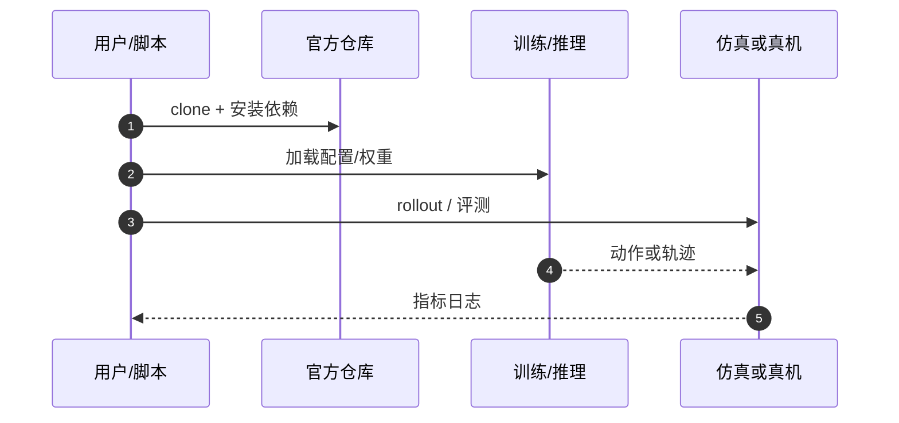

# TriWorldBench（arXiv:2609.26314）

**TriWorldBench**（*TriWorldBench: A Tri-View Consistency Perspective on Embodied World Models*，[arXiv:2609.26314](https://arxiv.org/abs/2609.26314)，[项目页](https://huggingface.co/datasets/TriWorldBench/Dataset)，[代码](https://github.com/TriWorldBench/TriWorldBench)）来自 [具身智能小站 12 篇盘点](../../sources/blogs/wechat_embodied_station_12_papers_collab_wm_2026-09-23.md)。

## 一句话定义

**500 episode / 50 双臂任务 / 19 指标检查 head 与双 wrist 预测是否描述同一动作与物体状态。**

## 英文缩写速查

| 缩写 | 英文全称 | 简要说明 |
|------|----------|----------|
| WM | World Model | 环境前向预测模型 |
| Tri-View | Tri-View Consistency | 头+双腕三视角一致性 |
| HF | Hugging Face | 数据集托管平台 |
| Bench | Benchmark | 标准化评测套件 |

## 为什么重要

- 分视角评测易漏掉「三路是否同一世界」；TriWorldBench 把三视角一致性当作 embodied WM 的一等指标。
- 开源结论：**已开源**（步骤 2.5，2026-09-23）。
- 与 [12 篇技术地图](../overview/collab-wm-12-papers-technology-map.md) 中同类工作可横向对照。

## 核心机制

| 项 | 内容 |
|----|------|
| **arXiv** | [2609.26314](https://arxiv.org/abs/2609.26314) |
| **开源** | **已开源** |
| **要点** | 三相机同步轨迹 + 一致性指标套件；官方 GitHub 与 Hugging Face 数据集入口。 |
| **文内指标** | 19 项指标覆盖语义、几何与动作对齐；具体分数以 benchmark 文档为准。 |

## 源码运行时序图

## 实验与评测

- 19 项指标覆盖语义、几何与动作对齐；具体分数以 benchmark 文档为准。
- **读法：** 索引级摘要；逐项对照与 baseline 以原文 PDF 为准。

## 与其他工作对比

- 横向索引见 [12 篇技术地图](../overview/collab-wm-12-papers-technology-map.md)；与同 arXiv 节点不重复造页。

## 结论

**TriWorldBench 适合筛「看起来像」但跨视角不自洽的 WM；复现从官方 repo + HF 数据集开始。**

1. 开源边界：**已开源** — 以项目页实际链接为准（入库日 2026-09-23）。
2. 核心机制：三相机同步轨迹 + 一致性指标套件；官方 GitHub 与 Hugging Face 数据集入口。…
3. 部署前核对任务协议与硬件条件，勿直接横比公众号摘录数字。

## 关联页面

- [generative-world-models](../methods/generative-world-models.md)
- [bimanual-manipulation](../tasks/bimanual-manipulation.md)
- [manipulation](../tasks/manipulation.md)
- [paper-pixverse-r2](./paper-pixverse-r2.md)
- [具身大模型评测基准选型闭环](../queries/embodied-eval-benchmark-selection-loop.md) — 本页归其 ② 世界模型预测保真度层：多视角双臂 WM rollout 保真度，视频逼真 ≠ 策略收益

## 参考来源

- [triworldbench_arxiv_2609_26314.md](../../sources/papers/triworldbench_arxiv_2609_26314.md)
- [wechat_embodied_station_12_papers_collab_wm_2026-09-23.md](../../sources/blogs/wechat_embodied_station_12_papers_collab_wm_2026-09-23.md)
- [arXiv:2609.26314](https://arxiv.org/abs/2609.26314)

## 推荐继续阅读

- [arXiv PDF](https://arxiv.org/pdf/2609.26314)
- [项目页](https://huggingface.co/datasets/TriWorldBench/Dataset)
- [https://github.com/TriWorldBench/TriWorldBench](https://github.com/TriWorldBench/TriWorldBench)

