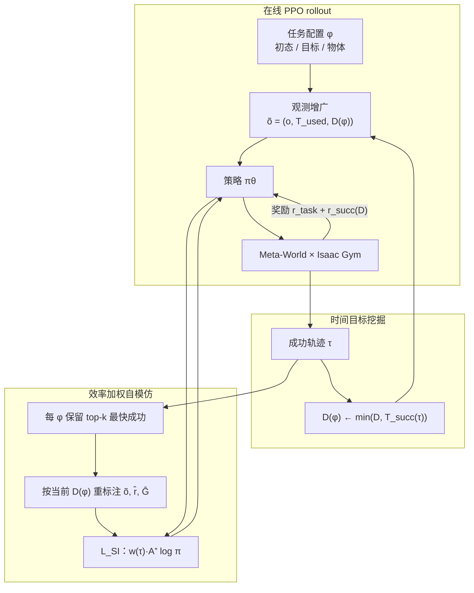

# TSIL（Temporal Self-Imitation Learning）

**TSIL**（*Temporal Self-Imitation Learning*，Jia & Chen，Duke / General Robotics Lab，arXiv:[2606.19752](https://arxiv.org/abs/2606.19752)，2026-06）提出：长时域机器人操作 RL 中，**成功轨迹的时间结构**本身是可扩展的自监督信号——不必只靠手工 reward shaping 去「猜」什么是高效行为。方法在 **PPO** 上叠加两条互补机制：**配置条件自适应时间目标**（用迄今最快成功时长收紧监督）与 **效率加权自模仿回放**（优先复现快速成功，对抗 on-policy 分布漂移）。

## 英文缩写速查

| 缩写 | 英文全称 | 简要说明 |
|------|----------|----------|
| TSIL | Temporal Self-Imitation Learning | 本文：用时间效率挖掘并回放快速成功轨迹的 RL 框架 |
| SIL | Self-Imitation Learning | 用智能体自身高价值轨迹作监督的 RL 扩展（Oh et al. 2018） |
| PPO | Proximal Policy Optimization | 本文基座 on-policy 策略优化算法 |
| RL | Reinforcement Learning | 通过与环境交互最大化长期回报的学习范式 |
| ATTL | Adaptive Temporal Target Learning | 本文消融：仅自适应时间目标、无效率加权回放 |
| IH | Infinite-Horizon PPO | 标准稠密奖励无限时域 PPO 基线 |
| MDP | Markov Decision Process | 状态–动作–奖励–转移的标准建模框架 |

## 为什么重要

- **对准长时域操作的 reward 失真：** 稠密 shaping 鼓励探索，但策略可在中间态「磨蹭」、绕路刷奖励，最终仍获高折扣回报——**回报与行为质量解耦**。
- **把「偶然发现的快成功」变成可持续信号：** 一旦某配置 $\phi$ 下出现更快成功，后续学习应**匹配或超越**该效率，而非让好轨迹在不稳定 PPO 更新中消失。
- **与手工时间工程对比清晰：** 加大稀疏成功奖励会削弱 shaping；逐步惩罚、D2S 调度、固定 time-limit 都**不直接复用学习期涌现的成功时间结构**（论文 Fig. 2）。
- **工程可插拔：** 除时间条件观测、目标缩放成功奖励与辅助 SIL 损失外，**PPO 主体不变**；仿真侧用 Isaac Gym + MTBench 在 15 个 Meta-World 操作任务上验证。
- **官方代码已开源：** [generalroboticslab/TSIL](https://github.com/generalroboticslab/TSIL) 提供 `core/training/algo/tsil/`、MT01/MT15 Hydra 启动脚本、捆绑 Isaac Gym Preview 4 + MTBench 子集，以及 Colab 迷你 demo。

## 核心信息

| 字段 | 内容 |
|------|------|
| 论文 | [arXiv:2606.19752](https://arxiv.org/abs/2606.19752) |
| 项目页 | [generalroboticslab.com/TSIL](https://generalroboticslab.com/TSIL) |
| 代码 | [github.com/generalroboticslab/TSIL](https://github.com/generalroboticslab/TSIL)（Apache-2.0） |
| 机构 | 杜克大学（Duke）/ General Robotics Lab |
| 仿真栈 | Isaac Gym Preview 4 + MTBench（Meta-World 操作子集） |
| 基座算法 | PPO + 自适应时间目标 + 效率加权 SIL |

## 流程总览

## 核心机制（归纳）

### 配置条件自适应时间目标

- 对每个配置 $\phi$ 维护 $D(\phi)\leq T^{\max}$：**迄今最快成功完成时间**（非全局硬 deadline；rollout 可超过 $D(\phi)$ 直至 $T^{\max}$）。
- 策略输入 $\tilde{o}_t=(o_t, T_t^{\mathrm{used}}, D(\phi))$，把**已用交互时间**与**当前效率标杆**同时暴露给策略。
- 成功终止奖励带相对目标的时间 bonus：早于 $D(\phi)$ 完成者获最大加成，越慢加成越小——在保留任务完成激励的同时，**渐进收紧**时间偏好。

### 效率加权自模仿

- 每配置 buffer 容量 $k$（默认 5），保留**最快**成功轨迹（非最高回报）；早期成功稀缺时可暂用高回报轨迹稳定回放。
- 回放前用当前 $D_i$ **重标注**观测、终止成功奖励与折扣回报；用 SIL 正优势门控避免已学会的状态被过度拉扯。
- 轨迹权重 $w_i(\tau)$ 随 $D(\phi)/T^{\mathrm{succ}}(\tau)$ 增大——**越快越重**，与 ATTL+SIL（按回报选轨迹）形成对照。

### 实验设定（论文）

| 维度 | 内容 |
|------|------|
| 任务 | 15 个 Meta-World 长时域操作（装配、插入、运输、工具、铰接物体、接触丰富） |
| 仿真 | Isaac Gym，经 **MTBench** 实现 |
| 基座 | PPO actor-critic |
| 主指标 | 成功率、AUC、到 80% 成功步数、**成功 episode 完成时间**、训练期成功 episode 数 |
| 鲁棒性 | policy gradient 噪声、稠密奖励 dropout、PPO clip / 学习率 sweep |

**主表摘要（15 任务均值）：** TSIL 成功率 **98.6%**、AUC **0.692**、成功完成时间 **0.674**（相对 IH 的 1.246 明显更短），训练期成功 episode 数最高——说明更多自生成成功经验被用于目标更新与回放。

## 代码与复现（仓库）

官方仓库把 **TSIL 钩子** 集中在 `core/training/algo/tsil/`，公开入口为 `projects/TSIL/{train,eval,plot}.py` 与 `exec/TSIL/` 下 Hydra shell。

| 步骤 | 命令 / 路径 |
|------|-------------|
| 环境 | `conda env create -f tsil.yml` → `pip install -e ./isaacgym/python` → `pip install -e ./MTBench` |
| 理解机制 | [notebooks/TSIL_demo.ipynb](https://colab.research.google.com/github/generalroboticslab/TSIL/blob/main/notebooks/TSIL_demo.ipynb)（迷宫迷你 demo） |
| MT15 主实验 | `bash exec/TSIL/train/entrypoints/mt15/compare_tsil/scratch/all.sh` |
| 评测 checkpoint | `python -m projects.TSIL.eval --index_episode best_suc_tail ...`（2000 trials） |
| 论文图表 | `exec/TSIL/plot/paper/figures/`、`tables/` |

复现论文结果时，评测推荐 `best_suc_tail`（训练末 10% 区间最佳成功率 checkpoint）；W&B 默认关闭，可用 `+force_args.wandb=true` 开启。

## 常见误区或局限

- **不是探索算法：** 若基座策略长期零成功，TSIL 无快轨迹可挖；仍需足够探索或任务引导。
- **不是替代全部 reward 设计：** 仍依赖任务 shaping 与稀疏成功信号；时间效率是**附加**自监督，而非唯一优化目标。
- **时间≠唯一部署指标：** 若需要更慢、更安全或更平滑的模式，需与其他行为指标组合（论文 §5）。
- **记忆开销：** 需 per-configuration 成功轨迹 buffer；论文用固定小容量，未系统研究压缩或更大规模回放。

## 关联页面

- [Reinforcement Learning](../methods/reinforcement-learning.md) — PPO 基座与 on-policy 操作 RL 语境
- [Imitation Learning](../methods/imitation-learning.md) — 自模仿与 SIL 族方法对照
- [Reward Design](../concepts/reward-design.md) — shaping 与稀疏成功的权衡、时间偏好工程
- [Manipulation](../tasks/manipulation.md) — 长时域操作任务背景
- [Contact-Rich Manipulation](../concepts/contact-rich-manipulation.md) — 评测任务族之一
- [InterPrior](./paper-interprior.md) — 另一路线：模仿初始化 + RL 微调巩固行为（HOI，接口不同）

## 推荐继续阅读

- 官方仓库：<https://github.com/generalroboticslab/TSIL>
- 项目页：<https://generalroboticslab.com/TSIL>
- Oh et al., *Self-Imitation Learning* (ICML 2018) — 经典 SIL 与高回报轨迹筛选
- Jia & Chen, *Time as a Control Dimension in Robot Learning* (arXiv:2511.07654) — 同组「时间作为控制维度」姊妹工作（推理期时间条件）
- Joshi et al., *MTBench* — 论文所用大规模并行 Meta-World 基准

## 实验与评测

- 完整 15 任务曲线、逐扰动鲁棒性表、positive-advantage mass 与 replay NLL 诊断见 **原文** 与 [参考来源](#参考来源)；本页侧重方法结构与知识库交叉引用。

## 与其他工作对比

| 对照 | TSIL | 相邻路线 |
|------|------|----------|
| 时间信号来源 | 训练期**自发现**的快速成功时长 → 自适应 $D(\phi)$ | 手工 step-cost / D2S 调度 / 固定 time-limit |
| 自模仿筛选 | **效率加权**最快成功轨迹 | 经典 SIL 按高回报；ATTL+SIL 无时间优先 |
| 任务域 | Meta-World 长时域**操作**（仿真） | InterPrior 等 HOI 模仿+RL；locomotion 侧重不同 |
| 部署 | 论文主证据在 Isaac Gym；仓库未含真机栈 | 真机 loco-manip 需另接 WBC / 感知管线 |

定量 ablation 与 baseline 表见原文（[参考来源](#参考来源)）。

## 参考来源

- [TSIL 论文摘录](../../sources/papers/tsil_arxiv_2606_19752.md)
- [TSIL 官方仓库归档](../../sources/repos/tsil.md)
- [TSIL 项目页归档](../../sources/sites/generalroboticslab-tsil.md)
- Jia & Chen, *Temporal Self-Imitation Learning*, arXiv:2606.19752, 2026. <https://arxiv.org/abs/2606.19752>
